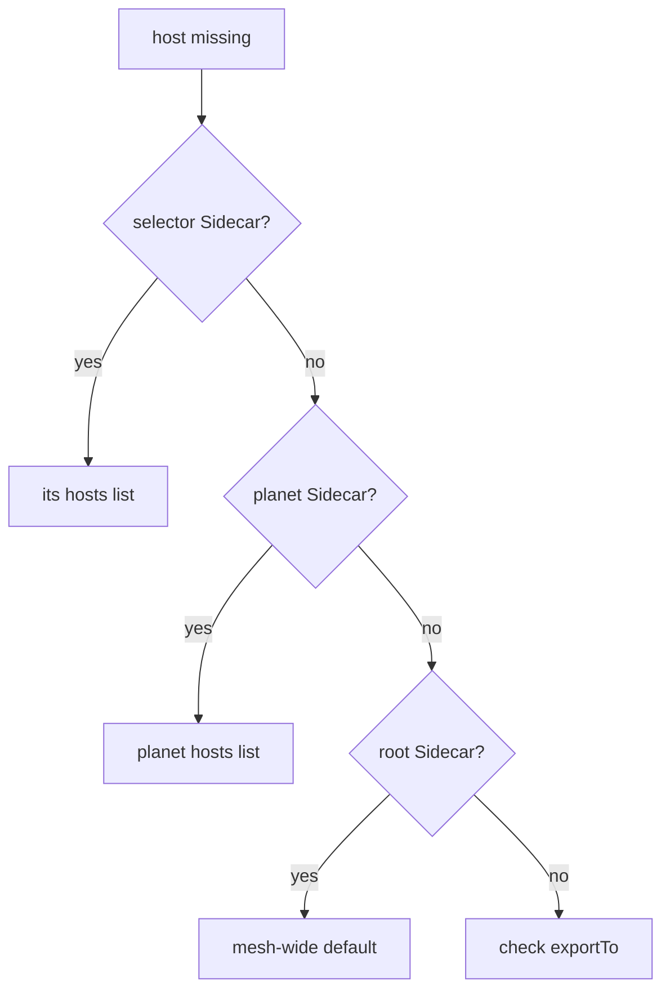

# A Star Chart Is Not A Shield

Astronaut, shrinking a ship's star chart can stop that ship from reaching a planet. It is tempting to call that security. It is not. A `Sidecar` decides what a ship's communications officer **knows**. It does not decide who may land on a planet, and it does nothing at all for a ship without a communications officer. This part proves that, and ends with the order to check things in when a host goes missing.

The commands below need the planet-wide `Sidecar` called `default` on `starfleet`, with `./*`, `istio-system/*`, `outpost/*` and `outboundTrafficPolicy: REGISTRY_ONLY`.

## What a `Sidecar` controls, and what it does not

A `Sidecar` changes one thing: the orders mission control sends to the proxies it applies to. Three kinds of traffic are outside that:

- **A ship without a communications officer.** A pod with no sidecar has no orders to shrink, so a `Sidecar` cannot touch it.
- **Signals arriving at a planet.** `egress` is about what *your* ships may send. It never limits who may send to them.
- **Signals for uncharted hosts under `ALLOW_ANY`.** They leave through `PassthroughCluster` as raw bytes. Only `REGISTRY_ONLY` turns that off.

<!-- astrona:playground:renew -->

### A ship with no communications officer

Launch a small visitor ship on the `default` planet, which has no sidecar injection:

```sh
kubectl run visitor -n default --image=curlimages/curl:8.11.1 --restart=Never --command -- sleep 3600
kubectl wait -n default --for=condition=Ready pod/visitor --timeout=120s
kubectl get pod visitor -n default
```

You should see (the last command):

```text
NAME      READY   STATUS    RESTARTS   AGE
visitor   1/1     Running   0          1s
```

`1/1` means one container and no communications officer. Now let the visitor call the probe on `outpost`:

```sh
kubectl exec -n default visitor -- curl -s -o /dev/null -w '%{http_code}\n' http://probe.outpost:8000/get
```

```text
200
```

The visitor reaches the probe without any trouble. No `Sidecar` applies to it, because there is no proxy to give a star chart to. A `Sidecar` on `starfleet` would not help either: it only shapes what `starfleet`'s ships may send, never what `outpost` accepts.

### A charted ship sending to a raw address

Now let the shuttle call the probe's pod address directly, instead of its beacon. In this playground the probe-v1 pod had the address `10.244.0.7`; find yours with `kubectl get pods -n outpost -o wide`:

```sh
kubectl -n starfleet exec deploy/shuttle -- curl -s -o /dev/null -w '%{http_code}\n' --max-time 5 http://10.244.0.7:8080/get
```

You should see:

```text
000
command terminated with exit code 56
```

Here `REGISTRY_ONLY` on the shuttle's planet does its job: a raw address is not on the star chart, so the signal falls into the black hole. Without `REGISTRY_ONLY`, the same call would leave through `PassthroughCluster`.

Remove the visitor ship:

```sh
kubectl delete pod visitor -n default --now
```

## Use the right tool for the job

A `Sidecar` is a tool for proxy configuration that also changes what a ship can reach. For real enforcement, combine it with the objects built for that:

| Goal | Object |
| --- | --- |
| Shrink proxy configuration and push cost | `Sidecar` |
| Refuse destinations that are not on the star chart | `outboundTrafficPolicy: REGISTRY_ONLY` |
| Refuse a call inside the mesh, checked by the **receiving** ship | `AuthorizationPolicy` |
| Block traffic at the pod network, with or without a proxy | Kubernetes `NetworkPolicy` |

The picture to keep: a `Sidecar` decides what a ship **knows**, an `AuthorizationPolicy` decides what a ship **accepts**, and a `NetworkPolicy` decides what the network **carries**.

## When a host goes missing

A `Sidecar` can hide anything on the star chart: a Kubernetes Service, an outside host added with a `ServiceEntry`, or a virtual machine added with a `WorkloadEntry`. So when a host that should be reachable is missing from a ship's `istioctl proxy-config cluster` list, a `Sidecar` is a likely cause, even if the host itself is defined perfectly. A classic case: a `ServiceEntry` works from one planet and fails from another, because the failing planet has a `Sidecar` that never listed the outside host.

Check in this order:



At each step there is exactly one object to read, because only one `Sidecar` ever applies to a ship. If no `Sidecar` applies, check the host's `exportTo`: its owner may never have offered it to your planet.

## Common pitfalls

> [!WARNING]
> - **Treating a `Sidecar` as a security boundary.** It shapes proxy configuration. A ship with no sidecar is not affected at all.
> - **Expecting a `Sidecar` to protect a planet from callers.** `egress` limits what your ships send, not what they accept. Use an `AuthorizationPolicy` for that.
> - **Relying on scoping under `ALLOW_ANY`.** Uncharted signals still leave through `PassthroughCluster`. Add `REGISTRY_ONLY`.
> - **Debugging a host that works from another planet.** Look for a `Sidecar` on the failing planet before you re-read the host's own object.

> *A `Sidecar` decides what a ship knows. An `AuthorizationPolicy` decides what a ship accepts. A `NetworkPolicy` decides what the network carries.*
