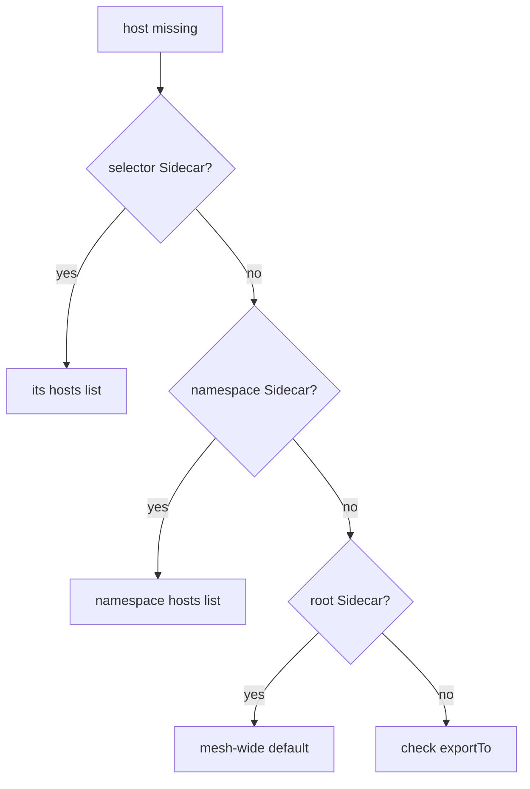

# What A Sidecar Resource Cannot Enforce

A smaller configuration can stop a pod from reaching a host, so it is tempting to call the `Sidecar` resource a security control. It is not. A `Sidecar` decides what a sidecar proxy **knows**. It does not decide who may send requests to a workload, and it does nothing at all for a pod without a sidecar proxy. This page proves both points and ends with the order of checks to use when a host goes missing.

The commands below need the namespace-wide `Sidecar` called `default` in `starfleet`, with the hosts `./*`, `istio-system/*` and `outpost/*`, and `outboundTrafficPolicy` set to `REGISTRY_ONLY`.

## What a Sidecar controls, and what it does not

A `Sidecar` changes one thing: the configuration that `istiod` sends to the proxies it applies to. Three kinds of traffic are outside that:

- **Traffic from a pod without a sidecar proxy.** Such a pod has no proxy configuration to limit, so a `Sidecar` cannot affect it.
- **Traffic that arrives at a workload.** `egress` limits what the proxies in *your* namespace send. It never limits who may send to them.
- **Requests for unknown hosts under `ALLOW_ANY`.** They leave through `PassthroughCluster` as raw TCP bytes. Only `REGISTRY_ONLY` stops them.

The first case is the easiest to prove. Start a client pod called `visitor` in the `default` namespace, which has no sidecar injection:

<!-- astrona:playground:renew -->

```sh
kubectl run visitor -n default --image=curlimages/curl:8.11.1 --restart=Never --command -- sleep 3600
kubectl wait -n default --for=condition=Ready pod/visitor --timeout=120s
kubectl get pod visitor -n default
```

You should see (output of the last command):

```text
NAME      READY   STATUS    RESTARTS   AGE
visitor   1/1     Running   0          1s
```

`1/1` means the pod has one container and no sidecar proxy. Now send a request from `visitor` to the `probe` Service in `outpost`:

```sh
kubectl exec -n default visitor -- curl -s -o /dev/null -w '%{http_code}\n' http://probe.outpost:8000/get
```

```text
200
```

The `visitor` pod reaches `probe` without any trouble. No `Sidecar` applies to it, because there is no proxy to configure. A `Sidecar` in `starfleet` would not help either: it only shapes what the proxies in `starfleet` send, never what `outpost` accepts.

The third case looks different from inside the mesh. Send a request from the `shuttle` pod straight to the IP address of a `probe` pod, instead of to the Service name. In this playground the `probe-v1` pod had the address `10.244.0.7`. Find yours with `kubectl get pods -n outpost -o wide` and use it in place of that address:

```sh
kubectl -n starfleet exec deploy/shuttle -- curl -s -o /dev/null -w '%{http_code}\n' --max-time 5 http://10.244.0.7:8080/get
```

You should see:

```text
000
command terminated with exit code 56
```

Here `REGISTRY_ONLY` in the `starfleet` namespace default does its job. A raw IP address is not a host in the proxy's configuration, so the proxy sends the request to the `BlackHoleCluster`. Without `REGISTRY_ONLY`, the same request would leave through `PassthroughCluster` and succeed.

Remove the `visitor` pod:

```sh
kubectl delete pod visitor -n default --now
```

## Use the right object for the job

A `Sidecar` is a tool for proxy configuration that also changes what a pod can reach. For real enforcement, combine it with the objects built for that:

| Goal | Object |
| --- | --- |
| Make proxy configuration and push cost smaller | `Sidecar` |
| Refuse destinations that are not in the proxy's configuration | `outboundTrafficPolicy: REGISTRY_ONLY` |
| Refuse a request inside the mesh, checked by the **receiving** workload's proxy | `AuthorizationPolicy` |
| Block traffic at the pod network, with or without a proxy | Kubernetes `NetworkPolicy` |

An `AuthorizationPolicy` is the Istio object that allows or denies requests to a workload; the proxy of the receiving pod enforces it. A `NetworkPolicy` is the Kubernetes object that allows or blocks connections between pods at the network level; the cluster's network plugin enforces it. So a `Sidecar` decides what a proxy **knows**, an `AuthorizationPolicy` decides what a workload **accepts**, and a `NetworkPolicy` decides what the network **carries**.

## When a host goes missing

A `Sidecar` can hide any host in the service registry: a Kubernetes Service, a host outside the cluster added with a `ServiceEntry`, or a virtual machine added with a `WorkloadEntry`. So when a host is missing from a pod's `istioctl proxy-config cluster` list, a `Sidecar` is a likely cause, even if the host itself is defined correctly. A common case: a `ServiceEntry` works from one namespace and fails from another, because the failing namespace has a `Sidecar` that never listed the outside host.

Check in this order:



The diagram shows that the checks follow the same order `istiod` uses to pick a `Sidecar`. At each step there is exactly one object to read, because only one `Sidecar` ever applies to a pod. If no `Sidecar` applies, check the `exportTo` field of the object that defines the host: its owner may never have made it visible to your namespace.

You now know where the `Sidecar` resource stops: it limits the configuration of the proxies it applies to, and nothing else. For pods without a proxy and for traffic arriving at a workload, you need an `AuthorizationPolicy` or a `NetworkPolicy`.

## Common pitfalls

> [!WARNING]
> - **Treating a `Sidecar` as a security boundary.** It shapes proxy configuration. A pod with no sidecar proxy is not affected at all.
> - **Expecting a `Sidecar` to protect a workload from callers.** `egress` limits what your proxies send, not what your workloads accept. Use an `AuthorizationPolicy` for that.
> - **Relying on a `Sidecar` under `ALLOW_ANY`.** Requests for unknown hosts still leave through `PassthroughCluster`. Add `REGISTRY_ONLY`.
> - **Debugging a host that works from another namespace.** Look for a `Sidecar` in the failing namespace before you read the host's own object again.
