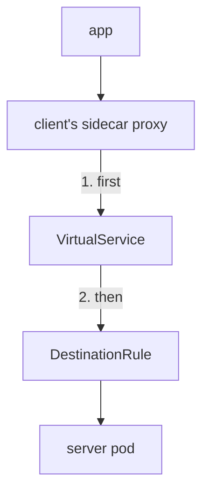
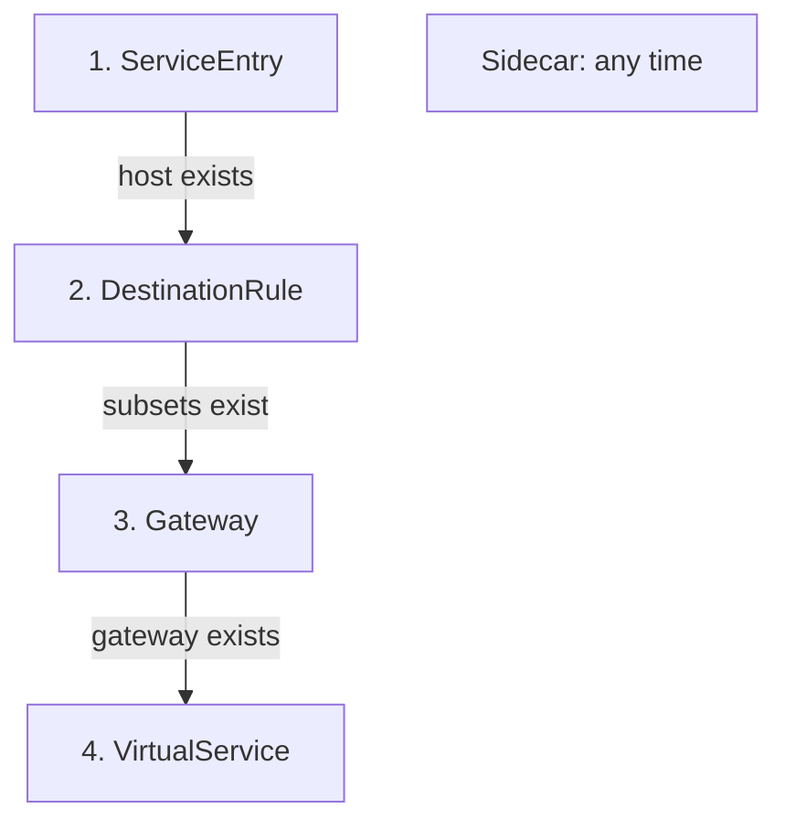
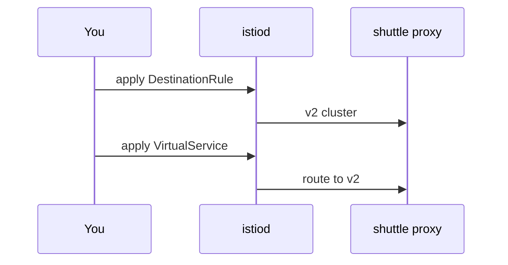

# Apply And Remove Objects In Dependency Order

Istio objects point at each other, and `istiod` sends them to the proxies one by one. If a route reaches a proxy before the subset it names, the proxy cannot send the request anywhere, and the client gets an error. This part shows which proxy reads each object, the order to apply objects in, what goes wrong in the wrong order, and the order to remove them in.

## Which proxy reads the rules

Two objects decide where a request goes. A **`VirtualService`** holds the routing rules for a host: which requests match, and which destination they go to. A **`DestinationRule`** says how to reach that destination: it defines **subsets** (named groups of pods, selected by pod labels) and settings such as load balancing.

Both objects are read by the **sidecar proxy** (Envoy) of the pod that **sends** the request. The sidecar proxy is a container that Istio adds to each pod; all traffic in and out of the pod passes through it. At the edge of the mesh, a gateway proxy does the same job instead.



The diagram shows the client's sidecar proxy reading the `VirtualService` first and the `DestinationRule` second, before it sends the request to a server pod.

The `VirtualService` decides the route: the match, fault injection, retries, timeout and the destination. The `DestinationRule` then decides how to reach that destination: subsets, load balancing, connection pools and the ejection of failing pods. The server's sidecar proxy only passes the request to its application.

This has effects that surprise many people. A test error that you inject for `navcom` comes from the sidecar proxy of the pod that calls `navcom`, not from `navcom`. And every client counts its own connection limits.

Two more objects play a role, but they are not steps on this path:

- A **`ServiceEntry`** adds a host from outside the mesh to Istio's service registry, the list of hosts that `istiod` knows. It makes an outside host *exist* for Istio.
- A **`Sidecar`** resource limits which hosts a sidecar proxy holds configuration for. It decides which hosts a proxy can *see*.

## The order to apply objects

Some objects point at others: a route names a subset, a host or a gateway. The rule is simple. Always create the object that is pointed at first, so a pointer never leads to something that does not exist yet.



Each arrow means "must exist before". The `Sidecar` stands apart, because no other object points at it.

1. **`ServiceEntry`**: the outside host must be in the service registry before any rule can use it.
2. **`DestinationRule`**: the subsets must exist before a `VirtualService` sends requests to them.
3. **`Gateway`**: the object that configures a gateway proxy at the edge of the mesh. It must exist before a `VirtualService` links to it with `spec.gateways`.
4. **`VirtualService`**: last, because it points at subsets and gateways.
5. **`Sidecar`**: any time. Afterwards, check that every host your applications call is still in its `egress.hosts` list.

## Why the order matters: make before break

`istiod` pushes your objects to every sidecar proxy, and that takes a moment. For a short time, some proxies have the new configuration and some still have the old one. "Make before break" means: create the new destination before any route uses it, and stop using an old destination before you remove it.

Take a `VirtualService` that sends requests to subset `v2`. If it reaches a sidecar proxy *before* the `DestinationRule` that defines `v2`, the proxy has no **cluster** for `v2`. A cluster is Envoy's name for a group of destination pods. The proxy then answers **`503 NC`** ("no cluster") by itself. The same flag appears when a subset name has a typo. Here, timing alone causes it: the subset exists, but it has not reached the proxy yet.



The diagram shows the safe order: the subset reaches the `shuttle` proxy first, so the route always has a destination. The cluster for subset `v2` is called `outbound|9080|v2|scout.starfleet.svc.cluster.local`.

So keep this rule:

- **Adding a version:** update the `DestinationRule` first. Wait until the proxies have it. Then update the `VirtualService`.
- **Removing a version:** stop using it in the `VirtualService` first. Wait. Then remove it from the `DestinationRule`.

In a real cluster the gap is short, so the wrong order may *look* fine when you try it once. Under steady traffic, it causes a burst of `503` errors on every change. The easiest way to see the error on purpose is to apply the route with no `DestinationRule` at all.

## Reproduce the 503 NC

The `VirtualService` below sends every request for `scout` to subset `v1`. Apply it before any `DestinationRule` exists, so the subset cannot exist.

<!-- astrona:playground:renew -->

Save this as `virtualservice-scout.yaml`:

```yaml
apiVersion: networking.istio.io/v1
kind: VirtualService
metadata:
  name: scout
  namespace: starfleet
spec:
  hosts:
  - scout
  http:
  - route:
    - destination:
        host: scout
        subset: v1
```

Apply it:

```sh
kubectl apply -f virtualservice-scout.yaml
```

```text
virtualservice.networking.istio.io/scout created
```

Then send one request from `shuttle`, read the last line of the `shuttle` proxy's access log, and run `istioctl analyze`, the command that checks Istio objects for errors:

```sh
kubectl exec -n starfleet deploy/shuttle -- curl -s -o /dev/null -w "%{http_code}\n" http://scout:9080/reviews/0
kubectl logs -n starfleet deploy/shuttle -c istio-proxy --tail=1
istioctl analyze -n starfleet
```

You should see (log line shortened):

```text
503
"GET /reviews/0 HTTP/1.1" 503 NC cluster_not_found ...
Error [IST0101] (VirtualService starfleet/scout) Referenced host+subset in destinationrule not found: "scout+v1"
```

The route names subset `v1`, and no `DestinationRule` defines it yet. The access log shows the flag `NC`, "no cluster". `istioctl analyze` reports message `IST0101` and names the missing subset.

The fix is to create the object the route points at. Save this as `destinationrule-scout.yaml`:

```yaml
apiVersion: networking.istio.io/v1
kind: DestinationRule
metadata:
  name: scout
  namespace: starfleet
spec:
  host: scout
  subsets:
  - name: v1
    labels:
      version: v1
  - name: v2
    labels:
      version: v2
  - name: v3
    labels:
      version: v3
```

Apply it:

```sh
kubectl apply -f destinationrule-scout.yaml
```

```text
destinationrule.networking.istio.io/scout created
```

Then check the result. List the clusters for `scout` in the `shuttle` proxy, and send the request again:

```sh
istioctl proxy-config clusters deploy/shuttle -n starfleet | grep scout
kubectl exec -n starfleet deploy/shuttle -- curl -s -o /dev/null -w "%{http_code}\n" http://scout:9080/reviews/0
```

You should see:

```text
scout.starfleet.svc.cluster.local          9080      -          outbound      EDS              scout.starfleet
scout.starfleet.svc.cluster.local          9080      v1         outbound      EDS              scout.starfleet
scout.starfleet.svc.cluster.local          9080      v2         outbound      EDS              scout.starfleet
scout.starfleet.svc.cluster.local          9080      v3         outbound      EDS              scout.starfleet
200
```

Once the `v1` row is in the `shuttle` proxy's cluster list, the request gets `200`. Nothing was wrong with either object. Only the order was.

## Check the push before you test

`kubectl apply` returns as soon as Kubernetes has stored the object, not when the proxies have it. So check that the configuration arrived before you judge your YAML. Three commands do it:

- `istioctl proxy-status` lists every proxy connected to `istiod`. A proxy missing from the list gets no configuration at all.
- `istioctl proxy-config clusters` on the client shows whether a new subset has arrived. The subset must be there before any route can use it.
- `istioctl analyze` finds missing subsets, missing gateways, unknown hosts and rules that a catch-all rule above them hides.

Run the three checks now:

```sh
istioctl proxy-status
istioctl proxy-config clusters deploy/shuttle -n starfleet | grep scout
istioctl analyze -n starfleet
```

You should see (shortened to the first rows of each):

```text
NAME                                     CLUSTER        ISTIOD                     VERSION     SUBSCRIBED TYPES
bridge-v1-bc4dc4fcc-9pgcl.starfleet      Kubernetes     istiod-995fd9df6-hddjn     1.30.5      4 (CDS,LDS,EDS,RDS)
cargo-v1-6f787f8bd5-qss4w.starfleet      Kubernetes     istiod-995fd9df6-hddjn     1.30.5      4 (CDS,LDS,EDS,RDS)
...
scout.starfleet.svc.cluster.local          9080      v1         outbound      EDS              scout.starfleet
...
✔ No validation issues found when analyzing namespace: starfleet.
```

Every proxy is connected to `istiod`. Each one subscribes to four kinds of xDS configuration, which is the protocol `istiod` uses to push configuration to proxies while they run. The four kinds are CDS (Cluster Discovery Service), LDS (Listener Discovery Service), EDS (Endpoint Discovery Service) and RDS (Route Discovery Service). The subset has arrived, and the objects agree with each other. Now a test tells you something about your YAML.

> [!TIP]
> Run these three checks after every change, before you send a single test request. They turn "it does not work" into "the configuration has not arrived yet" or "the configuration is wrong", which are very different problems.

## The order to remove objects

Removing works the other way round. Remove the pointer first, then the object it pointed at:

```text
VirtualService  →  Gateway  →  DestinationRule  →  ServiceEntry
```

If you delete a `DestinationRule` while a `VirtualService` still routes to its subsets, you get the same `503 NC` as above, this time on the way out. Try it: delete the `DestinationRule` while the route still uses subset `v1`:

```sh
kubectl delete -f destinationrule-scout.yaml
```

```text
destinationrule.networking.istio.io "scout" deleted from starfleet namespace
```

Then send a request and read the flag in the access log:

```sh
kubectl exec -n starfleet deploy/shuttle -- curl -s -o /dev/null -w "%{http_code}\n" http://scout:9080/reviews/0
kubectl logs -n starfleet deploy/shuttle -c istio-proxy --tail=1
```

You should see (log line shortened):

```text
503
"GET /reviews/0 HTTP/1.1" 503 NC cluster_not_found ...
```

The route still points at `v1`, and the subset is gone. Apply the subsets again, so the route works again:

```sh
kubectl apply -f destinationrule-scout.yaml
```

The safe way to remove this setup is the reverse order: `kubectl delete -f virtualservice-scout.yaml` first, then `kubectl delete -f destinationrule-scout.yaml`.

You now know that the client's sidecar proxy reads both routing objects, that objects must be created before anything points at them and removed after nothing points at them, and how to check that a change has reached the proxies. One question is still open: what happens when two files describe the same object, and what Istio does before you write any rule at all.

## Common pitfalls

> [!WARNING]
> - **Applying the `VirtualService` first.** Requests fail with `503 NC` until the subsets arrive. Apply the `DestinationRule` first.
> - **Removing the `DestinationRule` first.** The same `503 NC`, on the way out. Remove the route first.
> - **Testing straight after `kubectl apply`.** `apply` returns when the object is stored, not when the proxies have it. Check `istioctl proxy-config clusters` first.
> - **Trusting one quiet test.** The wrong order often looks fine once, because the gap is short. It still fails under real traffic.
> - **Forgetting the `Sidecar` host list.** You can apply a `Sidecar` at any time, but afterwards every host your applications call must still be in `egress.hosts`.

## Your mission: Retire A Subset Without Failed Requests Lab

You can now apply and remove objects in an order that never leaves a route pointing at nothing. The lab asks you to move all traffic off the `v1` subset of `scout` and remove that subset, while a client sends requests the whole time and not one of them may fail.

The lab runs in its own cluster, so first pause your playground. Nothing in it is lost:

```sh
astrona stop ats-014-playground-010-03
```

Then start the lab:

```sh
astrona run --git git@github.com:astrona-io/ATS014.git -c sections/section-010/module-03/labs/lab-01
```

The task is on the next page. Solve it on your own first. When you think you are done, send it for grading:

```sh
astrona submit -c sections/section-010/module-03/labs/lab-01
```

When the lab is done, remove it and start your playground again:

```sh
astrona destroy ats-014-lab-010-03-01
astrona start ats-014-playground-010-03
```
