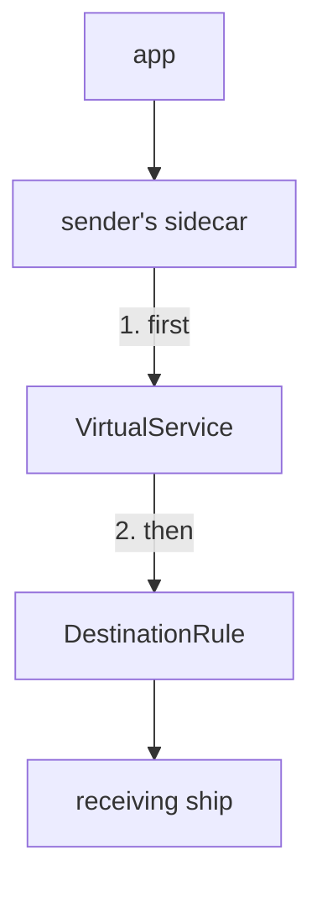
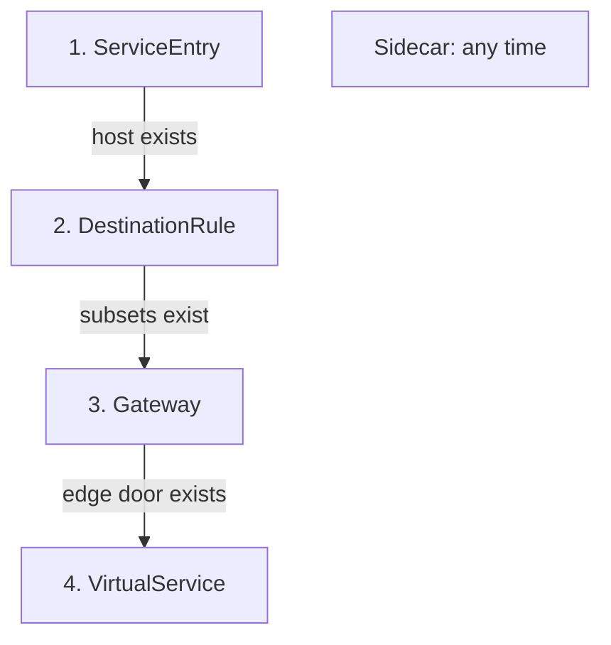
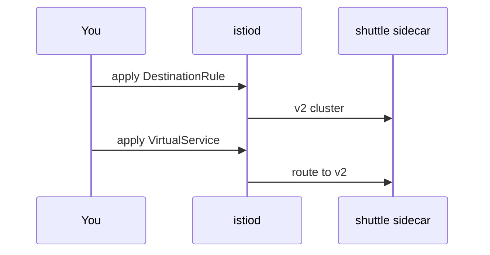

# The Order To Apply And Remove Rules

Astronaut, Istio's objects point at each other, and mission control delivers them to the fleet one by one. This part shows where each rule is read, the order to apply objects in, what goes wrong in the wrong order, and the order to remove them in.

## Where the rules are read

The `VirtualService` and the `DestinationRule` are both read by the communications officer (the sidecar proxy) of the ship that **sends** the signal. It reads the flight plan, picks a destination, and follows the docking instructions. At the edge of the mesh, a gateway does the same job instead.



The `VirtualService` decides the route: match, fault, retries, timeout and the destination. The `DestinationRule` then decides how to reach it: subsets, load balancing, connection pools and failing-ship ejection. Both are read in the sender's sidecar, in this order. The receiving ship's sidecar only hands the signal to its app.

This has surprising effects. A test error you inject for `navcom` comes from the sidecar of whoever calls `navcom`. And every sender counts its own connection limits.

Two objects are not steps on this path:

- A **`ServiceEntry`** adds a planet from another solar system to the star chart. It makes an outside host *exist* for Istio.
- A **`Sidecar`** resource gives a ship a smaller star chart. It decides which hosts a sidecar can *see*.

## The order to apply things

Some objects point at others. Always create the thing that is pointed at first. Then a pointer never leads to something that does not exist yet.



Each arrow means "must exist before". The `Sidecar` stands apart: apply it whenever you like, then check its host list.

1. **`ServiceEntry`**: the outside host must be on the star chart before any rule can use it.
2. **`DestinationRule`**: the subsets must exist before a `VirtualService` sends signals to them.
3. **`Gateway`**: it must exist before a `VirtualService` links to it with `spec.gateways`.
4. **`VirtualService`**: last, because it points at subsets and gateways.
5. **`Sidecar`**: any time. Afterwards, check that every host your apps call is still in its `egress.hosts` list.

## Why the order matters: "make before break"

Mission control sends your rules to every sidecar, and that takes a moment. For a short time, some ships have the new orders and some still have the old ones.

Say a `VirtualService` sends signals to subset `v2`. If it reaches a sidecar *before* the `DestinationRule` that defines `v2`, the sidecar has nowhere to send the signal. It answers with **`503 NC`** ("no cluster") by itself. The same flag appears when a subset name has a typo. Here it is caused only by timing: the subset exists, it just has not reached the sidecar yet.



The picture shows the safe order: the subset reaches the sidecar first, so the route always has somewhere to go. The cluster it creates is called `outbound|9080|v2|scout.starfleet.svc.cluster.local`.

So keep this rule:

- **Adding a version:** update the `DestinationRule` first. Wait until the sidecars have it. Then update the `VirtualService`.
- **Removing a version:** stop using it in the `VirtualService` first. Wait. Then remove it from the `DestinationRule`.

In a real cluster the gap is short, so the wrong order may *look* fine when you try it once. Under steady traffic, it causes a burst of `503` errors on every change. The easiest way to see it on purpose is to apply the route with no `DestinationRule` at all.

<!-- astrona:playground:renew -->

### Apply the route before the subsets

Send every scout signal to subset `v1`, before any `DestinationRule` exists. Save this as `virtualservice-scout.yaml`:

```yaml
apiVersion: networking.istio.io/v1
kind: VirtualService
metadata:
  name: scout
  namespace: starfleet
spec:
  hosts:
  - scout
  http:
  - route:
    - destination:
        host: scout
        subset: v1
```

Apply it:

```sh
kubectl apply -f virtualservice-scout.yaml
```

```text
virtualservice.networking.istio.io/scout created
```

Then send one signal, read the shuttle's flight log, and ask `istioctl analyze`:

```sh
kubectl exec -n starfleet deploy/shuttle -- curl -s -o /dev/null -w "%{http_code}\n" http://scout:9080/reviews/0
kubectl logs -n starfleet deploy/shuttle -c istio-proxy --tail=1
istioctl analyze -n starfleet
```

You should see (log line trimmed):

```text
503
"GET /reviews/0 HTTP/1.1" 503 NC cluster_not_found ...
Error [IST0101] (VirtualService starfleet/scout) Referenced host+subset in destinationrule not found: "scout+v1"
```

The route names subset `v1`, and no `DestinationRule` has defined it yet. The flight log says `NC`, "no cluster", and `istioctl analyze` names the missing subset.

### Now make the subsets exist

Save this as `destinationrule-scout.yaml`:

```yaml
apiVersion: networking.istio.io/v1
kind: DestinationRule
metadata:
  name: scout
  namespace: starfleet
spec:
  host: scout
  subsets:
  - name: v1
    labels:
      version: v1
  - name: v2
    labels:
      version: v2
  - name: v3
    labels:
      version: v3
```

Apply it:

```sh
kubectl apply -f destinationrule-scout.yaml
```

```text
destinationrule.networking.istio.io/scout created
```

Then check that the subsets reached the shuttle, and send the signal again:

```sh
istioctl proxy-config clusters deploy/shuttle -n starfleet | grep scout
kubectl exec -n starfleet deploy/shuttle -- curl -s -o /dev/null -w "%{http_code}\n" http://scout:9080/reviews/0
```

You should see:

```text
scout.starfleet.svc.cluster.local          9080      -          outbound      EDS              scout.starfleet
scout.starfleet.svc.cluster.local          9080      v1         outbound      EDS              scout.starfleet
scout.starfleet.svc.cluster.local          9080      v2         outbound      EDS              scout.starfleet
scout.starfleet.svc.cluster.local          9080      v3         outbound      EDS              scout.starfleet
200
```

Once the `v1` row is in the shuttle's cluster list, the signal gets `200`. Nothing was wrong with either object. Only the order was.

## Check the push before you test

`kubectl apply` returns as soon as Kubernetes has stored the object, not when the proxies have it. So check that the orders arrived before you judge your YAML. Three commands do it:

- `istioctl proxy-status` lists every proxy connected to mission control. A ship missing from the list gets no orders at all.
- `istioctl proxy-config clusters` on the sender shows whether a new subset has arrived. The subset must be there before any route can use it.
- `istioctl analyze` finds missing subsets, missing gateways, unknown hosts and rules hidden behind a catch-all.

### Run the three checks

```sh
istioctl proxy-status
istioctl proxy-config clusters deploy/shuttle -n starfleet | grep scout
istioctl analyze -n starfleet
```

You should see (trimmed to the first rows of each):

```text
NAME                                     CLUSTER        ISTIOD                     VERSION     SUBSCRIBED TYPES
bridge-v1-bc4dc4fcc-9pgcl.starfleet      Kubernetes     istiod-995fd9df6-hddjn     1.30.5      4 (CDS,LDS,EDS,RDS)
cargo-v1-6f787f8bd5-qss4w.starfleet      Kubernetes     istiod-995fd9df6-hddjn     1.30.5      4 (CDS,LDS,EDS,RDS)
...
scout.starfleet.svc.cluster.local          9080      v1         outbound      EDS              scout.starfleet
...
✔ No validation issues found when analyzing namespace: starfleet.
```

Every ship is connected to mission control and subscribed to the four kinds of orders: CDS (Cluster Discovery Service), LDS (Listener Discovery Service), EDS (Endpoint Discovery Service) and RDS (Route Discovery Service). The subset has arrived, and the objects agree with each other. Now a test tells you something about your YAML.

> [!TIP]
> Make these three checks a habit after every change, before you send a single test signal. They turn "it does not work" into "the orders have not arrived yet" or "the orders are wrong", which are very different problems.

## The order to remove things

Removing works the other way round:

```text
VirtualService  →  Gateway  →  DestinationRule  →  ServiceEntry
```

Remove the pointer first, then the thing it pointed at. If you delete a `DestinationRule` while a `VirtualService` still routes to its subsets, you get the same `503 NC` as above, this time on the way out.

### Remove in the wrong order

Delete the `DestinationRule` while the flight plan still uses subset `v1`:

```sh
kubectl delete -f destinationrule-scout.yaml
```

```text
destinationrule.networking.istio.io "scout" deleted from starfleet namespace
```

Then send a signal and read the flag in the flight log:

```sh
kubectl exec -n starfleet deploy/shuttle -- curl -s -o /dev/null -w "%{http_code}\n" http://scout:9080/reviews/0
kubectl logs -n starfleet deploy/shuttle -c istio-proxy --tail=1
```

You should see (log line trimmed):

```text
503
"GET /reviews/0 HTTP/1.1" 503 NC cluster_not_found ...
```

The route still points at `v1`, and the subset is gone. Put the subsets back, so the flight plan works again:

```sh
kubectl apply -f destinationrule-scout.yaml
```

The safe way to retire the setup is the reverse: `kubectl delete -f virtualservice-scout.yaml` first, then `kubectl delete -f destinationrule-scout.yaml`.

## Common pitfalls

> [!WARNING]
> - **Applying the `VirtualService` first.** Signals fail with `503 NC` until the subsets arrive. Apply the `DestinationRule` first.
> - **Removing the `DestinationRule` first.** The same `503 NC`, on the way out. Remove the route first.
> - **Testing straight after `kubectl apply`.** `apply` returns when the object is stored, not when the proxies have it. Check `istioctl proxy-config clusters` first.
> - **Trusting one quiet test.** The wrong order often looks fine once, because the gap is short. It still fails under real traffic.
> - **Forgetting the `Sidecar` host list.** A `Sidecar` can be applied any time, but afterwards every host your apps call must still be in `egress.hosts`.

> *Create the thing that is pointed at first. Remove the pointer first.*

## Your mission: Retire A Ship Class Safely

You can now apply and remove objects in an order that never leaves a route pointing at nothing. Now prove it in a graded mission: move every signal off an old ship class and retire it completely, without a single signal failing.

The mission runs in its own training solar system, so first pause your playground. Nothing in it is lost:

```sh
astrona stop ats-014-playground-010-03
```

Then start the mission:

```sh
astrona run --git git@github.com:astrona-io/ATS014.git -c sections/section-010/module-03/labs/lab-01
```

Read the task in [`question.md`](./labs/lab-01/question.md) and solve it on your own first. When you think you are done, send it for grading:

```sh
astrona submit -c sections/section-010/module-03/labs/lab-01
```

When the mission is done, remove it and wake your playground up again:

```sh
astrona destroy ats-014-lab-010-03-01
astrona start ats-014-playground-010-03
```
