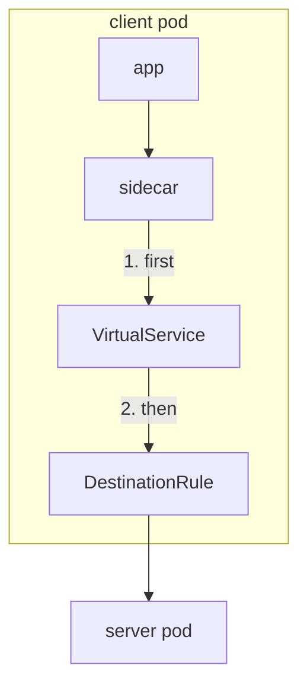
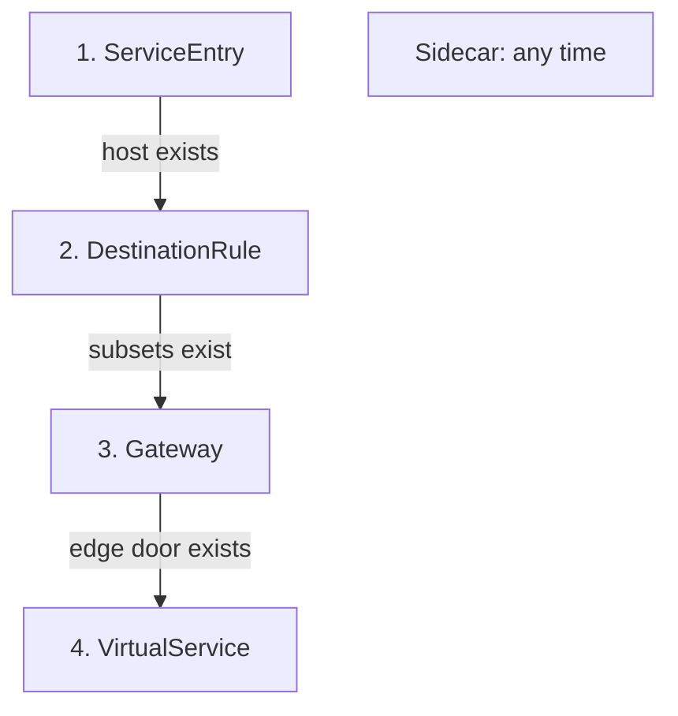
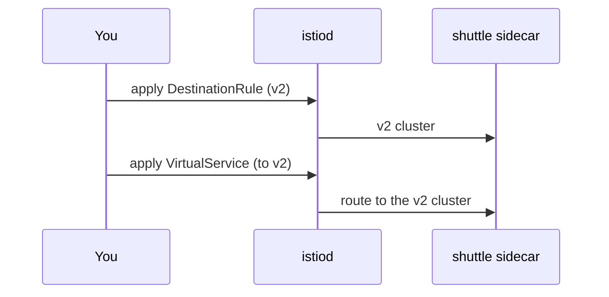

# The Order To Apply And Remove Rules

Istio's objects point at each other. This part shows where each one runs, why the order you apply them in matters, and the order to remove them in.

## Where the rules run

The `VirtualService` and the `DestinationRule` run in the sidecar of the app that **makes** the call. That sidecar is the communications officer on the calling ship: it reads the flight plan, picks a destination, and follows the docking instructions. At the edge of the mesh, a gateway does the same job instead.



The `VirtualService` handles match, fault, route, retries and timeout. The `DestinationRule` then handles subsets, load balancing, connection pools, outlier detection and TLS. Both objects are read in the caller's sidecar, in this order. The server's sidecar only hands the request to its app.

This has a few surprising effects. A test error you add to `navcom` (section 050) comes from the sidecar of whoever calls `navcom`. And each caller counts its own limits for circuit breaking (section 040).

Two objects are not steps on this path:

- A **`ServiceEntry`** adds a planet from another solar system to the star chart. It makes an outside host *exist* for Istio (section 070).
- A **`Sidecar`** resource gives a ship a smaller star chart. It decides which hosts a sidecar can *see* ([module 02](../module-02/course.md)).

## The order to apply things

Some objects point at others. Always create the thing that is pointed at first. Then a pointer never leads to something that does not exist yet.



Each arrow means "must exist before". The `Sidecar` stands apart: apply it whenever you like, then check its host list.

1. **`ServiceEntry`**: the outside host must be on the star chart before any rule can use it.
2. **`DestinationRule`**: the subsets must exist before a `VirtualService` sends traffic to them.
3. **`Gateway`**: it must exist before a `VirtualService` links to it with `spec.gateways`.
4. **`VirtualService`**: last, because it points at subsets and gateways.
5. **`Sidecar`**: any time. Afterwards, check that every host your apps call is still in its `egress.hosts` list.

## Why the order matters: "make before break"

`istiod` sends your rules to every sidecar. This takes a moment. It is like mission control radioing new orders to a whole fleet: for a short time, some ships have the new orders and some still have the old ones.

Say a `VirtualService` sends traffic to subset `v2`. If it reaches a sidecar *before* the `DestinationRule` that defines `v2`, the sidecar has nowhere to send the signal. It answers with **`503 NC`** ("no cluster") by itself. You met this flag in [module 01, part 3](../module-01/course-03-evaluation-order-and-proof.md#the-failure-signatures), caused there by a typo. Here it is caused only by timing.



The v2 cluster is `outbound|9080|v2|scout.starfleet.svc.cluster.local`. The picture shows the safe order. The subset reaches the sidecar first, so the route always has somewhere to go.

So keep this rule:

- **Adding a version:** update the `DestinationRule` first. Wait until the sidecars have it. Then update the `VirtualService`.
- **Removing a version:** stop using it in the `VirtualService` first. Wait. Then remove it from the `DestinationRule`.

In a real cluster the gap is short, so the wrong order may *look* fine when you try it once. Under steady traffic, it causes a burst of `503` errors on every change. The easiest way to see it on purpose is to apply the route with no `DestinationRule` at all.

> [!TIP]
> **Try it: the route before the subsets**
>
> Save this as `virtualservice-scout.yaml`:
>
> ```yaml
> apiVersion: networking.istio.io/v1
> kind: VirtualService
> metadata:
>   name: scout
>   namespace: starfleet
> spec:
>   hosts:
>   - scout
>   http:
>   - route:
>     - destination:
>         host: scout
>         subset: v1
> ```
>
> Apply it:
>
> ```sh
> kubectl apply -f virtualservice-scout.yaml
> ```
>
> Then check the result:
>
> ```sh
> kubectl exec -n starfleet deploy/shuttle -- curl -s -o /dev/null -w "%{http_code}\n" http://scout:9080/reviews/0
> kubectl logs -n starfleet deploy/shuttle -c istio-proxy --tail=1
> ```
>
> You should get `503`, and a flight log line with the flag `NC`: the route names subset `v1`, and no `DestinationRule` has defined it yet. Now make the subsets exist.
>
> Save this as `destinationrule-scout.yaml`:
>
> ```yaml
> apiVersion: networking.istio.io/v1
> kind: DestinationRule
> metadata:
>   name: scout
>   namespace: starfleet
> spec:
>   host: scout
>   subsets:
>   - name: v1
>     labels:
>       version: v1
>   - name: v2
>     labels:
>       version: v2
>   - name: v3
>     labels:
>       version: v3
> ```
>
> Apply it:
>
> ```sh
> kubectl apply -f destinationrule-scout.yaml
> ```
>
> Then check the result:
>
> ```sh
> istioctl proxy-status
> kubectl exec -n starfleet deploy/shuttle -- curl -s -o /dev/null -w "%{http_code}\n" http://scout:9080/reviews/0
> ```
>
> Once `proxy-status` shows every proxy as `SYNCED`, the call returns `200`. Nothing was wrong with either object. Only the order was.

## Check the push before you test

`istioctl proxy-status` lists every proxy and whether it has the latest configuration from `istiod`. Every proxy should show `SYNCED`. If one does not, its orders have not arrived yet, and testing now tells you nothing about your YAML.

`istioctl analyze -n starfleet` is the other quick check. It finds missing subsets, missing gateways, unknown hosts and rules hidden behind a catch-all. Run both after every change:

```bash
istioctl proxy-status          # every proxy should show SYNCED
istioctl analyze -n starfleet  # finds missing subsets, gateways, hosts, shadowed rules
```

## The order to remove things

Do it the other way round:

```text
VirtualService  →  Gateway  →  DestinationRule  →  ServiceEntry
```

Remove the pointer first, then the thing it pointed at. If you delete a `DestinationRule` while a `VirtualService` still routes to its subsets, you get the same `503 NC` as above, this time on the way out.

## Common pitfalls

> [!WARNING]
> - **Applying the `VirtualService` first.** Requests fail with `503 NC` until the subsets arrive. Apply the `DestinationRule` first.
> - **Removing the `DestinationRule` first.** The same `503 NC`, on the way out. Remove the route first.
> - **Testing straight after `kubectl apply`.** `apply` returns when the object is stored, not when the proxies have it. Check `istioctl proxy-status` first.
> - **Trusting one quiet test.** The wrong order often looks fine once, because the gap is short. It still fails under real traffic.
> - **Forgetting the `Sidecar` host list.** A `Sidecar` can be applied any time, but afterwards every host your apps call must still be in `egress.hosts`.

> *Create the thing that is pointed at first. Remove the pointer first.*
