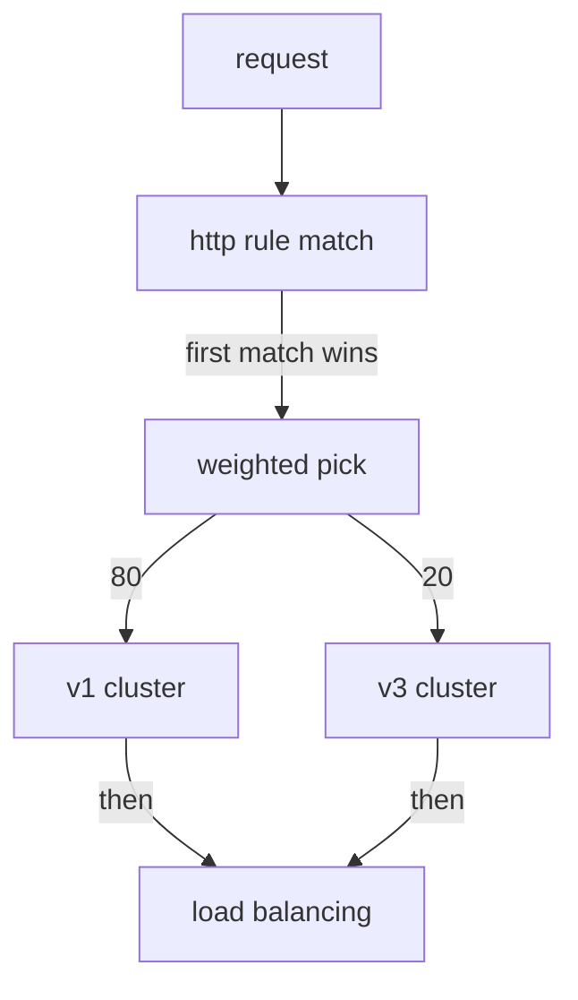

# Split Traffic With Weighted Destinations

A route with one destination sends every request to the same place. To release a new version safely, you need a route that sends most requests to the old version and a small share to the new one. This part writes such a route. You will see where the `weight` field goes, what the sidecar proxy does with it, and what Istio does when the numbers do not add up.

The commands below need the `scout` `DestinationRule` applied in your playground. A `DestinationRule` is the Istio object that defines **subsets**: named groups of a Service's pods, selected by a label. Here the subsets `v1`, `v2` and `v3` select the `scout` pods by their `version` label.

## A route with two weighted destinations

A `VirtualService` is the Istio object that tells the sidecar proxies where to send requests for a host. A weighted route in a `VirtualService` lists several destinations and gives each one a `weight`: its share of the requests. The first step of a canary release looks like this: most requests stay on `scout` v1, and one in five goes to the new v3.

<!-- astrona:playground:renew -->

The commands in this part use a small helper. It sends a number of requests from the `shuttle` pod to `scout` (20 if you give no number) and counts which version answered. Paste it into your terminal if it is not there yet:

```sh
count_versions() { n=${1:-20}; [ $# -gt 0 ] && shift; for i in $(seq 1 $n); do
  kubectl exec -n starfleet deploy/shuttle -- curl -s "$@" http://scout:9080/reviews/0 | grep -o 'scout-v[0-9]'
done | sort | uniq -c; }
```

First, count where the requests go before any `VirtualService` exists:

```sh
count_versions
```

```text
   6 scout-v1
   9 scout-v2
   5 scout-v3
```

All three versions answer. The Kubernetes Service picks pods, not versions, so every pod gets a turn.

Now write the canary. Save this as `virtualservice-scout.yaml`:

```yaml
apiVersion: networking.istio.io/v1
kind: VirtualService
metadata:
  name: scout
  namespace: starfleet
spec:
  hosts:
  - scout
  http:
  - route:
    - destination:
        host: scout
        subset: v1
      weight: 80
    - destination:
        host: scout
        subset: v3
      weight: 20
```

Apply it:

```sh
kubectl apply -f virtualservice-scout.yaml
```

Then check the result. Count 20 requests, twice:

```sh
count_versions
count_versions
```

You should see something like:

```text
  16 scout-v1
   4 scout-v3
  13 scout-v1
   7 scout-v3
```

About a fifth of the requests reach the canary, v3, but the two runs are not the same. The v2 pods are running and healthy, and they get nothing, because no destination names them.

The YAML shows three rules for writing weights:

- **`weight` sits on the route item, next to `destination`.** It is not inside `destination`. If you put it inside, Kubernetes rejects the object straight away.
- **Write weights that add up to 100.** That is what a task means when it says "send 20%".
- **With one destination you can leave `weight` out.** It then counts as 100. Once there are two or more destinations, give every one of them a weight.

The destinations do not have to be subsets of one Service, although that is the usual case. Any `destination` is allowed. For example, you can split requests between two different Services while you move an application from one to the other.

## How the sidecar proxy applies a weight

The **sidecar proxy** is the Envoy proxy that Istio adds to every pod; all traffic in and out of the pod passes through it. **`istiod`**, Istio's control plane, turns your route into configuration for this proxy. The route becomes one Envoy route with a list of **weighted clusters**. A **cluster** is Envoy's name for one destination it can send requests to, and each subset becomes its own cluster.

When a request matches the route, the sidecar proxy of the **sending** pod makes one random pick. The weights set the odds, and the pick chooses one cluster. The proxy does this for that one request only, and keeps no memory of it.



The diagram shows the order inside the sending proxy: it finds the `http` rule that matches, makes one weighted pick to choose a cluster, and only then uses load balancing to pick a pod in that cluster.

Two facts follow from this order. First, the split is not a fixed rotation. At 80/20 the proxy does not send every fifth request to v3. Five requests in a row can all go to v1. The share only shows up over many requests, and it is never exact. That is why your two runs above were different.

Second, the cluster is chosen before the pod. The weight picks a **subset**, and load balancing then picks a pod inside it. So the number of pods in a subset does not change its share.

## Weights that do not add up to 100

Now that you know how the proxy uses the numbers, look at what happens when they do not add up to 100. What happens if you write 50 and 30, which add up to 80? On Istio 1.30.5 the `VirtualService` is accepted with no error and no warning. The proxy uses the weights as **relative** shares: v1 gets 50 out of 80 (62.5%) and v3 gets 30 out of 80 (37.5%). It does **not** mean "50% to v1, 30% to v3, 20% to nowhere".

Save this as `virtualservice-scout.yaml`, replacing the old file:

```yaml
apiVersion: networking.istio.io/v1
kind: VirtualService
metadata:
  name: scout
  namespace: starfleet
spec:
  hosts:
  - scout
  http:
  - route:
    - destination:
        host: scout
        subset: v1
      weight: 50
    - destination:
        host: scout
        subset: v3
      weight: 30
```

Apply it:

```sh
kubectl apply -f virtualservice-scout.yaml
```

Then check the result. Count 100 requests, run `istioctl analyze` (the `istioctl` command that checks your Istio objects for known problems), and print the weights that the `shuttle` proxy received:

```sh
count_versions 100
istioctl analyze -n starfleet
istioctl proxy-config routes deploy/shuttle -n starfleet --name 9080 -o json | grep '"weight"'
```

You should see something like:

```text
  63 scout-v1
  37 scout-v3
✔ No validation issues found when analyzing namespace: starfleet.
                                        "weight": 50
                                        "weight": 30
```

The split is about 62/38, and no tool complains. The proxy received the raw numbers, 50 and 30, and uses them as a ratio. Still write weights that add up to 100. That is what a task means, and older Istio versions rejected any other total.

## More than two destinations

A route can share requests between any number of destinations. The proxy makes a new pick for each request, so the more requests you count, the closer you get to the split you set.

To send 50% to v1, 25% to v2 and 25% to v3, save this as `virtualservice-scout.yaml`, replacing the old file:

```yaml
apiVersion: networking.istio.io/v1
kind: VirtualService
metadata:
  name: scout
  namespace: starfleet
spec:
  hosts:
  - scout
  http:
  - route:
    - destination:
        host: scout
        subset: v1
      weight: 50
    - destination:
        host: scout
        subset: v2
      weight: 25
    - destination:
        host: scout
        subset: v3
      weight: 25
```

Apply it:

```sh
kubectl apply -f virtualservice-scout.yaml
```

Then check the result. Count 40 requests, and then 100:

```sh
count_versions 40
count_versions 100
```

You should see something like:

```text
  23 scout-v1
  11 scout-v2
   6 scout-v3
  50 scout-v1
  21 scout-v2
  29 scout-v3
```

With 40 requests, v3 got only 6 instead of about 10. With 100, all three versions are close to 50/25/25. Small counts move around a lot.

## `weight: 0` keeps a destination ready

A destination with `weight: 0` is allowed, and it gets no requests. It keeps the destination **in your YAML**. Moving a rollout forward is then a change to one number, not a new block of YAML that you must indent correctly under time pressure.

Save this as `virtualservice-scout.yaml`, replacing the old file:

```yaml
apiVersion: networking.istio.io/v1
kind: VirtualService
metadata:
  name: scout
  namespace: starfleet
spec:
  hosts:
  - scout
  http:
  - route:
    - destination:
        host: scout
        subset: v1
      weight: 100
    - destination:
        host: scout
        subset: v3
      weight: 0
```

Apply it:

```sh
kubectl apply -f virtualservice-scout.yaml
```

Then check the result. Count, and print the clusters in the `shuttle` proxy's route:

```sh
count_versions
istioctl proxy-config routes deploy/shuttle -n starfleet --name 9080 -o json | grep -B1 '"weight"' | grep -E 'name|weight'
```

You should see:

```text
  20 scout-v1
                                        "name": "outbound|9080|v1|scout.starfleet.svc.cluster.local",
                                        "weight": 100
```

Every request goes to v1. The proxy's route does not even list v3: `istiod` leaves a destination with weight 0 out of the configuration it sends. The destination only lives in your YAML, ready for the next step.

## A weight on a subset that does not exist

No check stops you from giving a weight to a subset that the `DestinationRule` never defined. Kubernetes accepts the `VirtualService`, and the requests sent to that subset fail.

To see this, change your file so the second destination is `subset: v9` with `weight: 50`, and v1 has `weight: 50`. Save it as `virtualservice-scout.yaml`:

```yaml
apiVersion: networking.istio.io/v1
kind: VirtualService
metadata:
  name: scout
  namespace: starfleet
spec:
  hosts:
  - scout
  http:
  - route:
    - destination:
        host: scout
        subset: v1
      weight: 50
    - destination:
        host: scout
        subset: v9
      weight: 50
```

Apply it:

```sh
kubectl apply -f virtualservice-scout.yaml
```

Then check the result. Send six requests and print only the HTTP status code of each, then run `istioctl analyze`:

```sh
for i in 1 2 3 4 5 6; do kubectl exec -n starfleet deploy/shuttle -- curl -s -o /dev/null -w "%{http_code} " http://scout:9080/reviews/0; done; echo
istioctl analyze -n starfleet
```

You should see something like this (the `analyze` output is shortened to the error):

```text
503 200 503 503 200 200
Error [IST0101] (VirtualService starfleet/scout) Referenced host+subset in destinationrule not found: "scout+v9"
```

About half the requests fail with `503 Service Unavailable`: those are the ones the random pick sent to `v9`. `istioctl analyze` names the problem with the message code `IST0101`, which means the object refers to something that does not exist.

> [!TIP]
> Run `istioctl analyze` after every weight change. It is the only check that notices a weight on a subset that does not exist.

## What a weight is not

Two more facts prevent a whole group of mistakes. First, a weight is not a rate limit. It divides the requests that arrive; it does not cap them. At `weight: 20`, if ten times more requests arrive, v3 gets ten times more requests than before.

Second, a weight does not keep one user on one version. Two requests in a row from the same client can go to different subsets, because each pick is separate. If a user must stay on one version, use a header match instead.

You now know how to write a weighted route, where `weight` goes, and how the sending proxy turns the weights into one random pick for each request. You have also seen what happens with weights that do not add up to 100, with `weight: 0`, and with a subset that does not exist. The open question is how to change these weights safely while real users depend on the service.

## Common pitfalls

> [!WARNING]
> - **Putting `weight` inside `destination`.** It sits next to `destination`, not inside it. Kubernetes rejects the object at once.
> - **Writing weights that do not add up to 100.** Istio 1.30.5 accepts them and uses them as a ratio, so 50 + 30 gives about 62/38, not 50/30.
> - **Giving a weight to a subset that no `DestinationRule` defines.** Nothing rejects it, and those requests fail with `503`. Run `istioctl analyze`.
> - **Expecting a fixed rotation.** Each request gets its own random pick. Count many requests before you judge a split.
> - **Reading a weight as a rate limit.** It divides the requests that arrive. It does not cap them.

## Your mission: Split Traffic Three Ways With Weights Lab

You can now write a weighted route, predict the split, and measure it over enough requests. The lab asks you to change an existing `VirtualService` so that `scout` requests split between three versions in exact shares, and to prove the split with live requests.

The lab runs in its own cluster, so first pause your playground. Nothing in it is lost:

```sh
astrona stop ats-014-playground-020-01
```

Then start the lab:

```sh
astrona run --git git@github.com:astrona-io/ATS014.git -c sections/section-020/module-01/labs/lab-02
```

The task is on the next page. Solve it on your own first. When you think you are done, send it for grading:

```sh
astrona submit -c sections/section-020/module-01/labs/lab-02
```

When the lab is done, remove it and start your playground again:

```sh
astrona destroy ats-014-lab-020-01-02
astrona start ats-014-playground-020-01
```
