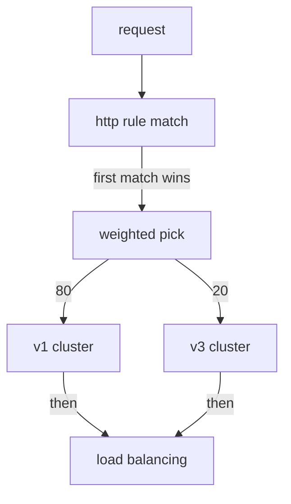

# Split Traffic With Weighted Destinations

A route with one destination sends every request to the same place. To release a new version safely, you need a route that sends most requests to the old version and a small share to the new one. This part writes such a route. You will see where the `weight` field goes and what the sidecar proxy does with it for each request.

The commands below need the `scout` `DestinationRule` applied in your playground. A `DestinationRule` is the Istio object that defines **subsets**: named groups of a Service's pods, selected by a label. Here the subsets `v1`, `v2` and `v3` select the `scout` pods by their `version` label.

## A route with two weighted destinations

A `VirtualService` is the Istio object that tells the sidecar proxies where to send requests for a host. A weighted route in a `VirtualService` lists several destinations and gives each one a `weight`: its share of the requests. The first step of a canary release looks like this: most requests stay on `scout` v1, and one in five goes to the new v3.

<!-- astrona:playground:renew -->

The commands in this part use a small helper. It sends a number of requests from the `shuttle` pod to `scout` (20 if you give no number) and counts which version answered. Paste it into your terminal if it is not there yet:

```sh
count_versions() { n=${1:-20}; [ $# -gt 0 ] && shift; for i in $(seq 1 $n); do
  kubectl exec -n starfleet deploy/shuttle -- curl -s "$@" http://scout:9080/reviews/0 | grep -o 'scout-v[0-9]'
done | sort | uniq -c; }
```

First, count where the requests go before any `VirtualService` exists:

```sh
count_versions
```

```text
   6 scout-v1
   9 scout-v2
   5 scout-v3
```

All three versions answer. The Kubernetes Service picks pods, not versions, so every pod gets a turn.

Now write the canary. Save this as `virtualservice-scout.yaml`:

```yaml
apiVersion: networking.istio.io/v1
kind: VirtualService
metadata:
  name: scout
  namespace: starfleet
spec:
  hosts:
  - scout
  http:
  - route:
    - destination:
        host: scout
        subset: v1
      weight: 80
    - destination:
        host: scout
        subset: v3
      weight: 20
```

Apply it:

```sh
kubectl apply -f virtualservice-scout.yaml
```

Then check the result. Count 20 requests, twice:

```sh
count_versions
count_versions
```

You should see something like:

```text
  16 scout-v1
   4 scout-v3
  13 scout-v1
   7 scout-v3
```

About a fifth of the requests reach the canary, v3, but the two runs are not the same. The v2 pods are running and healthy, and they get nothing, because no destination names them.

The YAML shows three rules for writing weights:

- **`weight` sits on the route item, next to `destination`.** It is not inside `destination`. If you put it inside, Kubernetes rejects the object straight away.
- **Write weights that add up to 100.** That is what a task means when it says "send 20%".
- **With one destination you can leave `weight` out.** It then counts as 100. Once there are two or more destinations, give every one of them a weight.

The destinations do not have to be subsets of one Service, although that is the usual case. Any `destination` is allowed. For example, you can split requests between two different Services while you move an application from one to the other.

## How the sidecar proxy applies a weight

The **sidecar proxy** is the Envoy proxy that Istio adds to every pod; all traffic in and out of the pod passes through it. **`istiod`**, Istio's control plane, turns your route into configuration for this proxy. The route becomes one Envoy route with a list of **weighted clusters**. A **cluster** is Envoy's name for one destination it can send requests to, and each subset becomes its own cluster.

When a request matches the route, the sidecar proxy of the **sending** pod makes one random pick. The weights set the odds, and the pick chooses one cluster. The proxy does this for that one request only, and keeps no memory of it.



The diagram shows the order inside the sending proxy: it finds the `http` rule that matches, makes one weighted pick to choose a cluster, and only then uses load balancing to pick a pod in that cluster.

Two facts follow from this order. First, the split is not a fixed rotation. At 80/20 the proxy does not send every fifth request to v3. Five requests in a row can all go to v1. The share only shows up over many requests, and it is never exact. That is why your two runs above were different.

Second, the cluster is chosen before the pod. The weight picks a **subset**, and load balancing then picks a pod inside it. So the number of pods in a subset does not change its share.

You now know how to write a weighted route, where `weight` goes, and how the sending proxy turns the weights into one random pick for each request, before load balancing picks a pod. You have also seen the split work on a live cluster, close to 80/20 but never exact. The open question is what Istio does when the weights are less tidy: totals other than 100, three destinations, a zero weight, or a subset that does not exist.

## Common pitfalls

> [!WARNING]
> - **Putting `weight` inside `destination`.** It sits next to `destination`, not inside it. Kubernetes rejects the object at once.
> - **Leaving out `weight` with two or more destinations.** Only a single destination may leave it out. Give every destination a weight.
> - **Expecting a fixed rotation.** Each request gets its own random pick. Count many requests before you judge a split.
> - **Forgetting the destinations you did not list.** A healthy subset that no destination names, like v2 here, gets no requests at all.
> - **Adding pods to change a share.** The weight picks the subset first, so the number of pods in a subset does not change its share.
