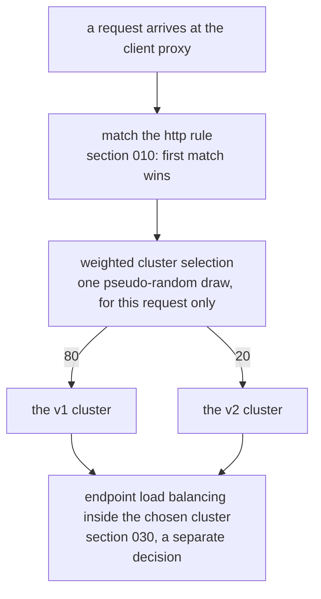

# Weighted Destinations

> Prerequisite: [the module landing page](./course.md). Next: [Running A Rollout](./course-02-running-a-rollout.md).

A route block has always been a list; until now every example had one entry in it. This part is about what happens when it has several, what rule governs the numbers you put on them, and what the proxy actually does with those numbers when a request arrives.

## Several destinations, one rule

```yaml
apiVersion: networking.istio.io/v1
kind: VirtualService
metadata:
  name: notification
  namespace: shifting-demo
spec:
  hosts:
    - notification-service
  http:
    - route:
        - destination:
            host: notification-service
            subset: v1
          weight: 80
        - destination:
            host: notification-service
            subset: v2
          weight: 20
```

Three things to read out of that shape:

- **`weight` sits on the route entry, beside `destination` — not inside it.** Nesting it under `destination` is a schema error, so the API server tells you immediately. This is the good kind of mistake.
- **The weights in one route block must sum to 100.** Anything else is rejected at admission time; you get an error from `kubectl apply`, not a silently odd split.
- **With a single destination you may omit `weight` entirely**, and it is implicitly 100. Two destinations where only one carries a weight is rejected — once there is a choice to make, every option must be quantified.

The destinations do not have to be subsets of the same host, though that is the common case. Any `destination` is legal, which is how you would weight traffic across two entirely different services during a migration.

## What the proxy does with a weight

The mechanism matters because it explains every measurement surprise in Part 2.

Istio compiles the route entries into a single Envoy route with a **weighted cluster** list. When a request matches that route, the proxy makes an independent, pseudo-random draw against the weights — for *that request*, then forgets it:



The draw happens once per request and nothing remembers it. That single property explains every measurement surprise in Part 2.

Two consequences follow immediately, and both are examinable:

- **It is not a rota.** At 80/20 the proxy does not send every fifth request to `v2`. Five requests can all land on `v1`; so can twenty. The proportion emerges over many requests and is never exact.
- **Cluster selection happens before endpoint selection.** The weight picks a *subset*; only then does load balancing choose a pod inside it. Part 3 is entirely about what that ordering implies.

## The degenerate case is the start of a rollout

Before shifting anything, a canary begins at 100/0 — a weighted route with all the traffic on the existing version. Writing it that way rather than omitting the second destination means the rollout is a change to a number rather than a change to the object's shape.

> [!TIP]
> **Try it — subsets plus an all-v1 route**
>
> ```sh
> kubectl apply -f - <<'EOF'
> apiVersion: networking.istio.io/v1
> kind: DestinationRule
> metadata:
>   name: notification-service
>   namespace: shifting-demo
> spec:
>   host: notification-service
>   subsets:
>     - name: v1
>       labels:
>         version: v1
>     - name: v2
>       labels:
>         version: v2
> ---
> apiVersion: networking.istio.io/v1
> kind: VirtualService
> metadata:
>   name: notification
>   namespace: shifting-demo
> spec:
>   hosts:
>     - notification-service
>   http:
>     - route:
>         - destination:
>             host: notification-service
>             subset: v1
>           weight: 100
> EOF
> kubectl -n shifting-demo exec deploy/tester -- sh -c \
>   'for i in $(seq 1 40); do curl -s -X POST http://notification-service/notify; echo; done' | sort | uniq -c
> ```
>
> Expect something like:
>
> ```text
>   40 ["EMAIL"]
> ```
>
> Forty requests, one distinct answer. `v2` is running and healthy and receives nothing — exactly the state a canary starts from, and the one you will step away from a weight at a time.

## What the admission check catches, and what it does not

The 100-sum rule is enforced by the control plane's validating webhook, which is worth confirming once so you recognise the error under time pressure rather than assuming your YAML is malformed.

> [!TIP]
> **Try it — weights that do not add up**
>
> ```sh
> kubectl apply -f - <<'EOF'
> apiVersion: networking.istio.io/v1
> kind: VirtualService
> metadata:
>   name: notification
>   namespace: shifting-demo
> spec:
>   hosts:
>     - notification-service
>   http:
>     - route:
>         - destination: { host: notification-service, subset: v1 }
>           weight: 80
>         - destination: { host: notification-service, subset: v2 }
>           weight: 30
> EOF
> ```
>
> Expect something like:
>
> ```text
> Error from server: admission webhook "validation.istio.io" denied the request:
> configuration is invalid: total destination weight 110 != 100
> ```
>
> The message names the total, which makes this one of the few Istio errors that tells you exactly what to change. Note what it does *not* check: that the subsets exist. `weight: 50` split across `v1` and `v9` sums to 100 and is accepted — and then 503s at request time, which is the section 010 failure all over again.

## A note on what a weight is not

Two clarifications that prevent a whole category of misreading later:

**A weight is not a rate limit.** It divides whatever traffic arrives; it does not cap it. At `weight: 20` under ten times the load, `v2` receives ten times as many requests as before.

**A weight is not a guarantee about any individual user.** Consecutive requests from the same client can land on different subsets, because each draw is independent. If a user must stay on one version for the duration of a session, weights are the wrong tool — that is either a header match from section 010 or the session affinity from section 030.

## `weight: 0` is a useful state

A destination weighted `0` is legal and receives nothing. It looks pointless and is not: it keeps the destination *in the object*, so advancing or reversing a rollout is a change to a number rather than an edit to the shape of the list.

That matters more than it sounds under time pressure. Adding a destination means getting indentation, `host` and `subset` right while something is wrong in production; changing `0` to `10` does not.

## Common pitfalls

> [!WARNING]
> **Nesting `weight` inside `destination`.** It is a sibling of `destination`, not a field of it. The schema catches this immediately.
>
> **Weights that do not sum to 100.** Rejected at admission, with the total named in the error.
>
> **Weighting a subset no `DestinationRule` defines.** The sum check passes and the requests 503. `istioctl analyze` is what catches it.
>
> **Expecting a rota.** The draw is independent per request. Five requests at 80/20 can all land on `v1`.
>
> **Reading a weight as a rate limit.** It divides the traffic that arrives; it does not cap it.
>
> **Expecting a user to stay on one version.** Consecutive requests from one client are independent draws. Use a header match or `consistentHash` instead.

> *A weight is a per-request draw, made by the client proxy, before any endpoint is chosen.*

## Reference

- [HTTPRouteDestination API](https://istio.io/latest/docs/reference/config/networking/virtual-service/#HTTPRouteDestination) — the `destination` + `weight` pair, in one short page.
- [Traffic shifting task](https://istio.io/latest/docs/tasks/traffic-management/traffic-shifting/) — the upstream walkthrough this module follows.
- [Envoy weighted cluster routing](https://www.envoyproxy.io/docs/envoy/latest/api-v3/config/route/v3/route_components.proto#envoy-v3-api-msg-config-route-v3-weightedcluster) — what Istio compiles your weights into.
- `istioctl analyze -n <namespace>` — catches the subset-does-not-exist case that the 100-sum check does not.
