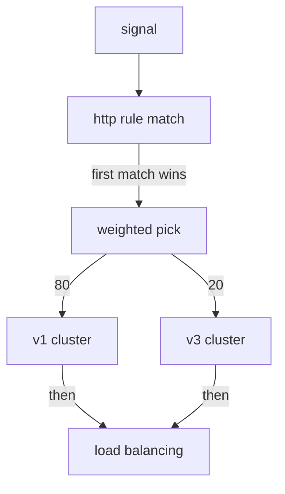

# Weighted Destinations

Astronaut, until now every route you wrote had one destination: every signal flew to the same place. This part is about a route with several destinations, each with a number on it. You will see where the number goes, what the sidecar does with it, and what Istio does when the numbers do not add up.

The commands below need the `scout` `DestinationRule` with the subsets `v1`, `v2` and `v3` applied in your playground, and the `count_versions` helper pasted into your terminal.

## Several destinations, one rule

A weighted route lists several destinations and gives each one a `weight`: its share of the signals. This is the first step of a canary release: most signals stay on the `scout` v1 ship class, and one in five goes to the new v3.

A piece of the `VirtualService` (you apply the full object below):

```yaml
  http:
  - route:
    - destination:
        host: scout
        subset: v1
      weight: 80
    - destination:
        host: scout
        subset: v3
      weight: 20
```

Three things to read out of it:

- **`weight` sits on the route item, next to `destination`.** It is not inside `destination`. If you nest it there, Kubernetes rejects the object straight away.
- **Write weights that add up to 100.** That is what a task means when it says "send 20%".
- **With one destination you can leave `weight` out.** It then counts as 100. Once there are two or more destinations, give every one of them a weight.

The destinations do not have to be subsets of one beacon, although that is the usual case. Any `destination` is allowed, which is how you would split signals between two different services during a move.

<!-- astrona:playground:renew -->

### Launch an 80/20 canary

First, count where the signals go before any flight plan exists:

```sh
count_versions
```

```text
   6 scout-v1
   9 scout-v2
   5 scout-v3
```

All three versions answer, because the Kubernetes Service picks pods, not versions. Now save the canary as `virtualservice-scout.yaml`:

```yaml
apiVersion: networking.istio.io/v1
kind: VirtualService
metadata:
  name: scout
  namespace: starfleet
spec:
  hosts:
  - scout
  http:
  - route:
    - destination:
        host: scout
        subset: v1
      weight: 80
    - destination:
        host: scout
        subset: v3
      weight: 20
```

Apply it:

```sh
kubectl apply -f virtualservice-scout.yaml
```

Then count 20 signals, twice:

```sh
count_versions
count_versions
```

You should see something like:

```text
  16 scout-v1
   4 scout-v3
  13 scout-v1
   7 scout-v3
```

About a fifth of the signals reach the canary, v3, but the two runs are not the same. v2 is running and healthy, and it gets nothing, because no destination names it.

## What the sidecar does with a weight

Istio turns the route into one Envoy route with a list of **weighted clusters**. A cluster is Envoy's name for one place a signal can go. When a signal fits the route, the communications officer of the **sending** ship rolls a dice. The weights set the odds, and the dice picks one cluster. The officer does this for that one signal, then forgets it.



The sending proxy first finds the `http` rule that fits, then makes one random pick for this signal to choose a cluster. Picking a pod inside that cluster is a separate decision that comes after. Two things follow:

- **It is not a rota.** At 80/20 the proxy does not send every fifth signal to v3. Five signals in a row can all land on v1. The share only shows up over many signals, and it is never exact. That is why your two runs above differed.
- **The cluster is chosen before the pod.** The weight picks a *subset*. Only then does load balancing pick a pod inside it. So the number of pods in a subset does not change its share.

## Weights that do not add up to 100

What happens if you write 50 and 30? That adds up to 80. On Istio 1.30.5 it is accepted with no error and no warning. The weights become **relative** shares: v1 gets 50 out of 80 (62.5%) and v3 gets 30 out of 80 (37.5%). It does **not** mean "50% to v1, 30% to v3, 20% to nowhere".

### Count a split that adds up to 80

Save this as `virtualservice-scout.yaml`, replacing the old file:

```yaml
apiVersion: networking.istio.io/v1
kind: VirtualService
metadata:
  name: scout
  namespace: starfleet
spec:
  hosts:
  - scout
  http:
  - route:
    - destination:
        host: scout
        subset: v1
      weight: 50
    - destination:
        host: scout
        subset: v3
      weight: 30
```

Apply it:

```sh
kubectl apply -f virtualservice-scout.yaml
```

Then count 100 signals, run `istioctl analyze`, and look at the weights the shuttle's proxy received:

```sh
count_versions 100
istioctl analyze -n starfleet
istioctl proxy-config routes deploy/shuttle -n starfleet --name 9080 -o json | grep '"weight"'
```

You should see something like:

```text
  63 scout-v1
  37 scout-v3
✔ No validation issues found when analyzing namespace: starfleet.
                                        "weight": 50
                                        "weight": 30
```

The split is about 62/38, and nothing complains. The proxy received the raw numbers, 50 and 30, and treats them as a ratio. Still write weights that add up to 100: it is what a task means, and older Istio versions rejected anything else.

## More than two destinations

A route can share signals between any number of destinations. Each signal gets its own roll, so the more signals you count, the closer you get to the split you set.

### Split three ways

Send 50% to v1, 25% to v2 and 25% to v3. Save this as `virtualservice-scout.yaml`, replacing the old file:

```yaml
apiVersion: networking.istio.io/v1
kind: VirtualService
metadata:
  name: scout
  namespace: starfleet
spec:
  hosts:
  - scout
  http:
  - route:
    - destination:
        host: scout
        subset: v1
      weight: 50
    - destination:
        host: scout
        subset: v2
      weight: 25
    - destination:
        host: scout
        subset: v3
      weight: 25
```

Apply it:

```sh
kubectl apply -f virtualservice-scout.yaml
```

Then count 40 signals, and then 100:

```sh
count_versions 40
count_versions 100
```

You should see something like:

```text
  23 scout-v1
  11 scout-v2
   6 scout-v3
  50 scout-v1
  21 scout-v2
  29 scout-v3
```

With 40 signals, v3 got only 6 instead of about 10. With 100, all three are close to 50/25/25. Small counts wobble.

## `weight: 0` keeps a destination ready

A destination with `weight: 0` is allowed, and it gets nothing. It keeps the destination **in your YAML**, so moving a rollout forward is a change to one number, not a new block of indentation under time pressure.

### Park v3 at zero

Save this as `virtualservice-scout.yaml`, replacing the old file:

```yaml
apiVersion: networking.istio.io/v1
kind: VirtualService
metadata:
  name: scout
  namespace: starfleet
spec:
  hosts:
  - scout
  http:
  - route:
    - destination:
        host: scout
        subset: v1
      weight: 100
    - destination:
        host: scout
        subset: v3
      weight: 0
```

Apply it:

```sh
kubectl apply -f virtualservice-scout.yaml
```

Then count, and look at the clusters in the shuttle's route:

```sh
count_versions
istioctl proxy-config routes deploy/shuttle -n starfleet --name 9080 -o json | grep -B1 '"weight"' | grep -E 'name|weight'
```

You should see:

```text
  20 scout-v1
                                        "name": "outbound|9080|v1|scout.starfleet.svc.cluster.local",
                                        "weight": 100
```

Every signal goes to v1. The proxy's route does not even list v3: a destination with weight 0 is left out of the orders mission control sends. It only lives in your YAML, ready for the next step.

## A weight on a subset that does not exist

No check stops you from giving a weight to a subset the `DestinationRule` never defined. The flight plan is accepted, and the signals sent there fail.

### Send half the signals to `v9`

Change your file so the second destination is `subset: v9` with `weight: 50`, and v1 has `weight: 50`. Save it as `virtualservice-scout.yaml`:

```yaml
apiVersion: networking.istio.io/v1
kind: VirtualService
metadata:
  name: scout
  namespace: starfleet
spec:
  hosts:
  - scout
  http:
  - route:
    - destination:
        host: scout
        subset: v1
      weight: 50
    - destination:
        host: scout
        subset: v9
      weight: 50
```

Apply it:

```sh
kubectl apply -f virtualservice-scout.yaml
```

Then send six signals, printing only the status code, and run `istioctl analyze`:

```sh
for i in 1 2 3 4 5 6; do kubectl exec -n starfleet deploy/shuttle -- curl -s -o /dev/null -w "%{http_code} " http://scout:9080/reviews/0; done; echo
istioctl analyze -n starfleet
```

You should see something like (`analyze` output trimmed to the error):

```text
503 200 503 503 200 200
Error [IST0101] (VirtualService starfleet/scout) Referenced host+subset in destinationrule not found: "scout+v9"
```

About half the signals fail with `503`: those were the ones the roll sent to `v9`. `istioctl analyze` names the problem.

> [!TIP]
> Run `istioctl analyze` after every weight change. It is the only check that notices a weight on a subset that does not exist.

## What a weight is not

Two points that prevent a whole group of mistakes:

- **A weight is not a rate limit.** It divides whatever signals arrive. It does not cap them. At `weight: 20` under ten times the load, v3 gets ten times as many signals as before.
- **A weight does not keep one astronaut on one version.** Two signals in a row from the same sender can land on different subsets, because each roll is separate. If an astronaut must stay on one version, use a header match instead.

## Common pitfalls

> [!WARNING]
> - **Nesting `weight` inside `destination`.** It sits next to `destination`, not inside it. Kubernetes rejects the object at once.
> - **Writing weights that do not add up to 100.** Istio 1.30.5 accepts them and uses them as a ratio, so 50 + 30 gives about 62/38, not 50/30.
> - **Weighting a subset no `DestinationRule` defines.** Nothing rejects it, and those signals fail with `503`. Run `istioctl analyze`.
> - **Expecting a rota.** Each signal is a separate random roll. Count many signals before you judge a split.
> - **Reading a weight as a rate limit.** It divides the signals that arrive. It does not cap them.

> *A weight is a random roll for each signal, made by the sending ship's communications officer, before any pod is chosen.*

## Your mission: Split The Scout Three Ways

You can now write a weighted flight plan, predict the split, and measure it over enough signals. Now prove it in a graded mission: split the scout's signals between three ship classes, in the exact shares mission control asks for.

The mission runs in its own training solar system, so first pause your playground. Nothing in it is lost:

```sh
astrona stop ats-014-playground-020-01
```

Then start the mission:

```sh
astrona run --git git@github.com:astrona-io/ATS014.git -c sections/section-020/module-01/labs/lab-02
```

Read the task in [`question.md`](./labs/lab-02/question.md) and solve it on your own first. When you think you are done, send it for grading:

```sh
astrona submit -c sections/section-020/module-01/labs/lab-02
```

When the mission is done, remove it and wake your playground up again:

```sh
astrona destroy ats-014-lab-020-01-02
astrona start ats-014-playground-020-01
```
