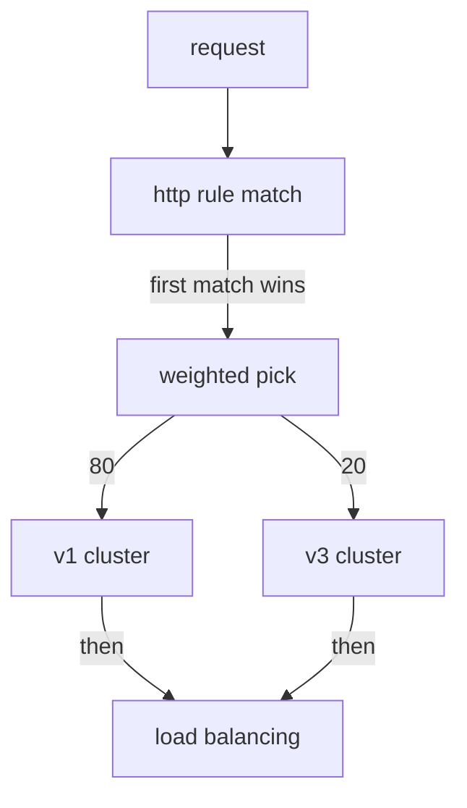

# Weighted Destinations

Until now, every route you wrote had one destination in it: every signal flew to the same place. This part is about a route with several. You will see how to put a number on each one, what Istio does with numbers that do not add up, and what the sidecar does with them when a request arrives.

## Several destinations, one rule

Here is the first step of a canary release on the Starfleet. Most signals stay on the `scout` v1 ship class, and one in five goes to the new v3:

```yaml
apiVersion: networking.istio.io/v1
kind: VirtualService
metadata:
  name: scout
  namespace: starfleet
spec:
  hosts:
  - scout
  http:
  - route:
    # Weights should add up to 100. Picked randomly per request.
    - destination:
        host: scout
        subset: v1
      weight: 80
    - destination:
        host: scout
        subset: v3
      weight: 20
```

A `VirtualService` is the flight plan for a service. A weighted route is a flight plan that sends a small share of signals to the new ship class before the whole fleet switches. Three things to read out of the YAML:

- **`weight` sits on the route item, next to `destination`.** It is not inside `destination`. If you nest it there, the API server rejects the object straight away. That is the good kind of mistake.
- **Write weights that add up to 100.** That is what a task means when it says "send 20%". Later in this part you will see what Istio does when they do not.
- **With one destination you can leave `weight` out.** It then counts as 100. Once there are two or more destinations, give every one of them a weight.

The destinations do not have to be subsets of one host, though that is the usual case. Any `destination` is allowed. That is how you would split traffic between two different services during a move.

## What the sidecar does with a weight

The mechanism matters, because it explains every surprise in Part 2.

Istio turns the route into one Envoy route with a list of **weighted clusters**. A cluster is Envoy's name for "one place a request can go". When a request matches the route, the sidecar of the app that **sends** it rolls a dice. The weights set the odds, and the dice picks one cluster. The sidecar does this for that one request, then forgets it:



The client sidecar matches the `http` rule, then makes one random roll for this request to pick a cluster. Load balancing inside that cluster is a separate decision that comes after. The roll happens once per request and nothing remembers it. Two things follow, and both come up in the exam:

- **It is not a rota.** At 80/20 the sidecar does not send every fifth request to v3. Five requests in a row can all land on v1. So can twenty. The share only shows up over many requests, and it is never exact.
- **The cluster is chosen before the pod.** The weight picks a *subset*. Only then does load balancing pick a pod inside it. Part 3 is about what that order means.

<!-- astrona:playground:renew -->

> [!TIP]
> **Try it – an 80/20 canary**
>
> Paste the `count_versions` helper from the playground's [overview](./playground/docs/overview.md) first. Then write the canary to a file and apply it.
>
> Save this as `virtualservice-scout.yaml`:
>
> ```yaml
> apiVersion: networking.istio.io/v1
> kind: VirtualService
> metadata:
>   name: scout
>   namespace: starfleet
> spec:
>   hosts:
>   - scout
>   http:
>   - route:
>     - destination:
>         host: scout
>         subset: v1
>       weight: 80
>     - destination:
>         host: scout
>         subset: v3
>       weight: 20
> ```
>
> Apply it:
>
> ```sh
> kubectl apply -f virtualservice-scout.yaml
> ```
>
> Then check the result:
>
> ```sh
> count_versions
> ```
>
> Expect something like:
>
> ```text
>   16 scout-v1
>    4 scout-v3
> ```
>
> About a fifth of the requests reached the canary, v3. Run it again and you get a slightly different pair. v2 is running and healthy, and it gets nothing, because no destination names it.

## Weights that do not add up to 100

What happens if you write 50 and 30? That adds up to 80. Is that an error?

In Istio 1.30.5 it is not. Istio accepts it with no error and no warning, and treats the weights as **relative** shares. v1 gets 50 out of 80 (62.5%) and v3 gets 30 out of 80 (37.5%). It does **not** mean "50% to v1, 30% to v3, 20% to nowhere".

> [!TIP]
> **Try it – weights that add up to 80**
>
> Save this as `virtualservice-scout.yaml`:
>
> ```yaml
> apiVersion: networking.istio.io/v1
> kind: VirtualService
> metadata:
>   name: scout
>   namespace: starfleet
> spec:
>   hosts:
>   - scout
>   http:
>   - route:
>     - destination:
>         host: scout
>         subset: v1
>       weight: 50
>     - destination:
>         host: scout
>         subset: v3
>       weight: 30
> ```
>
> Apply it:
>
> ```sh
> kubectl apply -f virtualservice-scout.yaml
> ```
>
> Then check the result:
>
> ```sh
> count_versions 100
> istioctl analyze -n starfleet
> istioctl proxy-config routes deploy/shuttle -n starfleet --name 9080 -o json | grep '"weight"'
> ```
>
> Expect something like:
>
> ```text
>   63 scout-v1
>   37 scout-v3
> ✔ No validation issues found when analyzing namespace: starfleet.
>                                         "weight": 50
>                                         "weight": 30
> ```
>
> The split is about 62/38, and nothing complains. Count at least 100 here: a run of 30 on the same cluster came out 14/16, which tells you nothing. The sidecar received the raw numbers, 50 and 30, and treats them as a ratio.

In the exam, still write weights that add up to 100. That is what the task means, and older Istio versions rejected anything else. Some older study material, and some older labs, still say a wrong total is rejected. Trust what your cluster does.

Note what no check looks at: whether the subsets exist. A weight on a subset named `v9` is accepted, and those requests then fail with a 503. `istioctl analyze` is the tool that catches it.

## More than two destinations

A route can share traffic between any number of destinations. This route sends 50% to v1, 25% to v2 and 25% to v3:

```yaml
  http:
  - route:
    - destination:
        host: scout
        subset: v1
      weight: 50
    - destination:
        host: scout
        subset: v2
      weight: 25
    - destination:
        host: scout
        subset: v3
      weight: 25
```

Each request rolls the dice again, so 40 requests only come out roughly 50/25/25. With `count_versions 40`, a run on a test cluster gave 20 v1, 10 v2 and 10 v3, but another run can easily come out 17/8/15. The more requests you send, the closer you get to the split you set.

## `weight: 0` is a useful state

A destination with weight `0` is allowed, and it gets nothing. That looks pointless, but it is not. It keeps the destination **in the object**, so moving a rollout forward or back is a change to a number, not a change to the shape of the list:

```yaml
  http:
  - route:
    - destination:
        host: scout
        subset: v1
      weight: 100
    - destination:
        host: scout
        subset: v3
      weight: 0
```

This matters most under time pressure. Adding a destination means getting the indentation, `host` and `subset` right while something is going wrong. Changing `0` to `10` does not. It is also handy when you want someone to review a rollout plan before it starts.

## What a weight is not

Two points that stop a whole group of mistakes later:

**A weight is not a rate limit.** It divides whatever traffic arrives. It does not cap it. At `weight: 20` under ten times the load, v3 gets ten times as many requests as before.

**A weight does not keep one user on one version.** Two requests in a row from the same client can land on different subsets, because each roll is separate. If a user must stay on one version, weights are the wrong tool. Use a header match from section 010, or session affinity from section 030.

## Common pitfalls

> [!WARNING]
> **Nesting `weight` inside `destination`.** It sits next to `destination`, not inside it. The schema check catches this at once.
>
> **Writing weights that do not add up to 100.** Istio 1.30.5 accepts them and uses them as a ratio, so 50 + 30 gives about 62/38, not 50/30. Make them add up to 100.
>
> **Weighting a subset no `DestinationRule` defines.** Nothing rejects it, and those requests fail with a 503. Run `istioctl analyze`.
>
> **Expecting a rota.** Each request is a separate random roll. Five requests at 80/20 can all land on v1.
>
> **Reading a weight as a rate limit.** It divides the traffic that arrives. It does not cap it.
>
> **Expecting a user to stay on one version.** Each request is a new roll. Use a header match or `consistentHash` instead.

> *A weight is a random roll per request, made by the client sidecar, before any pod is chosen.*
