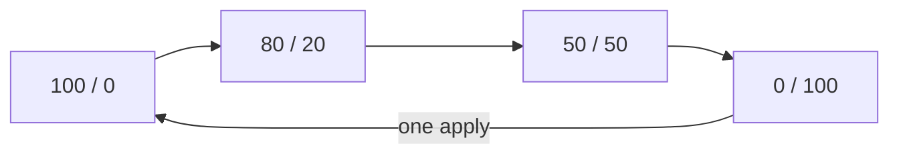

# Running A Rollout

Astronaut, a **canary release** moves astronauts to a new version a little at a time. First a small share of signals goes to the new ship class. If it holds up, more follow, and then the whole fleet. If it does not, every signal goes back to the proven ships in one step.

Istio has no special machinery for this. A canary is the same weighted `VirtualService`, applied a few times with new numbers. This part is about doing that safely: how to measure a split, how to move forward and back, how to change weights with a patch, and how to keep your testers out of the split.

The commands below need the `scout` `DestinationRule` with the subsets `v1`, `v2` and `v3` applied in your playground, and the `count_versions` helper pasted into your terminal.

## Measuring a random split

Each signal is a separate random roll, so a small sample tells you almost nothing. At a true 80/20 split, ten signals that all land on v1 are normal: it happens about one time in ten. Deciding from that that the weights are broken, and "fixing" a flight plan that was correct, is the most common mistake on this topic.

A rough guide for reading your own counts:

| Signals counted | What you can conclude at a set 80/20 |
| --- | --- |
| 10 | almost nothing; 10/0 and 6/4 are both normal |
| 100 | the split is in the right area; expect roughly 75–85 |
| 1000 | close to the weight, within a percent or two |

Use 100 signals as your working minimum, and expect a few percent of wobble even then. When a task says "confirm the split", it means over enough signals to mean something.

## Moving the rollout forward

Each step of the rollout is the **same** `VirtualService`, `scout`, with new numbers. Because the name and namespace stay the same, every `kubectl apply` replaces the split before it. You never delete anything between steps.

<!-- astrona:playground:renew -->

### Go from 80/20 to 50/50

Save this as `virtualservice-scout-50-50.yaml`:

```yaml
apiVersion: networking.istio.io/v1
kind: VirtualService
metadata:
  name: scout
  namespace: starfleet
spec:
  hosts:
  - scout
  http:
  - route:
    - destination:
        host: scout
        subset: v1
      weight: 50
    - destination:
        host: scout
        subset: v3
      weight: 50
```

Apply it:

```sh
kubectl apply -f virtualservice-scout-50-50.yaml
```

Then count 20 signals:

```sh
count_versions
```

You should see something like:

```text
   8 scout-v1
  12 scout-v3
```

Roughly half each. You changed two numbers. No pod was scaled or restarted.

### Move every signal to v3

The last step of the rollout has one destination, so it needs no `weight`. Save this as `virtualservice-scout-v3.yaml`:

```yaml
apiVersion: networking.istio.io/v1
kind: VirtualService
metadata:
  name: scout
  namespace: starfleet
spec:
  hosts:
  - scout
  http:
  - route:
    - destination:
        host: scout
        subset: v3
```

Apply it:

```sh
kubectl apply -f virtualservice-scout-v3.yaml
```

Then count again:

```sh
count_versions
```

You should see:

```text
  20 scout-v3
```

The whole fleet now flies to the new ship class.

## Rolling back

A change lands as fast as mission control can push it: a second or two on a small cluster. Mission control radios the new flight plan to every ship in flight, so no pod restarts and no Deployment changes. The app does not notice anything happened.

That makes the interesting number not how fast you can move signals *to* a new version, but how fast you can move them *away*:



Forward is a rollout and backward is a rollback. Both are the same operation with different numbers, and no step recreates a pod. A rollback needs no special procedure: it is the old numbers, applied again. A Deployment rollback, by comparison, recreates pods and takes as long as their readiness checks allow.

### Roll back in one apply

Save this as `virtualservice-scout-v1.yaml`:

```yaml
apiVersion: networking.istio.io/v1
kind: VirtualService
metadata:
  name: scout
  namespace: starfleet
spec:
  hosts:
  - scout
  http:
  - route:
    - destination:
        host: scout
        subset: v1
```

Apply it:

```sh
kubectl apply -f virtualservice-scout-v1.yaml
```

Then count:

```sh
count_versions
```

You should see:

```text
  20 scout-v1
```

One apply undid the whole rollout, within seconds.

## Changing weights with a patch

`kubectl apply` with the complete object is the safest way to change the numbers. Rollout scripts often use a merge patch instead, so you should be able to read one. A merge patch **replaces a list in one piece**. It does not edit one item, because there is no key it could use to match items up. So a patch on `spec.http` must restate the **whole** list, including the parts that did not change.

### Patch the split to 90/10

```sh
kubectl -n starfleet patch virtualservice scout --type merge -p '
spec:
  http:
    - route:
        - destination:
            host: scout
            subset: v1
          weight: 90
        - destination:
            host: scout
            subset: v3
          weight: 10'
```

```text
virtualservice.networking.istio.io/scout patched
```

Then count 100 signals:

```sh
count_versions 100
```

You should see something like:

```text
  85 scout-v1
  15 scout-v3
```

The patch replaced the whole `http` list with the one you wrote, and the split is near 90/10. If your flight plan had a second rule, it would now be gone. The rule for any list field: restate the whole list, or use `kubectl apply` with the complete object.

## A rule above the weights changes who is counted

Rules are still checked from the top, and the first one that fits wins. So a header match placed **above** the weighted rule takes those signals out of the split completely. This is a common real rollout: your testers always use the newest version, while a small share of everyone else tries the next one.

### Keep jason on v3, split everyone else 90/10

Save this as `virtualservice-scout.yaml`:

```yaml
apiVersion: networking.istio.io/v1
kind: VirtualService
metadata:
  name: scout
  namespace: starfleet
spec:
  hosts:
  - scout
  http:
  - match:
    - headers:
        end-user:
          exact: jason
    route:
    - destination:
        host: scout
        subset: v3
  - route:
    - destination:
        host: scout
        subset: v1
      weight: 90
    - destination:
        host: scout
        subset: v2
      weight: 10
```

Apply it:

```sh
kubectl apply -f virtualservice-scout.yaml
```

Then send 5 signals as jason, and 100 without a label:

```sh
count_versions 5 -H "end-user: jason"
count_versions 100
```

You should see something like:

```text
   5 scout-v3
  89 scout-v1
  11 scout-v2
```

jason never enters the split: the first rule fits his signals, so the weights never apply to him. Everyone else falls through to the second rule and divides roughly 90/10.

The weights add up to 100 **inside their own route list**. Each `http` rule is counted on its own; there is no shared budget across rules.

> [!TIP]
> When a measured split does not match your weights, read the whole `http` list first. A rule above the weighted one may be taking some signals out of the group you are counting.

## Common pitfalls

> [!WARNING]
> - **Deciding anything from ten signals.** At a true 80/20, ten signals landing 10/0 happen about one time in ten. Count 100 before you trust a number.
> - **Deleting the `VirtualService` between rollout steps.** You do not need to. The same name in the same namespace means `kubectl apply` replaces it.
> - **Expecting a merge patch to edit one route item.** It replaces the whole `http` list. Restate it, or use `kubectl apply` with the complete object.
> - **Forgetting a match rule above the weighted one.** Those signals never enter the split, so you measure a different group than you think.
> - **Treating a rollback as a separate procedure.** It is the old numbers, applied again.

> *A weight change is one apply and lands in seconds. That makes the rollback, not the rollout, the reason to use weights.*
