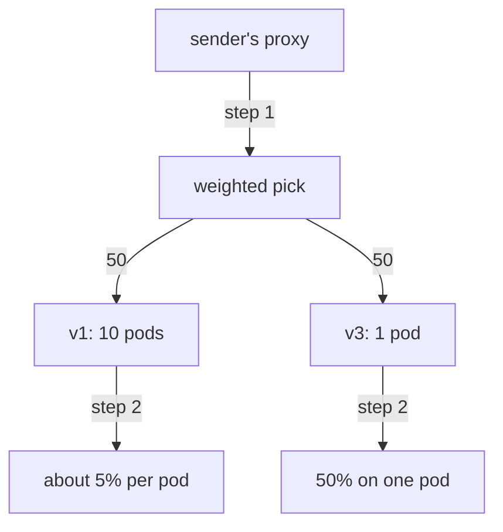

# Traffic Share, Replica Count And The Route Table

One question about canary releases comes up more than any other: how does the traffic a version gets relate to the number of pods it runs? This part answers it, first in theory and then on a live cluster. It then shows how to read the weights out of a live proxy, so that when a split does not behave, you can find the cause instead of guessing.

The commands below need the `scout` `DestinationRule` applied in your playground. It defines the subsets `v1`, `v2` and `v3`, which select the `scout` pods by their `version` label.

## Without Istio, the split follows the pods

A plain Kubernetes **Service** is one stable name and IP address in front of a group of pods. It splits connections by **pods**, so every pod behind it gets about an equal turn. With 9 v1 pods and 1 v3 pod behind one Service, v3 gets about 10% of the requests, because it is 1 pod out of 10. To give a new version more requests, you would have to run more copies of it.

With an Istio weight in a `VirtualService` (the Istio object that tells the sidecar proxies where to send requests for a host), the split is by **destination** instead. Weight 20 gives v3 20% of the requests, even if it has 1 pod against 10. That is what makes canary releases safe: you choose the share, not the number of copies.

## The two decisions happen in order

The **sidecar proxy** is the Envoy proxy that Istio adds to every pod. The sidecar proxy of the sending pod makes two separate choices for every request. Here they are with 10 v1 pods and 1 v3 pod at 50/50:



The diagram shows step 1, the weighted pick between the two subsets, and step 2, the load balancing between the pods of the chosen subset.

In step 1, the proxy picks a **cluster** (Envoy's name for one destination; each subset is its own cluster) with a random pick against the weights. In step 2, it uses load balancing to pick a pod inside that cluster. Step 2 cannot change step 1, because step 1 has already finished. So half of all requests go to the v3 cluster, and its one pod takes all of them. The other half is spread over ten v1 pods, so each of those pods gets about 5% of all requests.

**Weights control traffic share, and replicas control capacity.** They live in different objects, you change them for different reasons, and neither one changes the other. Scaling v3 to ten pods does not change its 50% share. It only changes how much capacity there is to handle that share.

## Proving it with four times the pods

The theory says the pod count cannot move the share. You can prove this on the playground by giving one version more pods and counting the split again.

<!-- astrona:playground:renew -->

The commands in this part use a small helper. It sends a number of requests from the `shuttle` pod to `scout` (20 if you give no number) and counts which version answered. Paste it into your terminal if it is not there yet:

```sh
count_versions() { n=${1:-20}; [ $# -gt 0 ] && shift; for i in $(seq 1 $n); do
  kubectl exec -n starfleet deploy/shuttle -- curl -s "$@" http://scout:9080/reviews/0 | grep -o 'scout-v[0-9]'
done | sort | uniq -c; }
```

Start from a 50/50 split between v1 and v3. Save this as `virtualservice-scout-50-50.yaml`:

```yaml
apiVersion: networking.istio.io/v1
kind: VirtualService
metadata:
  name: scout
  namespace: starfleet
spec:
  hosts:
  - scout
  http:
  - route:
    - destination:
        host: scout
        subset: v1
      weight: 50
    - destination:
        host: scout
        subset: v3
      weight: 50
```

Apply it:

```sh
kubectl apply -f virtualservice-scout-50-50.yaml
```

Now give v1 four pods, and wait until they are all ready:

```sh
kubectl -n starfleet scale deployment scout-v1 --replicas=4
kubectl -n starfleet rollout status deployment scout-v1
kubectl -n starfleet get deployment scout-v1 scout-v3
```

You should see this (the rollout messages are shortened):

```text
deployment.apps/scout-v1 scaled
deployment "scout-v1" successfully rolled out
NAME       READY   UP-TO-DATE   AVAILABLE   AGE
scout-v1   4/4     4            4           5m39s
scout-v3   1/1     1            1           5m39s
```

Then check the result. Count 100 requests:

```sh
count_versions 100
```

You should see something like:

```text
  51 scout-v1
  49 scout-v3
```

Four v1 pods against one v3 pod, and the split is still about 50/50. If the pod count changed the share, you would see roughly 80/20.

The endpoint lists show the same fact in a different way. An **endpoint** is the address of one pod that a cluster can send requests to. List the endpoints in the v1 cluster and in the v3 cluster of the `shuttle` proxy:

```sh
for s in v1 v3; do
  echo "--- subset $s ---"
  istioctl proxy-config endpoints deploy/shuttle -n starfleet \
    --cluster "outbound|9080|$s|scout.starfleet.svc.cluster.local"
done
```

You should see something like this (your pod addresses will be different):

```text
--- subset v1 ---
ENDPOINT             STATUS      OUTLIER CHECK     CLUSTER
10.244.0.15:9080     HEALTHY     OK                outbound|9080|v1|scout.starfleet.svc.cluster.local
10.244.0.16:9080     HEALTHY     OK                outbound|9080|v1|scout.starfleet.svc.cluster.local
10.244.0.17:9080     HEALTHY     OK                outbound|9080|v1|scout.starfleet.svc.cluster.local
10.244.0.8:9080      HEALTHY     OK                outbound|9080|v1|scout.starfleet.svc.cluster.local
--- subset v3 ---
ENDPOINT            STATUS      OUTLIER CHECK     CLUSTER
10.244.0.9:9080     HEALTHY     OK                outbound|9080|v3|scout.starfleet.svc.cluster.local
```

The v1 cluster has four endpoints and the v3 cluster has one, but the weights treat the two clusters as equals. The difference sits below the weighted pick, so the weight does not see it.

Put v1 back to one pod, so the playground is in its starting state again:

```sh
kubectl -n starfleet scale deployment scout-v1 --replicas=1
```

```text
deployment.apps/scout-v1 scaled
```

## Reading the weights the proxy holds

An object that `kubectl` shows and a proxy that uses it are two separate facts. `kubectl get` shows what you wrote. `istioctl proxy-config routes` shows the route table that the proxy really uses. A weighted route appears in that route table as a `weightedClusters` block, with one entry per destination. If a split does not behave, this block tells you whether the proxy has your weights at all.

With the 50/50 `VirtualService` still applied, print the `weightedClusters` block of the `shuttle` proxy:

```sh
istioctl proxy-config routes deploy/shuttle -n starfleet --name 9080 -o json \
  | grep -A12 weightedClusters | head -24
```

You should see this (shortened):

```text
                            "weightedClusters": {
                                "clusters": [
                                    {
                                        "name": "outbound|9080|v1|scout.starfleet.svc.cluster.local",
                                        "weight": 50
                                    },
                                    {
                                        "name": "outbound|9080|v3|scout.starfleet.svc.cluster.local",
                                        "weight": 50
                                    }
                                ]
                            },
```

The subset name is part of the cluster name: `|v1|` and `|v3|`. A cluster name has four parts: the direction (`outbound`), the port (`9080`), the subset and the host. This is how Envoy joins a weighted route to a `DestinationRule` subset.

When a split looks wrong, this block tells you which of three situations you are in:

| What you see | What it means | What to do |
| --- | --- | --- |
| No `weightedClusters` at all | the `VirtualService` never reached this proxy | check the namespace and the host name |
| Weights present but old | the new configuration has not reached the proxy yet | wait a moment and look again |
| Weights correct, traffic wrong | your sample is too small, or a rule above takes requests away | count 100 or more, and read the whole `http` list again |

You now know that the weighted pick happens before load balancing, so the replica count changes capacity but never the share. You can prove this by counting requests, by listing endpoints, and by reading the `weightedClusters` block in the proxy's route table. With these checks you can tell a correct split from a broken one on a live cluster.

## Common pitfalls

> [!WARNING]
> - **Scaling a Deployment to move traffic.** Pod count is capacity, not share. Only the weight moves requests.
> - **Checking the YAML instead of the proxy.** `kubectl get` shows what you wrote. `istioctl proxy-config routes` shows what the proxy uses.
> - **Reading endpoints for the wrong cluster name.** The name has four parts: direction, port, subset and host. For `scout`, the port is `9080`.

## Your mission: Run A Canary With A Header Rule Above The Split Lab

You can now run a canary as a series of weight changes, keep testers out of the split, and prove that the share does not follow the pod count. The lab asks you to define subsets, send requests with a tester header to the new version, split all other requests 70/30, and leave the replica counts unchanged. The lab uses its own small app (`notification-service` v1 and v2 and a `tester` client in the `shifting-demo` namespace), not the Starfleet.

The lab runs in its own cluster, so first pause your playground. Nothing in it is lost:

```sh
astrona stop ats-014-playground-020-01
```

Then start the lab:

```sh
astrona run --git git@github.com:astrona-io/ATS014.git -c sections/section-020/module-01/labs/lab-01
```

The task is on the next page. Solve it on your own first. When you think you are done, send it for grading:

```sh
astrona submit -c sections/section-020/module-01/labs/lab-01
```

When the lab is done, remove it and start your playground again:

```sh
astrona destroy ats-014-lab-020-01
astrona start ats-014-playground-020-01
```
