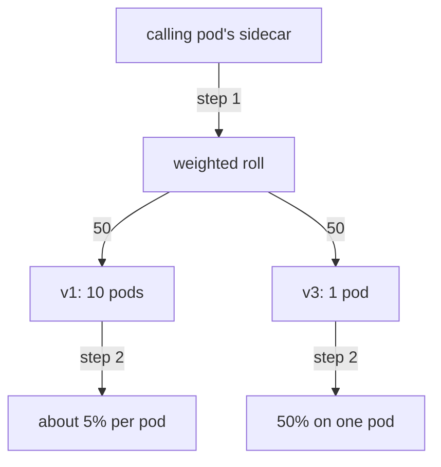

# Weight Versus Replicas, And Proof

One idea is left, and it is the one the exam asks about most often in this module: how much traffic a version gets compared with how many pods it runs. This part settles that. Then it shows how to read the weights out of a live sidecar, so that when a task is not working you can find out why instead of guessing.

## Without Istio, the split follows the pods

A plain Kubernetes Service is a beacon: one call sign that a whole group of ships answers to. It splits traffic by **pods** — every spaceship behind the beacon gets an equal turn. Say you run 9 v1 pods and 1 v3 pod behind one Service. v3 then gets about 10% of the traffic, because it is 1 pod out of 10. To give a new version more traffic, you would have to run more copies of it.

With an Istio weight, the split is by **destination** instead. Weight 20 gives v3 20% of the traffic, even if it has 1 pod against 10. This is what makes canaries safe: you choose the share, not the number of copies.

## The two decisions happen in order

Part 1's diagram already held the answer. Here is the bottom half in more detail, with 10 v1 pods and 1 v3 pod at 50/50:



Step 1 picks a subset with a random roll against the weights. Step 2 is load balancing inside the chosen cluster. Step 2 cannot change step 1, because step 1 has already finished. That order is the whole answer to "why does scaling not change the split".

The weight decides **which cluster** — which ship class gets the signal. Load balancing then decides **which pod inside it** — which ship in that squadron takes it. So the general rule is: **weights control traffic share, replicas control capacity.** They live in different objects, you change them for different reasons, and they do not affect each other.

With v1 on ten pods and v3 on one, at 50/50:

- half of all requests go to the v3 cluster, and its one pod gets all of them;
- the other half is spread over ten v1 pods, so each gets about 5% of all traffic.

Scaling v3 to ten pods does not change its 50% share. It changes how much capacity there is to handle that share. Getting capacity right matters a lot, but it is not a way to split traffic.

> [!TIP]
> **Try it – four times the pods, same share**
>
> ```sh
> kubectl -n starfleet patch virtualservice scout --type merge -p '
> spec:
>   http:
>     - route:
>         - destination:
>             host: scout
>             subset: v1
>           weight: 50
>         - destination:
>             host: scout
>             subset: v3
>           weight: 50'
> kubectl -n starfleet scale deployment scout-v1 --replicas=4
> kubectl -n starfleet rollout status deployment scout-v1
> count_versions 100
> ```
>
> Expect something like:
>
> ```text
>   51 scout-v1
>   49 scout-v3
> ```
>
> Four v1 pods against one v3 pod, and the split is still about 50/50. If pod count changed the traffic share, you would see roughly 80/20. Scale `scout-v1` back to 1 afterwards if you want a tidy cluster.

## Where the endpoints went

The endpoint list makes the same point by structure instead of by counting. It is also the faster check when you are looking for a fault rather than showing a feature.

> [!TIP]
> **Try it – one cluster with four endpoints, one with a single endpoint**
>
> ```sh
> for s in v1 v3; do
>   echo "--- subset $s ---"
>   istioctl proxy-config endpoints deploy/shuttle -n starfleet \
>     --cluster "outbound|9080|$s|scout.starfleet.svc.cluster.local"
> done
> ```
>
> Expect something like this (pod IPs differ, cluster names trimmed):
>
> ```text
> --- subset v1 ---
> ENDPOINT            STATUS    OUTLIER CHECK   CLUSTER
> 10.244.0.14:9080    HEALTHY   OK              outbound|9080|v1|scout...
> 10.244.0.18:9080    HEALTHY   OK              outbound|9080|v1|scout...
> 10.244.0.19:9080    HEALTHY   OK              outbound|9080|v1|scout...
> 10.244.0.20:9080    HEALTHY   OK              outbound|9080|v1|scout...
> --- subset v3 ---
> ENDPOINT            STATUS    OUTLIER CHECK   CLUSTER
> 10.244.0.15:9080    HEALTHY   OK              outbound|9080|v3|scout...
> ```
>
> Four endpoints and one endpoint, in two clusters that the weights treat as equals. The difference sits entirely below the weighted decision, which is why the weight does not see it.

## Reading the weights the sidecar holds

An object existing in `kubectl` and a sidecar acting on it are two separate facts. Weighted routes show up in the sidecar's route dump as a `weightedClusters` block, with one entry per destination.

> [!TIP]
> **Try it – the weights inside the client's route table**
>
> ```sh
> istioctl proxy-config routes deploy/shuttle -n starfleet --name 9080 -o json \
>   | grep -A12 weightedClusters | head -24
> ```
>
> Expect something like this (trimmed):
>
> ```text
> "weightedClusters": {
>   "clusters": [
>     {
>       "name": "outbound|9080|v1|scout.starfleet.svc.cluster.local",
>       "weight": 50
>     },
>     {
>       "name": "outbound|9080|v3|scout.starfleet.svc.cluster.local",
>       "weight": 50
>     }
> ```
>
> The subset name is part of the cluster name: `|v1|` and `|v3|`. That is how a weighted route and a `DestinationRule` subset are joined inside Envoy. If these weights do not match your `VirtualService`, the push has not landed, and editing the YAML again will not help.

That last sentence is the rule for finding faults in this module. Three states, three different actions:

| What you see | Means | Do |
| --- | --- | --- |
| No `weightedClusters` at all | the `VirtualService` never reached this sidecar | check namespace, host name, and `istioctl proxy-status` |
| Weights present but old | the push is on its way, or the sidecar is out of sync | wait, then check `proxy-status` |
| Weights correct, traffic wrong | your sample is too small, or a rule above takes traffic away | count 100+, and re-read the whole `http` list |

## Common pitfalls

> [!WARNING]
> **Scaling a Deployment to move traffic.** Pod count is capacity, not share. Only the weight moves traffic.
>
> **Checking the YAML instead of the sidecar.** `kubectl get` shows what you wrote. `istioctl proxy-config routes` shows what the sidecar is using.
>
> **Reading endpoints for the wrong cluster name.** The name has four parts: direction, port, subset and host. For the `scout` the port is `9080`.

> *Weights control traffic share and replicas control capacity. They are set in different objects, for different reasons, and neither one moves the other.*
