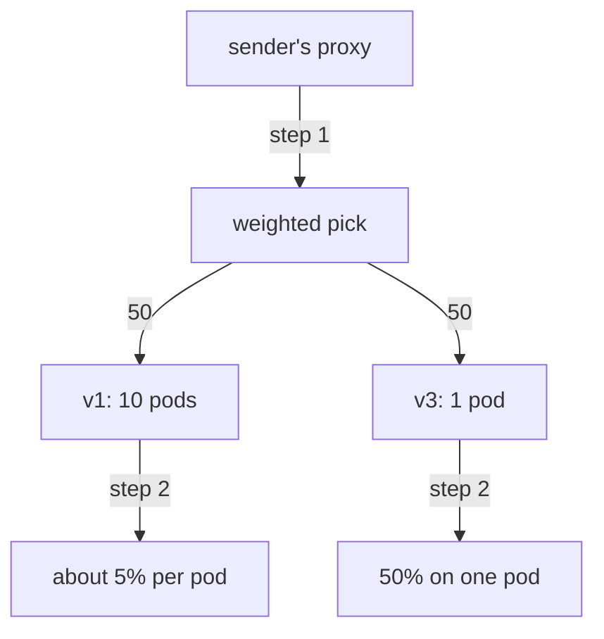

# Weight Versus Replicas, And Proof

Astronaut, one question about canaries comes up more than any other: how much traffic does a version get compared with how many pods it runs? This part settles it. Then it shows how to read the weights out of a live proxy, so that when a split does not behave you can find out why instead of guessing.

The commands below need the `scout` `DestinationRule` with the subsets `v1`, `v2` and `v3` applied in your playground, and the `count_versions` helper pasted into your terminal.

## Without Istio, the split follows the pods

A plain Kubernetes Service is a beacon: one call sign that a group of ships answers to. It splits signals by **pods**, so every ship behind the beacon gets about an equal turn. With 9 v1 pods and 1 v3 pod behind one Service, v3 gets about 10% of the signals, because it is 1 pod out of 10. To give a new version more signals, you would have to run more copies of it.

With an Istio weight, the split is by **destination** instead. Weight 20 gives v3 20% of the signals, even if it has 1 pod against 10. That is what makes canaries safe: you choose the share, not the number of copies.

## The two decisions happen in order

The sending ship's communications officer makes two separate choices for every signal. Here they are with 10 v1 pods and 1 v3 pod at 50/50:



Step 1 picks a subset with a random roll against the weights. Step 2 is load balancing inside the chosen cluster. Step 2 cannot change step 1, because step 1 has already finished. So:

- half of all signals go to the v3 cluster, and its one pod takes all of them;
- the other half is spread over ten v1 pods, so each gets about 5% of all signals.

**Weights control traffic share, replicas control capacity.** They live in different objects, you change them for different reasons, and neither one moves the other. Scaling v3 to ten pods does not change its 50% share. It only changes how much capacity there is to handle that share.

<!-- astrona:playground:renew -->

### Four times the pods, the same share

Start from a 50/50 split between v1 and v3. Save this as `virtualservice-scout-50-50.yaml`:

```yaml
apiVersion: networking.istio.io/v1
kind: VirtualService
metadata:
  name: scout
  namespace: starfleet
spec:
  hosts:
  - scout
  http:
  - route:
    - destination:
        host: scout
        subset: v1
      weight: 50
    - destination:
        host: scout
        subset: v3
      weight: 50
```

Apply it:

```sh
kubectl apply -f virtualservice-scout-50-50.yaml
```

Now give v1 four pods, and wait until they are all ready:

```sh
kubectl -n starfleet scale deployment scout-v1 --replicas=4
kubectl -n starfleet rollout status deployment scout-v1
kubectl -n starfleet get deployment scout-v1 scout-v3
```

You should see (the rollout messages trimmed):

```text
deployment.apps/scout-v1 scaled
deployment "scout-v1" successfully rolled out
NAME       READY   UP-TO-DATE   AVAILABLE   AGE
scout-v1   4/4     4            4           5m39s
scout-v3   1/1     1            1           5m39s
```

Then count 100 signals:

```sh
count_versions 100
```

You should see something like:

```text
  51 scout-v1
  49 scout-v3
```

Four v1 pods against one v3 pod, and the split is still about 50/50. If the pod count changed the share, you would see roughly 80/20.

### See where the pods went

The endpoint lists make the same point by structure instead of by counting. List the pods in the v1 cluster and in the v3 cluster:

```sh
for s in v1 v3; do
  echo "--- subset $s ---"
  istioctl proxy-config endpoints deploy/shuttle -n starfleet \
    --cluster "outbound|9080|$s|scout.starfleet.svc.cluster.local"
done
```

You should see (your pod addresses will be different):

```text
--- subset v1 ---
ENDPOINT             STATUS      OUTLIER CHECK     CLUSTER
10.244.0.15:9080     HEALTHY     OK                outbound|9080|v1|scout.starfleet.svc.cluster.local
10.244.0.16:9080     HEALTHY     OK                outbound|9080|v1|scout.starfleet.svc.cluster.local
10.244.0.17:9080     HEALTHY     OK                outbound|9080|v1|scout.starfleet.svc.cluster.local
10.244.0.8:9080      HEALTHY     OK                outbound|9080|v1|scout.starfleet.svc.cluster.local
--- subset v3 ---
ENDPOINT            STATUS      OUTLIER CHECK     CLUSTER
10.244.0.9:9080     HEALTHY     OK                outbound|9080|v3|scout.starfleet.svc.cluster.local
```

Four endpoints and one endpoint, in two clusters that the weights treat as equals. The difference sits entirely below the weighted pick, which is why the weight does not see it.

Put v1 back to one pod, so the playground is tidy again:

```sh
kubectl -n starfleet scale deployment scout-v1 --replicas=1
```

```text
deployment.apps/scout-v1 scaled
```

## Reading the weights the proxy holds

An object in `kubectl` and a proxy acting on it are two separate facts. A weighted route shows up in the proxy's route table as a `weightedClusters` block, with one entry per destination. If a split does not behave, this block tells you whether the proxy even has your weights.

### Find the weights in the shuttle's route table

With the 50/50 flight plan still applied, print the `weightedClusters` block:

```sh
istioctl proxy-config routes deploy/shuttle -n starfleet --name 9080 -o json \
  | grep -A12 weightedClusters | head -24
```

You should see (trimmed):

```text
                            "weightedClusters": {
                                "clusters": [
                                    {
                                        "name": "outbound|9080|v1|scout.starfleet.svc.cluster.local",
                                        "weight": 50
                                    },
                                    {
                                        "name": "outbound|9080|v3|scout.starfleet.svc.cluster.local",
                                        "weight": 50
                                    }
                                ]
                            },
```

The subset name is part of the cluster name: `|v1|` and `|v3|`. That is how a weighted route and a `DestinationRule` subset are joined inside Envoy.

When a split looks wrong, this block tells you which of three situations you are in:

| What you see | It means | What to do |
| --- | --- | --- |
| No `weightedClusters` at all | the flight plan never reached this proxy | check the namespace and the host name |
| Weights present but old | the new orders have not landed yet | wait a moment and look again |
| Weights correct, traffic wrong | your sample is too small, or a rule above takes signals away | count 100 or more, and re-read the whole `http` list |

## Common pitfalls

> [!WARNING]
> - **Scaling a Deployment to move traffic.** Pod count is capacity, not share. Only the weight moves signals.
> - **Checking the YAML instead of the proxy.** `kubectl get` shows what you wrote. `istioctl proxy-config routes` shows what the proxy uses.
> - **Reading endpoints for the wrong cluster name.** The name has four parts: direction, port, subset and host. For the scout, the port is `9080`.

> *Weights control traffic share and replicas control capacity. They are set in different objects, for different reasons, and neither one moves the other.*

## Your mission: Shift Traffic With Weighted Routing

You can now run a canary as a series of weight changes, keep testers out of the split, and prove that the share does not follow the pod count. Now prove it in a graded mission: run a canary with your testers pinned to the new version, and do not touch the replica counts.

The mission runs in its own training solar system, so first pause your playground. Nothing in it is lost:

```sh
astrona stop ats-014-playground-020-01
```

Then start the mission:

```sh
astrona run --git git@github.com:astrona-io/ATS014.git -c sections/section-020/module-01/labs/lab-01
```

Read the task in [`question.md`](./labs/lab-01/question.md) and solve it on your own first. When you think you are done, send it for grading:

```sh
astrona submit -c sections/section-020/module-01/labs/lab-01
```

When the mission is done, remove it and wake your playground up again:

```sh
astrona destroy ats-014-lab-020-01
astrona start ats-014-playground-020-01
```
