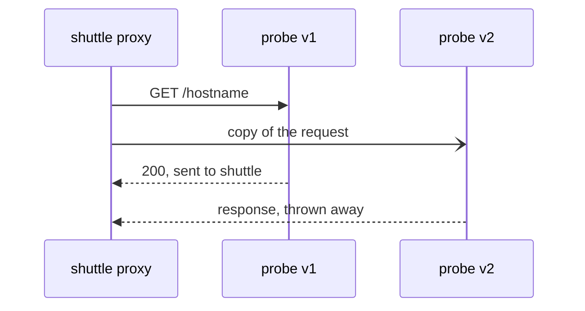

# Add A Mirror Destination To An HTTP Route

You want a new version of a service to handle real requests before any user depends on it. Mirroring does that with one field in a `VirtualService`, the Istio object that sets how requests to a host are routed. This part shows where that field goes and what the sidecar proxy does with it. It also shows the fact that confuses people first: a mirror sits *next to* the route, not inside it.

The commands below need the `mark_start`, `count_received` and `send_requests` shell helpers in your terminal. `send_requests` counts which version of `probe` sent each response, and `count_received` counts the requests each version received since `mark_start` ran.

## Responses versus received requests

Normally two things are the same: the version that **sent the response** to the client, and the versions that **received** the request. A mirror makes them differ. So before you add a mirror, measure both once while they still match.

First you need two subsets of the `probe` Service. A subset is a named group of a Service's pods, selected by labels. A `DestinationRule` defines subsets, and here it defines `v1` and `v2` over the `version` label. A `VirtualService` then sends every request to `v1`.

<!-- astrona:playground:renew -->

Save this as `destinationrule-probe.yaml`:

```yaml
apiVersion: networking.istio.io/v1
kind: DestinationRule
metadata:
  name: probe
  namespace: starfleet
spec:
  host: probe
  subsets:
  - name: v1
    labels:
      version: v1
  - name: v2
    labels:
      version: v2
```

Apply it:

```sh
kubectl apply -f destinationrule-probe.yaml
```

Now the `VirtualService` that sends every request to `v1`. Save this as `virtualservice-probe.yaml`:

```yaml
apiVersion: networking.istio.io/v1
kind: VirtualService
metadata:
  name: probe
  namespace: starfleet
spec:
  hosts:
  - probe
  http:
  - route:
    - destination:
        host: probe
        subset: v1
```

Apply it:

```sh
kubectl apply -f virtualservice-probe.yaml
```

Then send 5 requests from `shuttle` and count both sides:

```sh
mark_start; send_requests 5; count_received
```

You should see:

```text
   5 probe-v1
probe-v1 received: 5
probe-v2 received: 0
```

Five responses came from v1, v1 received five requests, and v2 received nothing. The two numbers match. A mirror changes the second number, so the next step is the field that does it.

## The field and where it sits

A mirror adds two fields to the same `http` rule. This piece of a `VirtualService` shows them (you do not apply it):

```yaml
  http:
  - route:
    - destination:
        host: probe
        subset: v1
    # Where to send the copy.
    mirror:
      host: probe
      subset: v2
    # Share of requests to copy, in percent. 100 = all.
    mirrorPercentage:
      value: 100.0
```

Read the indentation carefully, because this is where people usually go wrong:

- **`route`** is the list of destinations that send the response to the client.
- **`mirror`** sits next to `route` on the same rule. It is **one destination, not a list**, and it has no `weight`.
- **`mirrorPercentage`** is another field next to them. It holds a decimal number under `value`.

So a mirror is never part of a weighted split. The weights in `route` are complete on their own, and the copy is **extra traffic on top**. With a full mirror, 100 requests from clients become 200 requests inside the cluster.

## What the sidecar proxy does

The sidecar proxy (Envoy) in the client pod does the mirroring. It sends the request to the route's destination, as usual. It **also** sends a copy of the request to the mirror's destination. It waits only for the route's response, and it throws the mirror's response away. This style is often called "fire and forget".



The diagram shows one request: the response from v1 goes back to `shuttle`, and the response from v2 goes nowhere. Three facts follow from that:

- **The client's response always comes from the route.** The proxy does not compare the two responses, does not log a difference, and never falls back to the mirror.
- **The mirror's speed does not reach the client.** If the shadow takes ten seconds, the client does not wait. That makes it safe to mirror to a slow version.
- **A failing shadow is invisible to the client.** If v2 returns `503` to every copy, the client still gets the `200` from v1.

Now add the mirror to the real object. Save this as `virtualservice-probe.yaml`, replacing the old file:

```yaml
apiVersion: networking.istio.io/v1
kind: VirtualService
metadata:
  name: probe
  namespace: starfleet
spec:
  hosts:
  - probe
  http:
  - route:
    - destination:
        host: probe
        subset: v1
    mirror:
      host: probe
      subset: v2
    mirrorPercentage:
      value: 100.0
```

Apply it:

```sh
kubectl apply -f virtualservice-probe.yaml
```

Then count both sides again:

```sh
mark_start; send_requests 5; count_received
```

You should see:

```text
   5 probe-v1
probe-v1 received: 5
probe-v2 received: 5
```

`shuttle` only got responses from v1. Yet v2 handled every request too. Its five requests are the copies that the proxy in the `shuttle` pod sent.

You now know where `mirror` and `mirrorPercentage` go, and that the client's proxy sends the copy and throws away its response. You also saw the two numbers split apart: five responses from v1, but ten requests received in total. The claim that a broken shadow stays invisible to the client is still untested.

## Common pitfalls

> [!WARNING]
> - **Putting `mirror` inside the `route` list.** It sits next to `route` on the `http` rule, and it is one destination with no `weight`.
> - **Expecting the mirror to be part of the 100.** It is extra traffic on top of the split. A full mirror doubles the number of requests inside the cluster.
> - **Adding v2 as a second `route` destination to "mirror" it.** That is a weighted split, and clients start to get responses from v2.
> - **Checking only the client.** The client's output is the same with or without a working mirror. Count what the shadow received.
