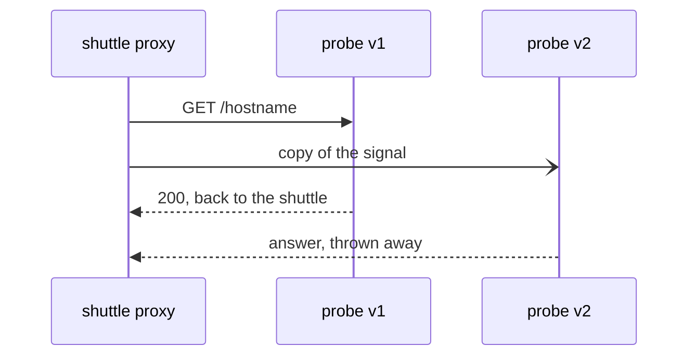

# Mirror As A Sibling Of Route

Astronaut, the whole feature is one field on the flight plan. This part shows where that field goes, what the communications officer does when it fires, and the fact that trips people up first: a mirror sits *next to* the route, not inside it.

The commands below need the `mark_start`, `count_received` and `send_requests` helpers pasted into your terminal.

## Answered versus received

Normally two things are the same: which version **answered** the sender, and which versions **received** the signal. A mirror makes them differ, so before you mirror anything, measure both once while they still match.

You need docking instructions with two ship classes first: the same `probe` model, built two ways, `v1` and `v2`. Then a flight plan that sends every signal to `v1`.

<!-- astrona:playground:renew -->

### Start with no mirror

Save this as `destinationrule-probe.yaml`:

```yaml
apiVersion: networking.istio.io/v1
kind: DestinationRule
metadata:
  name: probe
  namespace: starfleet
spec:
  host: probe
  subsets:
  - name: v1
    labels:
      version: v1
  - name: v2
    labels:
      version: v2
```

Apply it:

```sh
kubectl apply -f destinationrule-probe.yaml
```

Now the flight plan: every signal to v1. Save this as `virtualservice-probe.yaml`:

```yaml
apiVersion: networking.istio.io/v1
kind: VirtualService
metadata:
  name: probe
  namespace: starfleet
spec:
  hosts:
  - probe
  http:
  - route:
    - destination:
        host: probe
        subset: v1
```

Apply it:

```sh
kubectl apply -f virtualservice-probe.yaml
```

Then send 5 signals and count both sides:

```sh
mark_start; send_requests 5; count_received
```

You should see:

```text
   5 probe-v1
probe-v1 received: 5
probe-v2 received: 0
```

Five answers from v1, five arrivals at v1, nothing at v2. Answered and received match.

## The field, and where it sits

A mirror is two more fields on the same `http` rule. This piece of a `VirtualService` shows them (you do not apply it):

```yaml
  http:
  - route:
    - destination:
        host: probe
        subset: v1
    # Where to send the copy.
    mirror:
      host: probe
      subset: v2
    # Share of signals to copy, in percent. 100 = all.
    mirrorPercentage:
      value: 100.0
```

Read the indentation carefully, because this is where people usually go wrong:

- **`route`** is the list of destinations that answer the sender.
- **`mirror`** sits next to `route` on the same rule. It is **one destination, not a list**, and it has no `weight`.
- **`mirrorPercentage`** is another field next to them, with a decimal number under `value`.

So a mirror is never part of a weighted split. The weights in `route` are complete on their own, and the copy is **extra traffic on top**. A hundred signals with a full mirror become two hundred signals inside the solar system.

## What the communications officer does

Think of it as sending a copy of each signal to a test ship. The proven ship still answers. The test ship's answer is ignored.

In mesh terms: the sender's proxy sends the signal to the route's destination, as usual. It **also** sends a copy to the mirror's destination. It waits only for the route's answer, and throws the mirror's answer away. People call this "fire and forget".



The picture shows one signal: v1's answer goes back to the shuttle, v2's answer goes nowhere. Three things follow from that:

- **The sender's answer always comes from the route.** The proxy does not compare the two answers, does not log the difference, and never falls back to the mirror.
- **The mirror's speed does not reach the sender.** A shadow that takes ten seconds does not make the sender wait. That is what makes it safe to mirror to something slow.
- **A failing shadow is invisible from the sender's side.** If v2 answers `503` to every copy, the sender still sees v1's `200`.

### Copy everything to v2

Add the mirror to the flight plan. Save this as `virtualservice-probe.yaml`, replacing the old file:

```yaml
apiVersion: networking.istio.io/v1
kind: VirtualService
metadata:
  name: probe
  namespace: starfleet
spec:
  hosts:
  - probe
  http:
  - route:
    - destination:
        host: probe
        subset: v1
    mirror:
      host: probe
      subset: v2
    mirrorPercentage:
      value: 100.0
```

Apply it:

```sh
kubectl apply -f virtualservice-probe.yaml
```

Then count both sides again:

```sh
mark_start; send_requests 5; count_received
```

You should see:

```text
   5 probe-v1
probe-v1 received: 5
probe-v2 received: 5
```

The shuttle only ever heard from v1. Yet v2 handled every signal too.

## Mirroring into a broken version

The safety promise is easiest to believe when you watch it hold. You add a ship that answers `503` to every signal, label it `version: broken`, give it its own subset, and point the mirror there.

### Watch the sender stay fine while the shadow fails

First the broken ship. Save this as `deployment-probe-broken.yaml`:

```yaml
apiVersion: apps/v1
kind: Deployment
metadata:
  name: probe-broken
  namespace: starfleet
spec:
  replicas: 1
  selector:
    matchLabels:
      app: probe
      version: broken
  template:
    metadata:
      labels:
        app: probe
        version: broken
    spec:
      containers:
      - name: http-echo
        image: hashicorp/http-echo:1.0
        args: ["-listen=:8080", "-status-code=503", "-text=broken"]
        ports:
        - containerPort: 8080
```

Apply it:

```sh
kubectl apply -f deployment-probe-broken.yaml
```

Then wait until it is ready:

```sh
kubectl rollout status -n starfleet deploy/probe-broken
```

```text
deployment "probe-broken" successfully rolled out
```

Now give it a ship class. Save this as `destinationrule-probe-broken.yaml`:

```yaml
apiVersion: networking.istio.io/v1
kind: DestinationRule
metadata:
  name: probe
  namespace: starfleet
spec:
  host: probe
  subsets:
  - name: v1
    labels:
      version: v1
  - name: v2
    labels:
      version: v2
  - name: broken
    labels:
      version: broken
```

Apply it:

```sh
kubectl apply -f destinationrule-probe-broken.yaml
```

And point the mirror at it. Save this as `virtualservice-probe-mirror-broken.yaml`:

```yaml
apiVersion: networking.istio.io/v1
kind: VirtualService
metadata:
  name: probe
  namespace: starfleet
spec:
  hosts:
  - probe
  http:
  - route:
    - destination:
        host: probe
        subset: v1
    mirror:
      host: probe
      subset: broken
    mirrorPercentage:
      value: 100.0
```

Apply it:

```sh
kubectl apply -f virtualservice-probe-mirror-broken.yaml
```

Then send 5 signals and count the status codes the shuttle got. After that, count how many copies the broken ship's proxy logged, and read its last flight log line:

```sh
for i in $(seq 1 5); do
  kubectl exec -n starfleet deploy/shuttle -- curl -s -o /dev/null -w "%{http_code}\n" http://probe:8000/hostname
done | sort | uniq -c
kubectl logs -n starfleet deploy/probe-broken -c istio-proxy --tail=5 | grep -c hostname
kubectl logs -n starfleet deploy/probe-broken -c istio-proxy --tail=1
```

You should see (log line trimmed):

```text
      5 200
5
"GET /hostname HTTP/1.1" 503 - via_upstream ... outbound_.8000_.broken_.probe.starfleet.svc.cluster.local default
```

The shuttle got five `200`s. The broken ship got every copy and answered `503` to each one, and nobody saw it. You find a shadow's problems in its own logs and metrics, never in complaints from users.

Clean up the broken ship and its ship class:

```sh
kubectl delete -f deployment-probe-broken.yaml
kubectl apply -f destinationrule-probe.yaml
kubectl apply -f virtualservice-probe.yaml
```

## The subset still has to exist

`mirror.subset` is looked up in the same `DestinationRule` as every other destination. Point it at a subset nobody defined, and the mirror **silently sends nothing**. The sender still gets a correct answer from the route, so nothing looks wrong on the sending side.

When "my mirror is not working", check in this order:

1. Does the `DestinationRule` define the subset the `mirror` names? `istioctl analyze` reports it if not.
2. Does that subset select a running pod? `istioctl proxy-config endpoints` on the sender shows it.
3. Does the sender's proxy hold a mirror policy at all? `istioctl proxy-config routes` shows it.

## Mirroring to a different host

`mirror` takes any destination, not only another subset of the same host. This piece shows the shape (you do not apply it):

```yaml
mirror:
  host: probe-shadow
  port:
    number: 8000
```

Use that shape when the shadow is a separate Deployment with its own Service and its own datastore. That is usually what you want in production. Mirroring to a subset of the *same* Service is handy for learning, but the shadow pods then sit behind the same beacon, and ordinary signals can reach them too.

## What mirroring cannot tell you

Istio throws away the shadow's answer, so mirroring **cannot compare answers**. It tells you that the new version crashed, timed out or fell over under real load. It cannot tell you that it gave a slightly wrong answer, because nothing ever looks at the answer.

Comparing answers needs something that receives both and compares them, and that is a job for the application, outside the mesh. If you need to know whether a new version gives *the same results*, mirroring is not the tool. Weighted routing plus careful observation is.

## Common pitfalls

> [!WARNING]
> - **Putting `mirror` inside the `route` list.** It sits next to `route` on the `http` rule, and it is one destination with no `weight`.
> - **Expecting the mirror to be part of the 100.** It is extra traffic on top. A full mirror doubles the signals inside the solar system.
> - **Mirroring to a subset no `DestinationRule` defines.** No copy is sent and the sender sees nothing wrong.
> - **Expecting the shadow's failures to show at the sender.** The answer is thrown away. A shadow answering `503` to everything looks exactly like a healthy one from the sender's side.
> - **Expecting mirroring to compare answers.** Nothing looks at the shadow's answer. It finds crashes and load problems, never wrong results.

> *`mirror` sits next to `route`, not inside it. The copy is extra traffic whose answer and delay are both thrown away.*
