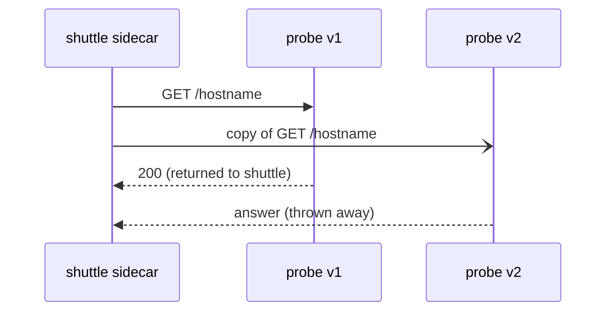

# Mirror As A Sibling Of Route

The whole feature is one field on the flight plan. This part is about where that field goes and what the sidecar does when it fires. It also covers the fact that trips people up first: a mirror sits *next to* the route, not inside it.

## Answered versus received

Normally two things are the same: which version **answered** the caller, and which versions **received** the request. Mirroring makes them differ. So before you mirror anything, it helps to be able to measure both.

The playground's [overview](./playground/docs/overview.md) has three helpers for that. Paste them once in each new terminal:

- `send_requests` counts **answers**: what the caller saw.
- `mark_start` notes the time, and `count_received` then counts **arrivals** since that time, from each version's own app log.

Start with a baseline: all traffic to v1, and nothing mirrored. You need a `DestinationRule` with subsets first. A subset is a ship class: the same `probe` model, built two ways, `v1` and `v2`. Then a `VirtualService`, the flight plan, sends every request to `v1`.

<!-- astrona:playground:renew -->

> [!TIP]
> **Try it – answered = received**
>
> Save this as `destinationrule-probe.yaml`:
>
> ```yaml
> apiVersion: networking.istio.io/v1
> kind: DestinationRule
> metadata:
>   name: probe
>   namespace: starfleet
> spec:
>   host: probe
>   subsets:
>   - name: v1
>     labels:
>       version: v1
>   - name: v2
>     labels:
>       version: v2
> ```
>
> Save this as `virtualservice-probe.yaml`:
>
> ```yaml
> apiVersion: networking.istio.io/v1
> kind: VirtualService
> metadata:
>   name: probe
>   namespace: starfleet
> spec:
>   hosts:
>   - probe
>   http:
>   - route:
>     - destination:
>         host: probe
>         subset: v1
> ```
>
> Apply it:
>
> ```sh
> kubectl apply -f destinationrule-probe.yaml
> kubectl apply -f virtualservice-probe.yaml
> ```
>
> Then check the result:
>
> ```sh
> mark_start; send_requests 5; count_received
> ```
>
> Expect:
>
> ```text
>    5 probe-v1
> probe-v1 received: 5
> probe-v2 received: 0
> ```
>
> Five answers from v1, five arrivals at v1, nothing at v2. The two numbers match.

## The field, and where it sits

Here is the same flight plan with a mirror added:

```yaml
  http:
  - route:
    - destination:
        host: probe
        subset: v1
      weight: 100
    # Where to send the copy.
    mirror:
      host: probe
      subset: v2
    # Share of requests to copy, in percent. 100 = all.
    mirrorPercentage:
      value: 100.0
```

Read the indentation carefully, because this is where people usually go wrong:

- **`route`** is the list of destinations that serve the caller.
- **`mirror`** sits next to `route` on the same `http` rule. It is **one destination, not a list**, and it has no `weight`.
- **`mirrorPercentage`** is another field next to them, with a decimal number under `value`.

So a mirror is never part of the weighted split. The weights in `route` are complete on their own, and the copy is **extra traffic on top**. A hundred requests with a full mirror become two hundred requests inside the cluster. Part 3 shows what that means when you combine a mirror with a split.

## What the sidecar does

Think of mirroring as sending a copy of each signal to a test ship. The proven ship still answers. The test ship's replies are ignored.

In mesh terms: the caller's sidecar sends the request to the route's destination, as usual. It **also** sends a copy to the mirror's destination. It only waits for the route's answer. The mirror's answer is thrown away. People call this "fire and forget".



The picture shows one request. v1's answer goes back to `shuttle`. v2's answer goes nowhere. Three things follow, and all three come up in the exam:

- **The caller's answer always comes from the route.** The mirrored answer is dropped. The sidecar does not compare the two, does not log the difference, and never falls back to it.
- **The mirror's speed does not reach the caller.** A shadow that takes ten seconds does not make the caller wait. That is what makes it safe to mirror to something slow.
- **A failing shadow is invisible from the caller's side.** If v2 answers 500 to every copy, the caller still sees v1's `200`. Part 2 is about where the evidence is.

> [!TIP]
> **Try it – v2 receives a copy of everything**
>
> Add the `mirror` and `mirrorPercentage` lines shown above to `virtualservice-probe.yaml`, then apply and count:
>
> ```sh
> kubectl apply -f virtualservice-probe.yaml
> ```
>
> Then check the result:
>
> ```sh
> mark_start; send_requests 5; count_received
> ```
>
> Expect:
>
> ```text
>    5 probe-v1
> probe-v1 received: 5
> probe-v2 received: 5
> ```
>
> The caller only ever saw v1. Yet v2 handled every request too.

## Mirroring into a broken version

The safety promise is easiest to believe when you watch it hold. Below is a pod that answers `503` to everything, labelled `version: broken`. The same files are in the playground's [`examples/cases/`](./playground/examples/cases/) folder. You add a `broken` subset for it to the DestinationRule, and point the mirror there with `mirrorPercentage: 100.0`.

> [!TIP]
> **Try it – the caller stays fine while the shadow fails**
>
> Write the three files, then apply them in this order.
>
> Save this as `c2-probe-broken-pod.yaml`:
>
> ```yaml
> apiVersion: apps/v1
> kind: Deployment
> metadata:
>   name: probe-broken
>   namespace: starfleet
> spec:
>   replicas: 1
>   selector:
>     matchLabels:
>       app: probe
>       version: broken
>   template:
>     metadata:
>       labels:
>         app: probe
>         version: broken
>     spec:
>       containers:
>       - name: http-echo
>         image: hashicorp/http-echo:1.0
>         args: ["-listen=:8080", "-status-code=503", "-text=broken"]
>         ports:
>         - containerPort: 8080
> ```
>
> Save this as `c2-destinationrule-with-broken-subset.yaml`:
>
> ```yaml
> apiVersion: networking.istio.io/v1
> kind: DestinationRule
> metadata:
>   name: probe
>   namespace: starfleet
> spec:
>   host: probe
>   subsets:
>   - name: v1
>     labels:
>       version: v1
>   - name: v2
>     labels:
>       version: v2
>   - name: broken
>     labels:
>       version: broken
> ```
>
> Save this as `c2-virtualservice-mirror-to-broken.yaml`:
>
> ```yaml
> apiVersion: networking.istio.io/v1
> kind: VirtualService
> metadata:
>   name: probe
>   namespace: starfleet
> spec:
>   hosts:
>   - probe
>   http:
>   - route:
>     - destination:
>         host: probe
>         subset: v1
>     mirror:
>       host: probe
>       subset: broken
>     mirrorPercentage:
>       value: 100.0
> ```
>
> Apply it:
>
> ```sh
> kubectl apply -f c2-probe-broken-pod.yaml
> ```
>
> Then check the result:
>
> ```sh
> kubectl rollout status -n starfleet deploy/probe-broken
> ```
>
> Apply it:
>
> ```sh
> kubectl apply -f c2-destinationrule-with-broken-subset.yaml
> kubectl apply -f c2-virtualservice-mirror-to-broken.yaml
> ```
>
> Then check the result:
>
> ```sh
> for i in $(seq 1 5); do
>   kubectl exec -n starfleet deploy/shuttle -- curl -s -o /dev/null -w "%{http_code}\n" http://probe:8000/hostname
> done | sort | uniq -c
> kubectl logs -n starfleet deploy/probe-broken -c istio-proxy --tail=5 | grep -c hostname
> kubectl logs -n starfleet deploy/probe-broken -c istio-proxy --tail=1
> ```
>
> Expect something like:
>
> ```text
>       5 200
> 5
> "GET /hostname HTTP/1.1" 503 ...
> ```
>
> The callers got five `200`s. The broken pod got every copy and answered `503` to each one, and nobody saw it. You find a shadow's problems in its logs and metrics, not in complaints from users.
>
> Clean up afterwards: `kubectl delete -f c2-probe-broken-pod.yaml`, then apply `destinationrule-probe.yaml` again.

## The subset still has to exist

`mirror.subset` is looked up through the same `DestinationRule` as every other destination in this course. Point it at a subset nobody defined, and the mirror **silently does nothing**. No copy is sent, the caller still gets a correct answer from the route, and nothing goes wrong on the calling side.

Keep that in mind before you spend time wondering why a shadow is quiet. When "my mirror is not working", check in this order:

1. Does the `DestinationRule` define the subset the `mirror` names? (`istioctl analyze` reports it if not.)
2. Does the subset select any running pod? (`istioctl proxy-config endpoints`.)
3. Does the sidecar's route configuration have `requestMirrorPolicies`? (Part 3.)

## Mirroring to a different host

`mirror` takes any destination, not just another subset of the same host:

```yaml
mirror:
  host: probe-shadow
  port:
    number: 8000
```

Use that shape when the shadow is a separate Deployment with its own Service and its own datastore. As Part 3 explains, that is usually what you want. Mirroring to a subset of the *same* Service is handy for a demo, and a little risky in production, because the shadow pods sit behind the same name and ordinary traffic can reach them too.

## What mirroring cannot tell you

One honest limit, because it decides whether the feature fits a question.

Istio throws away the shadow's answer, so mirroring **cannot compare outputs**. It will tell you that v2 crashed, timed out, leaked memory or fell over under real load. It will not tell you that v2 gave a slightly wrong answer, because nothing ever looked at the answer.

Comparing answers ("diff testing") needs something that receives both answers and compares them. That is an application concern outside the mesh. If a task asks how to check a new version gives *the same results*, mirroring is not the answer. Weighted routing plus real observation is.

## Common pitfalls

> [!WARNING]
> **Putting `mirror` inside the `route` list.** It sits next to `route` on the `http` rule, and it is one destination with no `weight`.
>
> **Expecting the mirror to be part of the 100.** It is extra traffic on top. A full mirror doubles the requests inside the cluster.
>
> **Mirroring to a subset no `DestinationRule` defines.** No copy is sent and the caller sees nothing wrong. This is the most common cause of a quiet shadow.
>
> **Expecting the shadow's failures to show at the caller.** The answer is thrown away. A shadow returning 503 to everything looks exactly like a healthy one from the caller's side.
>
> **Expecting mirroring to compare answers.** Nothing looks at the shadow's answer. It finds crashes and load problems, never wrong results.

> *`mirror` sits next to `route`, not inside it. The copy is extra traffic whose answer and delay are both thrown away.*
