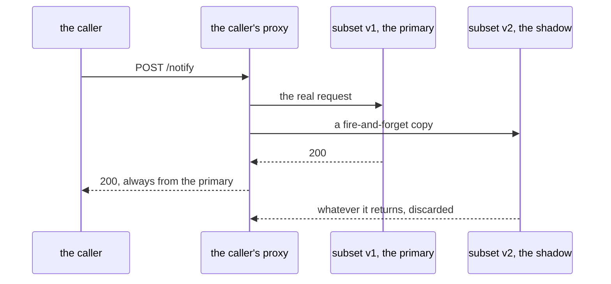

# Mirror As A Sibling Of Route

> Prerequisite: [the module landing page](./course.md). Next: [Identifying And Sampling Shadow Traffic](./course-02-identifying-and-sampling-shadow-traffic.md).

The whole feature is one field. This part is about where that field goes, what the proxy does when it fires, and the structural fact that trips people up first — that a mirror sits *beside* the route rather than inside it.

## The field, and its indentation

```yaml
http:
  - route:
      - destination:
          host: notification-service
          subset: v1
        weight: 100
    mirror:
      host: notification-service
      subset: v2
    mirrorPercentage:
      value: 100.0
```

Read the indentation carefully, because this is where the object is usually got wrong:

- **`route`** is a list of destinations that serve the caller. Its weights sum to 100 among themselves.
- **`mirror`** is a sibling of `route` on the same `http` rule, and it is **one destination, not a list**. There is no `weight` on it.
- **`mirrorPercentage`** is another sibling, with a float under `value`.

A mirror is therefore never part of the weighted split. The weights in `route` are complete on their own, and the mirrored copy is **extra traffic on top of them**. A hundred client requests with a full mirror produce two hundred requests inside the cluster.

## What the proxy actually does



The copy is dispatched and forgotten. Its response never reaches the caller and neither does its latency, which is what makes it safe to mirror at something slow or broken.

Three properties follow, and all three are examinable:

- **The caller's response always comes from the primary.** The mirrored response is dropped entirely — the proxy does not compare them, does not log the difference, and does not fall back to it.
- **The mirror's latency does not reach the caller.** The copy is dispatched fire-and-forget; a shadow that takes ten seconds does not make the caller wait. This is what makes mirroring safe to point at something slow.
- **A failing shadow is invisible from the client side.** If `v2` returns 500 to every copy, the caller still sees `v1`'s `200`. Part 2 is about where the evidence actually is.

## The subset still has to exist

`mirror.subset` resolves through the same `DestinationRule` as every other destination in this course. Point it at a subset nobody defined and the mirror **silently does nothing**: no copy is sent, the caller still gets a correct response from the primary, and there is no symptom on the calling side at all.

That is worth internalising before you spend time wondering why a shadow is quiet. The diagnostic order for "my mirror is not working" is:

1. Does the `DestinationRule` define the subset the `mirror` names? (`istioctl analyze` reports it if not.)
2. Does the subset select any running pod? (`istioctl proxy-config endpoints`.)
3. Is `requestMirrorPolicies` present in the proxy's route config? (Part 3.)

> [!TIP]
> **Try it — route to v1, mirror everything to v2**
>
> ```sh
> kubectl apply -f - <<'EOF'
> apiVersion: networking.istio.io/v1
> kind: DestinationRule
> metadata:
>   name: notification-service
>   namespace: mirror-demo
> spec:
>   host: notification-service
>   subsets:
>     - name: v1
>       labels:
>         version: v1
>     - name: v2
>       labels:
>         version: v2
> ---
> apiVersion: networking.istio.io/v1
> kind: VirtualService
> metadata:
>   name: notification
>   namespace: mirror-demo
> spec:
>   hosts:
>     - notification-service
>   http:
>     - route:
>         - destination:
>             host: notification-service
>             subset: v1
>           weight: 100
>       mirror:
>         host: notification-service
>         subset: v2
>       mirrorPercentage:
>         value: 100.0
> EOF
> kubectl -n mirror-demo exec deploy/tester -- sh -c \
>   'for i in $(seq 1 20); do curl -s -X POST http://notification-service/notify; echo; done' | sort | uniq -c
> ```
>
> Expect something like:
>
> ```text
>   20 ["EMAIL"]
> ```
>
> Twenty requests, twenty answers from `v1`, no trace of `v2` anywhere in the output. From the caller's side this is indistinguishable from a plain 100%-to-`v1` route — which is the entire point, and also why the next part exists.

## Mirroring to a different host

`mirror` takes any destination, not just another subset of the same host:

```yaml
mirror:
  host: notification-service-shadow
  port:
    number: 80
```

That is the shape to use when the shadow is a separate deployment with its own Service and its own datastore — which, as Part 3 argues, is usually what you want. Mirroring to a subset of the *same* Service is convenient for a demonstration and slightly risky in production, because the shadow pods are behind the same name and can be reached by ordinary traffic too.

## What mirroring cannot tell you

One honest limitation, because it decides whether the feature fits a given question.

Istio discards the shadow's response, so mirroring **cannot compare outputs**. It will tell you that `v2` crashed, timed out, leaked memory or fell over under real load. It will not tell you that `v2` returned a subtly wrong answer, because nothing ever looked at the answer.

Response comparison ("diff testing") needs a component that receives both responses and compares them — an application-level concern that sits outside the mesh. If a task asks how to verify a new version returns *the same results*, mirroring is not the answer; weighted routing plus real observation is.

## Common pitfalls

> [!WARNING]
> **Putting `mirror` inside the `route` list.** It is a sibling of `route` on the `http` rule, and it is a single destination with no `weight`.
>
> **Expecting the mirror to be part of the 100.** It is extra traffic on top. A full mirror doubles the requests inside the cluster.
>
> **Mirroring to a subset no `DestinationRule` defines.** No copy is sent and the caller sees nothing wrong. Silent, and the most common cause of a quiet shadow.
>
> **Expecting the shadow's failures to surface at the caller.** The response is discarded. A shadow returning 500 to everything looks identical to a healthy one from the client side.
>
> **Expecting mirroring to compare responses.** Nothing looks at the shadow's answer. It finds crashes and load problems, never wrong results.

> *`mirror` is a sibling of `route`, not an entry in it — the copy is extra traffic whose response and latency are both thrown away.*

## Reference

- [Mirroring task](https://istio.io/latest/docs/tasks/traffic-management/mirroring/) — the upstream walkthrough this module follows.
- [HTTPMirrorPolicy API](https://istio.io/latest/docs/reference/config/networking/virtual-service/#HTTPMirrorPolicy) — `mirror`, `mirrors` and `mirrorPercentage` in one page.
- [VirtualService API](https://istio.io/latest/docs/reference/config/networking/virtual-service/) — the `http` rule that `route`, `mirror`, `timeout` and `fault` all hang off.
- `istioctl analyze -n <namespace>` — the fastest way to catch a `mirror` pointing at an undefined subset.
