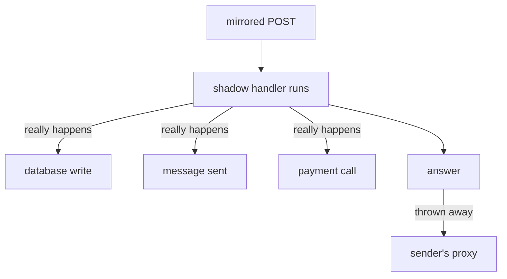

# Consequences, Verification And Limits

Astronaut, three things are left. The first can cause real damage: a mirrored signal does real work, and Istio has no idea what that work is. The second is the check that tells you whether a mirror exists inside the sender's proxy at all. The third is how much load a mirror adds when you combine it with a weighted split.

The commands below need the `probe` `DestinationRule` with the subsets `v1` and `v2`, and the `mark_start`, `count_received` and `send_requests` helpers pasted into your terminal.

## The answer is thrown away; the work is not

This is the sentence to take away from this module.

Istio copies the signal and sends it. The shadow then runs its **full handler**: it writes rows, publishes messages, adds to counters, charges cards, sends email. The mesh throws away the *answer*. Nothing about that undoes the work.

Think of a simulation drill on a spaceship. If the drill crew really opens an airlock, the air really goes out, drill or not. The mesh only ignores the test ship's report.



Only the last step, the proxy throwing the answer away, is the mesh's job. Everything above it is your application doing exactly what it was written to do, because nothing told it otherwise. On Istio 1.30, nothing in the copy tells the shadow that it is a copy.

Check this list before you mirror anything that has side effects:

- **Separate datastore.** Point the shadow at its own database, or make it read-only.
- **What it calls next.** A mirror spreads: every service the shadow calls also gets the extra load, and does not know it is serving a shadow.
- **Volume.** At 100%, the signals inside the solar system double, and so does the load on everything the shadow touches.
- **No self-detection.** The shadow cannot recognise itself from the signal. Keep side effects out of its path instead.

Mirroring is safe when you understand the shadow's side effects. That is a fact about your application, not about Istio.

## Checking the sender's proxy

Envoy calls this feature a **request mirror policy**. It lives in the *sender's* proxy, in its route table, because the sender's communications officer is the one that sends the copy. The receiving ship's flight log proves that copies *arrive*. This check proves that the order to send them *exists*. When the shadow is quiet, the two together tell you where to look.

<!-- astrona:playground:renew -->

### Read the mirror policy

Mirror 20% of the signals to v2. Save this as `virtualservice-probe.yaml`:

```yaml
apiVersion: networking.istio.io/v1
kind: VirtualService
metadata:
  name: probe
  namespace: starfleet
spec:
  hosts:
  - probe
  http:
  - route:
    - destination:
        host: probe
        subset: v1
    mirror:
      host: probe
      subset: v2
    mirrorPercentage:
      value: 20.0
```

Apply it:

```sh
kubectl apply -f virtualservice-probe.yaml
```

Then print the mirror policy from the shuttle's route table:

```sh
istioctl proxy-config routes deploy/shuttle -n starfleet -o json | grep -i -A8 requestMirrorPolicies
```

You should see (trimmed):

```text
"requestMirrorPolicies": [
    {
        "cluster": "outbound|8000|v2|probe.starfleet.svc.cluster.local",
        "runtimeFraction": {
            "defaultValue": {
                "numerator": 200000,
                "denominator": "MILLION"
            }
        },
```

The `|v2|` in the cluster name is the mirror's destination. The share is stored as a fraction: 200,000 out of a million, which is your 20%.

### Three ways a mirror stays quiet

When the shadow receives nothing, combine three checks: the mirror policy above, the endpoints of the mirror's cluster (`istioctl proxy-config endpoints deploy/shuttle -n starfleet --cluster "<cluster name>"`), and `istioctl analyze`. On a real cluster they give these results:

| Mirror policy in the shuttle | Endpoints of the mirror cluster | `istioctl analyze` | Means |
| --- | --- | --- | --- |
| missing | – | clean | the `VirtualService` has no `mirror`, or never reached the proxy |
| present, names a subset like `\|v3\|` | none: the cluster does not exist | `IST0101 Referenced mirror+subset in destinationrule not found` | the mirror names a subset no `DestinationRule` defines |
| present, names `\|v2\|` | empty list | `IST0173 The Subset v2 ... does not select any pods` | the subset's labels match no pod |
| present, names `\|v2\|` | at least one pod | clean | working: the shadow's flight log shows the copies |

In every quiet case the sender still gets its normal answers. Only these checks show the problem.

## Mirror plus a weighted split

A mirror and a weighted split work together. In this flight plan, real signals are split 50/50 between v1 and v2, and every signal is also copied to v2. There is no `mirrorPercentage`, so the default of 100% applies.

`mirror` belongs to the whole rule, not to one destination. The weights pick a destination for each signal. Then every signal is **also** copied to the mirror, whichever destination answered it. So v2 gets its real share **plus** a copy of everything.

### Count what v2 really receives

Save this as `virtualservice-probe-split-mirror.yaml`:

```yaml
apiVersion: networking.istio.io/v1
kind: VirtualService
metadata:
  name: probe
  namespace: starfleet
spec:
  hosts:
  - probe
  http:
  - route:
    - destination:
        host: probe
        subset: v1
      weight: 50
    - destination:
        host: probe
        subset: v2
      weight: 50
    mirror:
      host: probe
      subset: v2
```

Apply it:

```sh
kubectl apply -f virtualservice-probe-split-mirror.yaml
```

Then send 20 signals and count both sides:

```sh
mark_start; send_requests 20; count_received
```

You should see something like:

```text
   8 probe-v1
  12 probe-v2
probe-v1 received: 8
probe-v2 received: 32
```

v2 answered 12 signals and received 32: its own 12 plus a copy of all 20. Size a mirror target for its share **plus** everything it copies.

## Mirroring to more than one destination

The field has a plural form, `mirrors`. It takes a list of destinations, each with its own percentage. This piece shows the shape (you do not apply it):

```yaml
    mirrors:
    - destination:
        host: probe
        subset: v2
      percentage:
        value: 100.0
    - destination:
        host: probe-next
      percentage:
        value: 10.0
```

Use it when you shadow two candidate versions at once. `mirror` plus `mirrorPercentage` is still the common single-destination form, and it is what most tasks use. Recognise `mirrors`, but do not reach for it by default.

## Common pitfalls

> [!WARNING]
> - **Forgetting the shadow does real work.** This is the mistake that causes real damage. Check side effects, and what the shadow calls next, before you mirror anything.
> - **Assuming the shadow can tell it is a shadow.** Istio 1.30 sends the copy unchanged.
> - **Sizing the mirror target for its route share only.** With a split plus a mirror, the target gets its own share **plus** a copy of everything.
> - **Reading the mirror policy alone.** A policy can be present and still send nothing, when its subset is undefined or empty. Check the endpoints and `istioctl analyze` too.

> *The mesh throws away the mirrored answer. It does not undo the work the shadow did to produce it.*

## Your mission: Find The Quiet Shadow

You can now read a mirror policy, check the mirror cluster's endpoints, and tell the three quiet mirrors apart. Now prove it in a graded mission: a mirror that looks right sends nothing, and you have to find out why and fix it.

The mission runs in its own training solar system, so first pause your playground. Nothing in it is lost:

```sh
astrona stop ats-014-playground-020-02
```

Then start the mission:

```sh
astrona run --git git@github.com:astrona-io/ATS014.git -c sections/section-020/module-02/labs/lab-02
```

Read the task in [`question.md`](./labs/lab-02/question.md) and solve it on your own first. When you think you are done, send it for grading:

```sh
astrona submit -c sections/section-020/module-02/labs/lab-02
```

When the mission is done, remove it and wake your playground up again:

```sh
astrona destroy ats-014-lab-020-02-02
astrona start ats-014-playground-020-02
```
