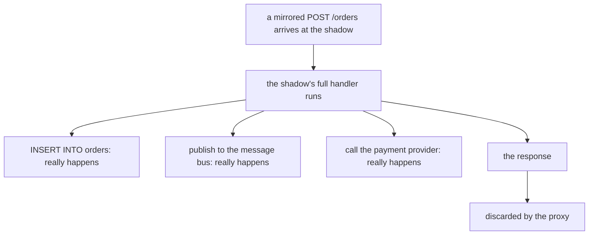

# Consequences, Verification And Limits

> Prerequisite: [Identifying And Sampling Shadow Traffic](./course-02-identifying-and-sampling-shadow-traffic.md). Next: [the module landing page](./course.md).

Two things remain. The first is the one that causes real damage: a mirrored request does real work, and Istio has no idea what that work is. The second is the proxy-side check that tells you whether a mirror exists at all. This part covers both and consolidates the module's pitfalls.

## The response is discarded; the work is not

This is the sentence to carry out of the module.

Istio duplicates the request at the network layer and dispatches it. The shadow service then runs its **full handler**: it writes rows, publishes messages, increments counters, charges cards, sends email. The mesh drops the *response*. Nothing about that drops the side effects.



Only the last box is a mesh concern. Everything above it is your application doing exactly what it was written to do, because nothing told it otherwise.

The `-shadow` authority older Istio releases added was only ever a **hint the application could act on**, never a guard rail Istio enforced — and 1.30 does not add it at all. Nothing in the copy tells the shadow it is a copy.

The practical checklist before mirroring anything with side effects:

- Point the shadow at a **separate datastore**, or make it read-only.
- Check what the shadow calls *downstream*. Mirroring one service fans out: its dependencies see the extra load too, and they are not aware they are serving a shadow.
- Account for the volume. At 100% the cluster's internal request count doubles, and so does the load on everything the shadow touches.
- Do not rely on the shadow recognising itself from the request. On 1.30 it cannot; keep the side effects out of its path instead.

Mirroring is safe when the shadow's side effects are understood — which is a fact about your application, not about Istio.

## Verifying from the proxy

Envoy's name for this feature is a **request mirror policy**, and it appears in the *client* proxy's route configuration — the caller's sidecar, because the caller is what dispatches the copy.

Checking there answers a different question from Part 2's log: the log proves copies are arriving, this proves the configuration exists. When the log is empty, this tells you whether the problem is the object or the destination.

> [!TIP]
> **Try it — the mirror policy as the client proxy holds it**
>
> ```sh
> istioctl proxy-config routes deploy/tester -n mirror-demo -o json | grep -i -A6 requestMirrorPolicies
> ```
>
> Expect something like:
>
> ```text
> "requestMirrorPolicies": [
>   {
>     "cluster": "outbound|80|v2|notification-service.mirror-demo.svc.cluster.local",
>     "runtimeFraction": {
>       "defaultValue": {
>         "numerator": 50,
> ```
>
> The `|v2|` in the cluster name is the mirror destination and `numerator: 50` is the percentage you patched in Part 2. If `requestMirrorPolicies` is absent entirely the proxy has no mirror at all — look at the object. If it is present with the right cluster but the shadow's log is empty, look at whether that cluster has endpoints.

That gives a three-state diagnostic, which is the useful form:

| `requestMirrorPolicies` | Shadow log | Means |
| --- | --- | --- |
| absent | empty | the `VirtualService` has no `mirror`, or never reached the proxy |
| present | empty | the mirror cluster has no endpoints — subset labels match nothing |
| present | logs requests the route never sent it | working |

## Mirroring more than one destination

The field has a plural form, `mirrors`, which takes a list of destinations each with its own percentage:

```yaml
mirrors:
  - destination:
      host: notification-service
      subset: v2
    percentage:
      value: 100.0
  - destination:
      host: notification-service-next
    percentage:
      value: 10.0
```

It is the right shape when you are shadowing two candidate versions at once. `mirror` plus `mirrorPercentage` remains the common single-destination form and is what most tasks and examples use; recognise `mirrors` rather than reaching for it.

## Common pitfalls

> [!WARNING]
> **Expecting the mirrored response to reach the caller.** It is always discarded, and its latency never affects the caller. If you need the new version's *answer*, that is weighted routing, not mirroring.
>
> **A `mirror` pointing at an undefined subset.** The mirror silently does nothing and the caller is unaffected — the only symptom is a quiet shadow. `istioctl analyze` names it.
>
> **A mirror subset whose labels match no pod.** `requestMirrorPolicies` is present and correct, and still nothing arrives. Check `istioctl proxy-config endpoints` for that cluster.
>
> **Forgetting the shadow does real writes.** This is the failure that causes actual damage. Check side effects, and check what the shadow calls downstream, before mirroring anything.
>
> **Assuming the shadow can tell it is a shadow.** Istio 1.30 sends the copy unchanged, and even the old `-shadow` authority was only a header the application might read. Istio enforces nothing.
>
> **Looking only at application logs for proof.** The authority rewrite is in the proxy access log (`-c istio-proxy`).
>
> **Indenting `mirror` as an entry of `route`.** It is a sibling of `route` on the same rule, and a single destination rather than a list.
>
> **Omitting `mirrorPercentage` and expecting no mirroring.** The default is 100%.
>
> **Counting shadow log lines without a baseline.** The log holds copies from earlier runs. Take a `BEFORE` count and subtract.

> *The mesh discards the mirrored response; it does not discard the work the shadow did to produce it.*

## Reference

- [Mirroring task](https://istio.io/latest/docs/tasks/traffic-management/mirroring/) — the canonical walkthrough.
- [HTTPMirrorPolicy API](https://istio.io/latest/docs/reference/config/networking/virtual-service/#HTTPMirrorPolicy) — `mirror`, the plural `mirrors`, and the percentage field.
- [Envoy request mirroring](https://www.envoyproxy.io/docs/envoy/latest/api-v3/config/route/v3/route_components.proto#envoy-v3-api-msg-config-route-v3-routeaction-requestmirrorpolicy) — the proxy feature Istio compiles this into, including the fire-and-forget semantics.
- `istioctl proxy-config routes -o json` — the only place `requestMirrorPolicies` is visible.
