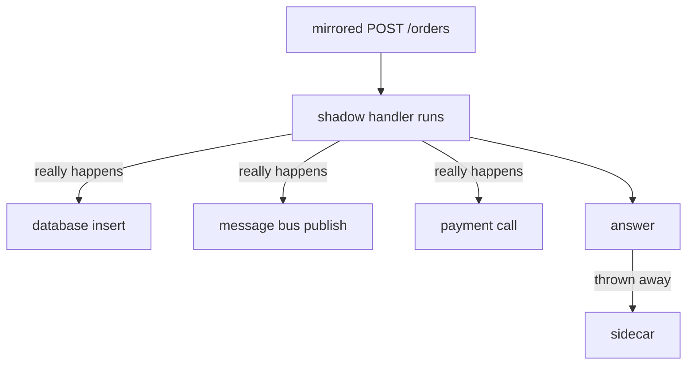

# Consequences, Verification And Limits

Three things are left. The first causes real damage: a mirrored request does real work, and Istio has no idea what that work is. The second is how much load a mirror adds when you combine it with a weighted split. The third is the sidecar-side check that tells you whether a mirror exists at all.

## The answer is thrown away; the work is not

This is the sentence to take away from the module.

Istio copies the request at the network layer and sends it. The shadow then runs its **full handler**: it writes rows, publishes messages, adds to counters, charges cards, sends email. The mesh throws away the *answer*. Nothing about that undoes the side effects.

Think of a simulation drill on a spaceship. If the drill crew really opens an airlock, the air really goes out, drill or not. The mesh only ignores the test ship's report.



Only the last step, the sidecar throwing the answer away, is a mesh matter. Everything above it is your application doing exactly what it was written to do, because nothing told it otherwise.

The `-shadow` authority that older Istio releases added was only ever a **hint the app could act on**. Istio never enforced it, and 1.30 does not add it at all. Nothing in the copy tells the shadow it is a copy.

Check this list before you mirror anything with side effects:

- Point the shadow at a **separate datastore**, or make it read-only.
- Check what the shadow calls *next*. Mirroring one service spreads: its dependencies get the extra load too, and they do not know they are serving a shadow.
- Count the volume. At 100% the traffic inside the cluster doubles, and so does the load on everything the shadow touches.
- Do not expect the shadow to recognise itself from the request. On 1.30 it cannot. Keep the side effects out of its path instead.

Mirroring is safe when you understand the shadow's side effects. That is a fact about your application, not about Istio.

## Mirror plus a weighted split

A mirror and a weighted split work together. Here, real traffic is split 50/50 between v1 and v2, and every request is also copied to v2:

```yaml
  http:
  - route:
    - destination:
        host: probe
        subset: v1
      weight: 50
    - destination:
        host: probe
        subset: v2
      weight: 50
    mirror:
      host: probe
      subset: v2
```

`mirror` belongs to the whole rule, not to one destination. The weights pick a destination for each request. Then every request is **also** copied to the mirror, whichever destination the weights picked. So v2 gets its real share **plus** a copy of everything.

> [!TIP]
> **Try it – how much does v2 really receive?**
>
> Write the rule above, with the usual `apiVersion`, `metadata` and `hosts: [probe]`, to `virtualservice-probe.yaml`, apply it, and count 20 requests:
>
> ```sh
> kubectl apply -f virtualservice-probe.yaml
> mark_start; send_requests 20; count_received
> ```
>
> Expect something like:
>
> ```text
>    8 probe-v1
>   12 probe-v2
> probe-v1 received: 8
> probe-v2 received: 32
> ```
>
> v2 answered 12 requests and received 32: its own 12 plus a copy of all 20. Keep that in mind when you decide how big the mirror target must be.

## Checking the sidecar

Envoy calls this feature a **request mirror policy**. It shows up in the *client* sidecar's route configuration, because the caller's sidecar is the one that sends the copy.

This check answers a different question from Part 2's logs. The logs prove copies are arriving. This proves the configuration exists. When the logs are empty, it tells you whether the problem is the object or the destination.

> [!TIP]
> **Try it – the mirror policy as the client sidecar holds it**
>
> Set the mirror back to v1 + 20% to v2 (Part 2's version of `virtualservice-probe.yaml`), apply it, then:
>
> ```sh
> istioctl proxy-config routes deploy/shuttle -n starfleet -o json | grep -i -A6 requestMirrorPolicies
> ```
>
> Expect something like this (trimmed):
>
> ```text
> "requestMirrorPolicies": [
>   {
>     "cluster": "outbound|8000|v2|probe.starfleet.svc.cluster.local",
>     "runtimeFraction": {
>       "defaultValue": {
>         "numerator": 20,
> ```
>
> The `|v2|` in the cluster name is the mirror destination, and `numerator: 20` is the percentage. If `requestMirrorPolicies` is missing completely, the sidecar has no mirror at all: look at the object. If it is there with the right cluster but the shadow's log is empty, check whether that cluster has endpoints.

That gives three states, which is the useful form:

| `requestMirrorPolicies` | Shadow log | Means |
| --- | --- | --- |
| missing | empty | the `VirtualService` has no `mirror`, or never reached the sidecar |
| present | empty | the mirror cluster has no endpoints; the subset labels match no pod |
| present | shows requests the route never sent it | working |

## Mirroring to more than one destination

The field has a plural form, `mirrors`. It takes a list of destinations, each with its own percentage:

```yaml
    mirrors:
    - destination:
        host: probe
        subset: v2
      percentage:
        value: 100.0
    - destination:
        host: probe-next
      percentage:
        value: 10.0
```

Use it when you shadow two candidate versions at once. `mirror` plus `mirrorPercentage` is still the common single-destination form, and it is what most tasks and examples use. Recognise `mirrors`, but do not reach for it by default.

## Common pitfalls

> [!WARNING]
> **Forgetting the shadow does real writes.** This is the mistake that causes real damage. Check side effects, and check what the shadow calls next, before you mirror anything.
>
> **Assuming the shadow can tell it is a shadow.** Istio 1.30 sends the copy unchanged. Even the old `-shadow` authority was only a header the app might read. Istio enforces nothing.
>
> **Sizing the mirror target for its route share only.** With a split plus a mirror, the target gets its own share **plus** a copy of everything.
>
> **A mirror subset whose labels match no pod.** `requestMirrorPolicies` is present and correct, and still nothing arrives. Check `istioctl proxy-config endpoints` for that cluster.

> *The mesh throws away the mirrored answer. It does not undo the work the shadow did to produce it.*
