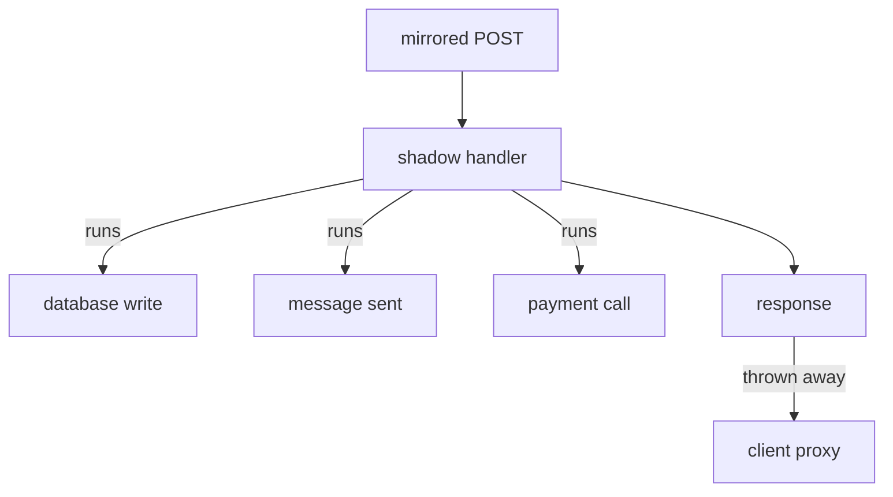

# Diagnose A Silent Mirror And Plan For Side Effects

Three topics about mirroring are left. The first can cause real damage: a mirrored request does real work, and Istio does not know what that work is. The second is the check that shows whether the client's proxy holds a mirror at all, and what to look at when the shadow stays quiet. The third is how much load a mirror adds when you combine it with a weighted split.

The commands below need a `DestinationRule` named `probe` in the `starfleet` namespace with the subsets `v1` and `v2` over the `version` label. They also need the `mark_start`, `count_received` and `send_requests` shell helpers in your terminal.

## The response is thrown away, the work is not

This is the most important fact about mirroring. Istio copies the request and sends it. The shadow application then runs its **full request handler**: it writes rows, publishes messages, updates counters, charges cards and sends email. The proxy in the client pod throws away the *response*. Nothing in that undoes the work.



The diagram shows one mirrored `POST` request: the shadow's handler runs every side effect, and only its response is thrown away by the proxy. Only that last step is the job of the mesh. Everything above it is your application doing what it was written to do, because nothing told it otherwise. On Istio 1.30, nothing in the copy tells the shadow that it is a copy.

Check these points before you mirror anything that has side effects:

- **Separate datastore.** Point the shadow at its own database, or make it read-only.
- **Downstream services.** A mirror spreads. Every service the shadow calls also gets extra load, and does not know that it serves a shadow.
- **Volume.** At 100%, the number of requests inside the cluster doubles, and so does the load on everything the shadow touches.
- **No self-detection.** The shadow cannot recognise a copy from the request. Keep side effects out of its code path instead.

Mirroring is safe when you understand the shadow's side effects. That is a fact about your application, not about Istio. The next question is a fact about Istio: did the mirror reach the proxy at all?

## Reading the mirror policy in the client's proxy

Envoy calls this feature a **request mirror policy**. It lives in the route table of the *client's* proxy, because the client's sidecar proxy sends the copy. The access log of the receiving pod proves that copies *arrive*. The mirror policy proves that the client's proxy *is configured* to send them. When the shadow is quiet, the two together tell you where to look.

<!-- astrona:playground:renew -->

Mirror 20% of the requests to v2. Save this as `virtualservice-probe.yaml`:

```yaml
apiVersion: networking.istio.io/v1
kind: VirtualService
metadata:
  name: probe
  namespace: starfleet
spec:
  hosts:
  - probe
  http:
  - route:
    - destination:
        host: probe
        subset: v1
    mirror:
      host: probe
      subset: v2
    mirrorPercentage:
      value: 20.0
```

Apply it:

```sh
kubectl apply -f virtualservice-probe.yaml
```

Then print the mirror policy from the route table of the `shuttle` proxy:

```sh
istioctl proxy-config routes deploy/shuttle -n starfleet -o json | grep -i -A8 requestMirrorPolicies
```

You should see (shortened):

```text
"requestMirrorPolicies": [
    {
        "cluster": "outbound|8000|v2|probe.starfleet.svc.cluster.local",
        "runtimeFraction": {
            "defaultValue": {
                "numerator": 200000,
                "denominator": "MILLION"
            }
        },
```

The `|v2|` in the cluster name is the mirror's destination subset. An Envoy cluster is a named group of endpoints that the proxy can send requests to. Envoy stores the share as a fraction: 200,000 out of a million, which is your 20%.

### Three ways a mirror stays quiet

A mirror policy can be present and still send nothing. When the shadow receives nothing, combine three checks. The first is the mirror policy above. The second is the list of endpoints (pod addresses) of the mirror's cluster: `istioctl proxy-config endpoints deploy/shuttle -n starfleet --cluster "<cluster name>"`. The third is `istioctl analyze`. On a real cluster they give these results:

| Mirror policy in `shuttle` | Endpoints of the mirror cluster | `istioctl analyze` | Means |
| --- | --- | --- | --- |
| missing | – | clean | the `VirtualService` has no `mirror`, or the configuration never reached the proxy |
| present, names a subset like `\|v3\|` | none: the cluster does not exist | `IST0101 Referenced mirror+subset in destinationrule not found` | the mirror names a subset that no `DestinationRule` defines |
| present, names `\|v2\|` | empty list | `IST0173 The Subset v2 ... does not select any pods` | the labels of the subset match no pod |
| present, names `\|v2\|` | at least one pod | clean | working: the access log of the shadow shows the copies |

In every quiet case the client still gets normal responses. Only these checks show the problem.

## A mirror plus a weighted split

A mirror and a weighted split work together on one rule. In the `VirtualService` below, client requests are split 50/50 between v1 and v2, and every request is also copied to v2. There is no `mirrorPercentage`, so the default of 100% applies.

`mirror` belongs to the whole rule, not to one destination. The weights pick a destination for each request. Then the proxy **also** copies every request to the mirror, whichever destination sends the response. So v2 gets its own share **plus** a copy of everything.

Save this as `virtualservice-probe-split-mirror.yaml`:

```yaml
apiVersion: networking.istio.io/v1
kind: VirtualService
metadata:
  name: probe
  namespace: starfleet
spec:
  hosts:
  - probe
  http:
  - route:
    - destination:
        host: probe
        subset: v1
      weight: 50
    - destination:
        host: probe
        subset: v2
      weight: 50
    mirror:
      host: probe
      subset: v2
```

Apply it:

```sh
kubectl apply -f virtualservice-probe-split-mirror.yaml
```

Then send 20 requests and count both sides:

```sh
mark_start; send_requests 20; count_received
```

You should see something like:

```text
   8 probe-v1
  12 probe-v2
probe-v1 received: 8
probe-v2 received: 32
```

v2 sent 12 responses and received 32 requests: its own 12 plus a copy of all 20. Size a mirror target for its own share **plus** everything it receives as copies.

## Mirroring to more than one destination

The field also has a plural form, `mirrors`. It takes a list of destinations, each with its own percentage. This piece shows the shape (you do not apply it):

```yaml
    mirrors:
    - destination:
        host: probe
        subset: v2
      percentage:
        value: 100.0
    - destination:
        host: probe-next
      percentage:
        value: 10.0
```

Use it when you test two candidate versions as shadows at the same time. `mirror` plus `mirrorPercentage` is still the common form for a single destination, and most tasks use it. Recognise `mirrors`, but do not use it by default.

You now know that a shadow does real work, how to read the mirror policy from the client's proxy, and how to tell the three quiet mirrors apart with the policy, the endpoints and `istioctl analyze`. You can also size a mirror target when a split and a mirror share one rule. That covers the whole mirroring feature.

## Common pitfalls

> [!WARNING]
> - **Forgetting that the shadow does real work.** This mistake causes real damage. Check the side effects, and the services the shadow calls, before you mirror anything.
> - **Assuming the shadow can tell that a request is a copy.** Istio 1.30 sends the copy unchanged.
> - **Sizing the mirror target for its route share only.** With a split plus a mirror, the target gets its own share **plus** a copy of everything.
> - **Reading the mirror policy alone.** A policy can be present and still send nothing, when its subset is undefined or selects no pods. Check the endpoints and `istioctl analyze` too.

## Your mission: Troubleshoot A Mirror That Sends No Copies Lab

You can now read a mirror policy, check the endpoints of the mirror cluster, and tell the three quiet mirrors apart. The lab gives you a mirror that looks correct but sends nothing, and asks you to find out why and fix it.

The lab runs in its own cluster, so first pause your playground. Nothing in it is lost:

```sh
astrona stop ats-014-playground-020-02
```

Then start the lab:

```sh
astrona run --git git@github.com:astrona-io/ATS014.git -c sections/section-020/module-02/labs/lab-02
```

The task is on the next page. Solve it on your own first. When you think you are done, send it for grading:

```sh
astrona submit -c sections/section-020/module-02/labs/lab-02
```

When the lab is done, remove it and start your playground again:

```sh
astrona destroy ats-014-lab-020-02-02
astrona start ats-014-playground-020-02
```
