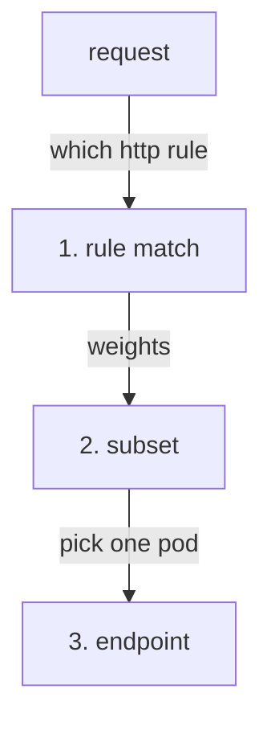

# Choose A Simple Load Balancing Algorithm

A Kubernetes Service usually has several pods behind it. Every request to the Service still goes to exactly one of those pods, so something must pick the pod. In Istio, the sidecar proxy makes that choice, and you can tell it how to choose. This part shows where the choice happens, how to watch it, and the four standard methods you can pick from.

A few terms first. The **sidecar proxy** is an Envoy proxy container that Istio adds to each pod; all inbound and outbound traffic of the pod passes through it. **`istiod`** is Istio's control plane: it sends configuration to every sidecar proxy. An **endpoint** is one pod address (IP address and port) behind a Service. **Load balancing** is the spreading of requests over those endpoints.

## Where the choice happens

The sidecar proxy of the pod that **sends** the request makes three decisions, in this order. It matches a rule of the `VirtualService` (the Istio object that holds routing rules), it picks a subset (a named group of pods, chosen by labels in a `DestinationRule`), and then it picks one endpoint in that subset.



The diagram shows that picking the endpoint is the last of the three decisions in the sending proxy.

`istiod` has already sent the sending proxy the list of endpoints for each subset. The proxy picks from that list on its own. The proxy of the receiving pod takes no part in the choice.

This order has two results. First, the number of pods in a subset never changes **which** subset is picked, because step 2 is finished before step 3 starts. Second, session affinity (keeping one user on one pod) only chooses among the pods of the subset that was already picked. It cannot keep a user on one **version** when a `VirtualService` splits traffic by weight.

## Watch the proxy choose

Before you change anything, look at the pods behind the `probe` Service and at how the `shuttle` pod's proxy picks one today. You need this starting point to see what each algorithm changes.

<!-- astrona:playground:renew -->

First paste this helper into your terminal. The `count_pods` function sends 8 requests from the `shuttle` pod to the `probe` Service and counts which pod answered each one. The path `/hostname` returns the name of the pod that served the request. Any `curl` options you add, such as a header, are passed on:

```sh
count_pods() { for i in $(seq 1 8); do
  kubectl exec -n starfleet deploy/shuttle -- curl -s "$@" | grep -o '"probe-[^"]*"'
done | sort | uniq -c; }
HOSTNAME_URL=http://probe:8000/hostname
```

### Four pods, no policy

An `EndpointSlice` is the Kubernetes object that lists the pod addresses behind a Service. List the one for `probe`:

```sh
kubectl get endpointslices -n starfleet -l kubernetes.io/service-name=probe
```

```text
NAME          ADDRESSTYPE   PORTS   ENDPOINTS                                      AGE
probe-g28v5   IPv4          8080    10.244.0.7,10.244.0.8,10.244.0.9 + 1 more...   36s
```

The Service has four endpoints: three `probe-v1` pods and one `probe-v2` pod. Now send 8 requests that all carry the same header, `x-user: alice`:

```sh
count_pods -H "x-user: alice" $HOSTNAME_URL
```

You should see a mix, for example:

```text
   1 "probe-v1-7888d6c6d5-57cqj"
   4 "probe-v1-7888d6c6d5-6lfpq"
   1 "probe-v1-7888d6c6d5-v2s9n"
   2 "probe-v2-58767cc46-9srsh"
```

Every request carried the same `x-user` header, but the proxy ignores it, because no configuration tells it to use the header. Your pod names and counts will be different.

### Read the proxy's access log

The pod name in the response comes from the application. The proxy also keeps its own record: its access log. An **access log** is a line the proxy writes for each request, and one field in it is the endpoint address the proxy picked. Read the last line of the `shuttle` pod's proxy log:

```sh
kubectl logs -n starfleet deploy/shuttle -c istio-proxy --tail=1
```

```text
[2026-10-08T20:35:10.301Z] "GET /hostname HTTP/1.1" 200 - via_upstream - "-" 0 46 5 5 "-" "curl/8.11.1" "4343f3c1-9e48-4690-8786-84a596b53023" "probe:8000" "10.244.0.10:8080" outbound|8000||probe.starfleet.svc.cluster.local 10.244.0.6:57852 10.96.215.230:8000 10.244.0.6:49902 - default
```

The field `"10.244.0.10:8080"` is the endpoint the `shuttle` pod's proxy chose for this request. With that proof in hand, you can now change how the proxy picks.

## The four `simple` algorithms

An **algorithm** here is a fixed method for picking an endpoint. You set it in a `DestinationRule`, the Istio object that holds policies for traffic to one host, under `trafficPolicy.loadBalancer`. That field takes one of two forms, and you can only use one at a time. The first form is `simple`, which names a standard algorithm:

| Value | How it picks | Use it when |
| --- | --- | --- |
| `LEAST_REQUEST` | the pod with the fewest requests in progress. **This is the Istio default.** | requests have very different costs, so a pod busy with a slow request should get fewer new ones |
| `ROUND_ROBIN` | each pod in turn | requests cost about the same and you want an even spread |
| `RANDOM` | a random pod, with no memory of past choices | there are very many pods, and tracking each one costs more than it saves |
| `PASSTHROUGH` | no choice at all: it connects to the address the request was already going to | the client already chose an address and the proxy must not change it |

Two of these need one more sentence each. **`LEAST_REQUEST` does not check every pod.** Envoy picks two pods at random and sends the request to the one with fewer requests in progress. That is nearly as good as checking every pod, for much less work, and it is why the spread looks a little uneven.

**`PASSTHROUGH` switches the choice off.** The other three pick from the list of endpoints. `PASSTHROUGH` ignores the list and connects to the address the request was already going to.

### Round robin over four pods

Make the `shuttle` pod's proxy take the four pods in turn. Save this as `destinationrule-probe.yaml`:

```yaml
apiVersion: networking.istio.io/v1
kind: DestinationRule
metadata:
  name: probe
  namespace: starfleet
spec:
  host: probe
  trafficPolicy:
    loadBalancer:
      simple: ROUND_ROBIN
```

Apply it:

```sh
kubectl apply -f destinationrule-probe.yaml
```

Then send 8 requests:

```sh
count_pods $HOSTNAME_URL
```

You should see each pod exactly twice:

```text
   2 "probe-v1-7888d6c6d5-57cqj"
   2 "probe-v1-7888d6c6d5-6lfpq"
   2 "probe-v1-7888d6c6d5-v2s9n"
   2 "probe-v2-58767cc46-9srsh"
```

### Compare the other two

Change `simple: ROUND_ROBIN` to `LEAST_REQUEST` in `destinationrule-probe.yaml`. Apply it:

```sh
kubectl apply -f destinationrule-probe.yaml
```

Then send 8 requests:

```sh
count_pods $HOSTNAME_URL
```

One run gave:

```text
   4 "probe-v1-7888d6c6d5-57cqj"
   2 "probe-v1-7888d6c6d5-6lfpq"
   2 "probe-v1-7888d6c6d5-v2s9n"
```

Then try `RANDOM` the same way. One run gave:

```text
   5 "probe-v1-7888d6c6d5-57cqj"
   1 "probe-v1-7888d6c6d5-6lfpq"
   1 "probe-v1-7888d6c6d5-v2s9n"
   1 "probe-v2-58767cc46-9srsh"
```

Both algorithms spread the requests, but unevenly. With only 8 requests, one pod may get none at all. Every `simple` value spreads traffic; that is what they are for.

### See which algorithm the proxy uses

Envoy groups the endpoints of one destination into a **cluster**, and it stores the algorithm on each cluster as the field `lbPolicy`. Read it from the `shuttle` pod's proxy with `istioctl proxy-config cluster`. With `RANDOM` applied:

```sh
istioctl proxy-config cluster deploy/shuttle -n starfleet --fqdn probe.starfleet.svc.cluster.local -o json | grep -m1 '"lbPolicy"'
```

```text
        "lbPolicy": "RANDOM",
```

With `LEAST_REQUEST`, the line says `"lbPolicy": "LEAST_REQUEST"`. It says the same with no `DestinationRule` at all, because that is Istio's default. With `ROUND_ROBIN`, the command prints **nothing**: round robin is Envoy's own built-in default, and the dump leaves default values out.

You now know that the sending proxy picks the endpoint last, after the rule and the subset, and that every `simple` algorithm spreads requests over the pods. You can also prove which algorithm a proxy uses. The open question is the opposite need: how to send the same user to the same pod every time.

## Common pitfalls

> [!WARNING]
> - **Expecting `LEAST_REQUEST` to spread perfectly evenly.** It picks two pods at random and uses the less busy one. An uneven count means it is working.
> - **Judging a spread from a handful of requests.** With 8 requests, `RANDOM` and `LEAST_REQUEST` can skip a pod completely. Send more before you draw a conclusion.
> - **Reading a missing `lbPolicy` line as "no policy".** It means `ROUND_ROBIN`, Envoy's default.
> - **Reading `PASSTHROUGH` as an algorithm.** It switches endpoint selection off and connects to the original address.
> - **Looking for the decision in the receiving pod.** The endpoint is chosen by the **sending** pod's proxy.

## Your mission: Spread Requests Evenly With ROUND_ROBIN Lab

You can now pick a load balancing algorithm and read which one the proxy really uses. The mission gives you a `probe` Service where every request lands on the same pod, and asks you to spread the requests over all pods again, in turn.

The lab runs on its own cluster, so first pause your playground. Nothing in it is lost:

```sh
astrona stop ats-014-playground-030-01
```

Then start the lab. The task is on the next page:

```sh
astrona run --git git@github.com:astrona-io/ATS014.git -c sections/section-030/module-01/labs/lab-03
```

Solve it on your own first. When you think you are done, send it for grading:

```sh
astrona submit -c sections/section-030/module-01/labs/lab-03
```

When you are finished, remove the lab and start your playground again:

```sh
astrona destroy ats-014-lab-030-01-03
astrona start ats-014-playground-030-01
```
