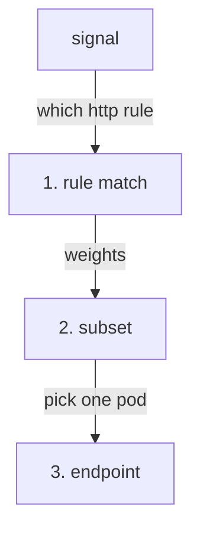

# Endpoint Selection And The `simple` Algorithms

Astronaut, before you change how a ship is picked, find out where that choice happens and how to watch it. Then meet the four standard ways to make it. Each one is an **algorithm**: a fixed method for picking a ship.

The commands below need the `count_pods` helper pasted into your terminal.

## Where the choice happens

Three decisions happen in order, all inside the communications officer of the ship that **sends** the signal:



Step 1 picks the rule in the flight plan, step 2 picks the ship class (subset), and step 3 picks one ship in that class. Mission control (`istiod`) has told the communications officer which ships fly in each squadron, and the officer picks from that list alone. The receiving ship takes no part in it.

This order explains two facts:

- The number of ships in a subset never changes **which** subset is picked. Step 2 is finished before step 3 starts.
- Stickiness only chooses among the ships of the subset that was already picked. It cannot keep a user on one **version** in a weighted split.

## Watch the proxy choose

Before you change anything, look at the squadron and at how the shuttle's proxy picks a ship today. You need this starting point to see what each algorithm changes.

<!-- astrona:playground:renew -->

### Four ships, no policy

First, see the squadron. The probe Service has four pod addresses behind it:

```sh
kubectl get endpointslices -n starfleet -l kubernetes.io/service-name=probe
```

```text
NAME          ADDRESSTYPE   PORTS   ENDPOINTS                                      AGE
probe-g28v5   IPv4          8080    10.244.0.7,10.244.0.8,10.244.0.9 + 1 more...   36s
```

Now send 8 signals that all carry the same label, `x-user: alice`:

```sh
count_pods -H "x-user: alice" $HOSTNAME_URL
```

You should see a mix, for example:

```text
   1 "probe-v1-7888d6c6d5-57cqj"
   4 "probe-v1-7888d6c6d5-6lfpq"
   1 "probe-v1-7888d6c6d5-v2s9n"
   2 "probe-v2-58767cc46-9srsh"
```

Every signal carried the same `x-user` header, but the header means nothing to the proxy yet. Nothing has told it to care. Your pod names and counts will be different.

### Read the proxy's own record

The pod name comes from the app. The communications officer keeps its own record too: every line in the shuttle's flight log names the pod address it picked:

```sh
kubectl logs -n starfleet deploy/shuttle -c istio-proxy --tail=1
```

```text
[2026-10-08T20:35:10.301Z] "GET /hostname HTTP/1.1" 200 - via_upstream - "-" 0 46 5 5 "-" "curl/8.11.1" "4343f3c1-9e48-4690-8786-84a596b53023" "probe:8000" "10.244.0.10:8080" outbound|8000||probe.starfleet.svc.cluster.local 10.244.0.6:57852 10.96.215.230:8000 10.244.0.6:49902 - default
```

`"10.244.0.10:8080"` is the ship the shuttle's proxy chose for this signal.

## The four `simple` algorithms

`trafficPolicy.loadBalancer` takes one of two forms, and you can only use one. The first is `simple`, which names a standard algorithm:

| Value | How it picks | Use it when |
| --- | --- | --- |
| `LEAST_REQUEST` | the pod with the fewest signals in progress. **This is the Istio default.** | signals have very different costs, so a pod stuck on a slow one should get fewer new ones |
| `ROUND_ROBIN` | each pod in turn | signals cost about the same and you want an even spread |
| `RANDOM` | a random pod, with no memory of past choices | there are very many pods, and tracking each one costs more than it saves |
| `PASSTHROUGH` | no choice at all: it connects to the address the signal was already going to | the sender already chose an address and the proxy must not change it |

Two of these need one more sentence each:

- **`LEAST_REQUEST` does not check every pod.** Envoy, the proxy Istio uses, picks two pods at random and sends the signal to the one with fewer signals in progress. That is nearly as good as checking every pod, for much less work, and it is why the spread looks a little uneven.
- **`PASSTHROUGH` switches the choice off.** The other three pick from the list of pods. `PASSTHROUGH` ignores the list and connects to the address the signal was already heading for.

### Round robin over four ships

Make the shuttle's proxy take the four ships in turn. Save this as `destinationrule-probe.yaml`:

```yaml
apiVersion: networking.istio.io/v1
kind: DestinationRule
metadata:
  name: probe
  namespace: starfleet
spec:
  host: probe
  trafficPolicy:
    loadBalancer:
      simple: ROUND_ROBIN
```

Apply it:

```sh
kubectl apply -f destinationrule-probe.yaml
```

Then send 8 signals:

```sh
count_pods $HOSTNAME_URL
```

You should see each ship exactly twice:

```text
   2 "probe-v1-7888d6c6d5-57cqj"
   2 "probe-v1-7888d6c6d5-6lfpq"
   2 "probe-v1-7888d6c6d5-v2s9n"
   2 "probe-v2-58767cc46-9srsh"
```

### Compare the other two

Change `simple: ROUND_ROBIN` to `LEAST_REQUEST` in `destinationrule-probe.yaml`. Apply it:

```sh
kubectl apply -f destinationrule-probe.yaml
```

Then send 8 signals:

```sh
count_pods $HOSTNAME_URL
```

One run gave:

```text
   4 "probe-v1-7888d6c6d5-57cqj"
   2 "probe-v1-7888d6c6d5-6lfpq"
   2 "probe-v1-7888d6c6d5-v2s9n"
```

Then try `RANDOM` the same way. One run gave:

```text
   5 "probe-v1-7888d6c6d5-57cqj"
   1 "probe-v1-7888d6c6d5-6lfpq"
   1 "probe-v1-7888d6c6d5-v2s9n"
   1 "probe-v2-58767cc46-9srsh"
```

Both spread the signals, but unevenly, and with only 8 signals one ship may get none at all. Every `simple` value spreads traffic. That is what they are for.

### See which algorithm the proxy uses

The shuttle's proxy stores the algorithm on each cluster, as `lbPolicy`. With `RANDOM` applied:

```sh
istioctl proxy-config cluster deploy/shuttle -n starfleet --fqdn probe.starfleet.svc.cluster.local -o json | grep -m1 '"lbPolicy"'
```

```text
        "lbPolicy": "RANDOM",
```

With `LEAST_REQUEST`, the line says `"lbPolicy": "LEAST_REQUEST"`, and it says the same with no `DestinationRule` at all, because that is Istio's default. With `ROUND_ROBIN`, the command prints **nothing**: round robin is Envoy's own built-in default, and the dump leaves default values out.

## Common pitfalls

> [!WARNING]
> - **Expecting `LEAST_REQUEST` to spread perfectly evenly.** It picks two pods at random and uses the less busy one. An uneven count means it is working.
> - **Judging a spread from a handful of signals.** With 8 signals, `RANDOM` and `LEAST_REQUEST` can skip a ship completely. Send more before you draw a conclusion.
> - **Reading a missing `lbPolicy` line as "no policy".** It means `ROUND_ROBIN`, Envoy's default.
> - **Reading `PASSTHROUGH` as an algorithm.** It switches pod selection off and connects to the original address.
> - **Looking for the decision on the receiving ship.** The pod is chosen by the **sender's** proxy.

> *Picking a ship is the third decision on a signal's path. The sender's proxy makes it for every signal, and every `simple` algorithm spreads the signals across the squadron.*

## Your mission: Spread The Signals Evenly

You can now pick a load balancing algorithm and read which one the proxy really uses. Now prove it in a graded mission: a squadron that sends every signal to the same ship has to be spread out again.

The mission runs in its own training solar system, so first pause your playground. Nothing in it is lost:

```sh
astrona stop ats-014-playground-030-01
```

Then start the mission:

```sh
astrona run --git git@github.com:astrona-io/ATS014.git -c sections/section-030/module-01/labs/lab-03
```

Read the task in [`question.md`](./labs/lab-03/question.md) and solve it on your own first. When you think you are done, send it for grading:

```sh
astrona submit -c sections/section-030/module-01/labs/lab-03
```

When the mission is done, remove it and wake your playground up again:

```sh
astrona destroy ats-014-lab-030-01-03
astrona start ats-014-playground-030-01
```
