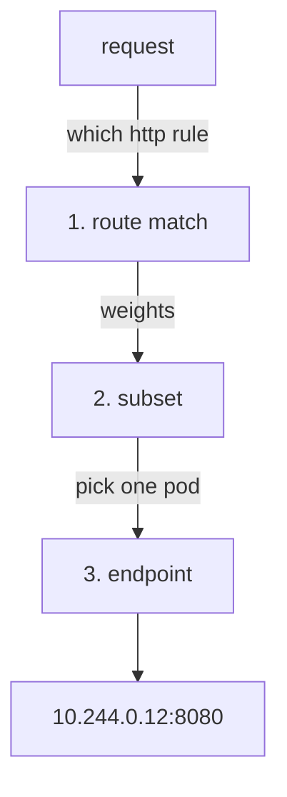

# Endpoint Selection And The `simple` Algorithms

Astronaut, this part shows where the choice of ship happens on a signal's path. It gives you a way to watch that choice. Then it covers the four standard algorithms. An **algorithm** here is just a fixed method for making the choice. All four of them spread traffic over the pods, and that is exactly what Part 2 will take away.

## Where the choice happens

Three decisions happen in order inside the **calling** proxy. Keeping them apart makes the rest of the course easier:



Step 3 comes last, after the subset is already fixed.

Think of the proxy as the communications officer on the calling ship. Mission control (`istiod`) has told the officer which spaceships (pods) fly in each squadron. Steps 1 and 2 pick the squadron. Step 3 picks one ship in that squadron, for each signal. The officer makes this choice alone, from the list of pods `istiod` sent. The receiving ship takes no part in it.

This order explains two things:

- The number of pods in a subset can never change **which** subset was chosen. Step 2 is finished before step 3 starts.
- Stickiness (Part 2) only chooses among the pods of the subset that was already picked. It cannot keep a user on one **version** in a weighted split.

## Watching a proxy choose

You need a quick way to see which pod answered. The playground's httpbin has a path, `/hostname`, that returns the name of the pod that served the request.

Paste this helper into your terminal. It sends 8 requests from the `curl` pod and counts which pod answered each one. You can add extra `curl` options, such as a header. It also sets `$HOSTNAME_URL`, the address every "Try it" in this module calls. A shell function lasts only for the current terminal, so paste it again in each new window.

<!-- astrona:playground:renew -->

```sh
count_pods() { for i in $(seq 1 8); do
  kubectl exec -n bookinfo deploy/curl -- curl -s "$@" | grep -o '"httpbin-[^"]*"'
done | sort | uniq -c; }
HOSTNAME_URL=http://httpbin:8000/hostname
```

The pod name comes from the app. The proxy keeps its own record too. With access logs on, every line in the caller's sidecar log includes the **upstream host**: the address of the pod the proxy picked. That is the proxy's own note of its decision, written in the ship's black box flight log. You can read it with `kubectl logs -n bookinfo deploy/curl -c istio-proxy --tail=8`.

> [!TIP]
> **Try it — four pods, no policy, no stickiness**
>
> ```sh
> kubectl get endpoints httpbin -n bookinfo
> count_pods -H "x-user: alice" $HOSTNAME_URL
> ```
>
> Expect four addresses on port `8080` in the endpoints list: three v1 pods and one v2 pod. The 8 answers spread over several of those pods; the exact counts change from run to run. Every request carried the same `x-user: alice` header, but the header means nothing to the proxy. Nothing has told it to care. This is the starting point that Part 2 changes.

## The four `simple` algorithms

`trafficPolicy.loadBalancer` takes one of two forms, and you can only use one. The first is `simple`, which names a standard algorithm:

| Value | How it picks | Use it when |
| --- | --- | --- |
| `LEAST_REQUEST` | the pod with the fewest requests in progress. **This is the Istio default.** | requests have very different costs, so a pod stuck on a slow request should get fewer new ones |
| `ROUND_ROBIN` | each pod in turn; the default in older Istio versions | requests cost about the same and you want an exactly even spread |
| `RANDOM` | a random pod, with no memory of past choices | there are very many pods, and keeping track of each one costs more than it saves |
| `PASSTHROUGH` | no choice at all: it connects to the address the request was already going to | the caller already chose an address and the proxy must not change it |

Two of these need one more sentence each.

**`LEAST_REQUEST` does not check every pod.** Envoy, the proxy Istio uses, does it as "power of two choices". It picks two pods at random and sends the request to the one with fewer requests in progress. That gives nearly all the benefit of checking every pod, for much less work. It is also why the spread looks a little uneven. A perfectly even spread is the sign of round robin.

**`PASSTHROUGH` is the odd one out.** The other three pick from the list of pods. `PASSTHROUGH` ignores that list and connects to the address the request was already heading for. It is a way to switch load balancing **off**, not a way to set it up.

The field sits under `trafficPolicy`, where every decision the caller makes about a destination lives:

```yaml
apiVersion: networking.istio.io/v1
kind: DestinationRule
metadata:
  name: httpbin
  namespace: bookinfo
spec:
  host: httpbin
  trafficPolicy:
    loadBalancer:
      simple: ROUND_ROBIN
```

> [!TIP]
> **Try it — round robin over four pods**
>
> Write the DestinationRule to a file, then apply it.
>
> Save this as `destinationrule-httpbin.yaml`:
>
> ```yaml
> apiVersion: networking.istio.io/v1
> kind: DestinationRule
> metadata:
>   name: httpbin
>   namespace: bookinfo
> spec:
>   host: httpbin
>   trafficPolicy:
>     loadBalancer:
>       simple: ROUND_ROBIN
> ```
>
> Apply it:
>
> ```sh
> kubectl apply -f destinationrule-httpbin.yaml
> ```
>
> Then check the result:
>
> ```sh
> count_pods $HOSTNAME_URL
> ```
>
> Expect each of the four pods about twice (the pod names vary):
>
> ```text
>    2 "httpbin-v1-...-gfp4z"
>    2 "httpbin-v1-...-h2njm"
>    2 "httpbin-v1-...-sbs7c"
>    2 "httpbin-v2-...-qx7g7"
> ```
>
> Change `simple` to `LEAST_REQUEST` or `RANDOM`, apply the file again, and rerun `count_pods`. The spread is less even, but all four pods still answer. Every `simple` value spreads traffic. That is what they are for.

## Common pitfalls

> [!WARNING]
> **Expecting `LEAST_REQUEST` to spread perfectly evenly.** It picks two pods at random and uses the less busy one. A slightly uneven count means the algorithm is working.
>
> **Reading `PASSTHROUGH` as an algorithm.** It switches pod selection off and connects to the original address.
>
> **Setting `simple` and `consistentHash` together.** You can only use one of them, and the object is rejected.
>
> **Looking for the decision on the server.** The pod is chosen in the **caller's** proxy. The server has no part in it.
>
> **Judging a spread from a handful of requests.** Eight requests show the pattern of round robin. For the other algorithms, send more before you draw a conclusion. The same caution applies as in section 020.

> *Picking a pod is the third decision in the path. The caller's proxy makes it for every request, and every `simple` algorithm spreads traffic across the pods.*
