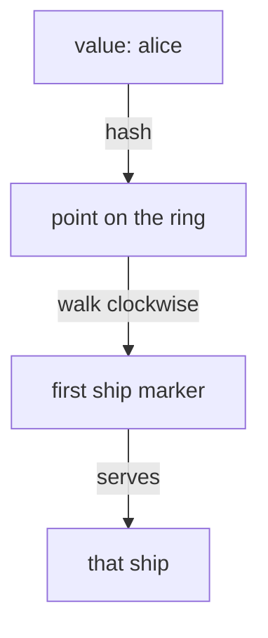

# `consistentHash` And The Ring

Astronaut, every algorithm so far spreads signals over the squadron. This part is the opposite. Instead of choosing by load, the proxy works out the ship from something **in the signal**, so the same input always lands on the same ship. That is a **sticky session**.

Think of an astronaut who calls the same squadron again and again. With sticky sessions, the same spaceship always answers that astronaut, so the crew on board still remembers where the conversation left off.

The commands below need the `count_pods` helper pasted into your terminal.

## What you can hash

A **hash** is a number the proxy calculates from a value, such as the text `alice`. The same value always gives the same number. `consistentHash` is the second form of `loadBalancer`, and you use it **instead of** `simple`, never together with it. You set exactly one of these fields:

| Field | Hashes | Good for |
| --- | --- | --- |
| `httpHeaderName` | a named request header | a gateway or client that already sends a stable user id |
| `httpCookie` | a cookie, with a `name` and an optional `ttl` | browser traffic, where Istio can **create** the cookie |
| `useSourceIp: true` | the sender's IP address | the bluntest option; misleading when many users share one address |
| `httpQueryParameterName` | a named query parameter, such as `?user=alice` | APIs that carry the user id in the URL |

This part uses the header. The next part covers the cookie and the other two.

## How a hash becomes a ship

"Consistent hashing" is a specific method. Knowing roughly how it works lets you predict what it does.

Envoy builds a **ring**: a circle of hash values. Picture the rings of Saturn, with every ship parked at many small spots around it. To route a signal, the proxy hashes the chosen value, finds that point on the ring, and walks clockwise to the first ship it meets.



Two facts follow from that picture:

- **Nothing is stored.** The proxy does not remember that `alice` went to ship A. It works out the same hash and walks to the same spot every time. So stickiness survives a proxy restart and needs no shared session store.
- **Each ship owns many small slices of the ring**, not one big slice. When a ship joins or leaves, only some users have to move. A simple "hash divided by the number of ships" would move almost everyone.

<!-- astrona:playground:renew -->

### Pin each user to one ship

Hash the `x-user` header. Save this as `destinationrule-probe.yaml`:

```yaml
apiVersion: networking.istio.io/v1
kind: DestinationRule
metadata:
  name: probe
  namespace: starfleet
spec:
  host: probe
  trafficPolicy:
    loadBalancer:
      consistentHash:
        httpHeaderName: x-user
```

Apply it:

```sh
kubectl apply -f destinationrule-probe.yaml
```

Then send 8 signals each as `alice`, `bob` and `carol`:

```sh
count_pods -H "x-user: alice" $HOSTNAME_URL
count_pods -H "x-user: bob" $HOSTNAME_URL
count_pods -H "x-user: carol" $HOSTNAME_URL
```

One run gave:

```text
   8 "probe-v2-58767cc46-9srsh"
   8 "probe-v2-58767cc46-9srsh"
   8 "probe-v1-7888d6c6d5-v2s9n"
```

Every user is pinned: 8 out of 8 signals reached the same ship each time. In this run, `alice` and `bob` landed on the **same** ship, and `carol` on another. With four ships, two names often share one. That is a **collision**, not a mistake in your configuration. Which ship each name gets depends on the hash, so yours may differ.

### See the ring in the proxy

Envoy calls consistent hashing `RING_HASH`. Ask the shuttle's proxy:

```sh
istioctl proxy-config cluster deploy/shuttle -n starfleet --fqdn probe.starfleet.svc.cluster.local -o json \
  | grep -E '"lbPolicy"|"minimumRingSize"'
```

```text
        "lbPolicy": "RING_HASH",
            "minimumRingSize": "1024"
```

`minimumRingSize` is how many spots the ring has. With 1024 spots shared by four ships, each ship owns hundreds of small slices.

## Stickiness is best effort

"Sticky sessions" sounds absolute, but it is not, and exam answers should say so. The ring is built from the ships that exist **right now**. When a ship joins or leaves, the ring is rebuilt, and some users move.

### Watch some users move

Keep the header policy. Write down which ship eight users land on, then add a fourth v1 ship and look again:

```sh
who() { for u in alice bob carol dave erin frank grace heidi; do
  printf "%-6s %s\n" $u "$(kubectl exec -n starfleet deploy/shuttle -- curl -s -H "x-user: $u" $HOSTNAME_URL | grep -o 'probe-[^"]*')"
done; }
who
```

One run gave:

```text
alice  probe-v2-58767cc46-9srsh
bob    probe-v2-58767cc46-9srsh
carol  probe-v1-7888d6c6d5-v2s9n
dave   probe-v2-58767cc46-9srsh
erin   probe-v1-7888d6c6d5-6lfpq
frank  probe-v2-58767cc46-9srsh
grace  probe-v1-7888d6c6d5-57cqj
heidi  probe-v1-7888d6c6d5-v2s9n
```

Now add one ship to the v1 squadron:

```sh
kubectl scale deploy/probe-v1 -n starfleet --replicas=4
kubectl rollout status deploy/probe-v1 -n starfleet
```

Wait a few seconds, then run `who` again. In the same run:

```text
alice  probe-v1-7888d6c6d5-xl2p6
bob    probe-v2-58767cc46-9srsh
carol  probe-v1-7888d6c6d5-xl2p6
dave   probe-v2-58767cc46-9srsh
erin   probe-v1-7888d6c6d5-v2s9n
frank  probe-v2-58767cc46-9srsh
grace  probe-v1-7888d6c6d5-57cqj
heidi  probe-v1-7888d6c6d5-v2s9n
```

Five of the eight users stayed where they were. Three moved: `alice` and `carol` to the new ship (`xl2p6`), and `erin` from one old ship to another, because the whole ring was rebuilt. Nobody had to move all users, but some did move.

Scale the squadron back:

```sh
kubectl scale deploy/probe-v1 -n starfleet --replicas=3
```

So treat stickiness as a **speed-up, not a guarantee**. It makes caches work better. If an app breaks when a session moves to another ship, that app needs shared session storage, whatever the load balancer does.

## A signal with nothing to hash

This is behind most "it works in testing but not in production" reports about stickiness. If a signal does not carry the hashed value, there is nothing to hash: a signal with no call sign on the label. The proxy does not fail the signal, and it does not pick a fixed backup ship. It **falls back to normal load balancing** for that signal.

### Send signals without the header

The header policy is still in place. Send 8 signals without `x-user`:

```sh
count_pods $HOSTNAME_URL
```

One run gave:

```text
   1 "probe-v1-7888d6c6d5-57cqj"
   2 "probe-v1-7888d6c6d5-6lfpq"
   2 "probe-v1-7888d6c6d5-v2s9n"
   3 "probe-v2-58767cc46-9srsh"
```

The same policy, different signals, completely different behaviour. A policy that hashes a header the sender only sometimes sends gives stickiness that only sometimes works, with no error anywhere.

## Common pitfalls

> [!WARNING]
> - **Setting `simple` and `consistentHash` together.** You can only use one. The object is rejected.
> - **Treating stickiness as a guarantee.** When ships join or leave, some users move. An app that breaks when a session moves needs shared session storage.
> - **Hashing a value the sender does not always send.** Signals without it fall back to normal load balancing, silently, one signal at a time.
> - **Reading a collision as a bug.** With a few ships, two values landing on the same ship is normal. Try a third value before you change anything.
> - **Testing stickiness against one ship.** Every signal lands on the same ship whether your policy works or not. Use several.

> *The ring turns a hash into a ship without storing anything. When the squadron changes, the ring is rebuilt and some users move, but most stay.*
