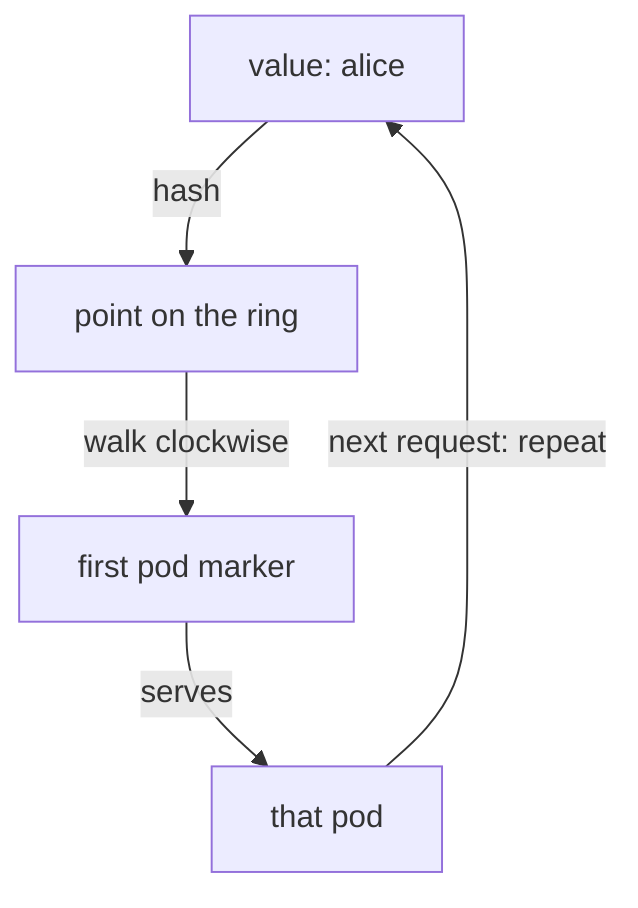

# `consistentHash` And The Ring

Every algorithm in Part 1 spreads traffic. This part is the other option. Instead of choosing by load, the proxy works out the pod from something **in the signal** (the request). The same input then always lands on the same pod. This is called a **sticky session**, or **session affinity**.

Think of an astronaut who calls the same squadron again and again. With sticky sessions, the same spaceship always answers that astronaut, so the crew on board still remembers where the conversation left off.

This part covers what you can hash, how a hash becomes a pod, and the two behaviours that surprise people: sessions moving when pods change, and stickiness vanishing when the request carries nothing to hash.

## The four things you can hash

A **hash** is a number the proxy calculates from a value, such as the text `alice`. The same value always gives the same number. `consistentHash` is the second form of `loadBalancer`, and you can only use it **instead of** `simple`. You set exactly one of these fields:

| Field | Hashes | Good for |
| --- | --- | --- |
| `httpHeaderName` | a named request header | a gateway or client that already sends a stable user or tenant id |
| `httpCookie` | a cookie, with a `name` and an optional `ttl` | browser traffic, where Istio can **create** the cookie |
| `useSourceIp: true` | the caller's IP address | the bluntest option; misleading when many users share one address |
| `httpQueryParameterName` | a named query parameter, such as `?user=alice` | APIs that carry the user id in the URL |

If you set `simple` and `consistentHash` together, the object is rejected when you apply it. That is a good kind of failure: you find out straight away.

## How a hash becomes a pod

"Consistent hashing" is the name of a specific method. Knowing roughly how it works lets you predict what it does.

Envoy builds a **ring**: a circle of hash values. Picture the rings of Saturn, with every spaceship (pod) parked at many small spots around it (hundreds of them, set by `minimumRingSize`). To route a request, the proxy hashes the chosen value, finds that point on the ring, and walks clockwise to the first pod marker it meets.



Nothing is stored: every request repeats the walk. Each pod owns hundreds of small slices of the ring, not one big slice. That is why losing one pod disturbs only a small share of users.

Two facts follow from that picture, and both come up in exams:

- **Nothing is stored.** The proxy does not remember that `alice` went to pod A. It works out the same hash and walks to the same marker every time. So stickiness survives a proxy restart and needs no shared session store.
- **Removing a pod only affects its own slices.** Take pod A away and its markers vanish. Requests that used to land on them walk on to the next marker. Requests that were already landing on B or C do not move.

That second fact is the "consistent" in consistent hashing. A simple `hash(value) % number_of_pods` would move **almost every** user when the number of pods changes. The ring moves only about `1/N` of them, where `N` is the number of pods.

> [!TIP]
> **Try it — the same user always lands on the same pod**
>
> Write a DestinationRule that hashes the `x-user` header, then apply it. It has the same name as the one from Part 1, so it replaces it.
>
> ```sh
> cat > destinationrule-httpbin.yaml <<'EOF'
> apiVersion: networking.istio.io/v1
> kind: DestinationRule
> metadata:
>   name: httpbin
>   namespace: bookinfo
> spec:
>   host: httpbin
>   trafficPolicy:
>     loadBalancer:
>       consistentHash:
>         httpHeaderName: x-user
> EOF
> kubectl apply -f destinationrule-httpbin.yaml
> count_pods -H "x-user: alice" $HOSTNAME_URL
> count_pods -H "x-user: bob" $HOSTNAME_URL
> ```
>
> Expect 8 × one pod for `alice`, and 8 × one (maybe other) pod for `bob`. Nothing was stored. The proxy worked out the same hash of `alice` on every request and walked to the same marker. Which pod it is depends on the hash, so yours may differ.

A pin only means something if different values can land on different pods. `bob` usually gets a different pod from `alice`. But with four pods, two names can land on the same one. **A collision is not a mistake in your configuration.** If `alice` and `bob` share a pod, try `carol`.

## Stickiness is best effort

Be ready to say this in an exam answer. "Sticky sessions" sounds absolute, but it is not.

The ring is built from the pods that exist **right now**. Add a pod and it places new markers, taking over some slices from its neighbours. Lose a pod and the next pods clockwise take over its slices. Either way, some existing sessions move.

What consistent hashing promises is that the share is **small**: about one over the number of pods, not a full reshuffle. Going from three pods to four moves about a quarter of sessions. The other three quarters never notice.

So **treat stickiness as a speed-up, not a guarantee.** If an app breaks when a session moves to another pod, that app needs shared session storage, whatever the load balancer does. Stickiness makes caches work better. It does not make in-memory session data safe.

## A request with nothing to hash

This is behind most "it works in testing but not in production" reports about stickiness.

If a signal does not carry the hashed value (no `x-user` header, no cookie, no such query parameter), there is nothing to hash. It is like a signal with no call sign on the label. The proxy does not fail the request, and it does not pick a fixed backup pod. It **falls back to normal load balancing** for that request.

So a policy that hashes a header the client only sometimes sends gives stickiness that only sometimes works. There is no error and no clear pattern.

> [!TIP]
> **Try it — no header means no stickiness**
>
> ```sh
> count_pods $HOSTNAME_URL
> ```
>
> Expect the 8 answers spread over several pods. The `consistentHash` policy is still in place and unchanged. These requests simply have nothing to hash, so they spread. Compare this with the 8-on-one-pod result above: same policy, different requests, completely different behaviour.

## Sticky by cookie, and what `ttl` does

A browser cannot easily send a custom header, but it does keep cookies. So for browser traffic, a cookie is usually the better choice:

```yaml
trafficPolicy:
  loadBalancer:
    consistentHash:
      httpCookie:
        name: session
        ttl: 3600s
```

The important detail is what `ttl` does. **Setting `ttl` makes the sidecar create the cookie** when the request does not have one. The sidecar adds a `Set-Cookie` header to the response, and the browser sends the cookie back on every later request. That closes the "nothing to hash" gap for a first-time visitor. `ttl` is also how long that cookie lasts.

If you leave `ttl` out, Istio only hashes a cookie the client already sends. That is the right choice when another part of your system owns the session cookie and a second one would cause confusion.

> [!TIP]
> **Try it — the sidecar hands out a cookie**
>
> ```sh
> cat > destinationrule-httpbin.yaml <<'EOF'
> apiVersion: networking.istio.io/v1
> kind: DestinationRule
> metadata:
>   name: httpbin
>   namespace: bookinfo
> spec:
>   host: httpbin
>   trafficPolicy:
>     loadBalancer:
>       consistentHash:
>         httpCookie:
>           name: session
>           ttl: 3600s
> EOF
> kubectl apply -f destinationrule-httpbin.yaml
> kubectl exec -n bookinfo deploy/curl -- curl -s -i $HOSTNAME_URL | grep -i -E 'set-cookie|hostname'
> count_pods -b "session=abc123" $HOSTNAME_URL
> ```
>
> Expect a `set-cookie: session="..."; Max-Age=3600; HttpOnly` line. Then expect 8 × the same pod for the requests that carry the cookie.

## The other two: source IP and query parameter

The playground has a ready-made file for each of the last two hash sources, in `examples/cases/`.

**`useSourceIp: true`** hashes the caller's IP address: where in the solar system the signal came from. All requests from the `curl` pod have the same IP, so they all land on one httpbin pod, with no header or cookie needed. The downside is the same fact turned around: many users behind one address all land on one pod. Traffic that comes in through the ingress gateway is the classic case, because every user then arrives from the gateway's address.

**`httpQueryParameterName: user`** hashes the value of `?user=`. `count_pods "$HOSTNAME_URL?user=alice"` lands 8 times on one pod. Without the parameter, requests spread as normal. Keep the quotes around the URL, because `?` is a special character in zsh.

## Common pitfalls

> [!WARNING]
> **Treating stickiness as a guarantee.** Changing the set of pods moves about `1/N` of sessions. An app that breaks when a session moves needs shared session storage.
>
> **Hashing a value the client does not always send.** Requests without it fall back to normal load balancing, silently, one request at a time.
>
> **Reading a collision as a bug.** With a few pods, two different values landing on the same pod is normal. Try a third value before changing anything.
>
> **Expecting `httpCookie` to create a cookie without `ttl`.** Without `ttl`, Istio only hashes a cookie the client already sends.
>
> **Using `useSourceIp` behind a gateway or NAT.** Every caller arrives with the same address, so every request hashes the same and one pod takes all of it.
>
> **Expecting stickiness to keep a user on one version in a weighted split.** The version (subset) is picked first, for every request. Stickiness only chooses among that version's pods. If each user must stay on one version, route by header in the `VirtualService`.
>
> **Leaving a query-parameter URL unquoted in zsh.** zsh treats `?` as a wildcard and stops with `no matches found` before `curl` even runs.

> *The ring maps a hash to a pod without storing anything, and changing the set of pods moves a small share of sessions, not all of them.*
