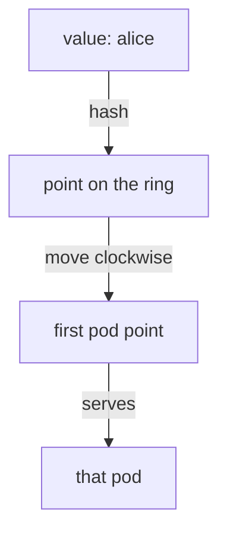

# Pin Requests To A Pod With `consistentHash`

The `simple` load balancing algorithms all spread requests over the pods of a Service. Some applications need the opposite. They keep each user's data in the memory of one pod, so a user whose requests jump between pods sees a broken session. This part shows how to make the sidecar proxy send the same user to the same pod every time, and where that promise ends.

Sending the same client to the same pod is called **session affinity**, or a **sticky session**. The **sidecar proxy** is the Envoy proxy container that Istio adds to each pod; the proxy of the pod that sends the request picks the pod that receives it. Istio's control plane, **`istiod`**, sends the proxy the list of pods to pick from.

## What you can hash

A **hash** is a number the proxy calculates from a value, such as the text `alice`. The same value always gives the same number. With `consistentHash`, the proxy calculates a hash from something in the request and uses it to pick the pod, so the same input always lands on the same pod.

`consistentHash` is the second form of `trafficPolicy.loadBalancer` in a `DestinationRule` (the Istio object that holds policies for traffic to one host). You use it **instead of** `simple`, never together with it. Inside it, you set exactly one of these fields:

| Field | Hashes | Good for |
| --- | --- | --- |
| `httpHeaderName` | a named request header | a gateway or client that already sends a stable user id |
| `httpCookie` | a cookie, with a `name` and an optional `ttl` | browser traffic, where Istio can **create** the cookie |
| `useSourceIp: true` | the client's IP address | the bluntest option; misleading when many users share one address |
| `httpQueryParameterName` | a named query parameter, such as `?user=alice` | APIs that carry the user id in the URL |

This part uses the header, because it is the easiest to test from a terminal. The same ring mechanism works for the other three fields.

## How a hash becomes a pod

"Consistent hashing" is a specific method. Knowing roughly how it works lets you predict what it does when pods come and go.

Envoy builds a **ring**: a fixed range of hash values, arranged in a circle. It places every pod at many points on the ring. To route a request, the proxy hashes the chosen value, finds that point on the ring, and moves clockwise to the first pod point it meets.



The diagram shows the three steps from a header value to the pod that serves the request.

Two facts follow from this. First, **nothing is stored.** The proxy does not remember that `alice` went to pod A; it calculates the same hash and reaches the same point every time. So stickiness survives a proxy restart and needs no shared session store.

Second, **each pod owns many small slices of the ring**, not one big slice. When a pod joins or leaves, only some users have to move. A simple "hash divided by the number of pods" would move almost everyone.

<!-- astrona:playground:renew -->

### Pin each user to one pod

First paste this helper into your terminal. The `count_pods` function sends 8 requests from the `shuttle` pod to the `probe` Service and counts which pod answered each one. The path `/hostname` returns the name of the pod that served the request. Any `curl` options you add are passed on:

```sh
count_pods() { for i in $(seq 1 8); do
  kubectl exec -n starfleet deploy/shuttle -- curl -s "$@" | grep -o '"probe-[^"]*"'
done | sort | uniq -c; }
HOSTNAME_URL=http://probe:8000/hostname
```

Now hash the `x-user` header. Save this as `destinationrule-probe.yaml`:

```yaml
apiVersion: networking.istio.io/v1
kind: DestinationRule
metadata:
  name: probe
  namespace: starfleet
spec:
  host: probe
  trafficPolicy:
    loadBalancer:
      consistentHash:
        httpHeaderName: x-user
```

Apply it:

```sh
kubectl apply -f destinationrule-probe.yaml
```

Then send 8 requests each as `alice`, `bob` and `carol`:

```sh
count_pods -H "x-user: alice" $HOSTNAME_URL
count_pods -H "x-user: bob" $HOSTNAME_URL
count_pods -H "x-user: carol" $HOSTNAME_URL
```

One run gave:

```text
   8 "probe-v2-58767cc46-9srsh"
   8 "probe-v2-58767cc46-9srsh"
   8 "probe-v1-7888d6c6d5-v2s9n"
```

Every user is pinned: 8 out of 8 requests reached the same pod each time. In this run, `alice` and `bob` landed on the **same** pod, and `carol` on another. With four pods, two names often share one. That is a **collision**, not a mistake in your configuration. Which pod each name gets depends on the hash, so yours may differ.

### See the ring in the proxy

Envoy stores the endpoints of one destination as a **cluster**, and it stores the algorithm as the cluster field `lbPolicy`. Envoy calls consistent hashing `RING_HASH`. Ask the `shuttle` pod's proxy:

```sh
istioctl proxy-config cluster deploy/shuttle -n starfleet --fqdn probe.starfleet.svc.cluster.local -o json \
  | grep -E '"lbPolicy"|"minimumRingSize"'
```

```text
        "lbPolicy": "RING_HASH",
            "minimumRingSize": "1024"
```

`minimumRingSize` is the number of points on the ring. With 1024 points shared by four pods, each pod owns hundreds of small slices.

## Stickiness is best effort

"Sticky sessions" sounds absolute, but it is not, and exam answers should say so. Envoy builds the ring from the pods that exist **right now**. When a pod joins or leaves, Envoy rebuilds the ring, and some users move to another pod.

### Watch some users move

Keep the header policy. The `who` helper below prints the pod that each of eight users lands on. Run it, write down the result, and then add a fourth `probe-v1` pod and look again:

```sh
who() { for u in alice bob carol dave erin frank grace heidi; do
  printf "%-6s %s\n" $u "$(kubectl exec -n starfleet deploy/shuttle -- curl -s -H "x-user: $u" $HOSTNAME_URL | grep -o 'probe-[^"]*')"
done; }
who
```

One run gave:

```text
alice  probe-v2-58767cc46-9srsh
bob    probe-v2-58767cc46-9srsh
carol  probe-v1-7888d6c6d5-v2s9n
dave   probe-v2-58767cc46-9srsh
erin   probe-v1-7888d6c6d5-6lfpq
frank  probe-v2-58767cc46-9srsh
grace  probe-v1-7888d6c6d5-57cqj
heidi  probe-v1-7888d6c6d5-v2s9n
```

Now scale the `probe-v1` Deployment from 3 to 4 pods:

```sh
kubectl scale deploy/probe-v1 -n starfleet --replicas=4
kubectl rollout status deploy/probe-v1 -n starfleet
```

Wait a few seconds, then run `who` again. In the same run:

```text
alice  probe-v1-7888d6c6d5-xl2p6
bob    probe-v2-58767cc46-9srsh
carol  probe-v1-7888d6c6d5-xl2p6
dave   probe-v2-58767cc46-9srsh
erin   probe-v1-7888d6c6d5-v2s9n
frank  probe-v2-58767cc46-9srsh
grace  probe-v1-7888d6c6d5-57cqj
heidi  probe-v1-7888d6c6d5-v2s9n
```

Five of the eight users stayed where they were. Three moved: `alice` and `carol` to the new pod (`xl2p6`), and `erin` from one old pod to another, because Envoy rebuilt the whole ring. Not every user moved, but some did.

Scale the Deployment back to 3 pods:

```sh
kubectl scale deploy/probe-v1 -n starfleet --replicas=3
```

So treat stickiness as a **speed-up, not a guarantee**. It makes in-memory caches work better. If an application breaks when a session moves to another pod, that application needs shared session storage, whatever the load balancer does.

## A request with nothing to hash

The next case is behind most "it works in testing but not in production" reports about stickiness. If a request does not carry the hashed value, the proxy has nothing to hash. It does not fail the request, and it does not pick a fixed backup pod. It **falls back to normal load balancing** for that request.

### Send requests without the header

The header policy is still in place. Send 8 requests without `x-user`:

```sh
count_pods $HOSTNAME_URL
```

One run gave:

```text
   1 "probe-v1-7888d6c6d5-57cqj"
   2 "probe-v1-7888d6c6d5-6lfpq"
   2 "probe-v1-7888d6c6d5-v2s9n"
   3 "probe-v2-58767cc46-9srsh"
```

The policy is the same, but the requests differ, so the result is completely different. A policy that hashes a header the client only sometimes sends gives stickiness that only sometimes works, with no error anywhere.

You now know that `consistentHash` pins a value to a pod through a ring that stores nothing, that a change in the pod list moves some users, and that a request without the value is spread as usual. The open question is what to hash when the client is a browser that sends no special header.

## Common pitfalls

> [!WARNING]
> - **Setting `simple` and `consistentHash` together.** You can only use one. Istio rejects the object.
> - **Treating stickiness as a guarantee.** When pods join or leave, some users move. An application that breaks when a session moves needs shared session storage.
> - **Hashing a value the client does not always send.** Requests without it fall back to normal load balancing, silently, one request at a time.
> - **Reading a collision as a bug.** With a few pods, two values landing on the same pod is normal. Try a third value before you change anything.
> - **Testing stickiness against one pod.** Every request lands on the same pod whether your policy works or not. Use several.
