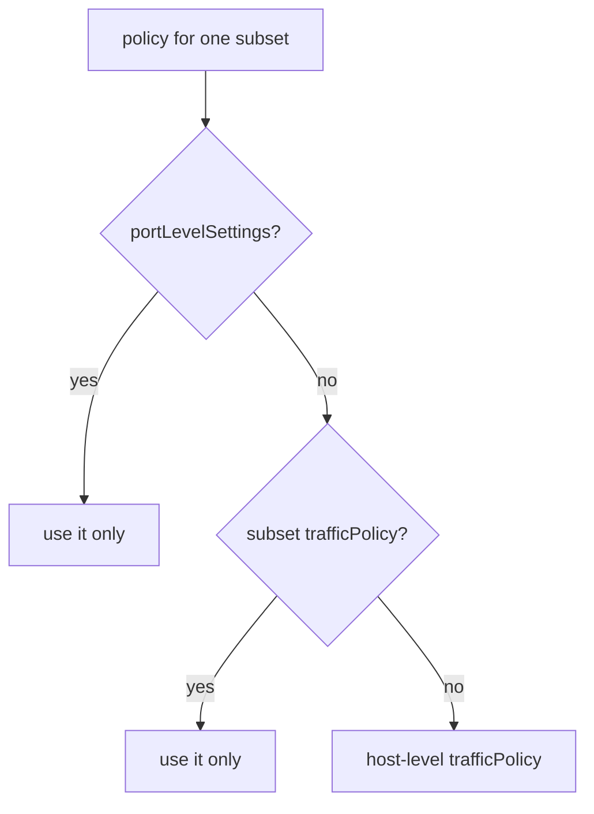

# Policy Levels And Verification

Astronaut, one `DestinationRule` can hold a `trafficPolicy` in three places. The rule for which one applies is easy to say. It is also easy to get wrong in a way that silently drops settings. This part covers that rule, how to check it on the proxy, and the module's combined pitfalls.

## Three levels, the most specific wins

Think of the `DestinationRule` as docking instructions for one beacon. There are general instructions for every ship that answers the beacon, there can be special instructions for one ship class (a subset), and there can be special instructions for one radio channel (a port). The most specific instructions win.

```yaml
spec:
  host: httpbin
  trafficPolicy:                    # 1. HOST level: every subset, every port
    loadBalancer:
      simple: RANDOM
  subsets:
  - name: v1
    labels:
      version: v1
    trafficPolicy:                  # 2. SUBSET level: this subset only
      loadBalancer:
        consistentHash:
          httpHeaderName: x-user
  - name: v2
    labels:
      version: v2
  # 3. PORT level lives under portLevelSettings, at host or subset level
```



Every "use it only" box means exactly that: nothing else is merged in. That is the part to remember.

The order is what you would expect: port beats subset, and subset beats host. But the way they combine is not:

> A more specific `trafficPolicy` **replaces** the less specific one for the scope it covers. It does not merge field by field.

So in the example above, subset `v1` gets sticky-by-header and **nothing else** from the host. Subset `v2` has no policy of its own, so it gets the host's `RANDOM`. If the host-level policy also set `connectionPool` or `outlierDetection`, subset `v1` would not get them. Its own policy is the complete policy for that subset.

This is the most common way to lose a setting you thought was applied. The sign is that a host-level circuit breaker or outlier detection "stops working" for exactly one subset: the one that has its own `trafficPolicy` for some unrelated reason.

The safe habit: when you add a subset-level `trafficPolicy`, write out **everything** that subset needs, not just the field you are changing.

<!-- astrona:playground:renew -->

> [!TIP]
> **Try it — a different load balancer for one subset**
>
> Write the DestinationRule above and a `VirtualService` that sends all httpbin traffic to subset `v1`, then apply both.
>
> Save this as `destinationrule-httpbin.yaml`:
>
> ```yaml
> apiVersion: networking.istio.io/v1
> kind: DestinationRule
> metadata:
>   name: httpbin
>   namespace: bookinfo
> spec:
>   host: httpbin
>   trafficPolicy:
>     loadBalancer:
>       simple: RANDOM
>   subsets:
>   - name: v1
>     labels:
>       version: v1
>     trafficPolicy:
>       loadBalancer:
>         consistentHash:
>           httpHeaderName: x-user
>   - name: v2
>     labels:
>       version: v2
> ```
>
> Save this as `virtualservice-httpbin.yaml`:
>
> ```yaml
> apiVersion: networking.istio.io/v1
> kind: VirtualService
> metadata:
>   name: httpbin
>   namespace: bookinfo
> spec:
>   hosts:
>   - httpbin
>   http:
>   - route:
>     - destination:
>         host: httpbin
>         subset: v1
> ```
>
> Apply it:
>
> ```sh
> kubectl apply -f destinationrule-httpbin.yaml
> kubectl apply -f virtualservice-httpbin.yaml
> ```
>
> Then check the result:
>
> ```sh
> count_pods -H "x-user: alice" $HOSTNAME_URL
> count_pods $HOSTNAME_URL
> ```
>
> Expect 8 × one v1 pod for `alice`, because subset `v1` is sticky. Without the header, expect the answers spread over the three v1 pods only. The `VirtualService` sends everything to `v1`, so v1's own policy applies and the v2 pod never answers.

## Port-level settings

`portLevelSettings` takes a list. Each entry names a port and carries its own policy:

```yaml
trafficPolicy:
  portLevelSettings:
  - port:
      number: 8000
    loadBalancer:
      simple: LEAST_REQUEST
```

It matters most for a Service with several ports that behave differently, such as a fast API on one port and large file transfers on another. It is also the shape section 070 uses for TLS origination, where `tls` settings must apply to port 443 and must not apply to port 80.

## Reading the policy from the proxy

Envoy calls the algorithm `lbPolicy`, and it stores it on each **cluster** (Envoy's name for one destination, here one subset of httpbin). Consistent hashing shows up as `RING_HASH`, with the ring settings beside it. As always, checking the proxy separates two problems: "my object is wrong" and "my object never arrived". In space terms: were the orders bad, or did mission control's message never reach the ship?

> [!TIP]
> **Try it — the policy the calling proxy is really using**
>
> ```sh
> istioctl proxy-config cluster deploy/curl -n bookinfo \
>   --fqdn httpbin.bookinfo.svc.cluster.local -o json | grep -E 'lbPolicy|ringHash|minimumRingSize|maglev' -A3
> ```
>
> Expect something like (trimmed):
>
> ```text
> "lbPolicy": "RING_HASH",
> "ringHashLbConfig": {
>   "minimumRingSize": "1024"
> },
> ```
>
> `RING_HASH` is how Envoy does `consistentHash`, and `minimumRingSize` is how many markers the ring holds. With `simple: RANDOM` you would see `RANDOM` here and no ring settings. If this still shows the old value, the new settings have not reached the proxy yet, and editing the YAML again will not help.

`lbPolicy` is reported **per cluster**, so a host with subsets has one entry per subset. That is the fastest way to confirm a subset-level override worked. With the DestinationRule from the first "Try it", you should see two different `lbPolicy` values for the same host: `RING_HASH` for the v1 cluster and `RANDOM` for the others.

When you are done, remove the `VirtualService` so later experiments reach both versions again: `kubectl delete vs httpbin -n bookinfo`.

## Choosing between the two forms

Exam questions tend to describe a need instead of naming a field. This short guide maps one to the other:

| The task says | Use |
| --- | --- |
| "spread evenly", "balance load" | `simple: ROUND_ROBIN` |
| "requests have very different costs", "avoid overloading a busy pod" | `simple: LEAST_REQUEST` |
| "the same user must reach the same instance", "sticky sessions" | `consistentHash` on a header or cookie |
| "session state is held in memory" | `consistentHash`, **and** note that this is best effort, not a guarantee |
| "do not load balance", "connect to the original address" | `simple: PASSTHROUGH` |

## Exam cheat sheet

```yaml
apiVersion: networking.istio.io/v1
kind: DestinationRule
metadata: {name: httpbin, namespace: bookinfo}
spec:
  host: httpbin
  trafficPolicy:
    loadBalancer:
      simple: ROUND_ROBIN            # or LEAST_REQUEST (default), RANDOM, PASSTHROUGH
      # consistentHash:              # instead of simple, not together
      #   httpHeaderName: x-user
      #   httpCookie: {name: session, ttl: 3600s}
      #   useSourceIp: true
      #   httpQueryParameterName: user
  subsets:
  - name: v1
    labels: {version: v1}
    trafficPolicy:                   # optional per-subset override (replaces, never merges)
      loadBalancer: {simple: RANDOM}
```

- `simple` **or** `consistentHash`, never both.
- In the docs: istio.io → reference → DestinationRule → **LoadBalancerSettings**.

## Common pitfalls

> [!WARNING]
> **Expecting perfect stickiness.** Changing the set of pods moves about `1/N` of sessions, by design. Stickiness is best effort. Say so if asked.
>
> **Hashing a header the client does not always send.** Requests without it fall back to normal load balancing, so stickiness silently applies to only some traffic.
>
> **Setting `simple` and `consistentHash` together.** You can only use one; the object is rejected.
>
> **Testing stickiness against one pod.** Every request lands on the same pod whether or not your policy works. Use several pods.
>
> **Assuming a subset `trafficPolicy` merges with the host one.** It replaces it for that subset. Write out everything the subset needs.
>
> **Using `useSourceIp` behind a shared address.** Everyone behind the same NAT or gateway hashes the same and lands on one pod.
>
> **Setting `httpCookie` without `ttl` and expecting Istio to create the cookie.** Without `ttl`, it only hashes a cookie the client already sends.
>
> **Judging stickiness only from the app's answers.** The calling proxy's access log records the chosen pod, which is the clearest evidence.

> *A more specific `trafficPolicy` replaces the less specific one for its scope. It never merges, so a subset policy must include everything that subset needs.*
