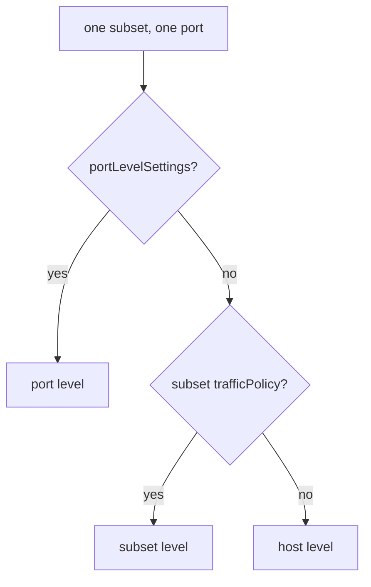

# Policy Levels And Verification

Astronaut, one `DestinationRule` can hold a `trafficPolicy` in three places: for the whole beacon, for one ship class, and for one radio channel (port). This part shows which one applies, exactly which settings a ship class inherits, and how to prove it on the proxy. The rule is short, but it is easy to lose a setting without noticing.

The commands below need the `count_pods` helper pasted into your terminal.

## Three levels, the most specific wins

Think of the `DestinationRule` as docking instructions for one beacon. There are general instructions for every ship that answers the beacon, there can be special instructions for one ship class (a subset), and there can be special instructions for one port. The most specific instructions win.

This piece of a `DestinationRule` shows the three places (you do not apply it):

```yaml
spec:
  host: probe
  trafficPolicy:                    # 1. HOST level: every subset, every port
    loadBalancer:
      simple: RANDOM
  subsets:
  - name: v1
    labels:
      version: v1
    trafficPolicy:                  # 2. SUBSET level: this subset only
      loadBalancer:
        consistentHash:
          httpHeaderName: x-user
  # 3. PORT level lives under portLevelSettings
```



Port beats subset, and subset beats host. The next section shows exactly what "beats" means, because it is not the same as "replaces everything".

<!-- astrona:playground:renew -->

### A different load balancer for one ship class

Give the beacon `RANDOM`, but make subset `v1` sticky by header. Save this as `destinationrule-probe.yaml`:

```yaml
apiVersion: networking.istio.io/v1
kind: DestinationRule
metadata:
  name: probe
  namespace: starfleet
spec:
  host: probe
  trafficPolicy:
    loadBalancer:
      simple: RANDOM
  subsets:
  - name: v1
    labels:
      version: v1
    trafficPolicy:
      loadBalancer:
        consistentHash:
          httpHeaderName: x-user
  - name: v2
    labels:
      version: v2
```

Apply it:

```sh
kubectl apply -f destinationrule-probe.yaml
```

A subset only matters when a route uses it. Send every probe signal to `v1`. Save this as `virtualservice-probe.yaml`:

```yaml
apiVersion: networking.istio.io/v1
kind: VirtualService
metadata:
  name: probe
  namespace: starfleet
spec:
  hosts:
  - probe
  http:
  - route:
    - destination:
        host: probe
        subset: v1
```

Apply it:

```sh
kubectl apply -f virtualservice-probe.yaml
```

Then send 8 signals as `alice`, and 8 without the header:

```sh
count_pods -H "x-user: alice" $HOSTNAME_URL
count_pods $HOSTNAME_URL
```

One run gave:

```text
   8 "probe-v1-7888d6c6d5-57cqj"
   3 "probe-v1-7888d6c6d5-57cqj"
   4 "probe-v1-7888d6c6d5-6lfpq"
   1 "probe-v1-7888d6c6d5-v2s9n"
```

`alice` is pinned to one v1 ship, because subset `v1` is sticky. Without the header, the signals spread over the three v1 ships only. The v2 ship never answers, because the flight plan sends everything to `v1`.

### Read the policy per cluster

The proxy stores one cluster per subset, and each has its own `lbPolicy`. Print the cluster names and their policies:

```sh
istioctl proxy-config cluster deploy/shuttle -n starfleet --fqdn probe.starfleet.svc.cluster.local -o json \
  | grep -E '"name": "outbound|"lbPolicy"'
```

```text
        "name": "outbound|8000||probe.starfleet.svc.cluster.local",
        "lbPolicy": "RANDOM",
        "name": "outbound|8000|v1|probe.starfleet.svc.cluster.local",
        "lbPolicy": "RING_HASH",
        "name": "outbound|8000|v2|probe.starfleet.svc.cluster.local",
        "lbPolicy": "RANDOM",
```

The v1 cluster uses `RING_HASH` (consistent hashing). The whole-beacon cluster and the v2 cluster use the host's `RANDOM`. This is the fastest way to prove a subset policy arrived.

## What a ship class inherits

Here is the exact rule, as Istio 1.30.5 applies it. A `trafficPolicy` has a few top-level fields: `loadBalancer`, `connectionPool`, `outlierDetection`, `tls` and `portLevelSettings`.

- **A field the subset does not set is inherited from the host.**
- **A field the subset does set replaces the host's whole field.** Nothing inside it is merged.

### Prove the inheritance

Add a connection limit at host level, and keep the subset's own `loadBalancer`. Save this as `destinationrule-probe-limits.yaml`:

```yaml
apiVersion: networking.istio.io/v1
kind: DestinationRule
metadata:
  name: probe
  namespace: starfleet
spec:
  host: probe
  trafficPolicy:
    loadBalancer:
      simple: RANDOM
    connectionPool:
      tcp:
        maxConnections: 7
  subsets:
  - name: v1
    labels:
      version: v1
    trafficPolicy:
      loadBalancer:
        consistentHash:
          httpHeaderName: x-user
  - name: v2
    labels:
      version: v2
```

Apply it:

```sh
kubectl apply -f destinationrule-probe-limits.yaml
```

Then print each cluster's policy and connection limit:

```sh
istioctl proxy-config cluster deploy/shuttle -n starfleet --fqdn probe.starfleet.svc.cluster.local -o json \
  | grep -E '"name": "outbound|"lbPolicy"|"maxConnections"'
```

```text
        "name": "outbound|8000||probe.starfleet.svc.cluster.local",
        "lbPolicy": "RANDOM",
                    "maxConnections": 7,
        "name": "outbound|8000|v1|probe.starfleet.svc.cluster.local",
        "lbPolicy": "RING_HASH",
                    "maxConnections": 7,
        "name": "outbound|8000|v2|probe.starfleet.svc.cluster.local",
        "lbPolicy": "RANDOM",
                    "maxConnections": 7,
```

The v1 cluster kept its own `RING_HASH`, **and** inherited `maxConnections: 7`, because its subset policy does not set `connectionPool` at all.

### Prove a field is replaced as a whole

Now give the subset its own `connectionPool`, but only the `http` half of it. Save this as `destinationrule-probe-limits.yaml`, replacing the old file:

```yaml
apiVersion: networking.istio.io/v1
kind: DestinationRule
metadata:
  name: probe
  namespace: starfleet
spec:
  host: probe
  trafficPolicy:
    connectionPool:
      tcp:
        maxConnections: 7
      http:
        http1MaxPendingRequests: 3
  subsets:
  - name: v1
    labels:
      version: v1
    trafficPolicy:
      connectionPool:
        http:
          http1MaxPendingRequests: 50
  - name: v2
    labels:
      version: v2
```

Apply it:

```sh
kubectl apply -f destinationrule-probe-limits.yaml
```

Then print the two limits per cluster:

```sh
istioctl proxy-config cluster deploy/shuttle -n starfleet --fqdn probe.starfleet.svc.cluster.local -o json \
  | grep -E '"name": "outbound|"maxConnections"|"maxPendingRequests"'
```

```text
        "name": "outbound|8000||probe.starfleet.svc.cluster.local",
                    "maxConnections": 7,
                    "maxPendingRequests": 3,
        "name": "outbound|8000|v1|probe.starfleet.svc.cluster.local",
                    "maxConnections": 4294967295,
                    "maxPendingRequests": 50,
        "name": "outbound|8000|v2|probe.starfleet.svc.cluster.local",
                    "maxConnections": 7,
                    "maxPendingRequests": 3,
```

The v1 cluster got its own `50`, but it **lost** the host's `maxConnections: 7`. The number `4294967295` is Envoy's "no limit". The subset set `connectionPool`, so its `connectionPool` replaced the host's completely, including the `tcp` half it never mentioned.

> [!TIP]
> When a subset sets a field that the host also sets, copy every part of that field into the subset, not only the part you are changing. Then check the cluster dump.

## Port-level settings

`portLevelSettings` takes a list. Each entry names a port and carries its own policy. It matters most for a Service with several ports that behave differently, such as a fast API on one port and large file transfers on another.

### A policy for one port

Save this as `destinationrule-probe-port.yaml`:

```yaml
apiVersion: networking.istio.io/v1
kind: DestinationRule
metadata:
  name: probe
  namespace: starfleet
spec:
  host: probe
  trafficPolicy:
    loadBalancer:
      simple: RANDOM
    portLevelSettings:
    - port:
        number: 8000
      loadBalancer:
        simple: LEAST_REQUEST
```

Apply it:

```sh
kubectl apply -f destinationrule-probe-port.yaml
```

Then read the policy for the probe's port:

```sh
istioctl proxy-config cluster deploy/shuttle -n starfleet --fqdn probe.starfleet.svc.cluster.local -o json \
  | grep -E '"name": "outbound|"lbPolicy"'
```

```text
        "name": "outbound|8000||probe.starfleet.svc.cluster.local",
        "lbPolicy": "LEAST_REQUEST",
```

Port `8000` uses `LEAST_REQUEST`, although the host level says `RANDOM`. The port-level setting is the most specific, so it wins.

### Clean up

Remove the flight plan and the docking instructions, so the probe is back to the default:

```sh
kubectl delete virtualservice probe -n starfleet
kubectl delete destinationrule probe -n starfleet
```

## Choosing the right form

Exam questions often describe a need instead of naming a field:

| The task says | Use |
| --- | --- |
| "spread evenly", "balance load" | `simple: ROUND_ROBIN` |
| "requests have very different costs", "avoid overloading a busy pod" | `simple: LEAST_REQUEST` |
| "the same user must reach the same instance", "sticky sessions" | `consistentHash` on a header or cookie |
| "session state is held in memory" | `consistentHash`, and say that it is best effort, not a guarantee |
| "do not load balance", "connect to the original address" | `simple: PASSTHROUGH` |

## Common pitfalls

> [!WARNING]
> - **Thinking a subset policy replaces the whole host policy.** Fields the subset does not set are inherited from the host.
> - **Thinking a subset field merges with the host's.** A field the subset sets replaces the host's whole field. Setting only `connectionPool.http` loses the host's `connectionPool.tcp`.
> - **Testing a subset policy without a route to the subset.** Nothing uses a subset until a flight plan sends signals to it.
> - **Checking only the YAML.** The cluster dump shows the policy each subset really got.

> *Port beats subset, and subset beats host. A subset inherits every field it leaves out, and replaces every field it sets, as a whole.*

## Your mission: Load Balancer Policy And Session Affinity

You can now set a load balancer per ship class and prove which policy each one really got. Now prove it in a graded mission: keep one ship class sticky by header while a second class is spread evenly.

The mission runs in its own training solar system, so first pause your playground. Nothing in it is lost:

```sh
astrona stop ats-014-playground-030-01
```

Then start the mission:

```sh
astrona run --git git@github.com:astrona-io/ATS014.git -c sections/section-030/module-01/labs/lab-01
```

Read the task in [`question.md`](./labs/lab-01/question.md) and solve it on your own first. When you think you are done, send it for grading:

```sh
astrona submit -c sections/section-030/module-01/labs/lab-01
```

When the mission is done, remove it and wake your playground up again:

```sh
astrona destroy ats-014-lab-030-01
astrona start ats-014-playground-030-01
```


## Your mission: Session Affinity For Browsers

You can now make Istio hand out a sticky cookie, and put a policy on one port. Now prove it in a graded mission: browsers with no call sign of their own must each be kept on one ship.

The mission runs in its own training solar system, so first pause your playground. Nothing in it is lost:

```sh
astrona stop ats-014-playground-030-01
```

Then start the mission:

```sh
astrona run --git git@github.com:astrona-io/ATS014.git -c sections/section-030/module-01/labs/lab-02
```

Read the task in [`question.md`](./labs/lab-02/question.md) and solve it on your own first. When you think you are done, send it for grading:

```sh
astrona submit -c sections/section-030/module-01/labs/lab-02
```

When the mission is done, remove it and wake your playground up again:

```sh
astrona destroy ats-014-lab-030-02
astrona start ats-014-playground-030-01
```
