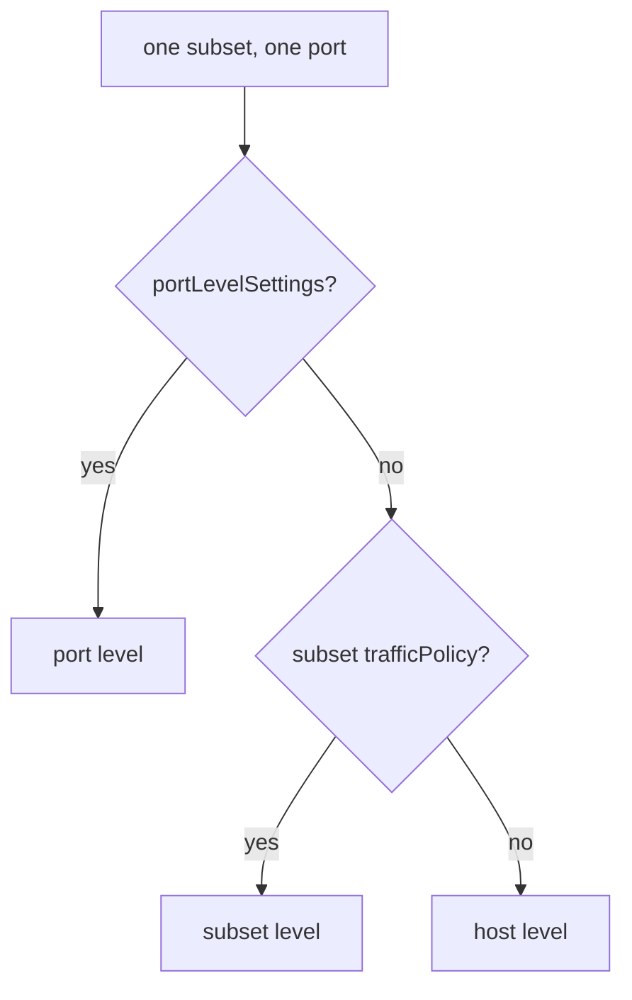

# Set A Load Balancer Per Subset

One `DestinationRule` often serves several versions of an application, and the versions do not always need the same load balancer. A version that keeps user data in memory needs sticky sessions, while a stateless version should simply spread its load. This part shows how to give one subset its own policy, exactly which settings that subset still takes from the host, and how to prove the result on the proxy.

A `DestinationRule` is the Istio object that holds policies for traffic to one host. A **subset** is a named group of the host's pods, chosen by pod labels inside the `DestinationRule`. A `VirtualService` is the Istio object that holds routing rules; it decides which subset a request goes to. The **sidecar proxy** (the Envoy proxy that Istio adds to each pod) of the sending pod applies all of these.

## Three levels, the most specific wins

One `DestinationRule` can hold a `trafficPolicy` in three places: for the whole host, for one subset, and for one port. The proxy uses the most specific one that exists. This piece of a `DestinationRule` shows the three places (you do not apply it):

```yaml
spec:
  host: probe
  trafficPolicy:                    # 1. HOST level: every subset, every port
    loadBalancer:
      simple: RANDOM
  subsets:
  - name: v1
    labels:
      version: v1
    trafficPolicy:                  # 2. SUBSET level: this subset only
      loadBalancer:
        consistentHash:
          httpHeaderName: x-user
  # 3. PORT level lives under portLevelSettings
```



The diagram shows the order in which the proxy looks for a policy for one subset and one port.

Port beats subset, and subset beats host. "Beats" does not mean "replaces everything", though. The exact rule comes later in this part, after you have seen a subset policy work.

<!-- astrona:playground:renew -->

### A different load balancer for one subset

First paste this helper into your terminal. The `count_pods` function sends 8 requests from the `shuttle` pod to the `probe` Service and counts which pod answered each one. The path `/hostname` returns the name of the pod that served the request. Any `curl` options you add are passed on:

```sh
count_pods() { for i in $(seq 1 8); do
  kubectl exec -n starfleet deploy/shuttle -- curl -s "$@" | grep -o '"probe-[^"]*"'
done | sort | uniq -c; }
HOSTNAME_URL=http://probe:8000/hostname
```

Give the host `RANDOM`, but make subset `v1` sticky by the `x-user` header with `consistentHash` (the form of `loadBalancer` that picks a pod from a hash of a request value). Save this as `destinationrule-probe.yaml`:

```yaml
apiVersion: networking.istio.io/v1
kind: DestinationRule
metadata:
  name: probe
  namespace: starfleet
spec:
  host: probe
  trafficPolicy:
    loadBalancer:
      simple: RANDOM
  subsets:
  - name: v1
    labels:
      version: v1
    trafficPolicy:
      loadBalancer:
        consistentHash:
          httpHeaderName: x-user
  - name: v2
    labels:
      version: v2
```

Apply it:

```sh
kubectl apply -f destinationrule-probe.yaml
```

A subset only matters when a route sends requests to it. Send every request for `probe` to subset `v1`. Save this as `virtualservice-probe.yaml`:

```yaml
apiVersion: networking.istio.io/v1
kind: VirtualService
metadata:
  name: probe
  namespace: starfleet
spec:
  hosts:
  - probe
  http:
  - route:
    - destination:
        host: probe
        subset: v1
```

Apply it:

```sh
kubectl apply -f virtualservice-probe.yaml
```

Then send 8 requests as `alice`, and 8 without the header:

```sh
count_pods -H "x-user: alice" $HOSTNAME_URL
count_pods $HOSTNAME_URL
```

One run gave:

```text
   8 "probe-v1-7888d6c6d5-57cqj"
   3 "probe-v1-7888d6c6d5-57cqj"
   4 "probe-v1-7888d6c6d5-6lfpq"
   1 "probe-v1-7888d6c6d5-v2s9n"
```

The proxy pins `alice` to one `v1` pod, because subset `v1` is sticky. Without the header, the requests spread over the three `v1` pods only. The `v2` pod never answers, because the `VirtualService` sends everything to `v1`.

### Read the policy per cluster

Envoy stores the endpoints of one destination as a **cluster**. The proxy holds one cluster for the whole host and one for each subset, and each cluster has its own `lbPolicy` field. Print the cluster names and their policies:

```sh
istioctl proxy-config cluster deploy/shuttle -n starfleet --fqdn probe.starfleet.svc.cluster.local -o json \
  | grep -E '"name": "outbound|"lbPolicy"'
```

```text
        "name": "outbound|8000||probe.starfleet.svc.cluster.local",
        "lbPolicy": "RANDOM",
        "name": "outbound|8000|v1|probe.starfleet.svc.cluster.local",
        "lbPolicy": "RING_HASH",
        "name": "outbound|8000|v2|probe.starfleet.svc.cluster.local",
        "lbPolicy": "RANDOM",
```

The `v1` cluster uses `RING_HASH`, Envoy's name for consistent hashing. The host cluster and the `v2` cluster use the host's `RANDOM`. Reading this dump is the fastest way to prove that a subset policy reached the proxy.

## What a subset inherits

The subset policy changed the load balancer, but a `trafficPolicy` holds more than that. Its top-level fields are `loadBalancer`, `connectionPool` (limits on connections and pending requests), `outlierDetection`, `tls` and `portLevelSettings`. Istio 1.30.5 combines the host and subset policies with two rules:

- **A field the subset does not set is inherited from the host.**
- **A field the subset does set replaces the host's whole field.** Nothing inside it is merged.

### Prove the inheritance

Add a connection limit at host level, and keep the subset's own `loadBalancer`. Save this as `destinationrule-probe-limits.yaml`:

```yaml
apiVersion: networking.istio.io/v1
kind: DestinationRule
metadata:
  name: probe
  namespace: starfleet
spec:
  host: probe
  trafficPolicy:
    loadBalancer:
      simple: RANDOM
    connectionPool:
      tcp:
        maxConnections: 7
  subsets:
  - name: v1
    labels:
      version: v1
    trafficPolicy:
      loadBalancer:
        consistentHash:
          httpHeaderName: x-user
  - name: v2
    labels:
      version: v2
```

Apply it:

```sh
kubectl apply -f destinationrule-probe-limits.yaml
```

Then print each cluster's policy and connection limit:

```sh
istioctl proxy-config cluster deploy/shuttle -n starfleet --fqdn probe.starfleet.svc.cluster.local -o json \
  | grep -E '"name": "outbound|"lbPolicy"|"maxConnections"'
```

```text
        "name": "outbound|8000||probe.starfleet.svc.cluster.local",
        "lbPolicy": "RANDOM",
                    "maxConnections": 7,
        "name": "outbound|8000|v1|probe.starfleet.svc.cluster.local",
        "lbPolicy": "RING_HASH",
                    "maxConnections": 7,
        "name": "outbound|8000|v2|probe.starfleet.svc.cluster.local",
        "lbPolicy": "RANDOM",
                    "maxConnections": 7,
```

The `v1` cluster kept its own `RING_HASH`, **and** inherited `maxConnections: 7`, because its subset policy does not set `connectionPool` at all.

### Prove a field is replaced as a whole

Now give the subset its own `connectionPool`, but only the `http` half of it. Save this as `destinationrule-probe-limits.yaml`, replacing the old file:

```yaml
apiVersion: networking.istio.io/v1
kind: DestinationRule
metadata:
  name: probe
  namespace: starfleet
spec:
  host: probe
  trafficPolicy:
    connectionPool:
      tcp:
        maxConnections: 7
      http:
        http1MaxPendingRequests: 3
  subsets:
  - name: v1
    labels:
      version: v1
    trafficPolicy:
      connectionPool:
        http:
          http1MaxPendingRequests: 50
  - name: v2
    labels:
      version: v2
```

Apply it:

```sh
kubectl apply -f destinationrule-probe-limits.yaml
```

Then print the two limits per cluster:

```sh
istioctl proxy-config cluster deploy/shuttle -n starfleet --fqdn probe.starfleet.svc.cluster.local -o json \
  | grep -E '"name": "outbound|"maxConnections"|"maxPendingRequests"'
```

```text
        "name": "outbound|8000||probe.starfleet.svc.cluster.local",
                    "maxConnections": 7,
                    "maxPendingRequests": 3,
        "name": "outbound|8000|v1|probe.starfleet.svc.cluster.local",
                    "maxConnections": 4294967295,
                    "maxPendingRequests": 50,
        "name": "outbound|8000|v2|probe.starfleet.svc.cluster.local",
                    "maxConnections": 7,
                    "maxPendingRequests": 3,
```

The `v1` cluster got its own `50`, but it **lost** the host's `maxConnections: 7`. The number `4294967295` is Envoy's value for "no limit". The subset set `connectionPool`, so its `connectionPool` replaced the host's completely, including the `tcp` half it never mentioned.

> [!TIP]
> When a subset sets a field that the host also sets, copy every part of that field into the subset, not only the part you are changing. Then check the cluster dump.

You now know how to give one subset its own load balancer, that a subset inherits every field it leaves out and replaces every field it sets as a whole, and how to prove both in the cluster dump. The open question is the third level: a policy for one port.

## Common pitfalls

> [!WARNING]
> - **Thinking a subset policy replaces the whole host policy.** Fields the subset does not set are inherited from the host.
> - **Thinking a subset field merges with the host's.** A field the subset sets replaces the host's whole field. Setting only `connectionPool.http` loses the host's `connectionPool.tcp`.
> - **Testing a subset policy without a route to the subset.** Nothing uses a subset until a `VirtualService` sends requests to it.
> - **Checking only the YAML.** The cluster dump shows the policy each subset really got.

## Your mission: Pin A Subset By Header And Override Another Subset Lab

You can now set a load balancer per subset and prove which policy each subset really got. The mission asks you to keep one subset sticky by header while a second subset spreads its requests evenly, and to route requests to each subset by header.

The lab runs on its own cluster, so first pause your playground. Nothing in it is lost:

```sh
astrona stop ats-014-playground-030-01
```

Then start the lab. The task is on the next page:

```sh
astrona run --git git@github.com:astrona-io/ATS014.git -c sections/section-030/module-01/labs/lab-01
```

Solve it on your own first. When you think you are done, send it for grading:

```sh
astrona submit -c sections/section-030/module-01/labs/lab-01
```

When you are finished, remove the lab and start your playground again:

```sh
astrona destroy ats-014-lab-030-01
astrona start ats-014-playground-030-01
```
