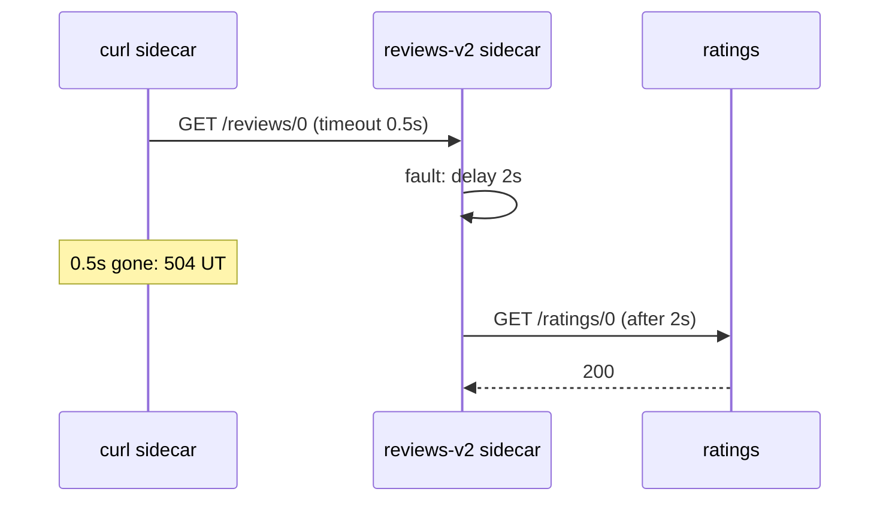
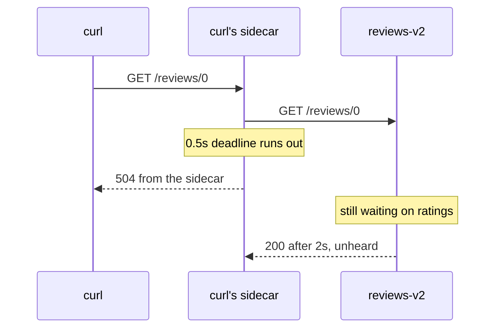

# The Route Timeout

> **Before you start:** define the helper functions from [the landing page](./course.md#before-you-start).

Astronaut, a timeout is your signal's abort window. It is one field. But there are three things to get exactly right about it: which proxy measures it, what the caller gets back, and what it does not do. This part settles all three, and shows you how to test a timeout properly, before retries make the picture harder.

## No timeout by default

Istio sets **no** HTTP timeout unless you write one. A request to a service that takes 3 seconds simply takes 3 seconds. A request that hangs keeps on hanging.

<!-- astrona:playground:renew -->

> [!TIP]
> **Try it — the caller waits as long as it takes**
>
> ```sh
> status_and_time http://httpbin:8000/delay/3
> ```
>
> Expect a `200` after about `3.0s`. Nothing stopped the slow request. In a real system, those 3 seconds are 3 seconds of an open connection and a busy request slot in *every* service between the user and this one.

## The field

`timeout` sits on a rule of a `VirtualService`, next to `route:`. Its value is a duration such as `500ms`, `0.5s`, `2s` or `1m`:

```yaml
http:
- route:
  - destination:
      host: httpbin
  timeout: 1s
```

Three facts about it, each with a consequence:

**The caller's proxy measures it.** Every pod in the mesh has a sidecar proxy beside it. Think of it as the ship's communications officer: every signal in or out goes through them. The timeout lives in the communications officer of the workload that **makes** the call, not on the server. So it protects the caller even when the server never answers at all: when it is stuck, unreachable, or has no pods.

**The caller gets HTTP 504.** When time runs out, the caller's sidecar cancels the request and answers `504 Gateway Timeout` by itself. The server never got to answer, and the 504 did not come from it.

**It covers the whole request.** Once retries exist, that means all tries together. That is Part 3's subject, so hold the thought.

A timeout belongs to a **rule**, not to the whole VirtualService. So one VirtualService can give different paths different limits. Here only the `/delay` rule has a 2-second limit, and the catch-all rule below it has none:

```yaml
http:
- match:
  - uri:
      prefix: /delay
  route:
  - destination:
      host: httpbin
  timeout: 2s
- route:
  - destination:
      host: httpbin
```

A typical use is a long limit for a slow report page and a short one for everything else.

## Reading the result in the access log

The status code tells you *that* a request failed. The access log tells you *who* failed it. Think of it as the ship's black box flight log: each sidecar writes one line per request, with short codes for anything that went wrong. These codes are called **response flags**.

The flag for a timeout is **`UT`**, short for "upstream timeout". "Upstream" is the word Envoy, the program inside the sidecar, uses for the service being called. A 504 with `UT` was made by the caller's own sidecar. A 504 without it came from somewhere else, which is worth knowing before you debug the wrong hop.

> [!TIP]
> **Try it — give up after 1 second**
>
> Save this as `virtualservice-httpbin-timeout.yaml`:
>
> ```yaml
> apiVersion: networking.istio.io/v1
> kind: VirtualService
> metadata:
>   name: httpbin
>   namespace: bookinfo
> spec:
>   hosts:
>   - httpbin
>   http:
>   - route:
>     - destination:
>         host: httpbin
>     timeout: 1s
> ```
>
> Apply it:
>
> ```sh
> kubectl apply -f virtualservice-httpbin-timeout.yaml
> ```
>
> Then check the result:
>
> ```sh
> status_and_time http://httpbin:8000/delay/3
> status_and_time http://httpbin:8000/delay/0
> kubectl logs -n bookinfo deploy/curl -c istio-proxy --tail=2
> ```
>
> Expect `504` after about `1.0s`, then `200` almost at once, and in the log (trimmed):
>
> ```text
> "GET /delay/3 HTTP/1.1" 504 UT response_timeout ...
> ```
>
> Slow requests are cut off at 1 second. Fast ones are not affected. The time shown is the *timeout*, not the delay, which is how you tell a fired deadline from a slow success. The same file is `examples/04-timeouts/01-virtualservice-httpbin-timeout.yaml` in the playground.

Response flags come up all through this section, so collect them as you go:

| Flag | Meaning | Where |
| --- | --- | --- |
| `UT` | upstream timeout: a deadline fired | this part |
| `DI` | delay injected: a fault added a delay | this part |
| `URX` | upstream retry limit exceeded: the retries are used up | Part 2 |
| `UO` | upstream overflow: a circuit breaker said no | module 2 |
| `UH` | no healthy upstream: every endpoint was removed or missing | module 3 |
| `UF` | upstream connection failure | general |

## Testing a timeout across two services

To test a timeout, you need a service that is slow on purpose. The usual way is **fault injection**: a mission simulation drill where Istio adds a fake delay, so you can see how the crew copes. It has its own module in section 050. Here it is only a tool.

The rule that makes this work: **the delay goes on the service being called, and the timeout goes on the caller.** In Bookinfo the calls go `curl → reviews v2 → ratings`. So you make `ratings` slow, and you give `reviews` the short limit.



Two sidecars each do one job. The `reviews-v2` sidecar adds the delay, because the delay sits on the route to `ratings` and `reviews` is the one calling `ratings`. The `curl` sidecar applies the timeout, because the timeout sits on the route to `reviews`.

> [!TIP]
> **Try it — make ratings slow**
>
> Save this as `destinationrule-ratings.yaml`:
>
> ```yaml
> apiVersion: networking.istio.io/v1
> kind: DestinationRule
> metadata:
>   name: ratings
>   namespace: bookinfo
> spec:
>   host: ratings
>   subsets:
>   - name: v1
>     labels:
>       version: v1
> ```
>
> Save this as `virtualservice-ratings-delay.yaml`:
>
> ```yaml
> apiVersion: networking.istio.io/v1
> kind: VirtualService
> metadata:
>   name: ratings
>   namespace: bookinfo
> spec:
>   hosts:
>   - ratings
>   http:
>   - fault:
>       delay:
>         percentage:
>           value: 100
>         fixedDelay: 2s
>     route:
>     - destination:
>         host: ratings
>         subset: v1
> ```
>
> Apply it:
>
> ```sh
> kubectl apply -f destinationrule-ratings.yaml -f virtualservice-ratings-delay.yaml
> ```
>
> Then check the result:
>
> ```sh
> status_and_time -H "end-user: jason" http://reviews:9080/reviews/0
> ```
>
> Expect a `200` after about `2.0s`. jason's request goes to `reviews` v2, and v2 waits 2 seconds for `ratings`.

Now add the limit on `reviews`. This VirtualService sends everyone to v2, with a half-second timeout.

> [!TIP]
> **Try it — reviews gives up after 0.5 seconds**
>
> Save this as `virtualservice-reviews-timeout.yaml`:
>
> ```yaml
> apiVersion: networking.istio.io/v1
> kind: VirtualService
> metadata:
>   name: reviews
>   namespace: bookinfo
> spec:
>   hosts:
>   - reviews
>   http:
>   - route:
>     - destination:
>         host: reviews
>         subset: v2
>     timeout: 0.5s
> ```
>
> Apply it:
>
> ```sh
> kubectl apply -f virtualservice-reviews-timeout.yaml
> ```
>
> Then check the result:
>
> ```sh
> status_and_time http://reviews:9080/reviews/0
> kubectl logs -n bookinfo deploy/reviews-v2 -c istio-proxy --tail=2 | grep ratings
> ```
>
> Expect `504` after about `0.5s`, and in the `reviews-v2` sidecar log (trimmed):
>
> ```text
> "GET /ratings/0 HTTP/1.1" 200 DI via_upstream ... 2001 ...
> ```
>
> `DI` means "delay injected". `2001` is the duration in milliseconds: `reviews` still waited the full 2 seconds. The timeout freed **curl**. It did not stop the work further down the chain.

If you set the timeout *longer* than the delay, for example `timeout: 3s`, the request succeeds after about 2 seconds. A timeout only fires when the request takes longer than the limit. In an exam, check both sides: "slow but fine" and "too slow, so 504".

## What a timeout does not do

That `2001` in the log is the first of three things a timeout does not do.



The deadline lives entirely on the left of that picture. Nothing about it reaches the server.

**It does not stop the server.** Giving up on a signal does not recall it. `reviews` keeps waiting on `ratings`, finishes its work, and tries to answer on a connection the sidecar already gave up on. A timeout limits *your waiting*, not the server's working. So a timeout does not reduce the load on a service that is overloaded. It just stops you queueing behind it.

**It is not a connection timeout.** `timeout` limits the whole HTTP exchange. Making the TCP connection is a separate setting, `connectionPool.tcp.connectTimeout` on a DestinationRule (module 2). A route timeout of `1s` means the whole thing, connecting included, must finish within one second.

**It is not a promise of speed.** A 504 at exactly the deadline is the normal case. If the proxy itself is overloaded, the answer may come later.

## The trap: delay and timeout on the same route

It is tempting to test a timeout with one VirtualService that has both the delay and the timeout. It does not work. The VirtualService reference says it: when a route has a `fault`, timeouts and retries are not switched on for that route.

> [!TIP]
> **Try it — the timeout that never fires**
>
> Save this as `virtualservice-ratings-delay-and-timeout.yaml`:
>
> ```yaml
> apiVersion: networking.istio.io/v1
> kind: VirtualService
> metadata:
>   name: ratings
>   namespace: bookinfo
> spec:
>   hosts:
>   - ratings
>   http:
>   - fault:
>       delay:
>         percentage:
>           value: 100
>         fixedDelay: 2s
>     route:
>     - destination:
>         host: ratings
>         subset: v1
>     timeout: 0.5s
> ```
>
> Apply it:
>
> ```sh
> kubectl apply -f virtualservice-ratings-delay-and-timeout.yaml
> ```
>
> Then check the result:
>
> ```sh
> status_and_time http://ratings:9080/ratings/0
> ```
>
> Expect a `200` after about `2.0s`, **not** a 504 after half a second. The route has a `fault`, so its own `timeout` is ignored. That is why the official Istio task uses two VirtualServices: the delay on `ratings` and the timeout on `reviews`.
>
> To go back, apply `virtualservice-ratings-delay.yaml` again (delay only).

## Common pitfalls

> [!WARNING]
> **Putting the delay and the timeout on the same route.** A route with `fault` ignores its own `timeout` and `retries`. Put the delay on the service being called and the timeout on the caller.
>
> **Expecting a timeout to reduce load on a struggling service.** It stops you waiting. The server finishes the work anyway.
>
> **Reading a 504 as coming from the server.** A timeout 504 is made by the caller's own sidecar. The `UT` flag tells them apart.
>
> **Confusing it with a connection timeout.** `timeout` limits the whole exchange, connecting included. `connectionPool.tcp.connectTimeout` is the separate connection setting.
>
> **Forgetting the app's own timeout.** An app can have its own limit that is shorter than Istio's, and the shorter one wins. Bookinfo's `productpage`, for example, has its own timeout and retry for calls to `reviews`, whatever Istio says.
>
> **Assuming there is a default.** There is no route timeout unless you write one.

> *A route timeout is measured by the caller's own sidecar and produces a 504 it makes itself. The server keeps working regardless.*
