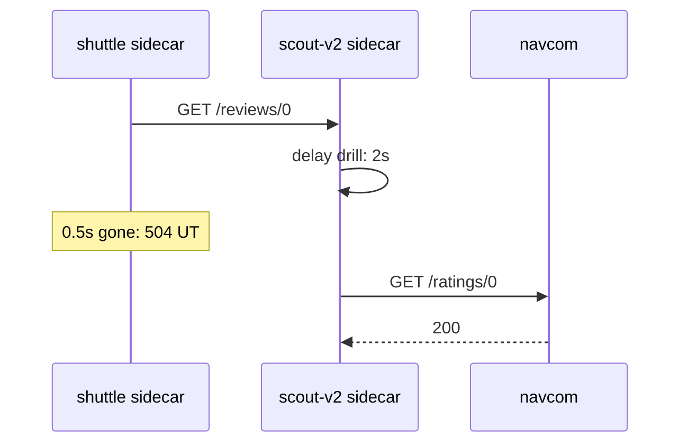
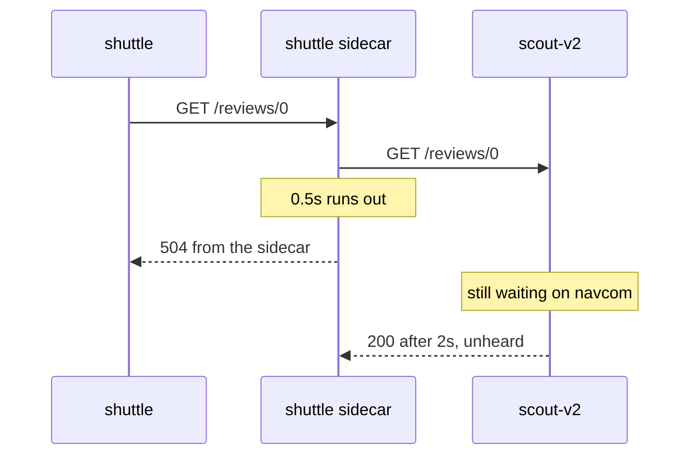

# Test A Timeout Across Two Ships

Astronaut, to test an abort window you need a ship that is slow on purpose. This part shows the right way to build that test across two ships, what a timeout does **not** do, and the trap that makes a correct-looking timeout never fire.

The commands below need the two helpers from the module's landing page pasted into your terminal. Your playground already has the scout subsets and the flight plan that sends `end-user: jason` to scout v2.

## Make one ship slow, time out the other

The usual way to make a ship slow on purpose is **fault injection**: a simulation drill where Istio adds a fake delay, so you can see how the crew copes. Here it is only a tool for testing the abort window.

One rule makes the test work: **the delay goes on the ship being called, and the abort window goes on the ship that calls it.** In your playground the signals go `shuttle → scout v2 → navcom`. So you make `navcom` slow, and you give the route to `scout` the short abort window.



Each sidecar does one job. The `scout-v2` sidecar adds the delay, because the delay sits on the route to `navcom`, and scout v2 is the ship calling navcom. The `shuttle` sidecar applies the abort window, because the timeout sits on the route to `scout`.

<!-- astrona:playground:renew -->

### Make navcom slow

First, docking instructions for navcom, with one ship class. Save this as `destinationrule-navcom.yaml`:

```yaml
apiVersion: networking.istio.io/v1
kind: DestinationRule
metadata:
  name: navcom
  namespace: starfleet
spec:
  host: navcom
  subsets:
  - name: v1
    labels:
      version: v1
```

Apply it:

```sh
kubectl apply -f destinationrule-navcom.yaml
```

Now the delay drill: every signal to navcom waits 2 seconds. Save this as `virtualservice-navcom-delay.yaml`:

```yaml
apiVersion: networking.istio.io/v1
kind: VirtualService
metadata:
  name: navcom
  namespace: starfleet
spec:
  hosts:
  - navcom
  http:
  - fault:
      delay:
        percentage:
          value: 100
        fixedDelay: 2s
    route:
    - destination:
        host: navcom
        subset: v1
```

Apply it:

```sh
kubectl apply -f virtualservice-navcom-delay.yaml
```

Then send one signal as jason, who flies to scout v2:

```sh
status_and_time -H "end-user: jason" http://scout:9080/reviews/0
```

You should see:

```text
200 2.440022s
```

jason's signal goes to scout v2, and scout v2 waits 2 seconds for navcom before it answers.

### Give scout a half-second abort window

Now the abort window on the route to scout. This flight plan sends every signal to scout v2, with a half-second timeout. Save this as `virtualservice-scout-timeout.yaml`:

```yaml
apiVersion: networking.istio.io/v1
kind: VirtualService
metadata:
  name: scout
  namespace: starfleet
spec:
  hosts:
  - scout
  http:
  - route:
    - destination:
        host: scout
        subset: v2
    timeout: 0.5s
```

Apply it:

```sh
kubectl apply -f virtualservice-scout-timeout.yaml
```

Then send one signal, and read scout v2's flight log for its call to navcom:

```sh
status_and_time http://scout:9080/reviews/0
kubectl logs -n starfleet deploy/scout-v2 -c istio-proxy --tail=4 | grep ratings
```

You should see (log line trimmed):

```text
504 0.509764s
"GET /ratings/0 HTTP/1.1" 200 DI via_upstream ... 2003 ... "navcom:9080" ...
```

The shuttle got a `504` after half a second. But scout v2's flight log shows its call to navcom finished with `200` after `2003` milliseconds. `DI` means "delay injected": the drill was there. scout v2 still waited the full 2 seconds.

If the abort window is *longer* than the delay, the signal succeeds. Change `timeout: 0.5s` to `timeout: 3s` in `virtualservice-scout-timeout.yaml`, apply it again, and send the same signal:

```text
200 2.060014s
```

A timeout only fires when the signal takes longer than the abort window. In the exam, check both sides: "slow but fine" and "too slow, so 504".

## What a timeout does not do

That `2003` in scout v2's log is the most important thing about a timeout:



The abort window lives entirely on the sender's side. Nothing about it reaches the receiver:

- **It does not stop the receiver.** Giving up on a signal does not recall it. scout v2 keeps waiting on navcom, finishes its work, and answers on a connection the shuttle's sidecar has already given up on. A timeout limits *your waiting*, not the receiver's work. So it does not take load off an overloaded ship. It only stops you queueing behind it.
- **It is not a connection timeout.** `timeout` limits the whole exchange, connecting included.
- **It is not a promise of speed.** A `504` at exactly the abort window is the normal case. If the sidecar itself is overloaded, the answer may come later.

## The trap: delay and timeout on the same rule

It is tempting to test a timeout with one flight plan that has both the delay and the timeout on the same rule. It does not work: when a rule has a `fault`, Istio does not apply that rule's `timeout` or `retries`.

### The abort window that never fires

Put a half-second timeout on navcom's own rule, next to the 2-second delay. Save this as `virtualservice-navcom-delay-and-timeout.yaml`:

```yaml
apiVersion: networking.istio.io/v1
kind: VirtualService
metadata:
  name: navcom
  namespace: starfleet
spec:
  hosts:
  - navcom
  http:
  - fault:
      delay:
        percentage:
          value: 100
        fixedDelay: 2s
    route:
    - destination:
        host: navcom
        subset: v1
    timeout: 0.5s
```

Apply it:

```sh
kubectl apply -f virtualservice-navcom-delay-and-timeout.yaml
```

Then send one signal straight to navcom:

```sh
status_and_time http://navcom:9080/ratings/0
```

You should see:

```text
200 2.008591s
```

A `200` after 2 seconds, **not** a `504` after half a second. The rule has a `fault`, so its own `timeout` is ignored. That is why the test uses two flight plans: the delay on navcom, the abort window on scout.

Put the delay-only flight plan back:

```sh
kubectl apply -f virtualservice-navcom-delay.yaml
```

## Common pitfalls

> [!WARNING]
> - **Putting the delay and the timeout on the same rule.** A rule with a `fault` ignores its own `timeout` and `retries`. Put the delay on the ship being called and the timeout on the caller.
> - **Expecting a timeout to take load off a struggling ship.** It stops you waiting. The receiver finishes the work anyway.
> - **Testing only the failure.** Also check that a timeout longer than the delay still succeeds.

> *Put the delay on the ship being called and the abort window on the caller. The abort window frees the sender, but the receiver keeps working.*

## Your mission: Free The Shuttle From A Slow Navcom

You can now test an abort window across two ships and spot a timeout that can never fire. Now prove it in a graded mission: someone put jason's abort window on the wrong rule, and you have to move it where it really fires.

The mission runs in its own training solar system, so first pause your playground. Nothing in it is lost:

```sh
astrona stop ats-014-playground-040-01
```

Then start the mission:

```sh
astrona run --git git@github.com:astrona-io/ATS014.git -c sections/section-040/module-01/labs/lab-02
```

Read the task in [`question.md`](./labs/lab-02/question.md) and solve it on your own first. When you think you are done, send it for grading:

```sh
astrona submit -c sections/section-040/module-01/labs/lab-02
```

When the mission is done, remove it and wake your playground up again:

```sh
astrona destroy ats-014-lab-040-01-02
astrona start ats-014-playground-040-01
```
