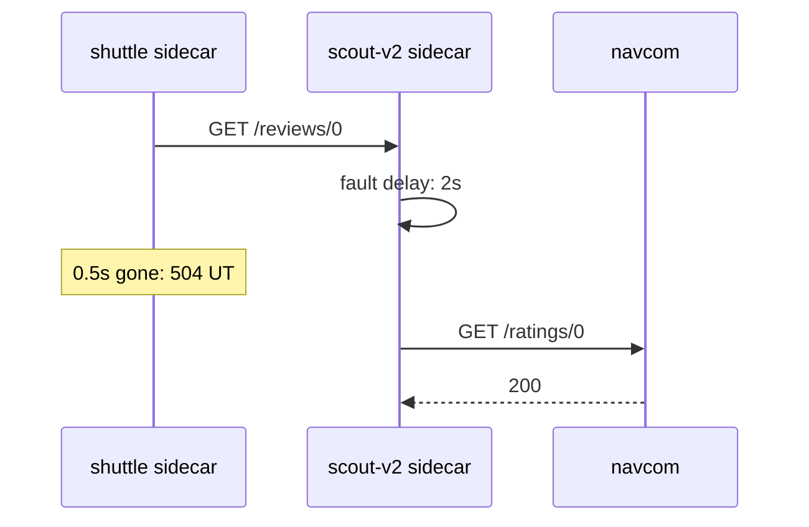
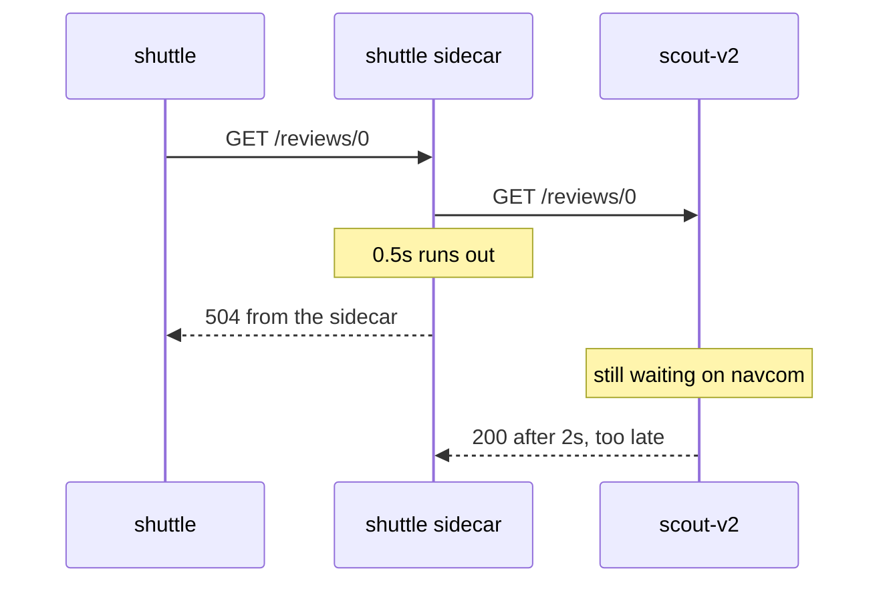

# Test A Timeout With A Delay Fault

A timeout only matters when a backend is slow, so to test one you need a backend that is slow on purpose. This part shows the right way to build that test across two services, what a timeout does **not** do, and the mistake that makes a correct-looking timeout never fire. The exam likes this mistake, because the configuration applies without any error.

## Make one service slow, time out the other

The usual way to make a service slow on purpose is **fault injection**: a `VirtualService` setting that makes the sidecar proxy add a delay or return an error, so you can test how callers react. A sidecar proxy is the Envoy container that Istio adds to each pod; all traffic in and out of the pod passes through it. Here fault injection is only a tool for testing the timeout.

One rule makes the test work: **the delay goes on the service being called, and the timeout goes on the route of the service that calls it.** In the `starfleet` namespace, requests go `shuttle → scout v2 → navcom`. `shuttle` is the test client, `scout` is a backend in three versions, and only `scout` v2 and v3 call `navcom`. So you make `navcom` slow, and you give the route to `scout` the short timeout.



The diagram shows that each sidecar proxy does one job. The `scout-v2` sidecar proxy adds the delay, because the delay sits on the route to `navcom`, and `scout` v2 is the pod calling `navcom`. The `shuttle` sidecar proxy applies the timeout, because the timeout sits on the route to `scout`.

### Make navcom slow

The commands below use a helper that sends one request from `shuttle` and prints the status code and the total time. Paste it into your terminal first:

<!-- astrona:playground:renew -->

```sh
status_and_time() { kubectl exec -n starfleet deploy/shuttle -- curl -s -o /dev/null -w "%{http_code} %{time_total}s\n" "$@"; }
```

The delay rule routes to a subset of `navcom`. A subset is a named group of a Service's pods, selected by labels, and a `DestinationRule` defines it. A `DestinationRule` is the Istio object that sets what happens after routing picks a host, such as subsets and load balancing. Save this as `destinationrule-navcom.yaml`:

```yaml
apiVersion: networking.istio.io/v1
kind: DestinationRule
metadata:
  name: navcom
  namespace: starfleet
spec:
  host: navcom
  subsets:
  - name: v1
    labels:
      version: v1
```

Apply it:

```sh
kubectl apply -f destinationrule-navcom.yaml
```

Now add the delay: every request to `navcom` waits 2 seconds. Save this as `virtualservice-navcom-delay.yaml`:

```yaml
apiVersion: networking.istio.io/v1
kind: VirtualService
metadata:
  name: navcom
  namespace: starfleet
spec:
  hosts:
  - navcom
  http:
  - fault:
      delay:
        percentage:
          value: 100
        fixedDelay: 2s
    route:
    - destination:
        host: navcom
        subset: v1
```

Apply it:

```sh
kubectl apply -f virtualservice-navcom-delay.yaml
```

Then check the result. The playground already has a `scout` `VirtualService` that sends requests with the header `end-user: jason` to `scout` v2. Send one request with that header:

```sh
status_and_time -H "end-user: jason" http://scout:9080/reviews/0
```

You should see:

```text
200 2.440022s
```

The request goes to `scout` v2, and `scout` v2 waits 2 seconds for `navcom` before it answers.

### Give scout a half-second timeout

With the slow backend in place, add the timeout on the route to `scout`. This `VirtualService` sends every request to `scout` v2, with a half-second timeout. It replaces the `jason` routing rule. Save this as `virtualservice-scout-timeout.yaml`:

```yaml
apiVersion: networking.istio.io/v1
kind: VirtualService
metadata:
  name: scout
  namespace: starfleet
spec:
  hosts:
  - scout
  http:
  - route:
    - destination:
        host: scout
        subset: v2
    timeout: 0.5s
```

Apply it:

```sh
kubectl apply -f virtualservice-scout-timeout.yaml
```

Then send one request, and read the `scout-v2` sidecar proxy's access log line for its call to `navcom`:

```sh
status_and_time http://scout:9080/reviews/0
kubectl logs -n starfleet deploy/scout-v2 -c istio-proxy --tail=4 | grep ratings
```

You should see (log line shortened):

```text
504 0.509764s
"GET /ratings/0 HTTP/1.1" 200 DI via_upstream ... 2003 ... "navcom:9080" ...
```

The `shuttle` pod got a `504` after half a second. But the `scout-v2` access log shows that its call to `navcom` finished with `200` after `2003` milliseconds. The response flag `DI` means "delay injected": the fault was applied. `scout` v2 still waited the full 2 seconds.

If the timeout is *longer* than the delay, the request succeeds. Change `timeout: 0.5s` to `timeout: 3s` in `virtualservice-scout-timeout.yaml`, apply it again, and send the same request:

```text
200 2.060014s
```

A timeout only fires when the request takes longer than the timeout. In the exam, check both cases: "slow but fine" and "too slow, so `504`".

## What a timeout does not do

That `2003` in the `scout-v2` access log shows the most important limit of a timeout. The next diagram follows one request when the timeout fires:



It shows that the timeout lives only on the client side. Nothing about it reaches the receiver, which leads to three limits:

- **It does not stop the receiver.** A cancelled request is not taken back. `scout` v2 keeps waiting on `navcom`, finishes its work, and answers on a connection the `shuttle` sidecar proxy has already closed. A timeout limits *how long the client waits*, not the receiver's work. So it does not take load off an overloaded service. It only stops the client from queueing behind it.
- **It is not a connection timeout.** `timeout` limits the whole exchange, connecting included.
- **It is not a promise of speed.** A `504` at exactly the timeout is the normal case. If the sidecar proxy itself is overloaded, the response may come later.

## The mistake: delay and timeout on the same rule

It is tempting to test a timeout with one `VirtualService` that has both the delay and the timeout on the same rule. It does not work. When a rule has a `fault`, Istio does not apply that rule's `timeout` or `retries`.

You can prove this. Put a half-second timeout on the `navcom` rule, next to the 2-second delay. Save this as `virtualservice-navcom-delay-and-timeout.yaml`:

```yaml
apiVersion: networking.istio.io/v1
kind: VirtualService
metadata:
  name: navcom
  namespace: starfleet
spec:
  hosts:
  - navcom
  http:
  - fault:
      delay:
        percentage:
          value: 100
        fixedDelay: 2s
    route:
    - destination:
        host: navcom
        subset: v1
    timeout: 0.5s
```

Apply it:

```sh
kubectl apply -f virtualservice-navcom-delay-and-timeout.yaml
```

Then send one request straight to `navcom`:

```sh
status_and_time http://navcom:9080/ratings/0
```

You should see:

```text
200 2.008591s
```

The result is a `200` after 2 seconds, **not** a `504` after half a second. The rule has a `fault`, so its own `timeout` is ignored. That is why the test uses two `VirtualService` objects: the delay on `navcom`, the timeout on `scout`. Put the delay-only version back:

```sh
kubectl apply -f virtualservice-navcom-delay.yaml
```

You can now build a timeout test across two services, and you know that a timeout frees the client but not the receiver. The open question is the other half of handling short failures: sending a failed request again, which is what retries do.

## Common pitfalls

> [!WARNING]
> - **Putting the delay and the timeout on the same rule.** A rule with a `fault` ignores its own `timeout` and `retries`. Put the delay on the service being called and the timeout on the caller's route.
> - **Expecting a timeout to take load off a slow service.** It stops the client waiting. The receiver finishes the work anyway.
> - **Testing only the failure.** Also check that a timeout longer than the delay still succeeds.

## Your mission: Move A Timeout Off A Fault Rule Lab

You can now test a timeout across two services and spot a timeout that can never fire. In the lab, someone put the timeout for the `jason` requests on the same rule as a delay fault, and you must move it to the route where it really fires.

The lab runs in its own cluster, so first pause your playground. Nothing in it is lost:

```sh
astrona stop ats-014-playground-040-01
```

Then start the lab:

```sh
astrona run --git git@github.com:astrona-io/ATS014.git -c sections/section-040/module-01/labs/lab-02
```

The task is on the next page. Solve it on your own first. When you think you are done, send it for grading:

```sh
astrona submit -c sections/section-040/module-01/labs/lab-02
```

When the lab is done, remove it and start your playground again:

```sh
astrona destroy ats-014-lab-040-01-02
astrona start ats-014-playground-040-01
```
