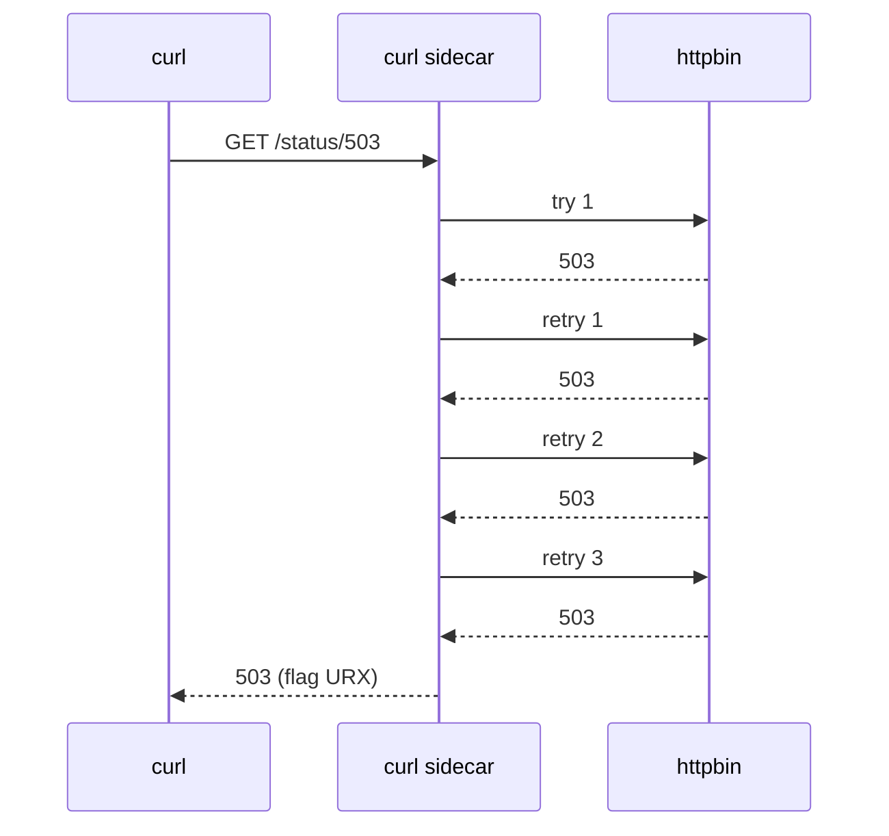
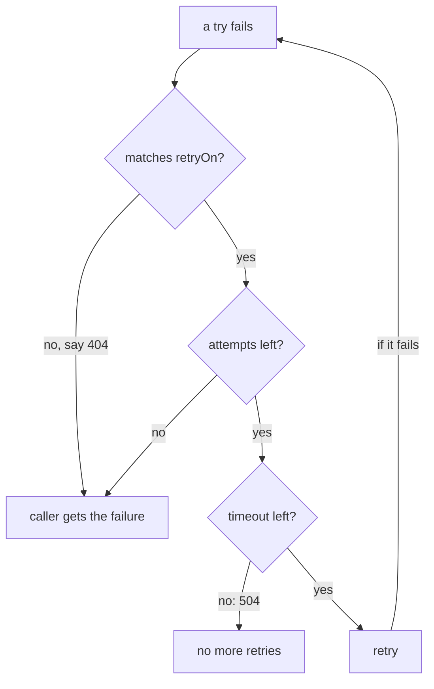

# The Retry Policy

> **Before you start:** define the helper functions from [the landing page](./course.md#before-you-start).

Many failures in space only last a moment. A ship (pod) restarts, a connection drops, or one signal reaches a ship in trouble. Send it again a moment later and it often gets through. A **retry** is exactly that: the communications officer (the sidecar) re-sends a signal that got lost, before the crew (the app) ever sees the failure.

Retries already happen in your mesh, whether or not you set them up. This part covers the three fields that control them, the off-by-one in the most important one, and the default policy behind a whole class of "why did that take so long" questions.

## How a retry works

You set retries on a rule of a `VirtualService`, the flight plan that tells the sidecar where requests go and how to handle them. The caller's sidecar sends the request. If the answer is one of the failures you listed, it sends the same request again, up to `attempts` more times. Only then does it pass the last answer to the app. The app sees **one** request and **one** answer.



With `attempts: 3`, the sidecar sends up to four requests in total: the first try plus three retries.

## The three fields

```yaml
http:
- route:
  - destination:
      host: httpbin
  retries:
    attempts: 3
    perTryTimeout: 2s
    retryOn: 5xx,connect-failure,reset
  timeout: 10s
```

- **`attempts`** — how many **retries** happen after the first try fails. `attempts: 3` means up to **four** requests reach the server.
- **`perTryTimeout`** — the time limit for each single try, the first one included.
- **`retryOn`** — a comma-separated list of the failures that are worth a retry. No spaces.

Fix the `attempts` off-by-one in your memory now. It is easy to misread under time pressure. Envoy's own name for the field, `numRetries`, says it more clearly. When a task says "three attempts", decide whether it means three requests (`attempts: 2`) or three retries (`attempts: 3`). Pick the reading that fits the budget arithmetic in Part 3.

## What `retryOn` accepts

| Condition | Retries when |
| --- | --- |
| `5xx` | the server answered with any 5xx status. A per-try timeout also counts. |
| `gateway-error` | narrower: only 502, 503 and 504 |
| `connect-failure` | the connection could not be made |
| `refused-stream` | the server sent an HTTP/2 `REFUSED_STREAM` |
| `reset` | the server reset the connection before it answered |
| `retriable-4xx` | the server answered 409 |
| `"503"` | the answer has exactly this status code (a number in quotes) |
| `retriable-status-codes` | the status is in a `retriableStatusCodes` list you supply |

You can mix names and numbers: `retryOn: connect-failure,reset,503`. Put a number on its own in quotes, `retryOn: "503"`, because the field is a text list.



Three gates, in that order. The third one is the reason Part 3 exists.

Notice what is missing: **4xx** in general. A `400` or `404` is the caller's own mistake, and a retry gets the same answer, only slower. `retryOn: 5xx` leaves them alone on purpose.

`gateway-error` or `5xx` is a real choice, not a matter of taste. `gateway-error` means "the server, or something on the way to it, had a problem". `5xx` also includes `500`, which is an error inside the app itself. A 500 usually fails the same way on every try, so retrying it rarely helps.

## Watching retries happen

The caller cannot see retries. It gets one answer. The proof is on the **server** side, where each try arrives as its own request in the sidecar log. That is what `count_received` counts.

<!-- astrona:playground:renew -->

> [!TIP]
> **Try it — four tries for one request**
>
> Save this as `virtualservice-httpbin-retries.yaml`:
>
> ```yaml
> apiVersion: networking.istio.io/v1
> kind: VirtualService
> metadata:
>   name: httpbin
>   namespace: bookinfo
> spec:
>   hosts:
>   - httpbin
>   http:
>   - route:
>     - destination:
>         host: httpbin
>     retries:
>       attempts: 3
>       perTryTimeout: 2s
>       retryOn: 5xx,connect-failure,reset
>     timeout: 10s
> ```
>
> Apply it:
>
> ```sh
> kubectl apply -f virtualservice-httpbin-retries.yaml
> ```
>
> Then check the result:
>
> ```sh
> status_and_time http://httpbin:8000/status/503
> count_received "status/503"
> kubectl logs -n bookinfo deploy/curl -c istio-proxy --tail=1
> ```
>
> Expect `503`, then `4`, and in the log (trimmed):
>
> ```text
> "GET /status/503 HTTP/1.1" 503 URX via_upstream ...
> ```
>
> One request from the client, four requests at the server: the first try plus three retries. The flag **`URX`** means "upstream retry limit exceeded": the retries are used up. The caller still got a `503`, because `/status/503` fails every single time. The same file is `examples/06-retries/01-virtualservice-httpbin-retries.yaml` in the playground.

That service was broken, not flaky. Retries do nothing for a broken service except send it more requests. Now try one that fails only some of the time, which is what retries are for.

> [!TIP]
> **Try it — a flaky service becomes reliable**
>
> ```sh
> for i in $(seq 1 10); do
>   kubectl exec -n bookinfo deploy/curl -- curl -s -o /dev/null -w "%{http_code}\n" "http://httpbin:8000/status/200,503"
> done | sort | uniq -c
> ```
>
> Expect `10 200`, or nearly. `/status/200,503` picks one of the two at random, so without retries about half would be 503. The retries hide the failures completely.

## Choosing which failures to retry

`retryOn` decides which failures count. Two cases from the table are worth seeing for yourself.

With `retryOn: gateway-error`, a `500` from the app is not retried, but a `502` is:

```bash
# file: examples/06-retries/cases/c1-virtualservice-retry-gateway-error.yaml  (attempts: 3, retryOn: gateway-error)
status_and_time http://httpbin:8000/status/500 ; count_received "status/500"    # 500 → 1  (not retried)
status_and_time http://httpbin:8000/status/502 ; count_received "status/502"    # 502 → 4  (retried)
```

With an exact code, `retryOn: "503"`, only that code is retried:

```bash
# file: examples/06-retries/cases/c2-virtualservice-retry-status-code.yaml  (attempts: 3, retryOn: "503")
status_and_time http://httpbin:8000/status/503 ; count_received "status/503"    # 503 → 4  (retried)
status_and_time http://httpbin:8000/status/502 ; count_received "status/502"    # 502 → 1  (not retried)
```

Both files are in the playground. Apply one with `kubectl apply -f`, run the two lines, then apply the next.

## The default policy nobody configured

Every route with no `retries` block still has a retry policy: **2 attempts**, but only for **connection** problems such as `connect-failure`, `refused-stream`, `unavailable` and `cancelled`.

A `503` that the app sends back is different. The connection worked, and the app gave a proper HTTP answer. So the default policy does **not** retry it.

The default is usually on your side. It absorbs the short connection failures that happen when a pod is moved or a node is drained, and it is a big part of why a rolling update looks smooth. But it explains two things people find confusing:

- **A failing request sometimes takes longer than expected.** It was retried twice before you were told.
- **Removing the `retries` block does not switch retries off.** Neither does `retries: {}`.

To really switch them off, you must say so:

```yaml
retries:
  attempts: 0
```

> [!TIP]
> **Try it — back to exactly one try**
>
> Save this as `virtualservice-httpbin-no-retries.yaml`:
>
> ```yaml
> apiVersion: networking.istio.io/v1
> kind: VirtualService
> metadata:
>   name: httpbin
>   namespace: bookinfo
> spec:
>   hosts:
>   - httpbin
>   http:
>   - route:
>     - destination:
>         host: httpbin
>     retries:
>       attempts: 0
> ```
>
> Apply it:
>
> ```sh
> kubectl apply -f virtualservice-httpbin-no-retries.yaml
> ```
>
> Then check the result:
>
> ```sh
> status_and_time http://httpbin:8000/status/503
> count_received "status/503"
> ```
>
> Expect `503` and `1`. Compare with the `4` from before. `attempts: 0` also switches off the default retries for connection errors. It is the only way to say "never retry". The same file is `examples/06-retries/02-virtualservice-httpbin-retries-disabled.yaml`.

## Common pitfalls

> [!WARNING]
> **Reading `attempts` as the total number of requests.** It counts retries *after* the first try. `attempts: 3` sends up to four requests.
>
> **Expecting the default retries to cover app errors.** The default only covers connection errors. Add `retryOn: 5xx`, `gateway-error` or an exact code.
>
> **Believing that removing the `retries` block switches retries off.** The default still retries twice on connection errors. Only `attempts: 0` turns them off.
>
> **Retrying a 500 with `5xx`.** A 500 is usually an app bug that fails the same way every time. `gateway-error` skips it.
>
> **Looking for retries at the caller.** The caller gets one answer. Count the tries in the *server's* sidecar log, or look for `URX` in the caller's log.
>
> **Retrying a broken service.** Retries fix a ship with a flickering radio, not a ship that has gone dark. Retries fix flaky, not broken. `/status/503` fails the same way on every try.

> *`attempts` counts retries after the first try, and a route with no `retries` block still retries twice on connection errors.*
