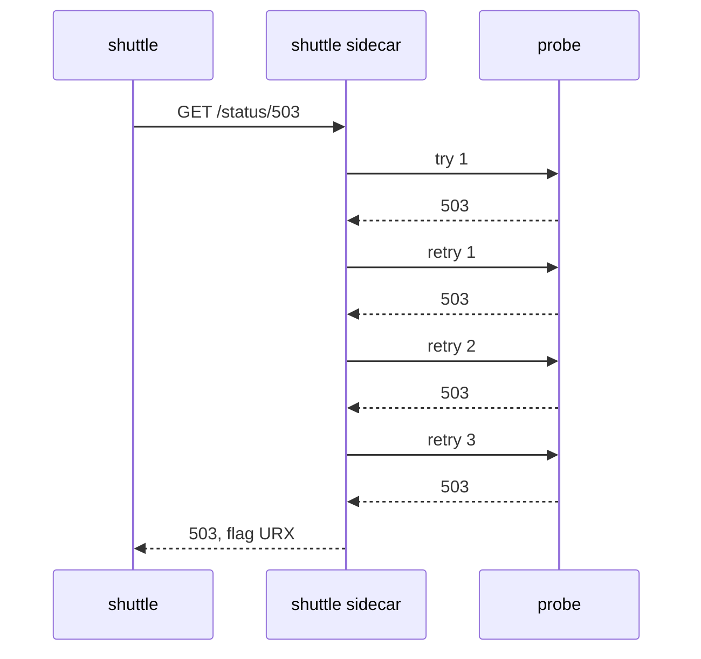

# Configure Retries

Many failures only last a moment. A pod restarts, a connection drops, or one request reaches a pod that is briefly in trouble. Send the same request again a moment later and it often succeeds. A **retry** is exactly that: the client's sidecar proxy sends a failed request again, before the application ever sees the failure.

A sidecar proxy is the Envoy container that Istio adds to each pod; all traffic in and out of the pod passes through it. This part covers how a retry works, the three fields of a retry policy, the off-by-one in the most important one, and how many retries run when you set none or set `attempts: 0`.

## How a retry works

You set retries on a rule of a `VirtualService`, the Istio object that sets how requests to a host are routed. The client's sidecar proxy sends the request. If the response is one of the failures you listed, the proxy sends the same request again, up to `attempts` more times. Only then does it pass the last response to the application. The application sees **one** request and **one** response.



The diagram shows that with `attempts: 3`, the sidecar proxy sends up to four requests in total: the first try plus three retries.

## The three fields

A retry policy has three fields. This piece of a `VirtualService` shows them (you do not apply it):

```yaml
http:
- route:
  - destination:
      host: probe
  retries:
    attempts: 3
    perTryTimeout: 2s
    retryOn: 5xx,connect-failure,reset
  timeout: 10s
```

- **`attempts`**: how many **retries** happen after the first try fails. `attempts: 3` means up to **four** requests reach the receiver.
- **`perTryTimeout`**: the timeout for each single try, the first one included.
- **`retryOn`**: a comma-separated list of the failures to retry, with no spaces.

Learn the `attempts` off-by-one now. Envoy's own name for the field, `numRetries`, says it more clearly. When a task says "three attempts", decide whether it means three requests (`attempts: 2`) or three retries (`attempts: 3`).

In the example, `retryOn: 5xx,connect-failure,reset` retries any response with a 5xx status code, a connection that could not be made, and a connection the receiver reset before it answered. That is a broad list, which makes it a good start for watching retries happen.

## Watch the retries happen

The client cannot see retries, because it gets one response. The proof is at the **receiver**: every try arrives there as its own request, with its own line in the receiver's sidecar proxy access log. In this playground, access logs are switched on, so every sidecar proxy writes one line per request.

The commands below use two helpers. `status_and_time` sends one request from the `shuttle` test pod and prints the status code and the total time. `count_received` waits a moment, then counts the lines that match a text in the access logs of the `probe` pods, an HTTP echo server on port 8000. Paste both into your terminal:

<!-- astrona:playground:renew -->

```sh
status_and_time() { kubectl exec -n starfleet deploy/shuttle -- curl -s -o /dev/null -w "%{http_code} %{time_total}s\n" "$@"; }
count_received() { sleep 4; kubectl logs -n starfleet -l app=probe -c istio-proxy --since=${2:-8s} | grep -c "$1"; }
```

### Four tries for one request

Start with a policy that retries every 5xx up to three times. Save this as `virtualservice-probe-retries.yaml`:

```yaml
apiVersion: networking.istio.io/v1
kind: VirtualService
metadata:
  name: probe
  namespace: starfleet
spec:
  hosts:
  - probe
  http:
  - route:
    - destination:
        host: probe
    retries:
      attempts: 3
      perTryTimeout: 2s
      retryOn: 5xx,connect-failure,reset
    timeout: 10s
```

Apply it:

```sh
kubectl apply -f virtualservice-probe-retries.yaml
```

Then check the result. The probe's `/status/503` path always answers `503`. Send one request to it, count how many reached the probe, and read the `shuttle` access log:

```sh
status_and_time http://probe:8000/status/503
count_received "status/503"
kubectl logs -n starfleet deploy/shuttle -c istio-proxy --tail=1
```

You should see (log line shortened):

```text
503 0.125604s
4
"GET /status/503 HTTP/1.1" 503 URX via_upstream ... "probe:8000" ...
```

One request from `shuttle`, four requests at the probe: the first try plus three retries. The response flag **`URX`** means "upstream retry limit exceeded": the retries are used up. `shuttle` still got a `503`, because `/status/503` fails on every single try.

### A flaky backend becomes more reliable

That path was broken, not flaky. Retries do nothing for a broken backend except send it more requests. Now try a path that fails only some of the time: `/status/200,503` picks one of the two at random.

```sh
for i in $(seq 1 10); do
  kubectl exec -n starfleet deploy/shuttle -- curl -s -o /dev/null -w "%{http_code}\n" "http://probe:8000/status/200,503"
done | sort | uniq -c
```

You should see something like:

```text
   9 200
   1 503
```

Without retries, about half of these requests would fail. With three retries, a request only fails when four tries in a row fail, so most of them succeed. Retries make failures rarer. They do not make them impossible.

## The retry policy nobody configured

So far every retry came from a policy you wrote. But a rule with no `retries` block still has a retry policy. You can read it in the `shuttle` route table, and prove what it does with the probe.

### See the default policy

First delete the probe's `VirtualService`, so the probe has no rule of yours at all:

```sh
kubectl delete virtualservice probe -n starfleet
```

```text
virtualservice.networking.istio.io "probe" deleted from starfleet namespace
```

`istioctl proxy-config routes` prints the routes that `istiod`, the Istio control plane, has sent to one proxy. Read the retry fields in the `shuttle` route table for port 8000, and send one `503`:

```sh
istioctl proxy-config routes deploy/shuttle -n starfleet --name 8000 -o json \
  | grep -E 'retryOn|numRetries'
status_and_time http://probe:8000/status/503; count_received "status/503"
```

You should see (shortened):

```text
"retryOn": "connect-failure,refused-stream,unavailable,cancelled,retriable-status-codes",
"numRetries": 2,
503 0.007382s
1
```

The default is **2 retries**, only for **connection problems**. The list ends with `retriable-status-codes`, but no status codes are given, so no status code is retried. A `503` that the application sends back is a complete HTTP response, so the default policy does **not** retry it: the request reached the probe once.

The default usually helps you: it hides the short connection failures when a pod is moved or restarted. But it explains two surprises:

- **A failing request sometimes takes longer than expected.** The sidecar proxy retried it twice before the application saw the failure.
- **Removing the `retries` block does not switch retries off.** Neither does `retries: {}`.

### Switch retries off for real

Only `attempts: 0` means "never retry". Save this as `virtualservice-probe-no-retries.yaml`:

```yaml
apiVersion: networking.istio.io/v1
kind: VirtualService
metadata:
  name: probe
  namespace: starfleet
spec:
  hosts:
  - probe
  http:
  - route:
    - destination:
        host: probe
    retries:
      attempts: 0
```

Apply it:

```sh
kubectl apply -f virtualservice-probe-no-retries.yaml
```

Then send one `503`, and run the flaky loop again:

```sh
status_and_time http://probe:8000/status/503; count_received "status/503"
for i in $(seq 1 10); do
  kubectl exec -n starfleet deploy/shuttle -- curl -s -o /dev/null -w "%{http_code}\n" "http://probe:8000/status/200,503"
done | sort | uniq -c
```

You should see something like:

```text
503 0.006197s
1
   7 200
   3 503
```

Each request now gets exactly one try, so the flaky path fails about as often as it fails on its own.

You can now write a retry policy, count the retries at the receiver, read the default retry policy from the proxy, and switch retries off. The open question is which failures a policy should retry, because retrying the wrong ones only sends a backend more requests.

## Common pitfalls

> [!WARNING]
> - **Reading `attempts` as the total number of requests.** It counts retries *after* the first try. `attempts: 3` sends up to four requests.
> - **Expecting the default retries to cover application errors.** The default only covers connection problems. Add `retryOn: 5xx`, `gateway-error` or an exact code.
> - **Believing that removing the `retries` block switches retries off.** The default still retries twice on connection problems. Only `attempts: 0` turns retries off.
> - **Looking for retries at the client.** The client gets one response. Count the tries in the receiver's access log, or look for `URX` in the client's access log.
> - **Retrying a broken backend.** Retries help with short failures, not with a backend that is down.
