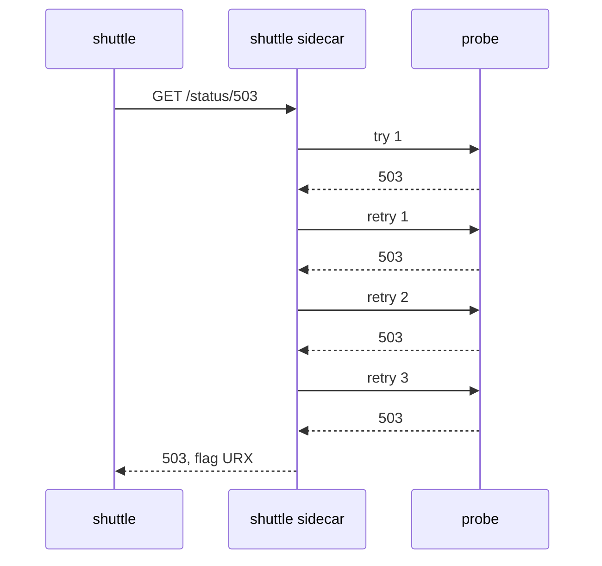
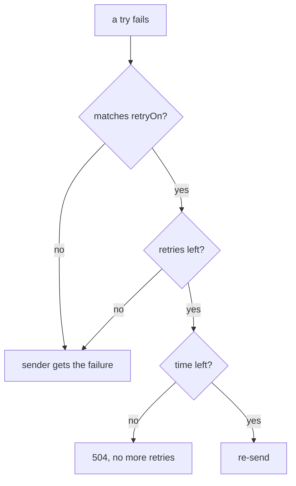

# Re-Send Lost Signals

Astronaut, many failures in space only last a moment. A ship restarts, a connection drops, or one signal reaches a ship that is briefly in trouble. Send it again a moment later and it often gets through. A **retry** is exactly that: the communications officer re-sends a lost signal before the crew (the app) ever sees the failure.

This part covers the three fields that control retries, the off-by-one in the most important one, how to choose which failures are worth a retry, and the retry policy that runs even when you set none.

The commands below need the two helpers from the module's landing page pasted into your terminal.

## How a retry works

You set retries on a rule of a `VirtualService`. The sender's sidecar sends the signal. If the answer is one of the failures you listed, it sends the same signal again, up to `attempts` more times. Only then does it pass the last answer to the app. The app sees **one** signal and **one** answer.



With `attempts: 3`, the sidecar sends up to four signals in total: the first try plus three retries.

## The three fields

This piece of a `VirtualService` shows them (you do not apply it):

```yaml
http:
- route:
  - destination:
      host: probe
  retries:
    attempts: 3
    perTryTimeout: 2s
    retryOn: 5xx,connect-failure,reset
  timeout: 10s
```

- **`attempts`**: how many **retries** happen after the first try fails. `attempts: 3` means up to **four** signals reach the receiver.
- **`perTryTimeout`**: the abort window for each single try, the first one included.
- **`retryOn`**: a comma-separated list of the failures worth a retry, with no spaces.

Fix the `attempts` off-by-one in your memory now. Envoy's own name for the field, `numRetries`, says it more clearly. When a task says "three attempts", decide whether it means three signals (`attempts: 2`) or three retries (`attempts: 3`).

## Which failures `retryOn` re-sends

| Condition | Retries when |
| --- | --- |
| `5xx` | the receiver answered with any 5xx status, or a try ran past its `perTryTimeout` |
| `gateway-error` | narrower: only 502, 503 and 504 |
| `connect-failure` | the connection could not be made |
| `refused-stream` | the receiver refused the stream (HTTP/2) |
| `reset` | the receiver reset the connection before it answered |
| `retriable-4xx` | the receiver answered 409 |
| `"503"` | the answer has exactly this status code. Write the number in quotes |

You can mix names and numbers: `retryOn: connect-failure,reset,503`.



Three questions, in that order. The third one matters most: the route's `timeout` is one abort window for the first try and every retry together. If it runs out, no retry is sent, however many are left.

Notice what is missing: most **4xx** codes. A `400` or `404` is the sender's own mistake, and a retry gets the same answer, only slower.

Choosing between `5xx` and `gateway-error` matters. `gateway-error` means "the receiver, or something on the way to it, had a problem". `5xx` also includes `500`, which is an error inside the app itself. A `500` usually fails the same way on every try, so re-sending it rarely helps.

## Watch the re-sends happen

The sender cannot see retries: it gets one answer. The proof is at the **receiver**, where every try arrives as its own signal in the sidecar's flight log. That is what `count_received` counts.

<!-- astrona:playground:renew -->

### Four tries for one signal

Re-send every 5xx up to three times. Save this as `virtualservice-probe-retries.yaml`:

```yaml
apiVersion: networking.istio.io/v1
kind: VirtualService
metadata:
  name: probe
  namespace: starfleet
spec:
  hosts:
  - probe
  http:
  - route:
    - destination:
        host: probe
    retries:
      attempts: 3
      perTryTimeout: 2s
      retryOn: 5xx,connect-failure,reset
    timeout: 10s
```

Apply it:

```sh
kubectl apply -f virtualservice-probe-retries.yaml
```

Then send one signal to `/status/503`, count how many reached the probe, and read the shuttle's flight log:

```sh
status_and_time http://probe:8000/status/503
count_received "status/503"
kubectl logs -n starfleet deploy/shuttle -c istio-proxy --tail=1
```

You should see (log line trimmed):

```text
503 0.125604s
4
"GET /status/503 HTTP/1.1" 503 URX via_upstream ... "probe:8000" ...
```

One signal from the shuttle, four signals at the probe: the first try plus three retries. The flag **`URX`** means "upstream retry limit exceeded": the retries are used up. The shuttle still got a `503`, because `/status/503` fails on every single try.

### A flaky probe becomes more reliable

That probe was broken, not flaky. Retries do nothing for a broken ship except send it more signals. Now try one that fails only some of the time: `/status/200,503` picks one of the two at random.

```sh
for i in $(seq 1 10); do
  kubectl exec -n starfleet deploy/shuttle -- curl -s -o /dev/null -w "%{http_code}\n" "http://probe:8000/status/200,503"
done | sort | uniq -c
```

You should see something like:

```text
   9 200
   1 503
```

Without retries, about half of these signals would fail. With three retries, a signal only fails when four tries in a row are unlucky, so most of them succeed. Retries make failures rarer. They do not make them impossible.

## Choose which failures to re-send

`retryOn` decides which failures count. Two choices from the table are worth seeing for yourself.

### Re-send only gateway errors

Save this as `virtualservice-probe-retry-gateway-error.yaml`:

```yaml
apiVersion: networking.istio.io/v1
kind: VirtualService
metadata:
  name: probe
  namespace: starfleet
spec:
  hosts:
  - probe
  http:
  - route:
    - destination:
        host: probe
    retries:
      attempts: 3
      retryOn: gateway-error
```

Apply it:

```sh
kubectl apply -f virtualservice-probe-retry-gateway-error.yaml
```

Then send a `500` and a `502`, and count each at the probe:

```sh
status_and_time http://probe:8000/status/500; count_received "status/500"
status_and_time http://probe:8000/status/502; count_received "status/502"
```

You should see:

```text
500 0.007943s
1
502 0.145082s
4
```

The app's own `500` reached the probe once: it was not re-sent. The `502` is a gateway error, so it was re-sent three times.

### Re-send one exact status code

Save this as `virtualservice-probe-retry-503.yaml`:

```yaml
apiVersion: networking.istio.io/v1
kind: VirtualService
metadata:
  name: probe
  namespace: starfleet
spec:
  hosts:
  - probe
  http:
  - route:
    - destination:
        host: probe
    retries:
      attempts: 3
      retryOn: "503"
```

Apply it:

```sh
kubectl apply -f virtualservice-probe-retry-503.yaml
```

Then send a `503` and a `502`:

```sh
status_and_time http://probe:8000/status/503; count_received "status/503"
status_and_time http://probe:8000/status/502; count_received "status/502"
```

You should see:

```text
503 0.124179s
4
502 0.003489s
1
```

Only the exact code `503` is re-sent. The `502` now reaches the probe once.

## The retry policy nobody configured

A rule with no `retries` block still has a retry policy. You can read it in the shuttle's route table, and prove what it does with the probe.

### See the default policy

Remove the probe's flight plan, so the probe has no rule of yours at all:

```sh
kubectl delete virtualservice probe -n starfleet
```

```text
virtualservice.networking.istio.io "probe" deleted from starfleet namespace
```

Then read the retry fields in the shuttle's route table for port 8000, and send one `503`:

```sh
istioctl proxy-config routes deploy/shuttle -n starfleet --name 8000 -o json \
  | grep -E 'retryOn|numRetries'
status_and_time http://probe:8000/status/503; count_received "status/503"
```

You should see (trimmed):

```text
"retryOn": "connect-failure,refused-stream,unavailable,cancelled,retriable-status-codes",
"numRetries": 2,
503 0.007382s
1
```

That is **2 retries**, only for **connection problems**. The list ends with `retriable-status-codes`, but no status codes are given, so no status is re-sent. A `503` that the app sends back is a proper HTTP answer, so the default policy does **not** retry it: the signal reached the probe once.

The default is usually on your side: it absorbs the short connection failures when a ship is moved or restarted. But it explains two surprises:

- **A failing signal sometimes takes longer than expected.** It was re-sent twice before you were told.
- **Removing the `retries` block does not switch retries off.** Neither does `retries: {}`.

### Switch retries off for real

Only `attempts: 0` says "never re-send". Save this as `virtualservice-probe-no-retries.yaml`:

```yaml
apiVersion: networking.istio.io/v1
kind: VirtualService
metadata:
  name: probe
  namespace: starfleet
spec:
  hosts:
  - probe
  http:
  - route:
    - destination:
        host: probe
    retries:
      attempts: 0
```

Apply it:

```sh
kubectl apply -f virtualservice-probe-no-retries.yaml
```

Then send one `503`, and run the flaky loop again:

```sh
status_and_time http://probe:8000/status/503; count_received "status/503"
for i in $(seq 1 10); do
  kubectl exec -n starfleet deploy/shuttle -- curl -s -o /dev/null -w "%{http_code}\n" "http://probe:8000/status/200,503"
done | sort | uniq -c
```

You should see something like:

```text
503 0.006197s
1
   7 200
   3 503
```

Exactly one try per signal now, so the flaky probe fails about as often as it answers badly on its own.

## Common pitfalls

> [!WARNING]
> - **Reading `attempts` as the total number of signals.** It counts retries *after* the first try. `attempts: 3` sends up to four signals.
> - **Expecting the default retries to cover app errors.** The default only covers connection problems. Add `retryOn: 5xx`, `gateway-error` or an exact code.
> - **Believing that removing the `retries` block switches retries off.** The default still re-sends twice on connection problems. Only `attempts: 0` turns them off.
> - **Re-sending a `500` with `5xx`.** A `500` is usually an app bug that fails the same way every time. `gateway-error` or an exact code skips it.
> - **Looking for retries at the sender.** The sender gets one answer. Count the tries in the receiver's flight log, or look for `URX` in the sender's.
> - **Re-sending to a broken ship.** Retries help a ship with a flickering radio, not a ship that has gone dark.

> *`attempts` counts retries after the first try, and a rule with no `retries` block still re-sends twice on connection problems.*

## Your mission: Retry Only The Signals Worth Re-Sending

You can now set a retry policy, choose which failures it re-sends, and count the re-sends at the receiver. Now prove it in a graded mission: narrow a policy that re-sends everything to the one failure worth another try.

The mission runs in its own training solar system, so first pause your playground. Nothing in it is lost:

```sh
astrona stop ats-014-playground-040-01
```

Then start the mission:

```sh
astrona run --git git@github.com:astrona-io/ATS014.git -c sections/section-040/module-01/labs/lab-03
```

Read the task in [`question.md`](./labs/lab-03/question.md) and solve it on your own first. When you think you are done, send it for grading:

```sh
astrona submit -c sections/section-040/module-01/labs/lab-03
```

When the mission is done, remove it and wake your playground up again:

```sh
astrona destroy ats-014-lab-040-01-03
astrona start ats-014-playground-040-01
```
