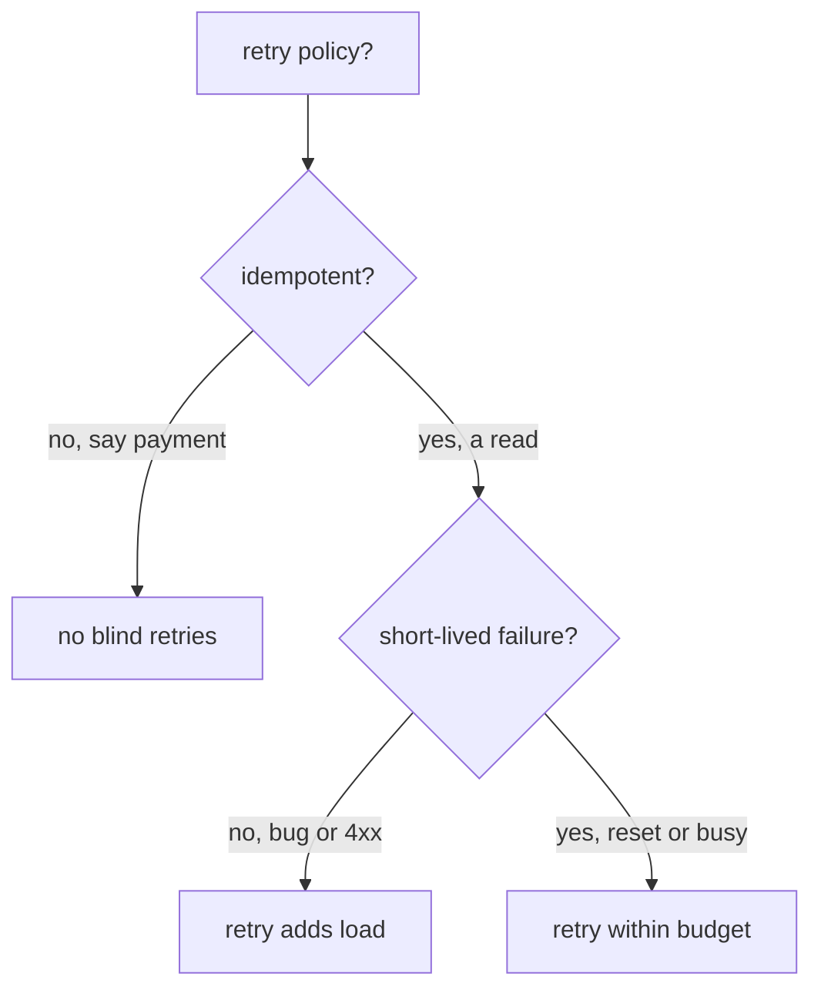

# The Shared Budget And Idempotency

> **Before you start:** define the helper functions from [the landing page](./course.md#before-you-start).

Astronaut, the two fields you now know share one clock. This part covers the arithmetic that follows from that, what it looks like when you get it wrong, and a safety question Istio cannot answer for you.

## One budget, all attempts

The route `timeout` limits the **whole request as the caller sees it**. Think of it as the mission's abort window: every retry has to happen inside it, not next to it.

```text
  timeout: 5s
  ├───────────────────────────────────────────────────┤

  try 1          retry 1        retry 2        retry 3
  ├── 1s ──┤     ├── 1s ──┤     ├── 1s ──┤     ├── 1s ──┤
                                                        ▲
                                              done after ~4s: fits

  timeout: 1.5s
  ├────────────┤
  try 1          retry 1   ✂ cut off here, caller gets 504
  ├── 1s ──┤     ├── 1s ──┤
```

The rule to check before you write any retry policy:

> **`timeout` ≥ (`attempts` + 1) × `perTryTimeout`**, plus a little room for making the connection.

It is `attempts + 1` because `attempts` counts retries, and there is also the first try. With `attempts: 3` and `perTryTimeout: 1s`, you need at least four seconds.

Set `timeout: 1.5s` against that policy, and the request is cut off soon after the second try starts. The caller sees a `504`, the retry policy looks broken, and **nothing anywhere reports a configuration error**. The policy was not ignored. It ran out of time.

> [!TIP]
> **Try it — the overall timeout cuts the retries short**
>
> Save this as `virtualservice-httpbin-short-budget.yaml`:
>
> ```yaml
> apiVersion: networking.istio.io/v1
> kind: VirtualService
> metadata:
>   name: httpbin
>   namespace: bookinfo
> spec:
>   hosts:
>   - httpbin
>   http:
>   - route:
>     - destination:
>         host: httpbin
>     timeout: 1.5s
>     retries:
>       attempts: 3
>       perTryTimeout: 1s
>       retryOn: 5xx
> ```
>
> Apply it:
>
> ```sh
> kubectl apply -f virtualservice-httpbin-short-budget.yaml
> ```
>
> Then check the result:
>
> ```sh
> status_and_time http://httpbin:8000/delay/3
> sleep 3; kubectl logs -n bookinfo -l app=httpbin -c istio-proxy --since=10s | grep -c delay/3
> ```
>
> Expect `504` after about `1.5s`, then `2`. Each try is cut off after 1 second and retried. Up to four tries were allowed, but the 1.5-second budget only had room for two. **A 504 where you expected a retried success is the sign of this mistake.** The same file is `examples/04-timeouts/cases/c3-virtualservice-httpbin-timeout-cuts-retries.yaml` in the playground.

## Per-try timeouts: retrying slow requests

`perTryTimeout` is not only a limit. It also turns a slow try into a retry. When a try runs past its `perTryTimeout`, the sidecar cancels it, and that cancelled try counts as a 5xx. So with `retryOn: 5xx` it gets retried. This helps when one pod hangs, because the retry may land on a healthy pod.

Here the overall `timeout: 10s` is big enough not to get in the way:

```yaml
http:
- route:
  - destination:
      host: httpbin
  timeout: 10s
  retries:
    attempts: 2
    perTryTimeout: 1s
    retryOn: 5xx
```

```bash
# file: examples/06-retries/cases/c3-virtualservice-retry-per-try-timeout.yaml
status_and_time http://httpbin:8000/delay/3        # 504 3.0s
count_received "delay/3" 12s                       # 3

kubectl logs -n bookinfo deploy/curl -c istio-proxy --tail=1
# "GET /delay/3 HTTP/1.1" 504 URX,UT upstream_per_try_timeout ...
```

That is 1 try + 2 retries = 3 tries of 1 second each, so 3 seconds, and then a **504**. The log shows two flags together: `UT` (a deadline fired) and `URX` (the retries are used up).

## Reading both values off the proxy

The route that `istiod` sent to the sidecar holds both numbers. Reading them is the fastest way to check the arithmetic against what really landed.

> [!TIP]
> **Try it — the timeout and retry policy as Envoy holds them**
>
> Apply the short-budget file from the first "Try it" again, then read the route:
>
> ```sh
> kubectl apply -f virtualservice-httpbin-short-budget.yaml
> ```
>
> Then check the result:
>
> ```sh
> istioctl proxy-config routes deploy/curl -n bookinfo -o json \
>   | grep -E '"timeout"|retryOn|numRetries|perTryTimeout' | head
> ```
>
> You should see the four fields from your file, in Envoy's own names: `timeout`, `retryOn`, `numRetries` and `perTryTimeout`. `numRetries: 3` confirms the off-by-one reading: three *retries*, four tries, needing four seconds against a budget of one and a half. Seeing the numbers side by side is usually enough to spot the problem without sending a single request.

## Retries are not free, and not always safe

First the decision in one picture, because the mesh will happily retry anything you tell it to, including things that must never run twice:



Idempotent means sending a request twice has the same effect as sending it once. Without that, use an idempotency key or `attempts: 0`. With it, retry only within a budget the timeout can afford. Istio cannot answer the first question. It sees an HTTP request, not what the request means.

A request is **idempotent** when running it twice does no more harm than running it once, like sending the same docking signal twice: the ship docks once. `GET`, `PUT` and `DELETE` are usually idempotent. `POST` usually is not.

**A retried `POST` is a second `POST`.** Istio retries at the HTTP level and does not check the method. Say the first try reached the server, the work was done, and then the *answer* got lost. The retry does the work again. An order could be created four times, like a launch command sent four times that fires four rockets. Stopping duplicates is the app's job: an idempotency key, a unique constraint, or a conditional write.

> [!TIP]
> **Try it — the POST is sent four times**
>
> Apply `virtualservice-httpbin-retries.yaml` from Part 2 again (`attempts: 3`, `retryOn: 5xx,…`), then:
>
> ```sh
> kubectl apply -f virtualservice-httpbin-retries.yaml
> ```
>
> Then check the result:
>
> ```sh
> status_and_time -X POST http://httpbin:8000/status/503
> count_received "POST /status/503"
> ```
>
> Expect `4`. Istio retried the `POST` exactly like a `GET`.

The safe pattern is to allow retries only for methods that are safe to repeat, by matching on the method. Rules are still checked top to bottom, and the first match wins. So `GET` requests take rule 1, with retries. Everything else falls through to rule 2, with `attempts: 0`:

```yaml
http:
- match:
  - method:
      exact: GET
  route:
  - destination:
      host: httpbin
  retries:
    attempts: 3
    retryOn: 5xx
- route:
  - destination:
      host: httpbin
  retries:
    attempts: 0
```

```bash
# file: examples/06-retries/cases/c4-virtualservice-retry-get-only.yaml
status_and_time http://httpbin:8000/status/503         ; count_received "GET /status/503"     # 4
status_and_time -X POST http://httpbin:8000/status/503 ; count_received "POST /status/503"    # 1
```

**Retries multiply the load on a struggling service.** A service that answers 503 because it is overloaded gets `attempts + 1` times as many requests from every caller that retries, right when it can least afford them. This is called a retry storm: a whole fleet re-sending signals at a ship that is already sinking under them. Keep `attempts` small, and combine retries with circuit breaking (module 2), which closes the hatch on an overloaded service before the overload spreads.

## Common pitfalls

> [!WARNING]
> **A `timeout` shorter than `(attempts + 1) × perTryTimeout`.** The retries are cut short and the caller gets a 504 with the `UT` flag. Do the multiplication before you apply.
>
> **Forgetting that a per-try timeout is retried.** With `retryOn: 5xx`, a try that runs past `perTryTimeout` counts as a failure and is sent again. The log then shows `URX,UT`.
>
> **Retrying requests that are not idempotent.** A retried `POST` repeats its side effect. Split the route with a `method` match and set `attempts: 0` for the rest.
>
> **Adding retries everywhere.** Under heavy load, retries multiply the load into a retry storm. Keep `attempts` small and add circuit breaking.
>
> **Assuming a timeout stops the server.** It stops the caller waiting. The server finishes its work anyway, so a timeout does not take load off a struggling service.
>
> **Confusing a 504 made by the sidecar with one from the server.** Check the access log for `UT` before you debug the wrong hop.

> *One clock covers every try. Work out `(attempts + 1) × perTryTimeout` and give the timeout room, or the policy you wrote is not the policy that runs.*
