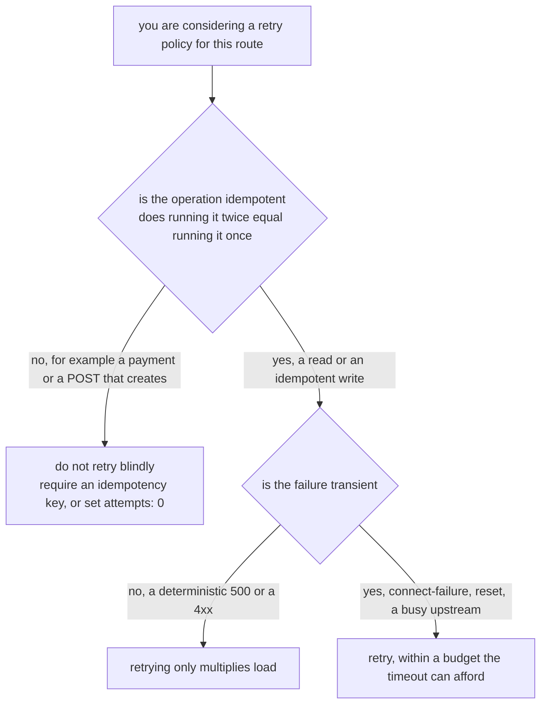

# The Shared Budget And Idempotency

> Prerequisite: [The Retry Policy](./course-02-the-retry-policy.md). Next: [the module landing page](./course.md).

The two fields you now know share one clock. This part is the arithmetic that follows, the signature of getting it wrong, and the safety question Istio cannot answer for you.

## One budget, all attempts

The route `timeout` bounds the **entire request as the caller experiences it**. Retries happen inside that window, not beside it:

```text
  timeout: 5s
  ├───────────────────────────────────────────────────┤

  attempt 1      attempt 2      attempt 3      attempt 4
  ├── 1s ──┤     ├── 1s ──┤     ├── 1s ──┤     ├── 1s ──┤
                                                        ▲
                                              finishes at ~4s: fits

  timeout: 2s
  ├────────────────┤
  attempt 1      attempt 2   ✂ cut off here — caller gets 504
  ├── 1s ──┤     ├── 1s ──┤
```

The rule to apply before writing any retry policy:

> **`timeout` ≥ (`attempts` + 1) × `perTryTimeout`**, plus headroom for connection setup.

`attempts + 1` because `attempts` counts retries and there is also the original try. With `attempts: 3` and `perTryTimeout: 1s` you need at least four seconds, and `timeout: 5s` gives a second of slack.

Set `timeout: 2s` against that policy and the request is cut off partway through the second retry. The caller sees a `504`, the retry policy looks broken, and **nothing anywhere reports a configuration error** — the policy was not ignored, it ran out of time.

> [!TIP]
> **Try it — shrink the budget and watch the retries get cut off**
>
> ```sh
> kubectl -n resilience-demo patch virtualservice httpbin --type merge -p '
> spec:
>   http:
>     - route:
>         - destination:
>             host: httpbin
>             port:
>               number: 8000
>       timeout: 2s
>       retries:
>         attempts: 3
>         perTryTimeout: 1s
>         retryOn: 5xx,connect-failure'
> kubectl -n resilience-demo exec deploy/tester -- \
>   curl -s -o /dev/null -w '%{http_code} %{time_total}s\n' http://httpbin:8000/delay/10
> kubectl -n resilience-demo logs deploy/tester -c istio-proxy --tail=2
> ```
>
> Expect something like:
>
> ```text
> 504 2.011s
> [2026-09-27T11:02:44.118Z] "GET /delay/10 HTTP/1.1" 504 UT upstream_response_timeout ...
> ```
>
> The caller is cut off at two seconds — the configured `attempts: 3` never had the budget to complete. **A 504 where you expected a retried success is the signature of this mistake**, and the `UT` flag from Part 1 confirms a deadline rather than an upstream error produced it.

## Reading both values off the proxy

The compiled route holds both numbers, which makes this the fastest way to check the arithmetic against what actually landed.

> [!TIP]
> **Try it — the timeout and retry policy as Envoy holds them**
>
> ```sh
> istioctl proxy-config routes deploy/tester -n resilience-demo -o json \
>   | grep -E '"timeout"|retryOn|numRetries|perTryTimeout' | head
> ```
>
> Expect something like:
>
> ```text
> "timeout": "2s",
> "retryOn": "5xx,connect-failure",
> "numRetries": 3,
> "perTryTimeout": "1s",
> ```
>
> `numRetries: 3` confirms the off-by-one reading — three *retries*, four attempts, needing four seconds against a two-second budget. Seeing the two numbers side by side is usually enough to spot the problem without running anything.

## Retries are not free, and not always safe

Before the detail, the decision in one picture — because the mesh will happily retry anything you tell it to, including things that must not be repeated:



Istio has no way to answer the first question. It sees an HTTP request, not what the request means.

Two consequences that Istio cannot decide for you.

**A retried `POST` is a second `POST`.** Istio retries at the HTTP layer with no knowledge of what the request does. If the first attempt reached the server, did its work, and then the *response* was lost, the retry performs the work again. Deduplication is an application concern — an idempotency key, a unique constraint, a conditional write.

The defensive pattern is to scope retries away from the write path by matching on method:

```yaml
http:
  - match:
      - method:
          exact: POST
    route:
      - destination: { host: httpbin, port: { number: 8000 } }
    timeout: 5s
    retries:
      attempts: 0            # writes: never retried
  - route:
      - destination: { host: httpbin, port: { number: 8000 } }
    timeout: 5s
    retries:
      attempts: 3            # reads: retried freely
      perTryTimeout: 1s
      retryOn: gateway-error
```

Rules are still evaluated top down and first match wins, so the `POST` rule goes first.

**Retries multiply load on a struggling service.** A dependency returning 503 under load gets `attempts + 1` times as many requests from every caller that retries — exactly when it can least afford them. This is the interaction with module 2's connection pools, where a pool rejection is itself a `503`: with `retryOn: 5xx` those rejections are retried, producing more rejections. Prefer `gateway-error` or `connect-failure` on routes to a pool-limited service, and keep `attempts` small.

## Common pitfalls

> [!WARNING]
> **A `timeout` shorter than `(attempts + 1) × perTryTimeout`.** The retries are truncated and the caller gets a 504 with the `UT` flag. Do the multiplication before applying.
>
> **Reading `attempts` as the total number of requests.** It is the number of retries *after* the first try — Envoy calls it `numRetries`.
>
> **Believing no `retries` block means no retries.** Istio's default is 2 attempts on connection-level failures. Only `attempts: 0` disables them.
>
> **Expecting `retryOn: 5xx` to retry a 4xx.** Client errors are never retried. Use `retriable-status-codes` with an explicit list if you really need one.
>
> **Retrying non-idempotent requests.** A retried `POST` duplicates the side effect. Split the route with a `method` match and set `attempts: 0` on the write path.
>
> **Using `retryOn: 5xx` toward a connection-pool-limited service.** Pool rejections are 503s; retrying them amplifies the overload.
>
> **Assuming a timeout stops the upstream.** It stops the caller waiting. The upstream finishes its work regardless, so a timeout does not shed load from a struggling dependency.
>
> **Confusing a synthesised 504 with an upstream one.** Check the access log for `UT` before debugging the wrong hop.

> *One clock covers every attempt — compute `(attempts + 1) × perTryTimeout` and give the timeout room, or the policy you wrote is not the policy that runs.*

## Reference

- [HTTPRetry API](https://istio.io/latest/docs/reference/config/networking/virtual-service/#HTTPRetry) — every retry field in one place.
- [Request timeouts task](https://istio.io/latest/docs/tasks/traffic-management/request-timeouts/) — the timeout half, with the retry interaction called out.
- [Envoy router filter retry policy](https://www.envoyproxy.io/docs/envoy/latest/configuration/http/http_filters/router_filter#retry-policy) — how the per-try and overall timeouts compose inside the proxy.
- [Idempotency in HTTP (RFC 9110 §9.2.2)](https://www.rfc-editor.org/rfc/rfc9110#section-9.2.2) — which methods are idempotent by specification, which is the basis for the `method`-matched split above.
