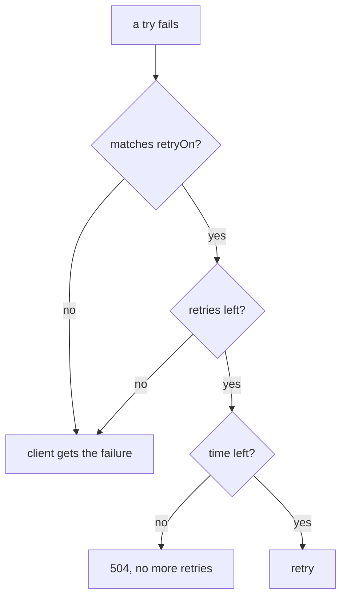

# Choose Which Failures To Retry

A retry only helps when the failure is short. A connection that dropped or a pod that was briefly overloaded may answer the next try. An application bug that returns `500` fails the same way every time, so a retry only sends the backend more requests. A **retry** is the client's sidecar proxy sending a failed request again, before the application sees the failure.

A sidecar proxy is the Envoy container that Istio adds to each pod; all traffic in and out of the pod passes through it. You set retries on a rule of a `VirtualService`, the Istio object that sets how requests to a host are routed. Its `attempts` field counts the retries after the first try, so `attempts: 3` sends up to four requests. This part covers the `retryOn` field, which decides which failures the proxy retries, and shows two choices at work.

## Which failures `retryOn` retries

The `retryOn` field takes a list of conditions. These are the ones you meet most often:

| Condition | Retries when |
| --- | --- |
| `5xx` | the receiver answered with any 5xx status, or a try ran past its `perTryTimeout` |
| `gateway-error` | narrower: only 502, 503 and 504 |
| `connect-failure` | the connection could not be made |
| `refused-stream` | the receiver refused the stream (HTTP/2) |
| `reset` | the receiver reset the connection before it answered |
| `retriable-4xx` | the receiver answered 409 |
| `"503"` | the response has exactly this status code. Write the number in quotes |

You can mix names and numbers: `retryOn: connect-failure,reset,503`. For each failed try, the sidecar proxy asks three questions in this order:



The diagram shows that a retry needs a matching failure, a retry left and time left. The third question matters most: the route `timeout` is one time limit for the first try and every retry together. If it runs out, no retry is sent, however many are left.

Notice what is missing from the table: most **4xx** codes. A `400` or `404` is the client's own mistake, and a retry gets the same response, only slower.

The choice between `5xx` and `gateway-error` also matters. `gateway-error` means "the receiver, or something on the way to it, had a problem". `5xx` also includes `500`, which is an error inside the application itself. A `500` usually fails the same way on every try, so retrying it rarely helps.

## Watch the choice at the receiver

The client cannot see retries, because it gets one response. The proof is at the **receiver**: every try arrives there as its own request, with its own line in the receiver's sidecar proxy access log. In this playground, access logs are switched on, so every sidecar proxy writes one line per request.

The commands below use two helpers. `status_and_time` sends one request from the `shuttle` test pod and prints the status code and the total time. `count_received` waits a moment, then counts the lines that match a text in the access logs of the `probe` pods, an HTTP echo server on port 8000 whose `/status/<code>` path answers with exactly that status code. Paste both into your terminal:

<!-- astrona:playground:renew -->

```sh
status_and_time() { kubectl exec -n starfleet deploy/shuttle -- curl -s -o /dev/null -w "%{http_code} %{time_total}s\n" "$@"; }
count_received() { sleep 4; kubectl logs -n starfleet -l app=probe -c istio-proxy --since=${2:-8s} | grep -c "$1"; }
```

### Retry only gateway errors

The first choice is `gateway-error`. Save this as `virtualservice-probe-retry-gateway-error.yaml`:

```yaml
apiVersion: networking.istio.io/v1
kind: VirtualService
metadata:
  name: probe
  namespace: starfleet
spec:
  hosts:
  - probe
  http:
  - route:
    - destination:
        host: probe
    retries:
      attempts: 3
      retryOn: gateway-error
```

Apply it:

```sh
kubectl apply -f virtualservice-probe-retry-gateway-error.yaml
```

Then send a `500` and a `502`, and count each at the probe:

```sh
status_and_time http://probe:8000/status/500; count_received "status/500"
status_and_time http://probe:8000/status/502; count_received "status/502"
```

You should see:

```text
500 0.007943s
1
502 0.145082s
4
```

The application's own `500` reached the probe once: it was not retried. The `502` is a gateway error, so the sidecar proxy retried it three times.

### Retry one exact status code

The second choice is one exact status code. Save this as `virtualservice-probe-retry-503.yaml`:

```yaml
apiVersion: networking.istio.io/v1
kind: VirtualService
metadata:
  name: probe
  namespace: starfleet
spec:
  hosts:
  - probe
  http:
  - route:
    - destination:
        host: probe
    retries:
      attempts: 3
      retryOn: "503"
```

Apply it:

```sh
kubectl apply -f virtualservice-probe-retry-503.yaml
```

Then send a `503` and a `502`:

```sh
status_and_time http://probe:8000/status/503; count_received "status/503"
status_and_time http://probe:8000/status/502; count_received "status/502"
```

You should see:

```text
503 0.124179s
4
502 0.003489s
1
```

Only the exact code `503` is retried. The `502` now reaches the probe once.

You can now choose which failures a retry policy retries, and prove the choice by counting the requests at the receiver. The open question is time: every retry takes time, and the route timeout limits the first try and all retries together.

## Common pitfalls

> [!WARNING]
> - **Retrying a `500` with `5xx`.** A `500` is usually an application bug that fails the same way every time. `gateway-error` or an exact code skips it.
> - **Retrying most 4xx codes.** A `400` or `404` is the client's own mistake. A retry gets the same response, only slower.
> - **Writing an exact status code without quotes.** Write `retryOn: "503"`, with the number in quotes.

## Your mission: Retry Only One Status Code Lab

You can now set a retry policy, choose which failures it retries, and count the retries at the receiver. In the lab, a policy retries every 5xx, and you must narrow it to the one status code worth another try.

The lab runs in its own cluster, so first pause your playground. Nothing in it is lost:

```sh
astrona stop ats-014-playground-040-01
```

Then start the lab:

```sh
astrona run --git git@github.com:astrona-io/ATS014.git -c sections/section-040/module-01/labs/lab-03
```

The task is on the next page. Solve it on your own first. When you think you are done, send it for grading:

```sh
astrona submit -c sections/section-040/module-01/labs/lab-03
```

When the lab is done, remove it and start your playground again:

```sh
astrona destroy ats-014-lab-040-01-03
astrona start ats-014-playground-040-01
```
