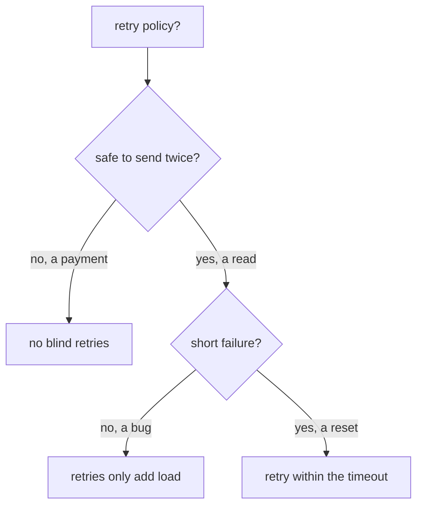

# Fit Retries Inside The Timeout

A route timeout and a retry policy share one time limit. If you size them on their own, the timeout can cut the retries short, and nothing reports an error. This part covers the arithmetic that prevents this, what the mistake looks like, how to read both settings from the proxy, and one question Istio cannot answer for you: is this request safe to send twice?

## One timeout for every try

The route `timeout` on a `VirtualService` rule limits the **whole request as the client sees it**. A `VirtualService` is the Istio object that sets how requests to a host are routed, including timeouts and retries. Every retry has to fit inside the timeout, not next to it:

```text
  timeout: 5s
  ├───────────────────────────────────────────────────┤

  try 1          retry 1        retry 2        retry 3
  ├── 1s ──┤     ├── 1s ──┤     ├── 1s ──┤     ├── 1s ──┤
                                                        ▲
                                              done after ~4s: fits

  timeout: 1.5s
  ├────────────┤
  try 1          retry 1   ✂ cut off here, the client gets 504
  ├── 1s ──┤     ├── 1s ──┤
```

Check this rule before you write any retry policy:

> **`timeout` ≥ (`attempts` + 1) × `perTryTimeout`**, plus a little room for making the connection.

It is `attempts + 1` because `attempts` counts retries, and there is also the first try. With `attempts: 3` and `perTryTimeout: 1s`, you need at least 4 seconds.

Set `timeout: 1.5s` with that policy, and the request stops soon after the second try starts. The client sees a `504`, the retry policy looks broken, and **nothing reports a configuration error**. Istio did not ignore the policy. The policy ran out of time.

### The timeout cuts the retries short

You can see this happen. The commands below use two helpers. `status_and_time` sends one request from the `shuttle` test pod and prints the status code and the total time. `count_received` waits a moment, then counts the lines that match a text in the access logs of the `probe` pods, an HTTP echo server on port 8000. The access log is the log where each sidecar proxy writes one line per request. Paste both into your terminal:

<!-- astrona:playground:renew -->

```sh
status_and_time() { kubectl exec -n starfleet deploy/shuttle -- curl -s -o /dev/null -w "%{http_code} %{time_total}s\n" "$@"; }
count_received() { sleep 4; kubectl logs -n starfleet -l app=probe -c istio-proxy --since=${2:-8s} | grep -c "$1"; }
```

Now write a policy whose timeout is too short. Save this as `virtualservice-probe-short-budget.yaml`:

```yaml
apiVersion: networking.istio.io/v1
kind: VirtualService
metadata:
  name: probe
  namespace: starfleet
spec:
  hosts:
  - probe
  http:
  - route:
    - destination:
        host: probe
    timeout: 1.5s
    retries:
      attempts: 3
      perTryTimeout: 1s
      retryOn: 5xx
```

Apply it:

```sh
kubectl apply -f virtualservice-probe-short-budget.yaml
```

Then check the result. Send one request to `/delay/3`, a path that waits 3 seconds before it answers, and count how often it reached the probe:

```sh
status_and_time http://probe:8000/delay/3
count_received "delay/3" 10s
```

You should see:

```text
504 1.502060s
2
```

The sidecar proxy cut off each try after 1 second and sent it again. The policy allowed up to four tries, but the 1.5-second timeout only had room for two. **A `504` where you expected a retried success is the sign of this mistake.**

## Per-try timeouts turn slow responses into retries

The `perTryTimeout` field does more than limit each try. When a try runs past it, the sidecar proxy cancels that try, and the cancelled try counts as a failure. With `retryOn: 5xx`, the proxy retries it. That helps when one pod hangs, because the retry may go to a healthy pod.

Give the route a generous timeout, with 2 retries of 1 second each. Save this as `virtualservice-probe-per-try.yaml`:

```yaml
apiVersion: networking.istio.io/v1
kind: VirtualService
metadata:
  name: probe
  namespace: starfleet
spec:
  hosts:
  - probe
  http:
  - route:
    - destination:
        host: probe
    timeout: 10s
    retries:
      attempts: 2
      perTryTimeout: 1s
      retryOn: 5xx
```

Apply it:

```sh
kubectl apply -f virtualservice-probe-per-try.yaml
```

Then send one slow request, count it at the probe, and read the `shuttle` access log:

```sh
status_and_time http://probe:8000/delay/3
count_received "delay/3" 12s
kubectl logs -n starfleet deploy/shuttle -c istio-proxy --tail=1
```

You should see (log line shortened):

```text
504 3.071110s
3
"GET /delay/3 HTTP/1.1" 504 URX,UT upstream_per_try_timeout ... "probe:8000" ...
```

One try plus two retries, each cut off after 1 second: 3 seconds, then a `504`. The access log shows two response flags together: `UT` (upstream timeout: a timeout fired) and `URX` (upstream retry limit exceeded: the retries are used up).

## Read both settings from the proxy

`istiod`, the Istio control plane, turns your `VirtualService` into Envoy configuration and sends both numbers to the `shuttle` sidecar proxy. Reading them there is the fastest way to check the arithmetic against what the proxy really holds.

Put the short-timeout policy back:

```sh
kubectl apply -f virtualservice-probe-short-budget.yaml
```

Then read the probe's route for port 8000 in the `shuttle` route table:

```sh
istioctl proxy-config routes deploy/shuttle -n starfleet --name 8000 -o json \
  | grep -E '"timeout"|retryOn|numRetries|perTryTimeout'
```

You should see (shortened to the probe's route):

```text
"timeout": "1.500s",
    "retryOn": "5xx",
    "numRetries": 3,
    "perTryTimeout": "1s",
```

These are the four fields from your file, with Envoy's own names. `numRetries: 3` confirms the off-by-one: three *retries*, so four tries of 1 second, against a timeout of 1.5 seconds. With the numbers side by side, you can usually spot the problem without sending a single request.

## Retry only what is safe to send twice

The sidecar proxy retries any request you tell it to, including requests that must never run twice. Istio cannot tell the difference: it sees an HTTP request, not what the request does in the application.



The diagram shows the two questions to ask before you add retries to a route. A request is **idempotent** when sending it twice has the same effect as sending it once. For example, reading the same record twice changes nothing. `GET`, `PUT` and `DELETE` are usually idempotent. `POST` usually is not.

**A retried `POST` is a second `POST`.** Say the first try reached the receiver, the receiver did the work, and then the *response* got lost. The retry does the work again, so an order could be created four times. Stopping duplicates is the application's job, for example with an idempotency key.

### A `POST` is retried like any other request

You can prove that Istio retries a `POST`. Apply the retry policy with `attempts: 3` again. Save this as `virtualservice-probe-retries.yaml`:

```yaml
apiVersion: networking.istio.io/v1
kind: VirtualService
metadata:
  name: probe
  namespace: starfleet
spec:
  hosts:
  - probe
  http:
  - route:
    - destination:
        host: probe
    retries:
      attempts: 3
      perTryTimeout: 2s
      retryOn: 5xx,connect-failure,reset
    timeout: 10s
```

Apply it:

```sh
kubectl apply -f virtualservice-probe-retries.yaml
```

Then send one `POST` and count it at the probe:

```sh
status_and_time -X POST http://probe:8000/status/503
count_received "POST /status/503"
```

You should see:

```text
503 0.092277s
4
```

The sidecar proxy retried the `POST` exactly like a `GET`: four requests reached the probe.

### Retry only `GET`

The safe pattern is to allow retries only for methods that are safe to repeat, with a `method` match. The sidecar proxy checks the rules from the top, and the first rule that matches wins. `GET` requests take rule 0, with retries. Everything else falls through to rule 1, with `attempts: 0`. Save this as `virtualservice-probe-get-only.yaml`:

```yaml
apiVersion: networking.istio.io/v1
kind: VirtualService
metadata:
  name: probe
  namespace: starfleet
spec:
  hosts:
  - probe
  http:
  - match:
    - method:
        exact: GET
    route:
    - destination:
        host: probe
    retries:
      attempts: 3
      retryOn: 5xx
  - route:
    - destination:
        host: probe
    retries:
      attempts: 0
```

Apply it:

```sh
kubectl apply -f virtualservice-probe-get-only.yaml
```

Then send a `GET` and a `POST`, and count each at the probe:

```sh
status_and_time http://probe:8000/status/503; count_received "GET /status/503"
status_and_time -X POST http://probe:8000/status/503; count_received "POST /status/503"
```

You should see:

```text
503 0.082587s
4
503 0.016980s
1
```

The sidecar proxy retried the `GET` three times. The `POST` reached the probe exactly once.

**Retries also multiply the load on a struggling backend.** A backend that answers `503` because it is overloaded gets `attempts + 1` times as many requests from every client that retries, at the moment it can least handle them. This is a **retry storm**. Keep `attempts` small, and combine retries with circuit breaking: connection pool limits in a `DestinationRule` that make the proxy reject extra requests at once with `503`, before the overload spreads.

You now know how to size a timeout for a retry policy, how to read both from the proxy, and how to keep retries away from requests that are not safe to repeat. That completes the two settings that decide how long a client waits and how often it tries again.

## Common pitfalls

> [!WARNING]
> - **A `timeout` shorter than `(attempts + 1) × perTryTimeout`.** The retries are cut short and the client gets a `504` with `UT`. Do the multiplication before you apply.
> - **Forgetting that a per-try timeout is retried.** With `retryOn: 5xx`, a try that runs past `perTryTimeout` is retried. The access log then shows `URX,UT`.
> - **Retrying requests that are not idempotent.** A retried `POST` repeats its effect. Split the route with a `method` match and set `attempts: 0` for the rest.
> - **Adding retries everywhere.** Under heavy load, retries multiply the load into a retry storm. Keep `attempts` small.

## Your mission: Set Timeouts And Retries Per HTTP Method Lab

You can now fit a retry policy inside its timeout, read both from the proxy, and keep retries away from requests that are not safe to repeat. In the lab, you give one service a write path with no retries and a read path with retries that fit inside their timeout. The lab uses its own small app (`httpbin` and a `tester` client in the `resilience-demo` namespace), not the Starfleet.

The lab runs in its own cluster, so first pause your playground. Nothing in it is lost:

```sh
astrona stop ats-014-playground-040-01
```

Then start the lab:

```sh
astrona run --git git@github.com:astrona-io/ATS014.git -c sections/section-040/module-01/labs/lab-01
```

The task is on the next page. Solve it on your own first. When you think you are done, send it for grading:

```sh
astrona submit -c sections/section-040/module-01/labs/lab-01
```

When the lab is done, remove it and start your playground again:

```sh
astrona destroy ats-014-lab-040-01
astrona start ats-014-playground-040-01
```
