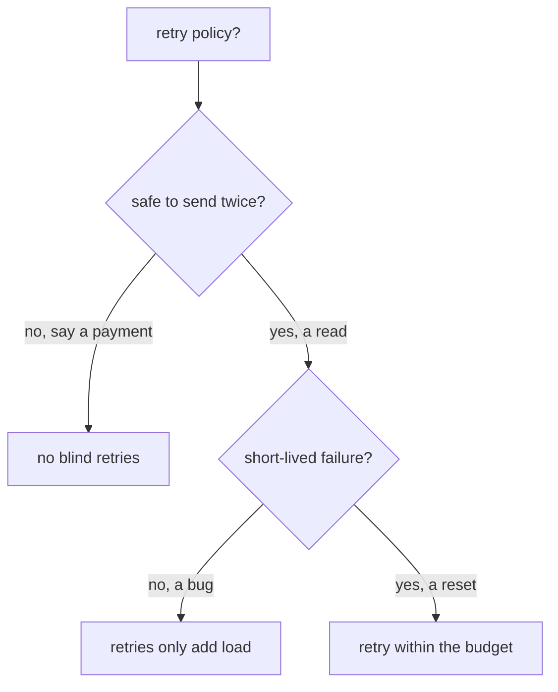

# Share One Clock, Retry What Is Safe

Astronaut, the abort window and the retry policy share one clock. This part covers the arithmetic that follows from that, what it looks like when you get it wrong, how to read both settings straight off the proxy, and a safety question Istio cannot answer for you: is this signal safe to send twice?

The commands below need the two helpers from the module's landing page pasted into your terminal.

## One abort window for every try

The route `timeout` limits the **whole signal as the sender sees it**. Every retry has to fit inside it, not next to it:

```text
  timeout: 5s
  ├───────────────────────────────────────────────────┤

  try 1          retry 1        retry 2        retry 3
  ├── 1s ──┤     ├── 1s ──┤     ├── 1s ──┤     ├── 1s ──┤
                                                        ▲
                                              done after ~4s: fits

  timeout: 1.5s
  ├────────────┤
  try 1          retry 1   ✂ cut off here, the sender gets 504
  ├── 1s ──┤     ├── 1s ──┤
```

The rule to check before you write any retry policy:

> **`timeout` ≥ (`attempts` + 1) × `perTryTimeout`**, plus a little room for making the connection.

It is `attempts + 1` because `attempts` counts retries, and there is also the first try. With `attempts: 3` and `perTryTimeout: 1s`, you need at least 4 seconds.

Set `timeout: 1.5s` against that policy, and the signal is cut off soon after the second try starts. The sender sees a `504`, the retry policy looks broken, and **nothing reports a configuration error**. The policy was not ignored. It ran out of time.

<!-- astrona:playground:renew -->

### The abort window cuts the retries short

Save this as `virtualservice-probe-short-budget.yaml`:

```yaml
apiVersion: networking.istio.io/v1
kind: VirtualService
metadata:
  name: probe
  namespace: starfleet
spec:
  hosts:
  - probe
  http:
  - route:
    - destination:
        host: probe
    timeout: 1.5s
    retries:
      attempts: 3
      perTryTimeout: 1s
      retryOn: 5xx
```

Apply it:

```sh
kubectl apply -f virtualservice-probe-short-budget.yaml
```

Then send one signal to `/delay/3`, and count how often it reached the probe:

```sh
status_and_time http://probe:8000/delay/3
count_received "delay/3" 10s
```

You should see:

```text
504 1.502060s
2
```

Each try is cut off after 1 second and re-sent. Up to four tries were allowed, but the 1.5-second abort window only had room for two. **A `504` where you expected a retried success is the sign of this mistake.**

## Per-try timeouts turn slow signals into retries

`perTryTimeout` is more than a limit. When a try runs past it, the sidecar cancels that try, and the cancelled try counts as a failure. With `retryOn: 5xx`, it is re-sent. That helps when one ship hangs, because the retry may land on a healthy ship.

### Three tries of one second each

Give the route a generous abort window, with 2 retries of 1 second each. Save this as `virtualservice-probe-per-try.yaml`:

```yaml
apiVersion: networking.istio.io/v1
kind: VirtualService
metadata:
  name: probe
  namespace: starfleet
spec:
  hosts:
  - probe
  http:
  - route:
    - destination:
        host: probe
    timeout: 10s
    retries:
      attempts: 2
      perTryTimeout: 1s
      retryOn: 5xx
```

Apply it:

```sh
kubectl apply -f virtualservice-probe-per-try.yaml
```

Then send one slow signal, count it at the probe, and read the shuttle's flight log:

```sh
status_and_time http://probe:8000/delay/3
count_received "delay/3" 12s
kubectl logs -n starfleet deploy/shuttle -c istio-proxy --tail=1
```

You should see (log line trimmed):

```text
504 3.071110s
3
"GET /delay/3 HTTP/1.1" 504 URX,UT upstream_per_try_timeout ... "probe:8000" ...
```

One try plus two retries, each cut off after 1 second: 3 seconds, then a `504`. The flight log shows two flags together: `UT` (an abort window fired) and `URX` (the retries are used up).

## Read both settings off the proxy

Mission control sends both numbers to the shuttle's sidecar. Reading them is the fastest way to check the arithmetic against what really landed.

### The abort window and the retry policy as Envoy holds them

Put the short-budget flight plan back:

```sh
kubectl apply -f virtualservice-probe-short-budget.yaml
```

Then read the probe's route for port 8000 in the shuttle's route table:

```sh
istioctl proxy-config routes deploy/shuttle -n starfleet --name 8000 -o json \
  | grep -E '"timeout"|retryOn|numRetries|perTryTimeout'
```

You should see (trimmed to the probe's route):

```text
"timeout": "1.500s",
    "retryOn": "5xx",
    "numRetries": 3,
    "perTryTimeout": "1s",
```

The four fields from your file, in Envoy's own names. `numRetries: 3` confirms the off-by-one: three *retries*, so four tries of 1 second, against an abort window of 1.5 seconds. Seeing the numbers side by side is usually enough to spot the problem without sending a single signal.

## Retry only what is safe to send twice

The mesh will happily re-send anything you tell it to, including signals that must never run twice. Istio cannot tell the difference: it sees an HTTP request, not what the request means.



A signal is **idempotent** when sending it twice does no more harm than sending it once, like sending the same docking signal twice: the ship still docks once. `GET`, `PUT` and `DELETE` are usually idempotent. `POST` usually is not.

**A retried `POST` is a second `POST`.** Say the first try reached the receiver, the work was done, and then the *answer* got lost. The retry does the work again. An order could be created four times, like a launch command sent four times that fires four rockets. Stopping duplicates is the app's job, for example with an idempotency key.

### A `POST` is re-sent like any other signal

Put the retry flight plan with `attempts: 3` back. Save this as `virtualservice-probe-retries.yaml`:

```yaml
apiVersion: networking.istio.io/v1
kind: VirtualService
metadata:
  name: probe
  namespace: starfleet
spec:
  hosts:
  - probe
  http:
  - route:
    - destination:
        host: probe
    retries:
      attempts: 3
      perTryTimeout: 2s
      retryOn: 5xx,connect-failure,reset
    timeout: 10s
```

Apply it:

```sh
kubectl apply -f virtualservice-probe-retries.yaml
```

Then send one `POST` and count it at the probe:

```sh
status_and_time -X POST http://probe:8000/status/503
count_received "POST /status/503"
```

You should see:

```text
503 0.092277s
4
```

Istio re-sent the `POST` exactly like a `GET`: four times.

### Retry only `GET`

The safe pattern is to allow retries only for methods that are safe to repeat, with a `method` match. The rules are checked from the top, and the first one that fits wins: `GET` signals take rule 0, with retries, and everything else falls through to rule 1, with `attempts: 0`. Save this as `virtualservice-probe-get-only.yaml`:

```yaml
apiVersion: networking.istio.io/v1
kind: VirtualService
metadata:
  name: probe
  namespace: starfleet
spec:
  hosts:
  - probe
  http:
  - match:
    - method:
        exact: GET
    route:
    - destination:
        host: probe
    retries:
      attempts: 3
      retryOn: 5xx
  - route:
    - destination:
        host: probe
    retries:
      attempts: 0
```

Apply it:

```sh
kubectl apply -f virtualservice-probe-get-only.yaml
```

Then send a `GET` and a `POST`, and count each at the probe:

```sh
status_and_time http://probe:8000/status/503; count_received "GET /status/503"
status_and_time -X POST http://probe:8000/status/503; count_received "POST /status/503"
```

You should see:

```text
503 0.082587s
4
503 0.016980s
1
```

The `GET` was re-sent three times. The `POST` reached the probe exactly once.

**Retries also multiply the load on a struggling ship.** A ship that answers `503` because it is overloaded gets `attempts + 1` times as many signals from every sender that retries, right when it can least afford them. This is a **retry storm**: a whole fleet re-sending signals at a ship that is already sinking under them. Keep `attempts` small, and combine retries with a circuit breaker, which closes the hatch on an overloaded ship before the overload spreads.

## Common pitfalls

> [!WARNING]
> - **A `timeout` shorter than `(attempts + 1) × perTryTimeout`.** The retries are cut short and the sender gets a `504` with `UT`. Do the multiplication before you apply.
> - **Forgetting that a per-try timeout is retried.** With `retryOn: 5xx`, a try that runs past `perTryTimeout` is re-sent. The flight log then shows `URX,UT`.
> - **Retrying signals that are not idempotent.** A retried `POST` repeats its effect. Split the route with a `method` match and set `attempts: 0` for the rest.
> - **Adding retries everywhere.** Under heavy load, retries multiply the load into a retry storm. Keep `attempts` small.

> *One clock covers every try. Work out `(attempts + 1) × perTryTimeout` and give the timeout room, and only re-send signals that are safe to send twice.*

## Your mission: Timeouts And Retries

You can now fit a retry policy inside its abort window, read both off the proxy, and keep retries away from signals that are not safe to repeat. Now prove it in a graded mission: give one service a write path without retries and a read path with retries that fit their budget.

The mission runs in its own training solar system, so first pause your playground. Nothing in it is lost:

```sh
astrona stop ats-014-playground-040-01
```

Then start the mission:

```sh
astrona run --git git@github.com:astrona-io/ATS014.git -c sections/section-040/module-01/labs/lab-01
```

Read the task in [`question.md`](./labs/lab-01/question.md) and solve it on your own first. When you think you are done, send it for grading:

```sh
astrona submit -c sections/section-040/module-01/labs/lab-01
```

When the mission is done, remove it and wake your playground up again:

```sh
astrona destroy ats-014-lab-040-01
astrona start ats-014-playground-040-01
```
