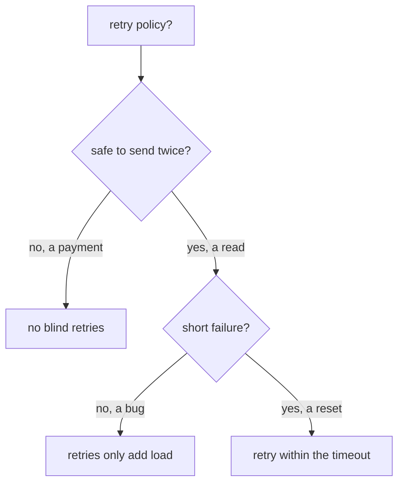

# Retry Only Idempotent Requests

A retry policy makes the client's sidecar proxy send a failed request again, before the application sees the failure. That is safe for a request that only reads data. It is not safe for a request that creates something, such as an order or a payment, because the first try may have done the work before it failed. This part shows that Istio retries every method the same way, and how to limit retries to the methods that are safe to repeat.

A sidecar proxy is the Envoy container that Istio adds to each pod; all traffic in and out of the pod passes through it. You set retries on a rule of a `VirtualService`, the Istio object that sets how requests to a host are routed, including timeouts and retries. Its `attempts` field counts the retries after the first try, so `attempts: 3` sends up to four requests.

## Retry only what is safe to send twice

The sidecar proxy retries any request you tell it to, including requests that must never run twice. Istio cannot tell the difference: it sees an HTTP request, not what the request does in the application.



The diagram shows the two questions to ask before you add retries to a route. A request is **idempotent** when sending it twice has the same effect as sending it once. For example, reading the same record twice changes nothing. `GET`, `PUT` and `DELETE` are usually idempotent. `POST` usually is not.

**A retried `POST` is a second `POST`.** Say the first try reached the receiver, the receiver did the work, and then the *response* got lost. The retry does the work again, so an order could be created four times. Stopping duplicates is the application's job, for example with an idempotency key.

The commands below use two helpers. `status_and_time` sends one request from the `shuttle` test pod and prints the status code and the total time; extra `curl` options, such as `-X POST`, go after it. `count_received` waits a moment, then counts the lines that match a text in the access logs of the `probe` pods, an HTTP echo server on port 8000 whose `/status/<code>` path answers with exactly that status code. The access log is the log where each sidecar proxy writes one line per request, so every try shows up there as its own line. Paste both into your terminal:

<!-- astrona:playground:renew -->

```sh
status_and_time() { kubectl exec -n starfleet deploy/shuttle -- curl -s -o /dev/null -w "%{http_code} %{time_total}s\n" "$@"; }
count_received() { sleep 4; kubectl logs -n starfleet -l app=probe -c istio-proxy --since=${2:-8s} | grep -c "$1"; }
```

### A `POST` is retried like any other request

You can prove that Istio retries a `POST`. Apply a retry policy that retries every 5xx up to three times. Save this as `virtualservice-probe-retries.yaml`:

```yaml
apiVersion: networking.istio.io/v1
kind: VirtualService
metadata:
  name: probe
  namespace: starfleet
spec:
  hosts:
  - probe
  http:
  - route:
    - destination:
        host: probe
    retries:
      attempts: 3
      perTryTimeout: 2s
      retryOn: 5xx,connect-failure,reset
    timeout: 10s
```

Apply it:

```sh
kubectl apply -f virtualservice-probe-retries.yaml
```

Then send one `POST` and count it at the probe:

```sh
status_and_time -X POST http://probe:8000/status/503
count_received "POST /status/503"
```

You should see:

```text
503 0.092277s
4
```

The sidecar proxy retried the `POST` exactly like a `GET`: four requests reached the probe.

### Retry only `GET`

The safe pattern is to allow retries only for methods that are safe to repeat, with a `method` match. The sidecar proxy checks the rules from the top, and the first rule that matches wins. `GET` requests take rule 0, with retries. Everything else falls through to rule 1, with `attempts: 0`. Save this as `virtualservice-probe-get-only.yaml`:

```yaml
apiVersion: networking.istio.io/v1
kind: VirtualService
metadata:
  name: probe
  namespace: starfleet
spec:
  hosts:
  - probe
  http:
  - match:
    - method:
        exact: GET
    route:
    - destination:
        host: probe
    retries:
      attempts: 3
      retryOn: 5xx
  - route:
    - destination:
        host: probe
    retries:
      attempts: 0
```

Apply it:

```sh
kubectl apply -f virtualservice-probe-get-only.yaml
```

Then send a `GET` and a `POST`, and count each at the probe:

```sh
status_and_time http://probe:8000/status/503; count_received "GET /status/503"
status_and_time -X POST http://probe:8000/status/503; count_received "POST /status/503"
```

You should see:

```text
503 0.082587s
4
503 0.016980s
1
```

The sidecar proxy retried the `GET` three times. The `POST` reached the probe exactly once.

**Retries also multiply the load on a struggling backend.** A backend that answers `503` because it is overloaded gets `attempts + 1` times as many requests from every client that retries, at the moment it can least handle them. This is a **retry storm**. Keep `attempts` small, and combine retries with circuit breaking: connection pool limits in a `DestinationRule` that make the proxy reject extra requests at once with `503`, before the overload spreads.

You now know that the sidecar proxy retries a `POST` like any other request, and how a `method` match keeps retries on `GET` only. Together with a route timeout that leaves room for every try, that completes the two settings that decide how long a client waits and how often it tries again.

## Common pitfalls

> [!WARNING]
> - **Retrying requests that are not idempotent.** A retried `POST` repeats its effect. Split the route with a `method` match and set `attempts: 0` for the rest.
> - **Leaving the fall-through rule without `attempts: 0`.** A rule with no `retries` block still gets Istio's default policy of 2 retries on connection problems.
> - **Adding retries everywhere.** Under heavy load, retries multiply the load into a retry storm. Keep `attempts` small.

## Your mission: Set Timeouts And Retries Per HTTP Method Lab

You can now keep retries away from requests that are not safe to repeat, and give the retries you keep a timeout with room for every try. In the lab, you give one service a write path with no retries and a read path with retries that fit inside their timeout. The lab uses its own small app (`httpbin` and a `tester` client in the `resilience-demo` namespace), not the Starfleet.

The lab runs in its own cluster, so first pause your playground. Nothing in it is lost:

```sh
astrona stop ats-014-playground-040-01
```

Then start the lab:

```sh
astrona run --git git@github.com:astrona-io/ATS014.git -c sections/section-040/module-01/labs/lab-01
```

The task is on the next page. Solve it on your own first. When you think you are done, send it for grading:

```sh
astrona submit -c sections/section-040/module-01/labs/lab-01
```

When the lab is done, remove it and start your playground again:

```sh
astrona destroy ats-014-lab-040-01
astrona start ats-014-playground-040-01
```
