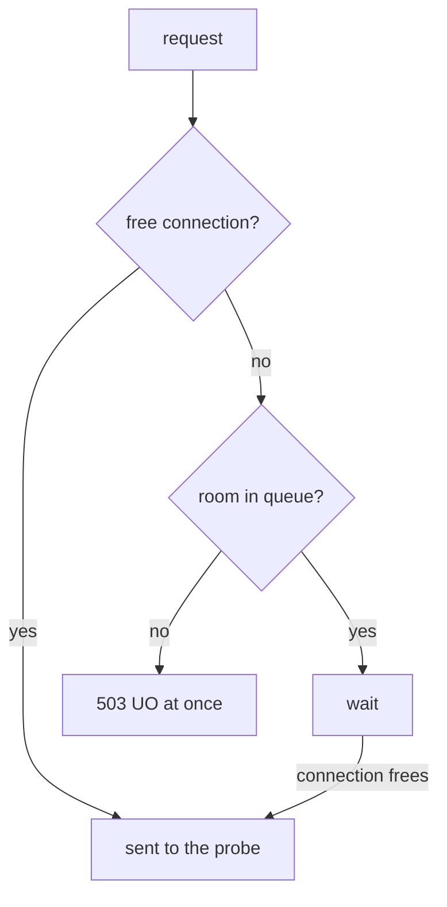

# Limit Concurrent Requests With A Connection Pool

A service that answers slowly can pull its clients down with it. Each waiting request holds memory and a worker thread in the client, and the client gets slow too. A **connection pool** limit stops this. It is a set of limits in a `DestinationRule` that caps how much work a client proxy may have open to one service at the same time. This part shows the object that holds the limits, the queue model behind them, and one idea that decides whether any test you run means anything: the limits count requests **at the same time**, not requests in total.

## The baseline: no limit yet

Before you set any limit, see what the `probe` Service handles on its own. The tests in this module use two shell helpers. `load_test` makes the `fortio` load generator send 30 requests to the `probe` Service over a given number of parallel connections and prints the status-code summary. `overflow_stats` reads the circuit-breaker counters that `fortio`'s sidecar proxy keeps for the `probe` Service. Paste both into your terminal:

<!-- astrona:playground:renew -->

```sh
# 30 requests to the probe over N parallel connections, from fortio; prints the status-code summary
load_test() { kubectl exec -n starfleet deploy/fortio -c fortio -- \
  fortio load -c "$1" -qps 0 -n 30 -loglevel Warning http://probe:8000/get 2>&1 | grep -E "^Code"; }
# fortio's own circuit-breaker counters for the probe
overflow_stats() { kubectl exec -n starfleet deploy/fortio -c istio-proxy -- \
  pilot-agent request GET stats 2>/dev/null | grep 'probe.starfleet' | grep -E 'pending_overflow|cx_overflow|pending_active'; }
```

`load_test 3` means "30 requests, with 3 open at any moment, as fast as possible". Run it now:

```sh
load_test 3
```

You should see:

```text
Code 200 : 30 (100.0 %)
```

All 30 requests got a `200`. No limit is set, so the only limit is what the `probe` pods can serve.

## The object

The circuit breaker lives in a `DestinationRule`, under `trafficPolicy.connectionPool`. These four settings are the ones worth knowing:

| Setting | Caps | Applies to |
| --- | --- | --- |
| `tcp.maxConnections` | open TCP connections to the service at the same time | every protocol |
| `http.http1MaxPendingRequests` | requests **waiting** for a free connection | HTTP/1 |
| `http.http2MaxRequests` | requests open at the same time to the service | mainly HTTP/2, where one connection carries many requests |
| `http.maxRequestsPerConnection` | requests sent over one connection before the proxy closes it. `1` means a new connection for every request | HTTP/1 |

`tcp` also has `connectTimeout` and keep-alive settings. They limit how long it may take to *open* a connection, not how many requests are open. They are useful, but they are not the circuit breaker.

## The queue model

For HTTP/1 traffic, two settings form the real circuit breaker: `maxConnections` and `http1MaxPendingRequests`. The first caps the open connections. The second caps the queue of requests that wait for one of those connections to become free.



The diagram shows the decision the client proxy makes for each request: use a free connection, else wait in the queue, else refuse the request with a `503` at once.

The proxy refuses a request only when the connections **and** the queue are both full, and the refusal path has no waiting on it. So with both settings at `1`, one request can be open, one more can wait, and a third request at the same moment has nowhere to go. The proxy refuses it **straight away**. It does not queue or delay it. That speed is the point. The client learns at once that there is no room. It can give up, answer with something simpler, or fail fast to its own caller, instead of piling up work.

## Two facts that are easy to get backwards

The settings live in a `DestinationRule` for the `probe` Service, so it is tempting to think the `probe` pods enforce them. In fact the sidecar proxies on **both** ends enforce them, and each keeps its own count:

- **The client proxy checks first.** Before a request leaves the pod, the client's sidecar proxy checks its own count of open connections to the `probe` Service. Most refusals happen here, so the `probe` application never sees them.
- **The server proxy checks again.** The sidecar proxy in each `probe` pod applies the same limits to the requests that arrive at that pod. Two clients that each stay inside their own limit can still be refused at the `probe` pod.

The second fact is about time, not totals. **The limits count requests at the same time.** A thousand requests sent one after another never go over `maxConnections: 1`, because only one is ever open. Three at once do. Testing a circuit breaker one request at a time, and then deciding it does not work, is the most common mistake on this topic.

You can see this for yourself. Save this as `destinationrule-probe-connection-pool.yaml`:

```yaml
apiVersion: networking.istio.io/v1
kind: DestinationRule
metadata:
  name: probe
  namespace: starfleet
spec:
  host: probe
  trafficPolicy:
    connectionPool:
      tcp:
        maxConnections: 1
      http:
        http1MaxPendingRequests: 1
        maxRequestsPerConnection: 1
```

Apply it:

```sh
kubectl apply -f destinationrule-probe-connection-pool.yaml
```

Then check the result. Send 30 requests, one at a time:

```sh
load_test 1
```

You should see:

```text
Code 200 : 30 (100.0 %)
```

Thirty requests went through a pool of one connection, and all of them got a `200`. The limits are active, and the proxy refused nothing, because with one parallel connection there was never more than one request open. This is exactly the result that makes people think the policy did not apply.

## Trip the circuit breaker

Raise the number of parallel connections above the limit, and refusals appear at once. Send the same 30 requests, but now 3 at a time:

```sh
load_test 3
```

You should see a split, for example:

```text
Code 200 : 13 (43.3 %)
Code 503 : 17 (56.7 %)
```

Your split will be different on every run, because it depends on timing. Four runs in a row gave between 47% and 67% refused.

The access log of `fortio`'s sidecar proxy shows why each request failed. Read its last line:

```sh
kubectl logs -n starfleet deploy/fortio -c istio-proxy --tail=1
```

You should see a line like this (shortened):

```text
"GET /get HTTP/1.1" 503 UO upstream_reset_before_response_started{overflow} ... "probe:8000" "-" outbound|8000||probe.starfleet.svc.cluster.local ...
```

The `503`s are the circuit breaker at work. These requests arrived while the one connection was busy and the one waiting slot was taken. The response flag is `UO`, and the upstream host field, right after `"probe:8000"`, is `"-"`, because the proxy never chose a `probe` pod for the request. If your last line happens to be a `200`, run the command again with `--tail=5` and look for the `UO` lines.

## The setting that decides whether it trips

You might think `maxConnections` alone is enough. It is not, and seeing why makes the queue model clear.

The queue limit, `http1MaxPendingRequests`, has a default that is close to unlimited. If you set only `maxConnections`, the proxy does not refuse extra requests. They wait in a very large queue, and every one of them is sent in the end. The circuit breaker never trips. Save this as `destinationrule-probe-max-connections-only.yaml`:

```yaml
apiVersion: networking.istio.io/v1
kind: DestinationRule
metadata:
  name: probe
  namespace: starfleet
spec:
  host: probe
  trafficPolicy:
    connectionPool:
      tcp:
        maxConnections: 1
```

Apply it:

```sh
kubectl apply -f destinationrule-probe-max-connections-only.yaml
```

Then check the result with 30 requests, 3 at a time:

```sh
load_test 3
```

You should see:

```text
Code 200 : 30 (100.0 %)
```

The proxy refused nothing. The requests waited in the queue instead of failing fast.

The same happens the other way round. Keep one connection but allow 10 waiting requests (`http1MaxPendingRequests: 10`), and `load_test 3` returns `Code 200 : 30 (100.0 %)` again. With 3 parallel connections the queue never fills, so the proxy refuses nothing, and the requests are only a little slower. So if a task says "the client must refuse requests to the probe when more than one is open", you need `http1MaxPendingRequests` as well as `maxConnections`, and usually `maxRequestsPerConnection: 1` too.

Put the full limits back before you go on:

```sh
kubectl apply -f destinationrule-probe-connection-pool.yaml
```

> [!TIP]
> To test a circuit breaker, always send requests **at the same time**. Use a load generator with more parallel connections than your limit, never a loop of single requests.

You now know where the connection pool limits live, how the proxy decides between sending, queueing and refusing a request, and why only requests at the same time can trip the limits. A `503` on its own does not yet prove that the circuit breaker sent it. How to tell a circuit-breaker refusal from any other `503` is the next question.

## Common pitfalls

> [!WARNING]
> - **Setting only `maxConnections`.** The waiting queue keeps its near-unlimited default, so extra requests wait instead of failing. Set `http1MaxPendingRequests` too.
> - **Testing with one request at a time.** A connection pool limits requests *at the same time*. Requests sent one by one never overflow anything.
> - **Setting only `http2MaxRequests` for HTTP/1 traffic.** It is the limit that matters for HTTP/2, where one connection carries many requests. For HTTP/1, the circuit breaker is `maxConnections` plus `http1MaxPendingRequests`.
> - **Reading `connectTimeout` as the circuit breaker.** It limits how long a connection may take to open, not how many requests are open.
