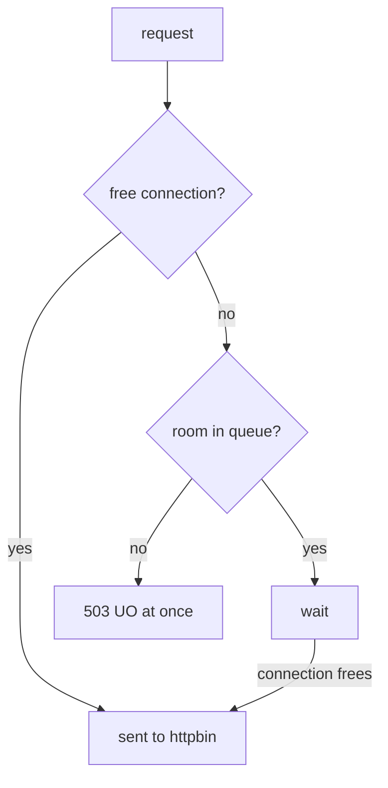

# The Connection Pool

> **Before you start:** define the helper functions from [the landing page](./course.md#before-you-start).

Astronaut, this part covers the shape of the object, the picture behind it, and one idea that decides whether any test you run means anything: limits count requests **at the same time**, not requests in total.

## The baseline: no limit yet

`load_test 3` sends 30 requests to `httpbin`, with 3 open at any moment. `-qps 0` inside the helper means "as fast as you can", so this is a small but aggressive burst.

> [!TIP]
> **Try it — 30 requests, three at a time, no policy**
>
> ```sh
> load_test 3
> ```
>
> Expect:
>
> ```text
> Code 200 : 30 (100.0 %)
> ```
>
> Thirty out of thirty. Nothing has set a ceiling, so the only limit is what `httpbin` can serve.

## The object

The circuit breaker lives in a `DestinationRule`, under `trafficPolicy.connectionPool`:

```yaml
apiVersion: networking.istio.io/v1
kind: DestinationRule
metadata:
  name: httpbin
  namespace: bookinfo
spec:
  host: httpbin
  trafficPolicy:
    connectionPool:
      tcp:
        maxConnections: 1
      http:
        http1MaxPendingRequests: 1
        maxRequestsPerConnection: 1
```

The four settings worth naming:

| Setting | Caps | Applies to |
| --- | --- | --- |
| `tcp.maxConnections` | open TCP connections to the service at the same time | all protocols |
| `http.http1MaxPendingRequests` | requests **waiting** for a free connection | HTTP/1 |
| `http.http2MaxRequests` | requests at the same time on one connection | HTTP/2, where one connection carries many requests |
| `http.maxRequestsPerConnection` | requests sent over one connection before it is closed; `1` means a new connection for every request (no keep-alive) | HTTP/1 |

`tcp` also has `connectTimeout` and TCP keep-alive settings. They limit how long it may take to *open* a connection, not how many requests are in flight. Useful, but not the circuit breaker.

## The queue model

For HTTP/1 traffic, two settings form the real breaker: `maxConnections` and `http1MaxPendingRequests`.

Think of the service's ships as one docking platform. `maxConnections` is the number of docking ports. `http1MaxPendingRequests` is how many ships may circle in a holding orbit, waiting for a port to free up. When every port is taken **and** the holding orbit is full, a new ship is turned away on the spot: the shields are up.



The connection limit is `tcp.maxConnections` and the queue is `http1MaxPendingRequests`. The diagram shows that a request only overflows when the connections **and** the queue are both full, and that the "refused" path has no waiting on it.

So with both set to 1: one request can be in flight, one more can wait, and a third request at the same moment has nowhere to go. It is refused **straight away**. It is not queued and not delayed. That speed is the feature. The caller learns at once that there is no room. It can drop the request, serve a simpler answer, or fail fast to *its* caller, instead of piling up work.

## Two facts that are easy to get backwards

**The caller enforces it.** The limits live in a `DestinationRule` that describes a destination. But the *calling* workload's sidecar applies them, before the request leaves. Each ship keeps its own count of the docking ports it is allowed. Three things follow:

- The backend never sees a refused request. Looking for these 503s in `httpbin`'s logs finds nothing.
- Every caller counts on its own. Three callers, each allowed one connection, can have three connections open to `httpbin` between them. So this is **not** server-side rate limiting.
- The limit protects the caller first. The backend only gains because callers stop piling on.

**It counts requests at the same time, not requests in total.** A thousand requests sent one after another never exceed `maxConnections: 1`, because only one is ever in flight. Three at once do.

Testing a circuit breaker with one request at a time, and then deciding it does not work, is the most common mistake on this topic. That is why the playground ships `fortio` instead of a `curl` loop.

> [!TIP]
> **Try it — apply the limits, then stay inside them**
>
> Write the rule to a file, apply it, and send requests one at a time:
>
> ```sh
> cat > destinationrule-httpbin-connection-pool.yaml <<'EOF'
> apiVersion: networking.istio.io/v1
> kind: DestinationRule
> metadata:
>   name: httpbin
>   namespace: bookinfo
> spec:
>   host: httpbin
>   trafficPolicy:
>     connectionPool:
>       tcp:
>         maxConnections: 1
>       http:
>         http1MaxPendingRequests: 1
>         maxRequestsPerConnection: 1
> EOF
> kubectl apply -f destinationrule-httpbin-connection-pool.yaml
> load_test 1
> ```
>
> Expect:
>
> ```text
> Code 200 : 30 (100.0 %)
> ```
>
> Thirty requests through a pool of one connection, all fine. The limit is in force and nothing was refused, because with one parallel connection there was never more than one request in flight. This is exactly the result that fools people into thinking the policy did not apply.

## Breaking it

Raise the number of parallel connections above the pool, and refusals appear at once.

> [!TIP]
> **Try it — three callers at once against a pool of one**
>
> ```sh
> load_test 3
> kubectl logs -n bookinfo deploy/fortio -c istio-proxy --tail=50 | grep ' 503 ' | tail -1
> ```
>
> Expect about half the requests to come back as 503, and a log line like this (trimmed):
>
> ```text
> "GET /get HTTP/1.1" 503 UO upstream_reset_before_response_started{overflow} ... "-" ...
> ```
>
> Your exact split will differ. It depends on timing, and on a fast local cluster many requests still get through. The 503s are the circuit breaker: requests that arrived while the one connection was busy and the one waiting slot was taken. The upstream host in the log is `"-"`, so `httpbin` never saw these requests. Part 2 reads this line in detail.

## The setting that decides whether it trips

You might think `maxConnections` alone is enough. It is not, and seeing why makes the queue model stick.

The waiting queue, `http1MaxPendingRequests`, has a default that is close to unlimited. If you set only `maxConnections`, extra requests do not overflow. They just wait in a huge holding orbit, and every one of them eventually lands. The breaker never trips.

> [!TIP]
> **Try it — only `maxConnections`, the common mistake**
>
> ```sh
> cat > destinationrule-httpbin-max-connections-only.yaml <<'EOF'
> apiVersion: networking.istio.io/v1
> kind: DestinationRule
> metadata:
>   name: httpbin
>   namespace: bookinfo
> spec:
>   host: httpbin
>   trafficPolicy:
>     connectionPool:
>       tcp:
>         maxConnections: 1
> EOF
> kubectl apply -f destinationrule-httpbin-max-connections-only.yaml
> load_test 3
> ```
>
> Expect:
>
> ```text
> Code 200 : 30 (100.0 %)
> ```
>
> The breaker never trips. Requests queue instead of failing fast. The same file is in the playground as `examples/cases/c2-destinationrule-max-connections-only.yaml`.

The same thing happens the other way round. Keep one connection but allow 10 waiting requests (`http1MaxPendingRequests: 10`, the playground's `examples/cases/c1-destinationrule-bigger-queue.yaml`). `load_test 3` then returns `Code 200 : 30 (100.0 %)` again. With 3 clients the queue never fills, so nothing overflows. The requests are only a little slower.

So if an exam task says "httpbin must reject requests when more than 1 is in flight", you need `http1MaxPendingRequests` as well as `maxConnections`, and usually `maxRequestsPerConnection: 1` too.

Put the full limits back before Part 2:

```sh
kubectl apply -f destinationrule-httpbin-connection-pool.yaml
```

## Common pitfalls

> [!WARNING]
> **Setting only `maxConnections`.** The waiting queue keeps its near-unlimited default, so extra requests wait instead of failing. Set `http1MaxPendingRequests` too.
>
> **Treating the limit as server-side capacity.** The *caller's* proxy enforces it, per calling workload. Ten callers with `maxConnections: 1` each give the backend up to ten connections.
>
> **Setting `http2MaxRequests` for HTTP/1 traffic.** It limits requests on one HTTP/2 connection and does nothing for HTTP/1.
>
> **Expecting refused requests to be retried into success.** A pool refusal is a `503`, and `retryOn: 5xx` sends it straight back into the same full pool. Part 3 shows this.
>
> **Testing with one request at a time.** A pool limits requests *at the same time*. One request at a time never overflows anything, whatever the numbers say.
>
> **Reading `connectTimeout` as the circuit breaker.** It limits how long a connection may take to open, not how many requests are in flight.

> *`connectionPool` caps how much work one caller may have open at the same time, so a one-at-a-time test never trips it, however many requests you send.*
