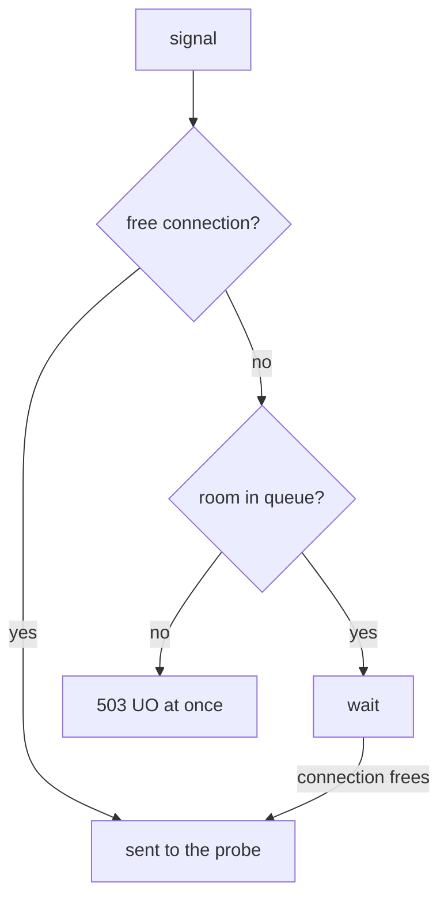

# The Connection Pool

Astronaut, this part covers the shields themselves: the object that holds them, the picture behind them, and one idea that decides whether any test you run means anything. The limits count signals **at the same time**, not signals in total.

The commands below need the two helpers from the module's landing page, `load_test` and `overflow_stats`, pasted into your terminal.

## The baseline: no limit yet

Before you raise any shields, see what the probe handles on its own.

<!-- astrona:playground:renew -->

### Thirty signals, three at a time

Fire 30 signals at the probe, with 3 open at any moment:

```sh
load_test 3
```

You should see:

```text
Code 200 : 30 (100.0 %)
```

Thirty out of thirty. Nothing has set a ceiling, so the only limit is what the probe can serve.

## The object

The circuit breaker lives in a `DestinationRule`, under `trafficPolicy.connectionPool`. These are the four settings worth knowing:

| Setting | Caps | Applies to |
| --- | --- | --- |
| `tcp.maxConnections` | open TCP connections to the service at the same time | every protocol |
| `http.http1MaxPendingRequests` | signals **waiting** for a free connection | HTTP/1 |
| `http.http2MaxRequests` | signals at the same time on one connection | HTTP/2, where one connection carries many signals |
| `http.maxRequestsPerConnection` | signals sent over one connection before it is closed. `1` means a new connection for every signal | HTTP/1 |

`tcp` also has `connectTimeout` and keep-alive settings. They limit how long it may take to *open* a connection, not how many signals are in flight. Useful, but not the circuit breaker.

## The queue model

For HTTP/1 traffic, two settings form the real breaker: `maxConnections` and `http1MaxPendingRequests`.

Think of the probe as a docking platform. `maxConnections` is the number of docking ports. `http1MaxPendingRequests` is how many ships may circle in a holding orbit, waiting for a port to free up. When every port is taken **and** the holding orbit is full, a new ship is turned away on the spot: the shields are up.



The connection limit is `tcp.maxConnections`, and the queue is `http1MaxPendingRequests`. A signal is only refused when the connections **and** the queue are both full, and the refused path has no waiting on it.

So with both set to `1`: one signal can be in flight, one more can wait, and a third signal at the same moment has nowhere to go. It is refused **straight away**, not queued and not delayed. That speed is the feature. The sender learns at once that there is no room, and can give up, answer with something simpler, or fail fast to *its* own sender, instead of piling up work.

## Two facts that are easy to get backwards

The settings live in a `DestinationRule` that describes the probe, so it is tempting to think the probe enforces them. In fact the communications officers on **both** ends do, and they count on their own:

- **The sender's officer checks first.** Before a signal leaves, the sending ship's proxy checks its own count of open connections to the probe. Most refusals happen here, so the probe's app never sees them.
- **The receiver's officer checks again.** Each probe pod's proxy applies the same limits to the signals arriving at that pod. Two senders that each stay inside their own limit can still be turned away at the probe's door.

The second fact is about time, not totals. **The limits count signals at the same time.** A thousand signals sent one after another never go over `maxConnections: 1`, because only one is ever in flight. Three at once do. Testing a circuit breaker one signal at a time, and then deciding it does not work, is the most common mistake on this topic.

### Raise the shields, then stay inside them

Save this as `destinationrule-probe-connection-pool.yaml`:

```yaml
apiVersion: networking.istio.io/v1
kind: DestinationRule
metadata:
  name: probe
  namespace: starfleet
spec:
  host: probe
  trafficPolicy:
    connectionPool:
      tcp:
        maxConnections: 1
      http:
        http1MaxPendingRequests: 1
        maxRequestsPerConnection: 1
```

Apply it:

```sh
kubectl apply -f destinationrule-probe-connection-pool.yaml
```

Then fire 30 signals, one at a time:

```sh
load_test 1
```

You should see:

```text
Code 200 : 30 (100.0 %)
```

Thirty signals through a pool of one connection, and all of them got through. The shields are up, and nothing was refused, because with one parallel connection there was never more than one signal in flight. This is exactly the result that makes people think the policy did not apply.

## Breaking it

Raise the number of parallel connections above the pool, and refusals appear at once.

### Three senders at once against a pool of one

Fire the same 30 signals, but now 3 at a time:

```sh
load_test 3
```

You should see a split, for example:

```text
Code 200 : 13 (43.3 %)
Code 503 : 17 (56.7 %)
```

Your split will be different every run. Four runs in a row gave between 47% and 67% refused. It depends on timing.

Now read the last line of fortio's flight log:

```sh
kubectl logs -n starfleet deploy/fortio -c istio-proxy --tail=1
```

You should see a line like this (trimmed):

```text
"GET /get HTTP/1.1" 503 UO upstream_reset_before_response_started{overflow} ... "probe:8000" "-" outbound|8000||probe.starfleet.svc.cluster.local ...
```

The `503`s are the shields: signals that arrived while the one connection was busy and the one waiting slot was taken. The flag is `UO`, and the chosen ship address is `"-"`, because no probe pod was ever chosen. If your last line happens to be a `200`, run the command with `--tail=5` and look for the `UO` lines.

## The setting that decides whether it trips

You might think `maxConnections` alone is enough. It is not, and seeing why makes the queue model stick.

The holding orbit, `http1MaxPendingRequests`, has a default that is close to unlimited. If you set only `maxConnections`, extra signals do not get refused. They wait in a huge holding orbit, and every one of them lands in the end. The shields never go up.

### Only `maxConnections`, the common mistake

Save this as `destinationrule-probe-max-connections-only.yaml`:

```yaml
apiVersion: networking.istio.io/v1
kind: DestinationRule
metadata:
  name: probe
  namespace: starfleet
spec:
  host: probe
  trafficPolicy:
    connectionPool:
      tcp:
        maxConnections: 1
```

Apply it:

```sh
kubectl apply -f destinationrule-probe-max-connections-only.yaml
```

Then fire 30 signals, 3 at a time:

```sh
load_test 3
```

You should see:

```text
Code 200 : 30 (100.0 %)
```

Nothing is refused. The signals queue instead of failing fast.

The same happens the other way round. Keep one connection but allow 10 waiting signals (`http1MaxPendingRequests: 10`), and `load_test 3` returns `Code 200 : 30 (100.0 %)` again. With 3 senders the queue never fills, so nothing is refused. The signals are only a little slower.

So if a task says "the probe must refuse signals when more than one is in flight", you need `http1MaxPendingRequests` as well as `maxConnections`, and usually `maxRequestsPerConnection: 1` too.

Put the full limits back:

```sh
kubectl apply -f destinationrule-probe-connection-pool.yaml
```

> [!TIP]
> To test a circuit breaker, always send signals **at the same time**. Use a load generator with more parallel connections than your limit, never a loop of single signals.

## Common pitfalls

> [!WARNING]
> - **Setting only `maxConnections`.** The waiting queue keeps its near-unlimited default, so extra signals wait instead of failing. Set `http1MaxPendingRequests` too.
> - **Testing with one signal at a time.** A pool limits signals *at the same time*. One at a time never overflows anything.
> - **Setting `http2MaxRequests` for HTTP/1 traffic.** It limits signals on one HTTP/2 connection and does nothing for HTTP/1.
> - **Reading `connectTimeout` as the circuit breaker.** It limits how long a connection may take to open, not how many signals are in flight.

> *`connectionPool` caps how much work may be open at the same time, so a one-at-a-time test never trips it, however many signals you send.*
