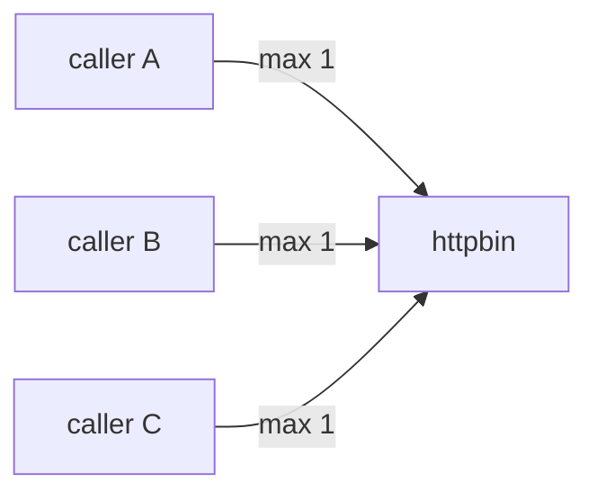
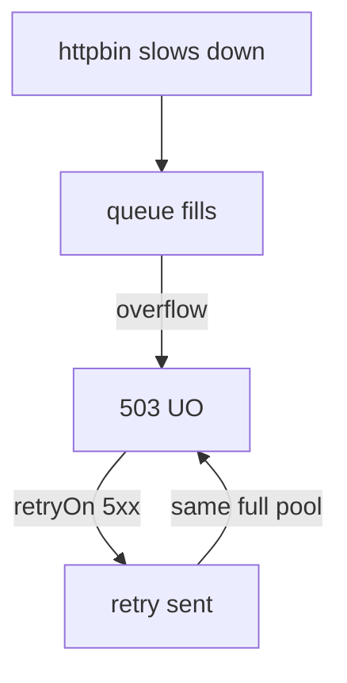

# Scope, Verification And Retry Amplification

Astronaut, three things are left. Reading the limits the proxy is really enforcing. Being exact about what "per caller" means when you plan capacity. And the way module 1's retries can turn a safety feature into a source of damage.

This part assumes the full limits from Part 1 are applied (`destinationrule-httpbin-connection-pool.yaml`).

## The limits as Envoy holds them

Envoy, the proxy inside every sidecar, calls this feature **circuit breakers**. The limits you set sit on the cluster for `httpbin`.

> [!TIP]
> **Try it — the limits the caller's proxy is enforcing**
>
> ```sh
> istioctl proxy-config cluster deploy/fortio -n bookinfo \
>   --fqdn httpbin.bookinfo.svc.cluster.local -o json | grep -A8 circuitBreakers
> ```
>
> Expect something like (trimmed):
>
> ```text
> "circuitBreakers": {
>   "thresholds": [
>     {
>       "maxConnections": 1,
>       "maxPendingRequests": 1,
>       "maxRequests": 4294967295,
>       "maxRetries": 4294967295
> ```
>
> `maxConnections` and `maxPendingRequests` are your settings. The two huge numbers are `2^32 - 1`, the unset defaults, which means "no real limit". That is the useful lesson: **anything you do not set has no limit**. A partial policy leaves a gap. It does not inherit something sensible.

`maxRequests` here matches `http2MaxRequests`. On HTTP/1 traffic it never binds, which is why the HTTP/1 breaker is built from `maxConnections` plus `maxPendingRequests`. On **HTTP/2** it is the other way round. One connection carries many requests at once, so `maxConnections: 1` barely limits anything, and `http2MaxRequests` is the setting that matters. gRPC runs on HTTP/2, so this is not a rare case.

## "Per caller" is a capacity statement

Each calling workload's sidecar enforces the limits with its own counters. There is no shared count and no coordination between callers. Every calling ship keeps its own tally of docking ports, and the ship being called sees the sum.



Each caller's sidecar has `maxConnections: 1`. The diagram shows each caller keeping its limit perfectly while `httpbin` still sees three times that limit.

Three things to be able to say:

- **The backend's exposure is `limit × number of callers`**, not `limit`. To size a pool you need to know how many caller pods there are, and that number changes when the callers scale.
- **It is not rate limiting.** Rate limiting caps requests per second, for everyone together, usually at the server. A connection pool caps open work, per caller. If a task says "the service must accept no more than N requests per second", a connection pool is the wrong answer.
- **A caller with no sidecar is not limited at all.** This is settings in the caller's proxy, not a wall around the service.

For a real service-wide ceiling, Istio offers rate limiting (local, or global with an external rate-limit service). That is outside this module and outside the Traffic Management domain.

## Retries and pools fight each other

This is the most valuable idea in the module, because it is a production trap, not a syntax detail.

Follow the sequence:



The arrow from "retry sent" back to "503 UO" is the whole problem: the refusal can itself be retried, so the feature meant to absorb a short failure feeds on itself.

The feature meant to soak up brief failures makes a lasting one worse. Each caller now sends up to `attempts + 1` times its normal load, at exactly the moment the pool is already full. And the pool's own refusals count as retryable under `5xx`.

Three safe habits:

- **Prefer `gateway-error` or `connect-failure` over a blanket `5xx`** on routes to a service you also pool-limit. A `503 UO` is a deliberate refusal, not a passing glitch. Retrying it makes things worse.
- **Keep `attempts` small:** one or two, not five.
- **Remember the time budget from module 1.** A retry policy that cannot finish inside the route timeout gives you a 504 *and* the extra load. That is the worst of both.

Istio lets you configure the harmful combination, and nothing warns you. It only shows up under load.

> [!TIP]
> **Try it — watch retries multiply the refusals**
>
> Note the counter, add an aggressive retry policy, run the same load, and read the counter again:
>
> ```sh
> pending_overflow() { kubectl exec -n bookinfo deploy/fortio -c istio-proxy -- \
>   pilot-agent request GET stats 2>/dev/null | grep 'httpbin.bookinfo.*pending_overflow' | awk -F': ' '{print $2}'; }
> BEFORE=$(pending_overflow)
> cat > virtualservice-httpbin-retry-5xx.yaml <<'EOF'
> apiVersion: networking.istio.io/v1
> kind: VirtualService
> metadata:
>   name: httpbin
>   namespace: bookinfo
> spec:
>   hosts:
>     - httpbin
>   http:
>     - route:
>         - destination:
>             host: httpbin
>       retries:
>         attempts: 3
>         perTryTimeout: 1s
>         retryOn: 5xx
>       timeout: 10s
> EOF
> kubectl apply -f virtualservice-httpbin-retry-5xx.yaml
> sleep 3
> load_test 4
> AFTER=$(pending_overflow)
> echo "pending_overflow went up by $((AFTER - BEFORE)) for 30 client requests"
> ```
>
> Compare this run's 503 share with Part 1's `load_test 3`. Read the two results together. The failure rate the client sees usually *improves*, because retries hide many refusals. Meanwhile the counter can go up by more than the 30 requests you sent, because each retry is another attempt into the full pool. Under real load, that extra work is the spiral. Delete the VirtualService afterwards to leave the playground as you found it:
>
> ```sh
> kubectl delete -f virtualservice-httpbin-retry-5xx.yaml
> ```

## Common pitfalls

> [!WARNING]
> **Expecting the limits to protect the server for everyone.** Each caller enforces its own pool, so the backend's exposure is `limit × callers`. For a service-wide ceiling you need rate limiting.
>
> **Leaving `http2MaxRequests` unset for HTTP/2 or gRPC traffic.** One connection carries many requests, so `maxConnections` barely limits anything.
>
> **Assuming unset fields inherit something sensible.** They are `2^32 - 1`, which means no limit.
>
> **Combining an aggressive `retryOn: 5xx` with tight pools.** Retries turn an overload into a storm, and the failure rate the client sees can *improve* while the real load doubles.
>
> **Putting the pool on the server's own side and expecting server-side protection.** Wherever the `DestinationRule` lives, it is the caller's proxy that reads and applies it.

> *Each caller enforces its own pool, so the limit you set is multiplied by the number of callers, and retries multiply it again.*
