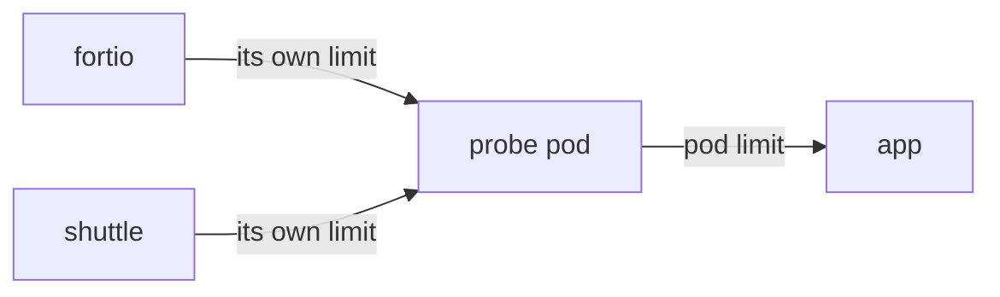
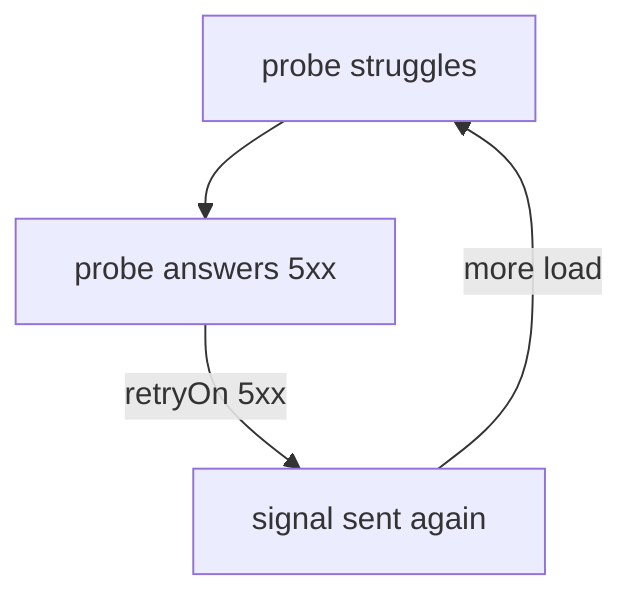

# Scope, Verification And Retry Amplification

Astronaut, three questions are left about the shields. Which limits does each proxy really enforce? Who is protected when many ships call the same probe? And what happens when you add retries on top?

The commands below need the two helpers from the module's landing page and the `probe` `DestinationRule` with all three limits set to `1`, saved as `destinationrule-probe-connection-pool.yaml`.

## The limits as Envoy holds them

Envoy, the program inside every sidecar, calls this feature **circuit breakers**. The limits you set sit on a cluster, and you can read them back to see what a proxy really enforces.

<!-- astrona:playground:renew -->

### Read the sender's limits

Print the circuit breakers fortio's proxy holds for the probe:

```sh
istioctl proxy-config cluster deploy/fortio -n starfleet \
  --fqdn probe.starfleet.svc.cluster.local -o json | grep -A8 circuitBreakers
```

You should see (trimmed):

```text
        "circuitBreakers": {
            "thresholds": [
                {
                    "maxConnections": 1,
                    "maxPendingRequests": 1,
                    "maxRequests": 4294967295,
                    "maxRetries": 4294967295
                }
            ]
```

`maxConnections` and `maxPendingRequests` are your settings. The two huge numbers are the defaults for what you did not set, and they mean "no real limit". So **anything you do not set has no limit**. A partial policy leaves a gap.

`maxRequests` is where `http2MaxRequests` would land. On HTTP/1 traffic it never binds, which is why the HTTP/1 breaker is built from `maxConnections` plus `maxPendingRequests`. On **HTTP/2** it is the other way round: one connection carries many signals at once, so `maxConnections: 1` barely limits anything, and `http2MaxRequests` is the setting that matters. gRPC runs on HTTP/2, so this is a common case.

### Read the receiver's limits

Now look at the other end: the inbound cluster of one probe pod.

```sh
PROBE_POD=$(kubectl get pod -n starfleet -l app=probe,version=v1 -o jsonpath='{.items[0].metadata.name}')
istioctl proxy-config cluster $PROBE_POD -n starfleet --direction inbound -o json | grep -A8 circuitBreakers
```

You should see the same two limits, now on the cluster named `inbound|8080||` (trimmed):

```text
        "circuitBreakers": {
            "thresholds": [
                {
                    "maxConnections": 1,
                    "maxPendingRequests": 1,
                    "maxRequests": 4294967295,
                    "maxRetries": 4294967295
                }
            ]
```

The same `DestinationRule` reached both ends. Each sender's proxy limits what *it* sends to the probe, and each probe pod's proxy limits what it accepts.

## Who the shields protect

Because both ends enforce the limits, the numbers mean two different things:

- **On the sender's side, per sender.** Every sending ship keeps its own count. Ten senders with `maxConnections: 1` may each open one connection.
- **On the receiver's side, per pod.** Every probe pod accepts at most `maxConnections` open connections from its own proxy, however many senders there are. Signals that arrive while the pod is full are refused at its door.



Each sender stays inside its own limit, and the probe pod still enforces its limit on what they send together. So a sender with no sidecar is not limited on its side, but its signals still meet the probe pod's limit, as long as the pod has a sidecar.

This is still **not** rate limiting. Rate limiting caps signals per second. A connection pool caps open work at the same time. If a task says "the service must accept no more than N signals per second", a connection pool is the wrong answer.

### Two careful senders, one crowded probe

Send signals from two ships at the same time, each **one at a time**: a `curl` loop from the shuttle and fortio with one connection. Neither sender ever has more than one signal in flight, so neither trips its own limit. First note how many refusals the probe pods have logged so far:

```sh
probe_refusals() { t=0; for p in $(kubectl get pod -n starfleet -l app=probe -o name); do
  n=$(kubectl logs -n starfleet $p -c istio-proxy | grep -c '503 UO.*inbound|'); t=$((t+n)); done; echo $t; }
BEFORE=$(probe_refusals)
```

Then run both senders together:

```sh
kubectl exec -n starfleet deploy/fortio -c fortio -- \
  fortio load -c 1 -qps 0 -n 400 -loglevel Warning http://probe:8000/get 2>&1 | grep -E "^Code" &
kubectl exec -n starfleet deploy/shuttle -- sh -c \
  'for i in $(seq 1 100); do curl -s -o /dev/null -w "%{http_code}\n" http://probe:8000/get; done' | sort | uniq -c
wait
echo "refused at the probe's side: $(( $(probe_refusals) - BEFORE ))"
```

You should see something like:

```text
     98 200
      2 503
Code 200 : 396 (99.0 %)
Code 503 : 4 (1.0 %)
refused at the probe's side: 6
```

Both senders got a few `503`s, although neither ever had two signals open at once. All 6 refusals happened at the probe pods' doors, when signals from the two senders arrived at the same pod together.

## Retries and the shields

Retries look like a cure for refused signals. On Istio 1.30.5 they do something more subtle, and it matters in production.

**A sender's own refusals are never retried.** When the sender's proxy refuses a signal with `UO`, the signal never left the ship, and Envoy does not try it again, whatever `retryOn` says.

**Real failures are retried, and that multiplies the load.** When the probe itself answers with a `5xx` (an app error, or a refusal at the probe's door), the retry policy sends the signal again. With `attempts: 3`, one failing signal can reach the probe four times, at exactly the moment the probe is struggling.



The loop is the danger: each failure brings more work for the ship that is already failing. Nothing warns you about it. It only shows up under load.

### Prove that refusals are not retried

Add an aggressive retry policy. Save this as `virtualservice-probe-retry.yaml`:

```yaml
apiVersion: networking.istio.io/v1
kind: VirtualService
metadata:
  name: probe
  namespace: starfleet
spec:
  hosts:
    - probe
  http:
    - route:
        - destination:
            host: probe
      retries:
        attempts: 3
        perTryTimeout: 1s
        retryOn: 5xx
      timeout: 10s
```

Apply it:

```sh
kubectl apply -f virtualservice-probe-retry.yaml
```

Then fire 30 signals, 4 at a time, and compare the refusals with the number of retries fortio's proxy made. This helper reads one counter for the probe:

```sh
probe_stat() { kubectl exec -n starfleet deploy/fortio -c istio-proxy -- \
  pilot-agent request GET stats 2>/dev/null | grep "probe.starfleet.*;\.$1:" | awk -F': ' '{print $2}'; }
P0=$(probe_stat upstream_rq_pending_overflow); R0=$(probe_stat upstream_rq_retry)
kubectl exec -n starfleet deploy/fortio -c fortio -- \
  fortio load -c 4 -qps 0 -n 30 -loglevel Warning http://probe:8000/get 2>&1 | grep -E "^Code"
echo "refused: +$(( $(probe_stat upstream_rq_pending_overflow) - P0 ))  retried: +$(( $(probe_stat upstream_rq_retry) - ${R0:-0} ))"
```

You should see something like:

```text
Code 200 : 10 (33.3 %)
Code 503 : 20 (66.7 %)
refused: +20  retried: +0
```

Every one of the 20 refused signals came back as a `503`, and not one was retried. The same happens with `retryOn: gateway-error` or `retryOn: connect-failure,refused-stream`.

Sometimes you see a small number of retries, like `retried: +1`. That is a signal that left fortio and was refused at the probe's door instead. For the sender it is a real `503` answer from the probe, so it *is* retried.

### Watch a real failure be retried

Now send 5 signals to `/status/503`, a path where the probe itself answers `503`:

```sh
R0=$(probe_stat upstream_rq_retry)
kubectl exec -n starfleet deploy/fortio -c fortio -- \
  fortio load -c 1 -qps 0 -n 5 -loglevel Warning http://probe:8000/status/503 2>&1 | grep -E "^Code"
echo "retried: +$(( $(probe_stat upstream_rq_retry) - ${R0:-0} ))"
```

You should see:

```text
Code 503 : 5 (100.0 %)
retried: +15
```

Five failing signals, each retried 3 times: the probe received 20 signals instead of 5, four times the load, and every one of them still failed.

Remove the retry policy before you go on:

```sh
kubectl delete -f virtualservice-probe-retry.yaml
```

Three habits keep retries from turning a struggle into an outage:

- **Keep `attempts` small:** one or two, not five.
- **Retry only what a second try can fix.** `5xx` and `gateway-error` both retry a `503` from the probe. For a service that may be overloaded, `connect-failure,refused-stream` retries only signals that never reached it.
- **Fit the retries inside the route timeout.** A retry policy that cannot finish in time gives you a `504` *and* the extra load.

> [!TIP]
> When a service is struggling, read `upstream_rq_retry` next to `upstream_rq_pending_overflow` in the sender's counters. Many retries mean you are adding load to the problem.

## Common pitfalls

> [!WARNING]
> - **Thinking only the sender enforces the limits.** Each probe pod's proxy enforces them too, on what it accepts.
> - **Leaving `http2MaxRequests` unset for HTTP/2 or gRPC traffic.** One connection carries many signals, so `maxConnections` barely limits anything.
> - **Assuming unset fields have a sensible default.** They mean no limit at all.
> - **Expecting retries to rescue refused signals.** A sender's own `UO` refusals are never retried.
> - **Combining large `attempts` with `retryOn: 5xx` for a struggling service.** Every real failure is sent again, multiplying the load at the worst moment.
> - **Treating a connection pool as rate limiting.** It caps open work at the same time, not signals per second.

> *The same limits apply on both ends: each sender caps what it sends, and each pod caps what it accepts. Retries never rescue a refusal, but they do multiply every real failure.*

## Your mission: Calm The Retry Storm

You can now read the limits on both ends, and tell a refusal that is never retried from a failure that is. Now prove it in a graded mission: a retry policy is sending every failing signal back to a struggling probe, and you have to calm it without losing the retries that help.

The mission runs in its own training solar system, so first pause your playground. Nothing in it is lost:

```sh
astrona stop ats-014-playground-040-02
```

Then start the mission:

```sh
astrona run --git git@github.com:astrona-io/ATS014.git -c sections/section-040/module-02/labs/lab-02
```

Read the task in [`question.md`](./labs/lab-02/question.md) and solve it on your own first. When you think you are done, send it for grading:

```sh
astrona submit -c sections/section-040/module-02/labs/lab-02
```

When the mission is done, remove it and wake your playground up again:

```sh
astrona destroy ats-014-lab-040-02-02
astrona start ats-014-playground-040-02
```
