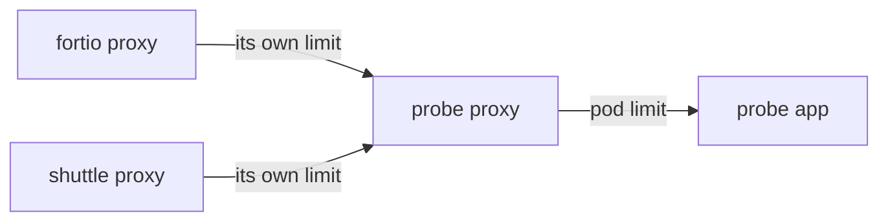
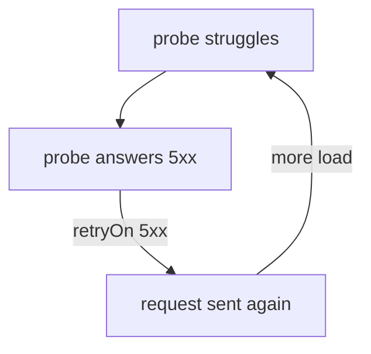

# Verify Limits On Both Proxies And Control Retries

A `DestinationRule` that exists is not yet a limit that a proxy enforces. Three questions decide how connection pool limits behave in a real mesh. Which limits does each proxy really hold? Who is protected when many clients call the same service? And what happens when you add retries on top? This part answers each one with a command you can run.

## The limits as Envoy holds them

Envoy, the proxy program inside every sidecar, calls this feature **circuit breakers**. `istiod` turns your connection pool settings into circuit-breaker thresholds on an Envoy **cluster**, which is the proxy's name for one destination service and the pods behind it. You can read the thresholds back to see what a proxy really enforces.

The commands below need the `probe` `DestinationRule` in the playground, with `tcp.maxConnections`, `http.http1MaxPendingRequests` and `http.maxRequestsPerConnection` all set to `1`, saved and applied as `destinationrule-probe-connection-pool.yaml`. Start with the client side. Print the circuit breakers that `fortio`'s sidecar proxy holds for the `probe` Service:

<!-- astrona:playground:renew -->

```sh
istioctl proxy-config cluster deploy/fortio -n starfleet \
  --fqdn probe.starfleet.svc.cluster.local -o json | grep -A8 circuitBreakers
```

You should see (shortened):

```text
        "circuitBreakers": {
            "thresholds": [
                {
                    "maxConnections": 1,
                    "maxPendingRequests": 1,
                    "maxRequests": 4294967295,
                    "maxRetries": 4294967295
                }
            ]
```

`maxConnections` and `maxPendingRequests` are your settings. The two very large numbers are the defaults for what you did not set, and they mean "no real limit". So **anything you do not set has no limit**, and a partial policy leaves a gap.

`maxRequests` is where `http2MaxRequests` would land. On HTTP/1 traffic it does not bind, because each request needs its own connection, so the HTTP/1 circuit breaker is built from `maxConnections` plus `maxPendingRequests`. On **HTTP/2** it is the other way round. One connection carries many requests at once, so `maxConnections: 1` barely limits anything, and `http2MaxRequests` is the setting that matters. gRPC, the remote procedure call framework, runs on HTTP/2, so this is a common case.

Now look at the server side: the inbound cluster in the sidecar proxy of one `probe` pod. The `--direction inbound` flag shows only the clusters for traffic that arrives at the pod:

```sh
PROBE_POD=$(kubectl get pod -n starfleet -l app=probe,version=v1 -o jsonpath='{.items[0].metadata.name}')
istioctl proxy-config cluster $PROBE_POD -n starfleet --direction inbound -o json | grep -A8 circuitBreakers
```

You should see the same two limits, now on the cluster named `inbound|8080||` (shortened):

```text
        "circuitBreakers": {
            "thresholds": [
                {
                    "maxConnections": 1,
                    "maxPendingRequests": 1,
                    "maxRequests": 4294967295,
                    "maxRetries": 4294967295
                }
            ]
```

`istiod` sent the same `DestinationRule` to both ends. Each client proxy limits what *it* sends to the `probe` Service, and the proxy in each `probe` pod limits what that pod accepts.

## Who the limits protect

Because both ends enforce the limits, the same numbers mean two different things:

- **On the client side, per client.** Every client proxy keeps its own count. Ten clients with `maxConnections: 1` may each open one connection.
- **On the server side, per pod.** The proxy in every `probe` pod accepts at most `maxConnections` open connections to its application, however many clients there are. It refuses requests that arrive while the pod is full.



The diagram shows two client proxies, each with its own limit, and the `probe` pod's proxy, which applies its own limit to what both clients send together.

So a client with no sidecar proxy is not limited on its side. Its requests still meet the limit in the `probe` pod, as long as that pod has a sidecar proxy.

This is still **not** rate limiting. Rate limiting caps requests per second. A connection pool caps open work at the same time. If a task says "the service must accept no more than N requests per second", a connection pool is the wrong answer.

You can watch the server-side limit work. Send requests from two clients at the same time, each **one at a time**: a `curl` loop from the `shuttle` pod and `fortio` with one connection. Neither client ever has more than one request open, so neither trips its own limit. First define a helper that counts the `UO` refusals on `inbound` lines in the `probe` pods' access logs, and note the count so far:

```sh
probe_refusals() { t=0; for p in $(kubectl get pod -n starfleet -l app=probe -o name); do
  n=$(kubectl logs -n starfleet $p -c istio-proxy | grep -c '503 UO.*inbound|'); t=$((t+n)); done; echo $t; }
BEFORE=$(probe_refusals)
```

Then run both clients together:

```sh
kubectl exec -n starfleet deploy/fortio -c fortio -- \
  fortio load -c 1 -qps 0 -n 400 -loglevel Warning http://probe:8000/get 2>&1 | grep -E "^Code" &
kubectl exec -n starfleet deploy/shuttle -- sh -c \
  'for i in $(seq 1 100); do curl -s -o /dev/null -w "%{http_code}\n" http://probe:8000/get; done' | sort | uniq -c
wait
echo "refused at the probe's side: $(( $(probe_refusals) - BEFORE ))"
```

You should see something like:

```text
     98 200
      2 503
Code 200 : 396 (99.0 %)
Code 503 : 4 (1.0 %)
refused at the probe's side: 6
```

Both clients got a few `503`s, although neither ever had two requests open at once. The `probe` pods' proxies made all 6 refusals, when requests from the two clients arrived at the same pod together.

## Retries and the circuit breaker

Retries look like a cure for refused requests. On Istio 1.30.5 they do something more subtle, and it matters in production. A **retry policy** is the `retries` field of a `VirtualService` route: the client proxy sends a failed request again, up to `attempts` times, for the failures listed in `retryOn`.

**A client proxy's own refusals are never retried.** When the client proxy refuses a request with `UO`, the request never left the pod, and Envoy does not try it again, whatever `retryOn` says.

**Real failures are retried, and that multiplies the load.** When the `probe` pod itself answers with a `5xx` status (an application error, or a refusal by the `probe` pod's proxy), the retry policy sends the request again. With `attempts: 3`, one failing request can reach the `probe` pods four times, at exactly the moment the service is struggling.



The diagram shows the loop: each failure brings more work for the service that is already failing. Nothing warns you about it, and it only shows up under load.

Prove that refusals are not retried. Add an aggressive retry policy. Save this as `virtualservice-probe-retry.yaml`:

```yaml
apiVersion: networking.istio.io/v1
kind: VirtualService
metadata:
  name: probe
  namespace: starfleet
spec:
  hosts:
    - probe
  http:
    - route:
        - destination:
            host: probe
      retries:
        attempts: 3
        perTryTimeout: 1s
        retryOn: 5xx
      timeout: 10s
```

Apply it:

```sh
kubectl apply -f virtualservice-probe-retry.yaml
```

Then check the result. The `probe_stat` helper reads one counter that `fortio`'s proxy keeps for the `probe` Service. The commands send 30 requests, 4 at a time, and compare the refusals with the number of retries that `fortio`'s proxy made:

```sh
probe_stat() { kubectl exec -n starfleet deploy/fortio -c istio-proxy -- \
  pilot-agent request GET stats 2>/dev/null | grep "probe.starfleet.*;\.$1:" | awk -F': ' '{print $2}'; }
P0=$(probe_stat upstream_rq_pending_overflow); R0=$(probe_stat upstream_rq_retry)
kubectl exec -n starfleet deploy/fortio -c fortio -- \
  fortio load -c 4 -qps 0 -n 30 -loglevel Warning http://probe:8000/get 2>&1 | grep -E "^Code"
echo "refused: +$(( $(probe_stat upstream_rq_pending_overflow) - P0 ))  retried: +$(( $(probe_stat upstream_rq_retry) - ${R0:-0} ))"
```

You should see something like:

```text
Code 200 : 10 (33.3 %)
Code 503 : 20 (66.7 %)
refused: +20  retried: +0
```

Every one of the 20 refused requests came back as a `503`, and the proxy retried none of them. The same happens with `retryOn: gateway-error` or `retryOn: connect-failure,refused-stream`. Sometimes you see a small number of retries, like `retried: +1`. That is a request that left `fortio` and was refused by a `probe` pod's proxy instead. For the client proxy it is a real `503` answer from the server, so it *is* retried.

Now watch a real failure being retried. Send 5 requests to `/status/503`, a path where the `probe` application itself answers `503`:

```sh
R0=$(probe_stat upstream_rq_retry)
kubectl exec -n starfleet deploy/fortio -c fortio -- \
  fortio load -c 1 -qps 0 -n 5 -loglevel Warning http://probe:8000/status/503 2>&1 | grep -E "^Code"
echo "retried: +$(( $(probe_stat upstream_rq_retry) - ${R0:-0} ))"
```

You should see:

```text
Code 503 : 5 (100.0 %)
retried: +15
```

Five failing requests were each retried 3 times. The `probe` pods received 20 requests instead of 5, four times the load, and every one of them still failed. Remove the retry policy before you go on:

```sh
kubectl delete -f virtualservice-probe-retry.yaml
```

Three habits keep retries from turning a struggling service into an outage:

- **Keep `attempts` small:** one or two, not five.
- **Retry only what a second try can fix.** `5xx` and `gateway-error` both retry a `503` from the `probe` pods. For a service that may be overloaded, `connect-failure,refused-stream` retries only requests that never reached it.
- **Fit the retries inside the route timeout.** A retry policy that cannot finish in time gives you a `504` *and* the extra load.

> [!TIP]
> When a service is struggling, read `upstream_rq_retry` next to `upstream_rq_pending_overflow` in the client proxy's counters. Many retries mean the retry policy adds load to the problem.

You now know how to read the live limits on both ends, who each limit protects, and how retries interact with the circuit breaker. Retries never rescue a client proxy's own refusal, but they do multiply every real failure that reaches the server.

## Common pitfalls

> [!WARNING]
> - **Thinking only the client proxy enforces the limits.** The proxy in each `probe` pod enforces them too, on what that pod accepts.
> - **Leaving `http2MaxRequests` unset for HTTP/2 or gRPC traffic.** One connection carries many requests, so `maxConnections` barely limits anything.
> - **Assuming unset fields have a sensible default.** They mean no limit at all.
> - **Expecting retries to rescue refused requests.** A client proxy's own `UO` refusals are never retried.
> - **Combining large `attempts` with `retryOn: 5xx` for a struggling service.** The proxy sends every real failure again, multiplying the load at the worst moment.
> - **Treating a connection pool as rate limiting.** It caps open work at the same time, not requests per second.

## Your mission: Limit Retries To Connection Failures Lab

You can now read the limits on both ends, and tell a refusal that is never retried from a failure that is. The lab gives you a retry policy that sends every failing request back to a struggling `probe` Service, and you must fix it without losing the retries that help.

The lab runs in its own cluster, so first pause your playground. Nothing in it is lost:

```sh
astrona stop ats-014-playground-040-02
```

Then start the lab:

```sh
astrona run --git git@github.com:astrona-io/ATS014.git -c sections/section-040/module-02/labs/lab-02
```

The task is on the next page. Solve it on your own first. When you think you are done, send it for grading:

```sh
astrona submit -c sections/section-040/module-02/labs/lab-02
```

When the lab is done, remove it and start your playground again:

```sh
astrona destroy ats-014-lab-040-02-02
astrona start ats-014-playground-040-02
```
