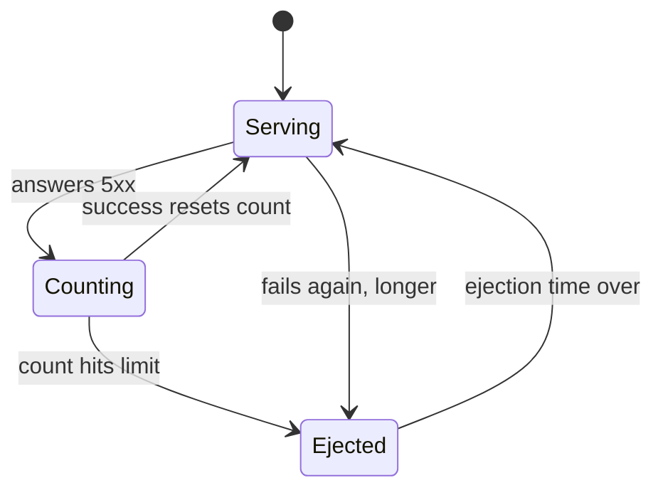

# Control Ejection Time And Which Errors Count

An outlier detection rule that ejects a failing endpoint raises two new questions. How long does the endpoint stay out of the load-balancing pool? And which HTTP errors count as failures? This part answers both. It explains the timeline of an ejection, then shows on a real pod that the choice between `consecutive5xxErrors` and `consecutiveGatewayErrors` decides whether an endpoint that answers `500` is ejected or not.

The commands in this part start from a known state. The `starfleet` namespace has the `probe` Service with two healthy pods (`probe-v1` and `probe-v2`) and a third pod, `probe-broken`, that answers every request with `503`. A `DestinationRule` named `probe` has this outlier detection block: `consecutive5xxErrors: 3`, `interval: 5s`, `baseEjectionTime: 1m` and `maxEjectionPercent: 50`.

## The timeline of an ejection

Outlier detection runs inside each client's sidecar proxy, the Envoy container that Istio adds to each pod. An **ejection** means that the proxy removes an endpoint, one pod address and port, from its load-balancing pool for a while. The ejection is not permanent. An endpoint moves between three states, and the move back is the part that surprises people.



The diagram shows the two moves that people forget: one success puts the endpoint straight back to `Serving` with a count of zero, and a repeat ejection lasts longer than the first one. The limit in the diagram is `consecutive5xxErrors`.

Four facts follow from this timeline:

- **A consecutive-error ejection happens at once.** As soon as an endpoint reaches `consecutive5xxErrors` (or `consecutiveGatewayErrors`), the proxy ejects it. It does not wait for the next `interval`.
- **`interval` is the time between two checks.** At every `interval` (default `10s`), the proxy brings back the endpoints whose ejection time is over. So an endpoint can stay out up to one `interval` longer than its ejection time.
- **`baseEjectionTime` is the starting length.** The real ejection time is `baseEjectionTime` × the number of times this endpoint has been ejected. A second ejection lasts twice as long, a third three times as long. Envoy caps this growth at 300 seconds, or at `baseEjectionTime` if that is larger.
- **An ejection always ends.** When the time is up, the endpoint goes back into the pool and gets requests again. If it is still broken, it fails again and is ejected for longer.

So an endpoint that stays broken does **not** give you a stable state. You see short bursts of failures, with error-free periods that grow longer each time.

## Which errors count

The timeline decides how long an endpoint stays out. The next question is what puts it there. Two fields count errors, and they overlap:

| Field | Counts | Value if you leave it out |
| --- | --- | --- |
| `consecutive5xxErrors` | every 5xx: `500`, `502`, `503`, `504`, ... | **5**, as soon as an `outlierDetection` block exists |
| `consecutiveGatewayErrors` | only `502`, `503` and `504` | off (`0`) |

The trap is that first default. You might write only `consecutiveGatewayErrors: 3`, so that an endpoint that answers `500` (an error inside the application) is left alone. But `consecutive5xxErrors` is still active at 5, and a `500` counts for it. To count *only* gateway errors, switch the other field off with `consecutive5xxErrors: 0`.

There is one more rule. Gateway errors also count as 5xx errors. So if `consecutiveGatewayErrors` is equal to or higher than `consecutive5xxErrors`, the 5xx count always reaches its limit first, and `consecutiveGatewayErrors` never acts.

<!-- astrona:playground:renew -->

To see this on a real pod, replace the broken pod with one that answers `500` instead of `503`. The commands in this part use one shell helper function, `count_status`. Paste it into your terminal first. It sends 15 requests from the `shuttle` pod to the `probe` Service and counts the responses by status code:

```sh
# 15 single requests from the shuttle to the probe, counted by status code
count_status() { for i in $(seq 1 15); do
  kubectl exec -n starfleet deploy/shuttle -- curl -s -o /dev/null -w "%{http_code}\n" http://probe:8000/get
done | sort | uniq -c; }
```

Remove the Deployment of the pod that answers `503`. Its file is `deployment-probe-broken.yaml`:

```sh
kubectl delete -f deployment-probe-broken.yaml
```

The new Deployment has the same `app: probe` label, so the `probe` Service sends it a share of the requests. Save this as `deployment-probe-broken-500.yaml`:

```yaml
apiVersion: apps/v1
kind: Deployment
metadata:
  name: probe-broken-500
  namespace: starfleet
spec:
  replicas: 1
  selector:
    matchLabels:
      app: probe
      version: broken-500
  template:
    metadata:
      labels:
        app: probe
        version: broken-500
    spec:
      containers:
      - name: http-echo
        image: hashicorp/http-echo:1.0
        args: ["-listen=:8080", "-status-code=500", "-text=broken"]
        ports:
        - containerPort: 8080
```

Apply it, and wait for the pod to start:

```sh
kubectl apply -f deployment-probe-broken-500.yaml
kubectl rollout status -n starfleet deploy/probe-broken-500
```

## Count only gateway errors

With a pod that answers `500` in place, you can test a rule that ignores `500` responses. It counts gateway errors only, and it switches the 5xx count off. Save this as `destinationrule-probe-gateway-errors-only.yaml`:

```yaml
apiVersion: networking.istio.io/v1
kind: DestinationRule
metadata:
  name: probe
  namespace: starfleet
spec:
  host: probe
  trafficPolicy:
    outlierDetection:
      consecutiveGatewayErrors: 3
      consecutive5xxErrors: 0
      interval: 5s
      baseEjectionTime: 1m
      maxEjectionPercent: 50
```

Apply it:

```sh
kubectl apply -f destinationrule-probe-gateway-errors-only.yaml
```

Then send two rounds of 15 requests:

```sh
count_status
count_status
```

You should see:

```text
  10 200
   5 500
  10 200
   5 500
```

About one request in three fails in **every** round. The proxy never ejects the pod that answers `500`, because this rule only counts `502`, `503` and `504`.

## Count every 5xx error again

The opposite case proves the default. The first rule of this module uses `consecutive5xxErrors: 3`, which counts `500` responses too. It is still saved in `destinationrule-probe-outlier-detection.yaml`, with `interval: 5s`, `baseEjectionTime: 1m` and `maxEjectionPercent: 50`. Apply it, and send two rounds of 15 requests:

```sh
kubectl apply -f destinationrule-probe-outlier-detection.yaml
count_status
count_status
```

You should see (the `apply` line is left out):

```text
  12 200
   3 500
  15 200
```

After three `500` responses in a row, the proxy ejects the endpoint. The same happens if you write only `consecutiveGatewayErrors: 3` and leave `consecutive5xxErrors` out. The 5xx count is then 5, so the proxy ejects the `500` pod after five errors in a row.

When you are done, put the pod that answers `503` back from `deployment-probe-broken.yaml`:

```sh
kubectl delete -f deployment-probe-broken-500.yaml
kubectl apply -f deployment-probe-broken.yaml
```

You now know how long an ejection lasts, why it grows each time, and how to choose which status codes count. One question is still open: a rule can count every failure correctly and still never eject anything, because two limits protect the pool from losing too many endpoints.

## Common pitfalls

> [!WARNING]
> - **Writing only `consecutiveGatewayErrors` and expecting `500` responses to be ignored.** `consecutive5xxErrors` is still 5. Set it to `0`.
> - **Setting `consecutiveGatewayErrors` equal to or higher than `consecutive5xxErrors`.** The 5xx count reaches its limit first, so the gateway count never acts.
> - **Reading `baseEjectionTime` as the length of every ejection.** It is the starting length. An endpoint that keeps failing is ejected for a growing multiple of it.
> - **Expecting an endpoint back the moment its time is up.** It returns at the next `interval` check after that.
> - **Expecting a stable state from a pod that stays broken.** It produces repeating bursts of failures with growing gaps between them.
